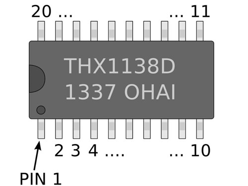
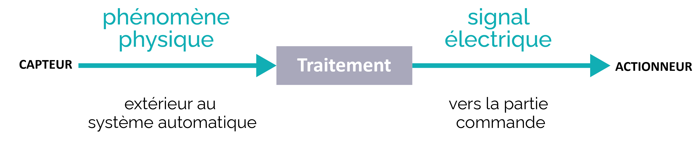

# Composants électroniques

## 🎯 Objectifs
À la fin de cette fiche, je suis capable de :

| Je sais… | Exemple attendu en E2 |
|---|---|
| **Identifier** un composant | “C’est une **résistance**, elle sert à **limiter le courant**.” |
| **Associer** des composants pour une fonction | “Pour **mesurer un capteur résistif**, on utilise un **diviseur de tension**.” |
| **Justifier** un choix (montage / valeur / sens) | “La **LED** doit être dans le bon **sens** et avec une **résistance** sinon elle grille.” |
| **Repérer** une erreur fréquente | “Condensateur **électrolytique** monté à l’envers → risque de panne.” |

---

## 🔑 Avant de commencer : 2 rappels indispensables

✅ Un **circuit** fonctionne seulement s’il est **fermé** (boucle complète).  
✅ Deux grandeurs reviennent tout le temps :

- **Tension (U)** en volts (V) : on peut la voir comme “la force” qui pousse.
- **Courant (I)** en ampères (A) : on peut le voir comme “le débit” qui circule.

👉 Beaucoup d’erreurs en atelier viennent :
- d’un **mauvais sens** (diode/LED),
- ou d’une **mauvaise valeur** (résistance trop faible → trop de courant → LED grillée).

   
  <em>comparaison d’un circuit ouvert (lampe éteinte) et d’un circuit fermé (lampe allumée).</em>

---

## I. Les composants électroniques de base : caractéristiques et fonctions

Les composants électroniques sont les éléments fondamentaux d'un circuit électronique. Chacun joue un rôle précis pour contrôler le flux d'électricité, amplifier des signaux, stocker de l'énergie ou permettre l'interconnexion de différents éléments.

---

### ● Résistances (ou résistors)

> **Idée clé :** une résistance **limite le passage du courant** en imposant une opposition.

- Mesurées en **ohms (Ω)**, leur valeur permet de déterminer la quantité de courant qui peut traverser un circuit.
- Exemple : une résistance peut limiter le courant pour éviter de brûler une ampoule **LED** fragile.

En pratique, on utilise très souvent la loi d’Ohm : **I = U / R**.  
Donc, si **R** augmente, le courant **I** diminue.  
C’est exactement ce qu’on veut quand on protège une LED.

Attention aussi : une résistance peut **chauffer**, car elle dissipe de l’énergie (puissance **P** en watts). Enfin, savoir lire le **code couleur** ou un marquage est utile pour reconnaître la valeur d’une résistance.

On retrouve la résistance dans plusieurs montages classiques :
- pour **limiter** un courant,
- pour réaliser un **diviseur de tension**,
- pour stabiliser un signal logique (pull-up / pull-down selon les montages).

   
  <em>photo d’une résistance + exemple de lecture du code couleur vers une valeur en ohms.</em>

**Vocabulaire à maîtriser :** ohm, opposition, limiter, valeur, tolérance.

**Mémo rapide (résistance)**

| Ce que je dois savoir | À retenir |
|---|---|
| Unité | **Ω** |
| Rôle | **Limiter** un courant / **diviser** une tension |
| Erreur fréquente | Valeur trop faible → **surintensité** (LED grillée) |

---

### ● Condensateurs (ou capacitors)

> **Idée clé :** un condensateur **stocke temporairement** de l’énergie (champ électrique) puis la libère.

- Capacité mesurée en **farads (F)**.
- Rôle fréquent : éliminer les pics de tension ou stabiliser les tensions d’alimentation.
- Exemple : dans les alimentations d'ordinateurs, ils filtrent les variations de tension.

En réalité, on rencontre très souvent des valeurs en **µF** (microfarads) ou **nF** (nanofarads).  
On utilise un condensateur pour :
- **lisser** une tension (filtrage),
- **absorber** des variations rapides (anti-parasites),
- créer une temporisation simple avec une résistance (circuit **RC**).

⚠️ Point important : certains condensateurs (électrolytiques) ont une **polarité** (+ et –).  
Si on inverse la polarité, il peut être endommagé et provoquer une panne.

   
  <em>condensateur électrolytique avec bande “–” + rappel du sens de montage.</em>

**Vocabulaire à maîtriser :** farad, capacité, filtrage, pics de tension, polarité.

**Mémo rapide (condensateur)**

| Ce que je dois savoir | À retenir |
|---|---|
| Unité | **F** (souvent µF / nF) |
| Rôle | **Filtrage** / stabilisation / temporisation (RC) |
| Erreur fréquente | **Polarité inversée** (électrolytique) |

---

### ● Inductances (ou bobines)

> **Idée clé :** une inductance stocke de l’énergie (champ magnétique) et réagit aux **changements de courant**.

- Mesurées en **henrys (H)**, souvent utilisées pour filtrer des signaux ou limiter les pics de courant.
- Exemple : elles filtrent les hautes fréquences dans certains systèmes audio.

On rencontre souvent des inductances en **mH** (millihenrys) ou **µH**.  
L’idée à retenir est simple : une inductance “n’aime pas” que le courant change brutalement, elle s’oppose donc aux **variations rapides de courant**.

On les retrouve notamment dans :
- des alimentations (filtrage),
- des filtres audio (séparation graves/aigus).

   
  <em>photo de différentes bobines/inductances (composant traversant ou CMS) et symbole sur schéma.</em>

**Vocabulaire à maîtriser :** henry, champ magnétique, filtrage.

**Mémo rapide (inductance)**

| Ce que je dois savoir | À retenir |
|---|---|
| Unité | **H** (souvent mH / µH) |
| Rôle | **Filtrage** / limitation des variations de courant |
| Erreur fréquente | La confondre avec une résistance |

---

### ● Diodes

> **Idée clé :** une diode laisse passer le courant **dans un seul sens** (comme une “valve”).

- Exemple : les diodes **LED** émettent de la lumière.
- Les diodes de redressement convertissent le courant alternatif en courant continu.

Une diode a un **sens** :
- le courant “autorisé” va de **l’anode vers la cathode**,
- sur le symbole, le trait correspond à la **cathode**.

La **LED** est une diode particulière : elle émet de la lumière.  
⚠️ Piège majeur : une LED doit souvent être protégée par une **résistance** de limitation, sinon elle peut griller.

   
  <em>symbole diode + symbole LED + repérage anode/cathode et sens du courant.</em>

**Vocabulaire à maîtriser :** sens passant, sens bloqué, anode, cathode, redressement.

**Mémo rapide (diode/LED)**

| Ce que je dois savoir | À retenir |
|---|---|
| Unité | — |
| Rôle | Courant **dans un seul sens** / LED = **lumière** |
| Erreur fréquente | LED montée à l’envers / LED sans résistance |

---

### ● Transistors

> **Idée clé :** un transistor peut être un **interrupteur** ou un **amplificateur**.

- En interrupteur : permet d’allumer/éteindre une charge.
- En amplificateur : augmente l’intensité d’un signal faible.
- Exemple : téléphones portables, amplification et traitement de signaux.

En atelier (niveau CIEL), on s’en sert souvent pour **commander une charge** (moteur, LED puissante, relais) avec un petit signal.  
On distingue deux familles fréquentes :
- **bipolaire (BJT)** : base/collecteur/émetteur (NPN/PNP),
- **MOSFET** : gate/drain/source (souvent utilisé en puissance et en numérique).

Quand c’est mal câblé, le résultat est typique : la charge ne s’allume pas, ou reste toujours allumée, ou se comporte de façon instable.

   
  <em>Différents transistor.</em>

**Vocabulaire à maîtriser :** interrupteur électronique, amplification, commande, signal.

**Mémo rapide (transistor)**

| Ce que je dois savoir | À retenir |
|---|---|
| Unité | — |
| Rôle | **Interrupteur** / **amplification** / **commande** |
| Erreur fréquente | Mauvais câblage / mauvaise commande |

---

## II. Classification des composants électroniques : actifs et passifs

### 🧩 Tableau comparatif (très utile en E2)

| Type | Définition | Exemples | À retenir |
|---|---|---|---|
| **Composants passifs** | Ne génèrent pas d’énergie : ils **consomment** ou **stockent** | résistances, condensateurs, inductances | “Passif” = ne peut pas amplifier/traiter une info |
| **Composants actifs** | Nécessitent une source d’énergie et peuvent **contrôler** le courant | transistors, diodes, circuits intégrés | “Actif” = contrôler / orienter / amplifier / traiter |

Les passifs sont indispensables pour :
- protéger (résistance),
- stabiliser (condensateur),
- filtrer (inductance).

Un **circuit intégré (CI)** contient souvent un grand nombre de transistors (et d’autres éléments internes).

   
  <em>tableau comparatif passif/actif avec exemples et rôles.</em>

---

## III. Utilisation et association des composants : les circuits de base

En E2, on vous demande souvent : “Quel montage choisir ? Pourquoi ?”  
Donc on apprend à relier : **fonction attendue → association de composants**.

---

### ● Circuits en série et en parallèle

- **Série** : composants l’un après l’autre → **même courant** / **tension qui se divise**.
- **Parallèle** : plusieurs branches → **même tension** / **courant qui se divise**.

En série, si un composant se coupe, tout s’arrête : c’est une panne “en chaîne”.  
En parallèle, une branche peut tomber en panne sans couper les autres : c’est souvent plus fiable pour des systèmes où on veut garder une partie fonctionnelle.

   
  <em>deux schémas : série (même courant) et parallèle (même tension).</em>

**Tableau mémo**

| Montage | Ce qui est “pareil” | Ce qui se “partage” | Panne typique |
|---|---|---|---|
| **Série** | Courant **I** | Tension **U** | 1 coupure = tout s’arrête |
| **Parallèle** | Tension **U** | Courant **I** | 1 branche HS ≠ tout HS |

---

### ● Diviseur de tension

Un diviseur de tension utilise **deux résistances en série** pour diviser une tension d’entrée.  
On l’utilise beaucoup quand on veut obtenir une tension plus petite, ou quand un capteur change sa résistance (capteurs résistifs).

Formule (niveau attendu standard) :  
**U_sortie = U_entrée × R2 / (R1 + R2)** (si la sortie est prise sur **R2**).

Application typique CIEL : capteur résistif (**LDR**, **NTC**) → variation de résistance → variation de tension mesurable.

   
  <em>schéma diviseur avec Ue, R1, R2, Us + flèche de mesure au multimètre.</em>

**Méthode express (diviseur de tension)**

| Étape | Ce que je fais |
|---|---|
| 1 | Je repère **U_entrée** |
| 2 | Je place **R1** puis **R2** en **série** |
| 3 | Je prends **U_sortie** sur **R2** (comme sur le schéma) |
| 4 | Je vérifie la formule : **R2 / (R1 + R2)** |

---

### ● Filtres

Les filtres permettent de sélectionner certaines fréquences et d'en bloquer d'autres.  
Exemple : un **filtre passe-bas** laisse passer les basses fréquences et bloque les hautes fréquences.

Un filtre **RC** est très courant : résistance + condensateur.  
On l’utilise par exemple pour réduire les parasites et lisser une alimentation avant un microcontrôleur.  
On peut retenir simplement : “passe-bas” = cela lisse et adoucit les variations rapides.

   
  <em>Illustration attendue : schéma RC (R en série, C à la masse) + courbe simple montrant atténuation des hautes fréquences.</em>

---

## IV. Les composants spécialisés : diodes, transistors et circuits intégrés

### ● Diodes LED
- Émettent de la lumière.
- Fonctionnent avec faible tension/faible courant mais nécessitent souvent une résistance.

On retient un ordre de grandeur : une LED rouge a souvent une tension autour de 1,8 à 2,2 V.  
La résistance de protection est indispensable si on alimente en 5 V par exemple.  
Pour repérer le sens : selon les modèles, la patte longue est souvent le +, et un méplat peut indiquer le –.

---

### ● Diodes Zener
- Courant dans les deux sens, mais conduction en sens inverse au-delà d'une certaine tension.
- Utilisées pour réguler la tension (protection / limitation).

En diagnostic, si une Zener est HS, la tension peut ne plus être régulée : le circuit peut devenir instable ou s’endommager.

---

### ● Transistors MOSFET et Bipolaires
- **MOSFET** : circuits de puissance et systèmes numériques.
- **Bipolaires (BJT)** : fréquents dans les amplificateurs.

Pour une commande avec un microcontrôleur, un MOSFET “logic-level” est souvent utilisé (commande en 3,3V/5V).  
Le BJT est souvent plus simple à comprendre pour débuter, car la commande se fait par un petit courant.

---

### ● Circuits intégrés (CI)
- Contiennent de multiples transistors et autres composants.
- Exemples : amplificateurs opérationnels, microcontrôleurs, mémoires.

Un circuit intégré se reconnaît souvent à son boîtier multi-broches et à son marquage (référence).  
En E2, on attend surtout : identifier le composant et expliquer son rôle global (ce qu’il fait dans le système).

   
  <em>photo DIP/SOIC + repère du détrompeur (encoche) + notion de broche 1.</em>

---

## V. Les capteurs et actionneurs : interaction avec l’environnement

Les capteurs et actionneurs permettent à un circuit d’interagir avec son environnement.

### ● Capteurs
- Détectent une variation (température, lumière, pression) et la convertissent en signal électrique.

Souvent, un capteur résistif a besoin d’un montage comme un diviseur de tension :  
LDR → variation de résistance → variation de tension mesurée.

---

### ● Actionneurs
- Transforment un signal électrique en action (mouvement, vibration, son…).

Très souvent, on a besoin d’un transistor/driver pour commander un actionneur.  
Piloter un moteur directement sur une sortie logique est impossible ou dangereux (courant trop important).

   
  <em>schéma bloc “capteur → traitement → actionneur” (ex : LDR → microcontrôleur → moteur/LED).</em>

---

## VI. Les technologies de fabrication : CMS et traversant

### Technologie traversante (Through-Hole)
- Composants insérés dans des trous et soudés de l'autre côté.
- Avantages : robuste, utile prototypes, haute puissance.

C’est souvent plus facile pour apprendre car les composants sont plus gros.  
On l’utilise beaucoup en atelier prototypage et pour certaines réparations simples.

---

### Technologie CMS (Composants Montés en Surface)
- Composants soudés sur les pistes, sans perçage.
- Avantages : circuits compacts (appareils modernes).

CMS = miniaturisation : smartphones, objets connectés, cartes modernes.  
La réparation est plus délicate et demande un outillage fin.

   
  <em>photo comparative : composant traversant vs composant CMS + indication de taille.</em>

---

## VII. Applications concrètes et exemples d’utilisation

- Téléphonie mobile : microprocesseurs + nombreux transistors pour communications, affichage, stockage.
- Automobile : circuits intégrés (ABS, gestion moteur, capteurs).
- Électronique grand public : traitement de signal, amplificateurs, conversion de courant.
- Robotique : capteurs (entrée) → microcontrôleur (traitement) → actionneurs (sortie).

En CIEL, on retient souvent la chaîne : **capteurs → traitement → actionneurs**.  
Exemple : capteur lumière → allumer LED automatiquement.

---

## VIII. Les bases de la conception de circuits : les étapes essentielles

| Étapes | Ce qu’on attend |
|---|---|
| 1. Choix des composants | Selon besoin : tension, courant, fréquence |
| 2. Dessin du schéma | Composants au bon endroit, connexions correctes |
| 3. Vérification | Valeurs + polarités + sens (LED, condo) |
| 4. Fabrication / test | PCB + soudure + test fonctionnement |

Réflexe pro : toujours vérifier dans cet ordre :
1) **tension d’alimentation**  
2) **polarités** (LED, condensateur électrolytique)  
3) **valeurs** (résistance trop faible = courant trop fort)

En E2, la démarche attendue est : **besoin → choix → schéma → test → conclusion**.

---

# Tableau récapitulatif (vocabulaire à connaître pour l'examen)

| Composant | Unité | Rôle principal | Erreur fréquente |
|---|---:|---|---|
| Résistance | Ω | Limiter courant / diviser tension | Valeur trop faible → surintensité |
| Condensateur | F | Stockage électrique / filtrage | Polarité inversée (électrolytique) |
| Inductance | H | Stockage magnétique / filtrage | Confondre avec résistance |
| Diode / LED | - | Sens unique / indication lumineuse | Montage inversé / sans résistance |
| Transistor | - | Interrupteur / amplification | Mauvais câblage / mauvaise commande |
