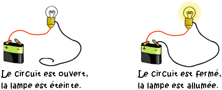
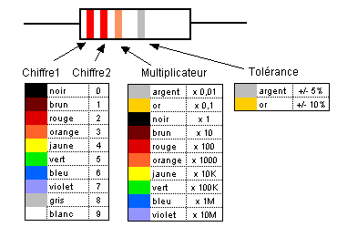
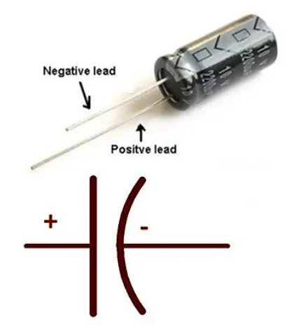
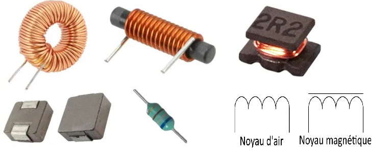
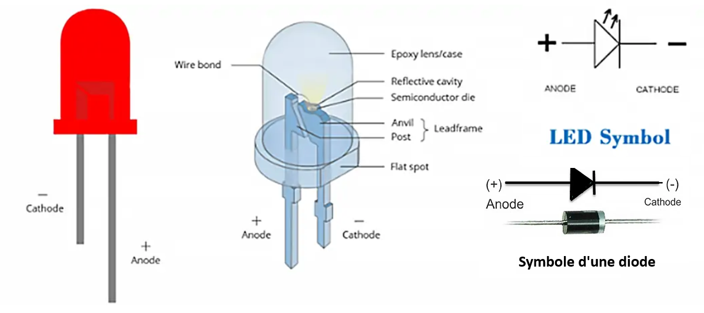
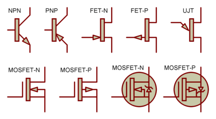
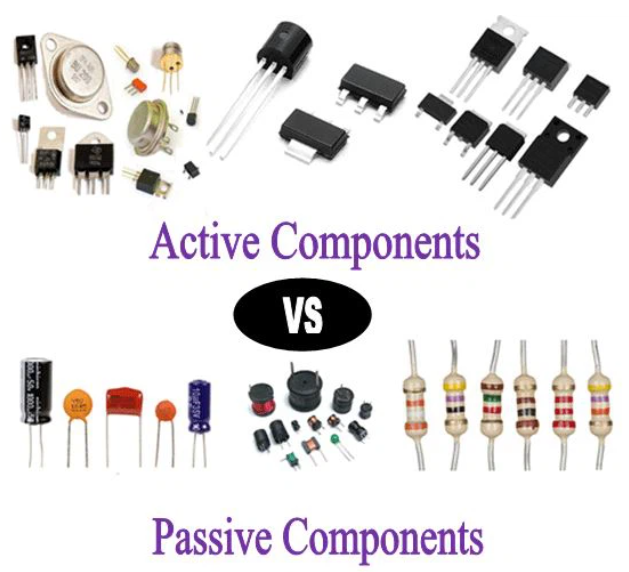
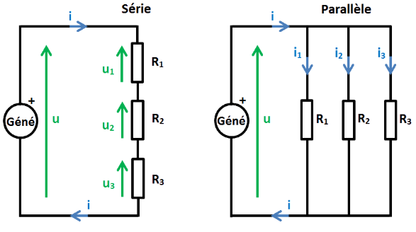
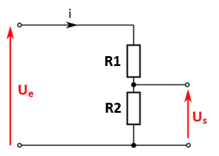
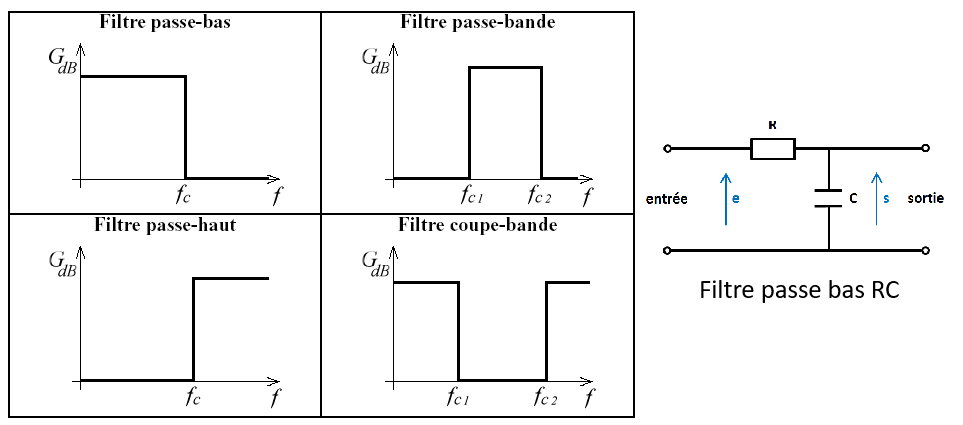

# Composants électroniques

## I. Les composants électroniques de base : caractéristiques et fonctions

Les composants électroniques sont les éléments fondamentaux d'un circuit électronique. Chacun joue un rôle précis pour contrôler le flux d'électricité, amplifier des signaux, stocker de l'énergie ou permettre l'interconnexion de différents éléments.

✅ **Complément utile :**
- Un **circuit** fonctionne seulement s’il est **fermé** (boucle complète).
- Deux grandeurs reviennent tout le temps :
  - **Tension (U)** en volts (V) : “la force” qui pousse.
  - **Courant (I)** en ampères (A) : “le débit” qui circule.
- Beaucoup d’erreurs viennent d’un **mauvais sens** (diode/LED) ou d’une **mauvaise valeur** (résistance trop faible → LED grillée).

   
  <em>Comparaison d’un circuit ouvert (lampe éteinte) et d’un circuit fermé (lampe allumée).</em>

### ● Résistances (ou résistors) : elles limitent le passage du courant dans un circuit en imposant une opposition à l'écoulement électrique.
- Mesurées en ohms (Ω), leur valeur permet de déterminer la quantité de courant qui peut traverser un circuit.
- Exemples : dans un circuit d'éclairage, une résistance peut limiter le courant pour éviter de brûler une ampoule LED fragile.

✅ **Compléments utiles :**
- Loi d’Ohm (très utilisée) : **I = U / R** (plus R est grande, plus I diminue).
- Attention puissance : une résistance peut chauffer (puissance P en watts).
- Codes couleurs / marquage : utile pour reconnaître la valeur.
- En pratique, une résistance sert aussi à :
  - faire un **diviseur de tension**
  - “tirer” un signal logique (pull-up / pull-down, selon les montages)

   
  <em>Photo d’une résistance + exemple de lecture du code couleur vers une valeur en ohms.</em>

**Vocabulaire à maîtriser :** ohm, opposition, limiter, valeur, tolérance.

---

### ● Condensateurs (ou capacitors) : ils stockent temporairement de l'énergie sous forme de champ électrique et la libèrent quand c'est nécessaire.
- Capacité mesurée en farads (F), leur fonction est souvent d'éliminer les pics de tension ou de stabiliser les tensions d’alimentation.
- Exemples : dans les alimentations d'ordinateurs, ils aident à filtrer les variations de tension pour éviter les pannes.

✅ **Compléments utiles :**
- Un condensateur est souvent en **µF** (microfarads) ou **nF** (nanofarads) en électronique réelle.
- Il sert à :
  - **lisser** une tension (filtrage)
  - **absorber** des variations rapides (anti-parasites)
  - créer des temporisations simples (avec une résistance : circuit RC)
- **Piège important :** certains condensateurs (électrolytiques) ont une **polarité** (+ et –). Inverser peut les abîmer.

   
  <em>condensateur électrolytique avec bande “–” + rappel du sens de montage.</em>

**Vocabulaire à maîtriser :** farad, capacité, filtrage, pics de tension, polarité.

---

### ● Inductances (ou bobines) : elles stockent de l'énergie sous forme de champ magnétique et réagissent principalement aux changements de courant.
- Mesurées en henrys (H), elles sont souvent utilisées pour filtrer les signaux ou limiter les pics de courant.
- Exemples : dans les systèmes audio, elles filtrent les hautes fréquences pour améliorer la qualité sonore.

✅ **Compléments utiles :**
- En pratique, les inductances sont souvent en **mH** (millihenrys) ou **µH**.
- Elles s’opposent surtout aux **variations rapides de courant** : elles “n’aiment pas” que le courant change brusquement.
- On les trouve dans :
  - alimentations (selfs, bobines de filtrage)
  - filtres audio (séparation graves/aigus)

   
  <em>photo d’une bobine/inductance (composant traversant ou CMS) et symbole sur schéma.</em>

**Vocabulaire à maîtriser :** henry, champ magnétique, filtrage.

---

### ● Diodes : elles permettent le passage du courant dans un seul sens, agissant comme des « valves » dans un circuit.
- Exemples : les diodes LED émettent de la lumière quand un courant les traverse, tandis que les diodes de redressement convertissent le courant alternatif en courant continu.

✅ **Compléments utiles :**
- Une diode a un **sens** :
  - **anode → cathode** (courant “autorisé”)
  - repérage : trait sur le symbole = **cathode**
- Une **LED** est une diode qui **émet de la lumière**.
- **Piège majeur :** une LED sans résistance de limitation peut griller (trop de courant).

   
  <em>symbole diode + symbole LED + repérage anode/cathode et sens du courant.</em>

**Vocabulaire à maîtriser :** sens passant, sens bloqué, anode, cathode, redressement.

---

### ● Transistors : ils fonctionnent comme des interrupteurs ou des amplificateurs de signal.
- En tant qu'interrupteurs, ils permettent d’allumer ou d’éteindre un circuit ; en tant qu’amplificateurs, ils augmentent l’intensité d’un signal faible.
- Exemples : dans les téléphones portables, les transistors amplifient les signaux pour émettre ou recevoir des communications.

✅ **Compléments utiles :**
- Un transistor sert souvent à :
  - commander une charge (moteur, LED puissante, relais) avec un petit signal
  - amplifier un signal faible (audio par exemple)
- Deux familles fréquentes :
  - **bipolaire (BJT)** : base/collecteur/émetteur (NPN/PNP)
  - **MOSFET** : gate/drain/source (très utilisé en puissance et numérique)
- En diagnostic : si un transistor est mal câblé, la charge ne s’allume pas ou reste toujours allumée.

   
  <em>transistors</em>

**Vocabulaire à maîtriser :** interrupteur électronique, amplification, commande, signal.

---

## II. Classification des composants électroniques : actifs et passifs

### Composants passifs : ce sont ceux qui ne génèrent pas d’énergie mais se contentent de la consommer ou de la stocker.
- Exemples : résistances, condensateurs, inductances. Ils n’ont pas besoin de source externe pour fonctionner.

✅ **Compléments utiles :**
- “Passif” = ne peut pas “amplifier” ou “décider”, il subit le circuit.
- Ils sont essentiels pour :
  - protéger (résistance)
  - stabiliser (condensateur)
  - filtrer (inductance)

### Composants actifs : ils nécessitent une source d’énergie pour fonctionner et peuvent contrôler le flux de courant.
- Exemples : transistors, diodes, circuits intégrés. Ces composants sont au cœur des fonctions de traitement de signal et de régulation dans les systèmes électroniques.

✅ **Compléments utiles :**
- “Actif” = peut contrôler, orienter, amplifier, traiter une information.
- Un **circuit intégré (CI)** est souvent une “boîte” qui contient beaucoup de transistors.

   
  <em>tableau comparatif passif/actif avec exemples et rôles.</em>

---

## III. Utilisation et association des composants : les circuits de base

La plupart des systèmes électroniques fonctionnent en utilisant des associations spécifiques de composants pour remplir des fonctions précises.

✅ **Complément utile :**
- En E2, on vous demande souvent : “Quel montage choisir ? Pourquoi ?”
- Donc il faut savoir relier **fonction attendue → association de composants**.

### ● Circuits en série et en parallèle :
- En série, les composants sont placés l’un après l’autre. Cela signifie que le même courant traverse chaque composant, mais que la tension se divise.
- En parallèle, chaque composant reçoit la même tension, mais le courant est divisé entre les branches du circuit.

✅ **Compléments utiles :**
- **Série** : si un composant se coupe, tout s’arrête.
- **Parallèle** : une branche peut tomber en panne sans couper les autres.
- Exemple concret : lampes d’une guirlande (selon modèle), circuits domestiques (plutôt parallèle).

   
  <em>deux schémas : série (même courant) et parallèle (même tension).</em>

---

### ● Diviseur de tension :
- Un diviseur de tension est un circuit qui utilise deux résistances en série pour diviser la tension d’entrée en deux tensions de sortie.
- Utilisé souvent pour ajuster les niveaux de tension dans des circuits sensibles, comme les circuits de capteurs.

✅ **Compléments utiles :**
- Formule (niveau attendu “standard”) :
  - **U_sortie = U_entrée × R2 / (R1 + R2)** (si sortie prise sur R2)
- Application typique CIEL : transformer un capteur résistif (LDR, NTC) en tension mesurable.

   
  <em>schéma diviseur avec Ue, R1, R2, Us + flèche de mesure au multimètre.</em>

---

### ● Filtres :
- Les filtres permettent de sélectionner certaines fréquences et d'en bloquer d'autres.
- Exemples : un filtre passe-bas (inductance ou condensateur) laissera passer les basses fréquences et bloquera les hautes fréquences.

✅ **Compléments utiles :**
- Filtre **RC** très courant : résistance + condensateur.
- Exemple concret : éviter les parasites sur l’alimentation d’un microcontrôleur.
- “Passe-bas” = lisse / adoucit les variations rapides.

   
  <em>schéma RC (R en série, C à la masse) + courbe simple montrant atténuation des hautes fréquences.</em>

---

## IV. Les composants spécialisés : diodes, transistors et circuits intégrés

### ● Diodes LED : elles émettent de la lumière et sont largement utilisées pour les affichages et les indicateurs.
- Fonctionnent avec une faible tension et faible courant, mais nécessitent souvent une résistance pour limiter le courant afin de ne pas les brûler.

✅ **Compléments utiles :**
- Tension typique : LED rouge ~ 1,8 à 2,2 V (ordre de grandeur).
- Résistance de protection : indispensable si alimentation “fixe” (5V par ex).
- Repérer : patte longue souvent +, méplat côté – (selon modèles).

### ● Diodes Zener : elles permettent un courant dans les deux sens, mais ne conduisent dans le sens inverse qu'au-delà d'une certaine tension.
- Utilisées pour réguler la tension dans les circuits d'alimentation.

✅ **Compléments utiles :**
- Utilisation : limiter une tension max (ex : protection entrée).
- En diagnostic : si Zener HS, la tension peut ne plus être régulée.

### ● Transistors MOSFET et Bipolaires : ces transistors sont essentiels dans les applications de puissance (MOSFET) ou de signal (bipolaires).
- Les MOSFET sont utilisés dans les circuits de puissance et les systèmes numériques, tandis que les bipolaires sont fréquents dans les amplificateurs.

✅ **Compléments utiles :**
- MOSFET “logic-level” : utile avec microcontrôleur (commande en 3,3V/5V).
- BJT : simple à comprendre pour débuter (commande par “petit courant” en base).

### ● Circuits intégrés (CI) : ils contiennent de multiples transistors et autres composants pour effectuer des fonctions complexes dans un espace réduit.
- Exemples : amplificateurs opérationnels (op-amps) pour le traitement de signal, microcontrôleurs pour le contrôle de systèmes, mémoires pour le stockage de données.

✅ **Compléments utiles :**
- Un CI se repère souvent par :
  - boîtier à plusieurs pattes
  - un marquage (référence)
- En E2 : on attend souvent “identifier le composant + rôle global”, pas la micro-électronique interne.

   
  <em>Illustration attendue : photo DIP/SOIC + repère du détrompeur (encoche) + notion de broche 1.</em>

---

## V. Les capteurs et actionneurs : interaction avec l’environnement

Les capteurs et actionneurs sont des composants permettant à un circuit électronique d’interagir avec son environnement :

### ● Capteurs : ils détectent les variations de l’environnement (température, lumière, pression) et convertissent cette information en signal électrique.
- Exemples : capteur de température pour les thermostats, capteur de lumière pour ajuster l'éclairage.

✅ **Compléments utiles :**
- Un capteur ne donne pas toujours “directement” une valeur : souvent il faut un montage (diviseur).
- Exemple : LDR → variation de résistance → variation de tension mesurée.

### ● Actionneurs : ils traduisent un signal électrique en une action physique, comme un mouvement ou une vibration.
- Exemples : moteurs pour contrôler des mécanismes, haut-parleurs pour émettre des sons.

✅ **Compléments utiles :**
- Un actionneur consomme souvent plus : on a besoin d’un transistor/driver pour le commander.
- Ex : piloter un moteur directement avec une sortie logique → impossible / dangereux.

   
  <em>Illustration attendue : schéma bloc “capteur → traitement → actionneur” (ex : LDR → microcontrôleur → moteur/LED).</em>

---

## VI. Les technologies de fabrication : CMS et traversant

### Technologie traversante (Through-Hole) : les composants sont insérés dans des trous percés sur le circuit imprimé (PCB) et soudés de l'autre côté.
- Avantages : robustesse et résistance aux vibrations, utile pour les prototypes et applications de haute puissance.

✅ **Compléments utiles :**
- Idéal pour apprendre : composants plus gros, plus faciles à manipuler.
- Souvent utilisé en atelier prototypage et pour réparations simples.

### Technologie CMS (Composants Montés en Surface) : les composants sont soudés directement sur les pistes du PCB sans perçage.
- Avantages : permet des circuits plus compacts, largement utilisée dans les appareils modernes.

✅ **Compléments utiles :**
- CMS = miniaturisation (smartphones, objets connectés).
- En maintenance : réparation plus délicate (outillage fin).

   
  <em>Illustration attendue : photo comparative : composant traversant vs composant CMS + indication de taille.</em>

---

## VII. Applications concrètes et exemples d’utilisation
- Téléphonie mobile : utilisation de microprocesseurs et de nombreux transistors pour gérer les communications, l’affichage et le stockage de données.
- Automobile : circuits intégrés pour le contrôle des moteurs, systèmes d'ABS, gestion de la température et capteurs divers (accélération, pression).
- Électronique grand public (télévisions, ordinateurs) : circuits de traitement de signal, amplificateurs et systèmes de conversion de courant.
- Robotique : les capteurs détectent l’environnement (obstacles, luminosité), tandis que les microcontrôleurs traitent les informations et les actionneurs exécutent les commandes.

✅ **Compléments utiles :**
- En CIEL, on relie souvent :
  - **capteurs** (entrée) → **traitement** (microcontrôleur/CI) → **actionneurs** (sortie)
- Exemple simple : capteur lumière → allumer LED automatiquement.

---

## VIII. Les bases de la conception de circuits : les étapes essentielles
- Choix des composants en fonction des besoins du circuit (tension, courant, fréquence).
- Dessin du schéma électronique en plaçant chaque composant aux bons emplacements et en reliant leurs connexions.
- Vérification des valeurs et ajustement selon les résultats attendus du circuit.
- Fabrication du PCB (circuit imprimé) où les composants seront soudés pour tester la fonctionnalité du montage.

✅ **Compléments utiles :**
- Réflexe pro : toujours vérifier
  1) **tension d’alimentation**
  2) **polarités** (LED, condo)
  3) **valeurs** (R trop faible = courant trop fort)
- En E2 : on attend une démarche claire : **besoin → choix → schéma → test → conclusion**.

---

# Tableau récapitulatif (vocabulaire examen)

| Composant | Unité | Rôle principal | Erreur fréquente |
|---|---:|---|---|
| Résistance | Ω | Limiter courant / diviser tension | Valeur trop faible → surintensité |
| Condensateur | F | Stockage électrique / filtrage | Polarité inversée (électrolytique) |
| Inductance | H | Stockage magnétique / filtrage | Confondre avec résistance |
| Diode / LED | - | Sens unique / indication lumineuse | Montage inversé / sans résistance |
| Transistor | - | Interrupteur / amplification | Mauvais câblage / mauvaise commande |

