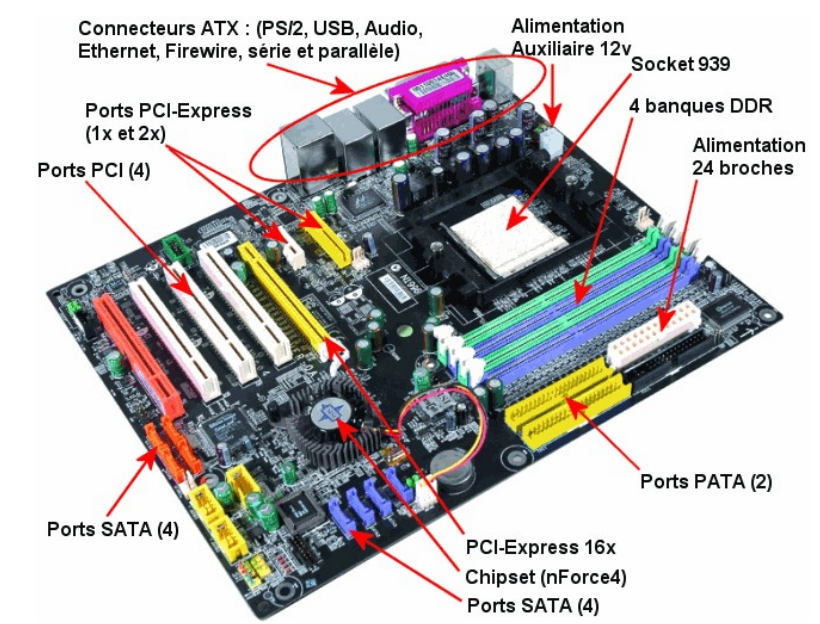
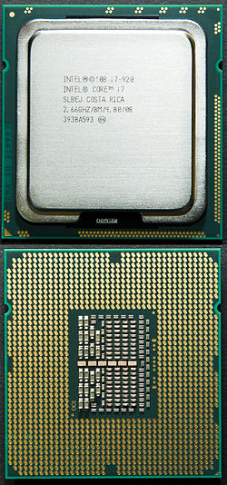
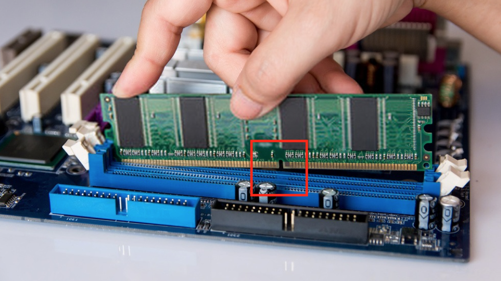
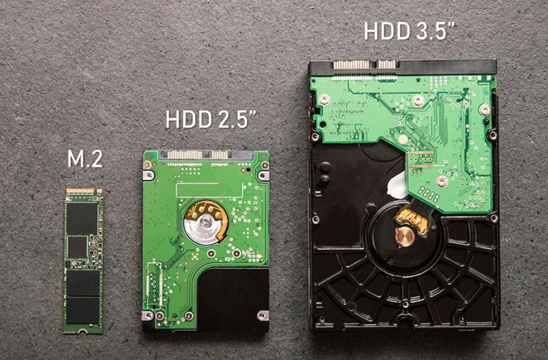
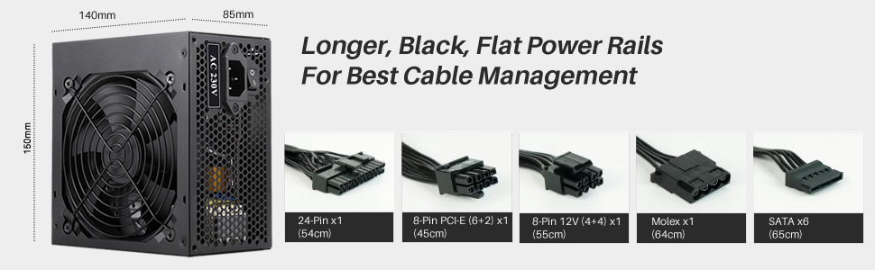
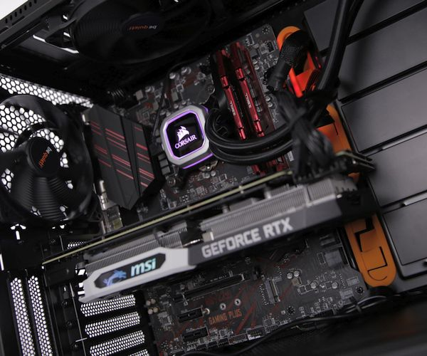
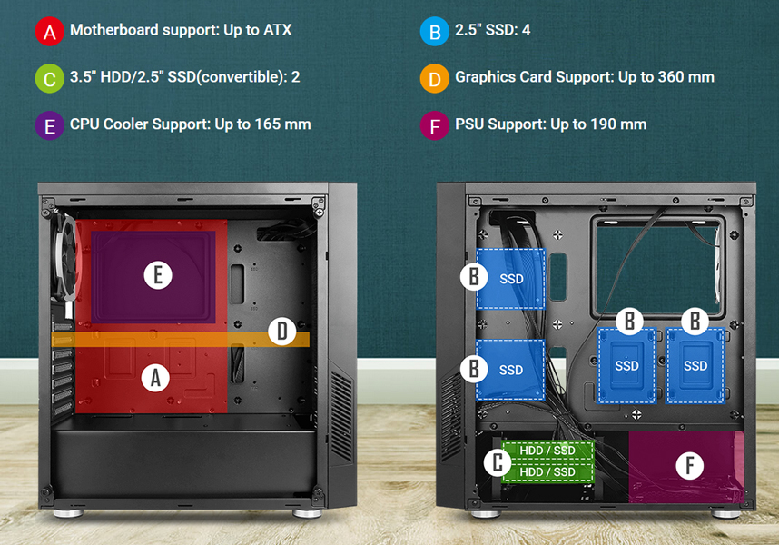

## 📚 FICHE DE COURS ÉLÈVE
### "Architecture Matérielle du PC"

*Version 1.0 - BTS SIO SISR - Semestre 1*

---

### 🎯 Compétences Travaillées

| **Code** | **Compétence** |
|----------|----------------|
| **B1.1** | Recenser et identifier les ressources numériques |
| **B2.2** | Installer et configurer des éléments d'infrastructure |

---

### I. Introduction : Pourquoi ouvrir un PC ?

En tant que futur **technicien systèmes et réseaux**, vous serez amené à :

- ✅ **Diagnostiquer** des pannes matérielles
- ✅ **Upgrader** des composants (ajout de RAM, changement de disque...)
- ✅ **Inventorier** le parc informatique de votre entreprise
- ✅ **Conseiller** les utilisateurs ou votre hiérarchie sur les évolutions à prévoir

💡 **Lien avec ITIL :** Dans le cadre de la **Gestion des Configurations (Configuration Management)**, il est essentiel de maintenir une **CMDB (Configuration Management Database)** à jour. Cela commence par l'identification précise du matériel !

---

### II. Hardware vs Software : Les Deux Piliers de l'Informatique

#### 🔧 Hardware (Matériel)

**Définition :** Ensemble des **composants physiques** d'un ordinateur que l'on peut toucher.

**Exemples :**
- Processeur (CPU)
- Mémoire vive (RAM)
- Disque dur / SSD
- Carte mère
- Alimentation
- Carte graphique

#### 💾 Software (Logiciel)

**Définition :** Ensemble des **programmes et données** immatériels qui font fonctionner le matériel.

**Exemples :**
- Système d'exploitation (Windows, Linux...)
- Applications (navigateur web, traitement de texte...)
- Pilotes (drivers)

#### 🔗 Relation Hardware / Software

```
┌─────────────────────────────────────────┐
│    UTILISATEUR (Vous et moi)            │
└──────────────┬──────────────────────────┘
               │ Interaction
┌──────────────▼──────────────────────────┐
│    APPLICATIONS (Word, Chrome...)       │
│         (Niveau LOGICIEL 2)             │
└──────────────┬──────────────────────────┘
               │ Utilise les services de
┌──────────────▼──────────────────────────┐
│  SYSTÈME D'EXPLOITATION (Windows, Linux)│
│         (Niveau LOGICIEL 1)             │
└──────────────┬──────────────────────────┘
               │ Pilote et gère
┌──────────────▼──────────────────────────┐
│     MATÉRIEL (CPU, RAM, Disque...)      │
│         (Niveau HARDWARE)               │
└─────────────────────────────────────────┘
```

*Légende : Ce schéma illustre la hiérarchie entre l'utilisateur, les applications, le système d'exploitation et le matériel. Chaque couche utilise les services de la couche inférieure.*

📌 **À retenir :** Le **logiciel** ne peut pas fonctionner sans le **matériel**, et le matériel seul n'a aucune utilité sans logiciel pour l'exploiter !

---

### III. Architecture d'un PC : Les Composants Essentiels

#### A. La Carte Mère (Motherboard)

**Rôle :** Carte principale qui **interconnecte** tous les composants du PC.

**Analogie :** C'est le "squelette" + le "système nerveux" du PC.

**Éléments clés à identifier :**
- **Socket CPU** : Emplacement pour le processeur
- **Slots RAM (DIMM)** : Emplacements pour les barrettes de mémoire vive
- **Slots PCIe** : Pour cartes d'extension (carte graphique, carte réseau...)
- **Connecteurs SATA** : Pour disques durs et lecteurs optiques
- **Connecteur d'alimentation** : Prise 24 broches pour l'alimentation
- **Chipset** : Ensemble de puces gérant les communications entre composants
- **Pile CMOS** : Pile bouton maintenant les paramètres du BIOS


*Légende : Schéma annoté d'une carte mère ATX standard montrant les principaux emplacements et connecteurs.*

---

#### B. Le Processeur (CPU - Central Processing Unit)

**Rôle :** "Cerveau" de l'ordinateur qui **exécute les instructions** des programmes.

**Caractéristiques principales :**
- **Marque** : Intel (Core i3/i5/i7/i9) ou AMD (Ryzen 3/5/7/9)
- **Fréquence** : Vitesse d'exécution exprimée en GHz (ex: 3.5 GHz)
- **Nombre de cœurs** : Permet d'exécuter plusieurs tâches simultanément (ex: 4 cœurs)
- **Nombre de threads** : Nombre de tâches parallèles gérées (ex: 8 threads avec Hyper-Threading)

**Identification physique :**
- Généralement caché sous un **ventirad** (ventilateur + radiateur)
- Format carré avec des centaines de petites broches (ou contacts plats selon le socket)


*Légende : Processeur Intel Core i7 avec vue du dessus (marquages) et du dessous (broches/contacts).*

⚠️ **Attention :** Le CPU est très fragile (broches) et sensible à la chaleur. Ne jamais le manipuler sans précautions !

---

#### C. La Mémoire Vive (RAM - Random Access Memory)

**Rôle :** Mémoire **temporaire** ultra-rapide qui stocke les données et programmes **en cours d'utilisation**.

**Analogie :** C'est le "bureau de travail" du CPU. Plus il est grand, plus on peut travailler sur plusieurs dossiers simultanément.

**Caractéristiques principales :**
- **Type** : DDR3, DDR4, DDR5 (plus le chiffre est élevé, plus c'est récent et rapide)
- **Capacité** : Exprimée en Go (ex: 8 Go, 16 Go, 32 Go)
- **Fréquence** : Vitesse exprimée en MHz (ex: 2400 MHz, 3200 MHz)

**Identification physique :**
- **Barrettes rectangulaires** enfichées verticalement dans les slots DIMM
- Généralement **vertes, bleues ou noires**
- Clips de maintien aux extrémités


*Légende : Barrette de RAM DDR4 8Go installée dans un slot DIMM. Notez les clips de maintien blancs aux extrémités.*

📌 **Particularité :** La RAM est **volatile** → toutes les données sont **perdues** à l'extinction du PC !

---

#### D. Le Stockage : Disque Dur (HDD) vs SSD

**Rôle :** Mémoire **permanente** qui conserve les données même PC éteint (OS, programmes, fichiers personnels).

##### 🔸 HDD (Hard Disk Drive)

**Technologie :** **Mécanique** → Plateaux magnétiques en rotation + têtes de lecture

**Avantages :**
- Prix faible (€/Go)
- Grande capacité (jusqu'à plusieurs To)

**Inconvénients :**
- Lent (vitesse limitée par la rotation mécanique, généralement 5400 ou 7200 tr/min)
- Fragile aux chocs
- Bruyant

**Identification physique :**
- Boîtier métallique rectangulaire de 3.5" (PC fixe) ou 2.5" (PC portable)
- Connectique : SATA (données) + Alimentation SATA ou Molex

##### 🔹 SSD (Solid State Drive)

**Technologie :** **Électronique** → Mémoire flash (comme une grosse clé USB)

**Avantages :**
- **Très rapide** (jusqu'à 10x plus rapide qu'un HDD)
- Silencieux
- Résistant aux chocs
- Consomme moins d'énergie

**Inconvénients :**
- Plus cher (€/Go)
- Capacité généralement inférieure (mais en augmentation)

**Identification physique :**
- Format 2.5" (comme un petit HDD) ou M.2 (petite carte enfichée directement sur la carte mère)
- Connectique : SATA ou M.2 (PCIe NVMe pour les plus rapides)


*Légende : Comparaison visuelle entre un disque dur HDD 3.5" (à droite), un SSD 2.5" SATA (au centre) et d'un NVME M2 (à gauche). Notez la différence de taille.*

📊 **Tableau comparatif :**

| Critère | HDD | SSD |
|---------|-----|-----|
| **Vitesse de lecture/écriture** | 80-160 Mo/s | 200-3500 Mo/s |
| **Temps d'accès** | 10-15 ms | 0.1 ms |
| **Prix (€/Go)** | ~ 0.03€ | ~ 0.10€ |
| **Durée de vie** | 3-5 ans | 5-10 ans |
| **Bruit** | Audible | Silencieux |

💡 **Conseil pro :** Configuration idéale = **SSD pour l'OS et programmes** + **HDD pour le stockage de masse** (documents, vidéos...).

---

#### E. L'Alimentation (PSU - Power Supply Unit)

**Rôle :** Convertit le courant **alternatif 220V** (secteur) en courant **continu** de différentes tensions (12V, 5V, 3.3V) utilisables par les composants.

**Caractéristiques principales :**
- **Puissance** : Exprimée en Watts (W) - ex: 500W, 650W, 750W...
  - Doit être adaptée à la consommation totale des composants
- **Certification 80 Plus** : Indicateur de rendement énergétique (Bronze, Silver, Gold, Platinum, Titanium)
- **Modularité** : Câbles fixes ou détachables

**Identification physique :**
- Gros boîtier métallique avec ventilateur (généralement situé à l'arrière/bas du boîtier)
- De nombreux câbles sortant : 
  - Câble 24 broches (carte mère)
  - Câble 4+4 broches (CPU)
  - Câbles 6+2 broches (carte graphique)
  - Câbles SATA (disques, SSD)
  - Câbles Molex (anciens périphériques)


*Légende : Bloc d'alimentation 650W modulaire avec ses différents types de câbles : 24 broches (carte mère), 8 broches (CPU), 8 broches PCIe (GPU), Molex et SATA.*

⚠️ **Danger :** L'alimentation contient des condensateurs qui peuvent rester chargés même PC débranché. **Ne jamais ouvrir une alimentation !**

---

#### F. La Carte Graphique (GPU - Graphics Processing Unit)

**Rôle :** Gère l'affichage et calcule les images envoyées à l'écran. Essentielle pour les **jeux, la vidéo et le graphisme 3D**.

**Deux types :**

##### 🔸 GPU Intégré (iGPU)

- Intégré au processeur
- Puissance limitée
- Suffisant pour bureautique et vidéo
- Pas de carte additionnelle nécessaire

##### 🔹 GPU Dédié (Carte graphique)

- Carte d'extension enfichée sur un slot PCIe x16
- Beaucoup plus puissant
- Nécessaire pour jeux, montage vidéo, calcul scientifique
- Marques principales : **NVIDIA** (GeForce GTX/RTX) ou **AMD** (Radeon RX)

**Identification physique :**
- Grande carte avec ventilateurs imposants
- Occupe 2 ou 3 slots PCIe en hauteur
- Sorties vidéo à l'arrière (HDMI, DisplayPort, DVI...)
- Nécessite souvent une alimentation dédiée (câbles PCIe 6+2 broches)


*Légende : Carte graphique NVIDIA GeForce RTX installée sur un slot PCIe x16. Notez les deux ventilateurs de refroidissement et les connecteurs d'alimentation PCIe sur le côté.*

---

#### G. Le Boîtier (Case)

**Rôle :** **Protège** les composants et **facilite le refroidissement** (circulation d'air).

**Formats courants :**
- **Mini-ITX** : Petit, compact
- **Micro-ATX** : Format moyen
- **ATX** : Format standard
- **E-ATX / Full Tower** : Très grand, pour configurations extrêmes

**Éléments à identifier :**
- **Façade** : Bouton power, ports USB, prises jack audio
- **Ventilateurs** : Entrée d'air (avant) et extraction (arrière/haut)
- **Panneaux latéraux** : Retirables par vis ou clips


*Légende : Vue intérieure d'un boîtier ATX montrant l'emplacement de la carte mère, de l'alimentation (en bas), des emplacements de disques et des ventilateurs.*

---

### IV. Programme, Système d'Exploitation, Application : La Pyramide Logicielle

#### A. Le Code Machine (Niveau le plus bas)

**Définition :** Instructions élémentaires **directement exécutables** par le processeur, en **langage binaire** (0 et 1).

**Exemple (instruction fictive en binaire) :**
```
10110000 01100001
```
→ Cette instruction pourrait signifier "Charge la valeur 97 dans le registre AL du CPU"

📌 **Problème :** Illisible et incompréhensible pour un humain ! C'est pourquoi on a créé des **langages de programmation**.

---

#### B. Le Système d'Exploitation (OS - Operating System)

**Définition :** Logiciel **intermédiaire** entre le matériel et les applications. Il gère les ressources et offre des services.

**Rôles principaux :**
1. **Gestion du matériel** : CPU, RAM, disques, périphériques...
2. **Gestion des fichiers** : Organisation, lecture/écriture sur les disques
3. **Gestion des processus** : Exécution des programmes
4. **Interface utilisateur** : Graphique (GUI) ou en ligne de commande (CLI)
5. **Sécurité** : Gestion des utilisateurs et droits d'accès

**Exemples d'OS :**
- **Windows** (10, 11)
- **Linux** (Ubuntu, Debian, CentOS...)
- **macOS** (pour les Mac)
- **Android / iOS** (pour smartphones/tablettes)


*Légende : Le système d'exploitation agit comme un chef d'orchestre entre les applications (niveau supérieur) et le matériel (niveau inférieur). Il traduit les demandes des applications en instructions compréhensibles par le matériel.*

---

#### C. Les Applications (Logiciels Utilisateurs)

**Définition :** Programmes que l'**utilisateur final** utilise pour effectuer des tâches spécifiques.

**Exemples :**
- **Bureautique** : Microsoft Office, LibreOffice
- **Navigation Web** : Google Chrome, Firefox
- **Communication** : Outlook, Teams, Slack
- **Création** : Photoshop, Blender, Visual Studio Code
- **Jeux** : Fortnite, Minecraft...

**Relation avec l'OS :**
- Les applications **utilisent les services** de l'OS
- Exemple : Word demande à Windows d'enregistrer un fichier sur le disque → Windows traduit cette demande en instructions pour le contrôleur SATA → Le contrôleur écrit physiquement les données sur le disque

---

#### 📊 Schéma Récapitulatif : La Pyramide Logicielle

```
          👤 UTILISATEUR
             ▲
             │ Utilise
             │
    ┌────────▼────────┐
    │  APPLICATIONS   │
    │  (Word, Chrome) │
    └────────┬────────┘
             │ Utilise les services de
             │
    ┌────────▼──────────────┐
    │ SYSTÈME D'EXPLOITATION│
    │     (Windows)         │
    └────────┬──────────────┘
             │ Pilote
             │
    ┌────────▼────────┐
    │   MATÉRIEL      │
    │ (CPU, RAM, SSD) │
    └─────────────────┘
             ▲
             │ Exécute
             │
    ┌────────┴────────┐
    │   CODE MACHINE  │
    │   (Binaire)     │
    └─────────────────┘
```

*Légende : Représentation en couches de l'architecture informatique, de l'utilisateur (sommet) au code machine binaire exécuté par le processeur (base). Chaque couche utilise les services de la couche inférieure.*

---

### V. TP : Démontage / Remontage d'un PC - Guide Pas à Pas

#### ⚠️ Consignes de Sécurité (À RESPECTER ABSOLUMENT)

1. ✅ **PC débranché** du secteur
2. ✅ Port du **bracelet antistatique** ou toucher régulièrement la partie métallique du boîtier
3. ✅ Manipulation des composants **par les bords** uniquement
4. ✅ Rangement des **vis** dans un bac dédié
5. ✅ **Pas de force** : si un composant résiste, c'est qu'il y a un clip ou une vis oubliée !

---

#### 🔧 Étape 1 : Préparation (5 min)

1. Poser le PC sur une surface plane et stable
2. Mettre le bracelet antistatique
3. Préparer le bac de rangement pour les vis
4. Prendre la fiche d'inventaire vierge

---

#### 🔧 Étape 2 : Ouverture du Boîtier (5 min)

1. Retirer les **deux panneaux latéraux** (généralement 2 vis à l'arrière)
2. Certains boîtiers ont des **clips** : les déverrouiller avant de tirer
3. Mettre les panneaux de côté en sécurité

**Ce que vous voyez maintenant :**
- La carte mère au centre
- L'alimentation (généralement en bas ou en haut)
- Les disques dans leurs baies
- De nombreux câbles !

---

#### 🔧 Étape 3 : Identification AVANT Démontage (10 min)

**AVANT de toucher quoi que ce soit, identifiez et notez sur votre fiche :**

| Composant | Emplacement | Marque/Modèle (si visible) |
|-----------|-------------|----------------------------|
| Carte mère | | |
| Processeur (sous ventirad) | | |
| RAM (barrettes) | | |
| Disque(s) | | |
| Alimentation | | |
| Carte graphique (si présente) | | |

📸 **Conseil pro :** Prenez une **photo** de l'intérieur avant de démonter. Cela vous aidera au remontage !

---

#### 🔧 Étape 4 : Démontage des Composants (40 min)

##### A. Retrait de la Carte Graphique (si présente)

1. Localiser la carte graphique (grande carte sur slot PCIe x16)
2. Dévisser la/les **vis de fixation** à l'arrière du boîtier
3. Débrancher le(s) **câble(s) d'alimentation PCIe** (6+2 broches)
4. Déverrouiller le **clip du slot PCIe** (petit levier sur le côté du slot)
5. Retirer délicatement la carte en tirant **droit vers le haut**

##### B. Retrait de la RAM

1. Localiser les barrettes de RAM (slots DIMM)
2. Appuyer simultanément sur les **deux clips** (un de chaque côté du slot)
3. La barrette se soulève légèrement
4. Retirer en tirant **droit vers le haut**

##### C. Déconnexion des Disques

1. Localiser les disques durs / SSD dans leurs baies
2. Débrancher les **câbles SATA** (données ET alimentation)
3. Dévisser les **vis de fixation** des baies (généralement 4 vis par disque)
4. Retirer le(s) disque(s)

##### D. Déconnexion de l'Alimentation

1. Débrancher le **câble 24 broches** de la carte mère (il y a un clip à presser)
2. Débrancher le **câble 4+4 broches** du CPU
3. Débrancher les autres câbles d'alimentation (SATA, Molex...)
4. Dévisser les **4 vis** fixant l'alimentation au boîtier
5. Retirer l'alimentation

##### E. Retrait du Ventirad (Optionnel - Si le prof le demande)

⚠️ **Attention :** Manipulation délicate !

1. Débrancher le **câble d'alimentation du ventilateur** (branché sur la carte mère, souvent marqué "CPU_FAN")
2. Déverrouiller les **clips** ou dévisser les **vis de fixation** (selon le modèle)
3. Retirer délicatement le ventirad **en tirant droit vers le haut**
4. ⚠️ **Ne PAS retirer le processeur** sauf instruction contraire !

##### F. Retrait de la Carte Mère (Optionnel - Si le prof le demande)

1. Débrancher TOUS les câbles restants (façade du boîtier : USB, audio, bouton power...)
2. Dévisser toutes les **vis de fixation** de la carte mère (généralement 6 à 9 vis)
   - ⚠️ Repérer les vis avec **entretoises** (petits plots en laiton sous la carte mère)
3. Retirer délicatement la carte en la soulevant **droit vers le haut**

---

#### 🔧 Étape 5 : Observation et Remplissage de la Fiche (20 min)

**Maintenant que tout est démonté, examinez chaque composant attentivement :**

Pour **CHAQUE composant**, notez sur votre fiche d'inventaire :

**Carte Mère :**
- Marque et modèle (imprimé sur la carte)
- Format (ATX, Micro-ATX, Mini-ITX)
- Socket CPU (ex: LGA1200, AM4)
- Nombre de slots RAM
- Nombre de slots PCIe

**Processeur :**
- Marque (Intel / AMD)
- Modèle (ex: Intel Core i5-10400F, AMD Ryzen 5 3600)
- Fréquence (ex: 2.9 GHz)
- Nombre de cœurs / threads (chercher sur Internet si pas marqué)

**RAM :**
- Type (DDR3 / DDR4)
- Capacité TOTALE (ex: 2 barrettes de 8 Go = 16 Go)
- Fréquence (ex: 2666 MHz)

**Stockage :**
- Type (HDD / SSD / M.2)
- Capacité (ex: 500 Go, 1 To)
- Marque et modèle

**Alimentation :**
- Puissance (ex: 550W)
- Certification (80 Plus Bronze/Silver/Gold...)
- Modulaire ou non

**Carte Graphique :**
- Marque (NVIDIA / AMD)
- Modèle (ex: GeForce GTX 1660, Radeon RX 580)
- Mémoire (VRAM) (ex: 6 Go)

💡 **Astuce :** Si une information n'est pas lisible physiquement, notez les références visibles et cherchez-les sur Google !

---

#### 🔧 Étape 6 : Remontage (45 min)

**Principe général :** Tout se remonte **dans l'ordre inverse** du démontage.

##### Ordre recommandé :

1. **Carte mère** (si retirée)
   - Replacer les **entretoises** si nécessaires
   - Bien aligner avec les trous du boîtier
   - Visser sans forcer

2. **Ventirad** (si retiré)
   - ⚠️ Vérifier la présence de **pâte thermique** (si elle a séché, en remettre)
   - Fixer selon le système de fixation du modèle
   - Rebrancher le câble d'alimentation sur "CPU_FAN"

3. **RAM**
   - Aligner l'**encoche** de la barrette avec le détrompeur du slot
   - Enfoncer fermement jusqu'au **clic** des deux clips

4. **Disques**
   - Replacer dans les baies
   - Visser les fixations
   - Rebrancher câbles SATA (données + alimentation)

5. **Carte graphique** (si présente)
   - Aligner avec le slot PCIe x16
   - Enfoncer fermement jusqu'au clic du clip
   - Visser la fixation arrière
   - Rebrancher le(s) câble(s) d'alimentation PCIe

6. **Alimentation**
   - Repositionner dans le boîtier
   - Visser les 4 vis de fixation
   - Rebrancher TOUS les câbles :
     - 24 broches → carte mère
     - 4+4 broches → CPU
     - Câbles SATA → disques
     - Câbles PCIe → carte graphique (si présente)
     - Câbles façade → connecteurs carte mère (power, reset, USB, audio...)

7. **Câbles de la façade**
   - Consulter le **manuel de la carte mère** pour le branchement exact
   - Connecteurs principaux : POWER SW, RESET SW, HDD LED, POWER LED, USB, HD AUDIO

8. **Fermeture du boîtier**
   - Replacer les panneaux latéraux
   - Revisser

---

#### ✅ Étape 7 : Vérification et Test (10 min)

**Avant de brancher le PC :**

- [ ] Toutes les vis ont été remises
- [ ] Aucun câble ne touche un ventilateur
- [ ] Tous les câbles d'alimentation sont branchés
- [ ] Les clips de RAM sont bien enclenchés
- [ ] La carte graphique est bien fixée

**Test de démarrage :**

1. Rebrancher le câble secteur
2. Brancher écran, clavier, souris
3. Appuyer sur le bouton Power
4. ✅ **Succès** : Le PC démarre, affiche le BIOS ou l'OS
5. ❌ **Échec** : Pas de réaction ou bips d'erreur → Appeler le prof !

**Codes bips courants (selon le BIOS) :**

| Nombre de bips | Signification probable |
|----------------|------------------------|
| 1 bip long | POST réussi (normal) |
| 1 bip court répété | Problème d'alimentation |
| 2 bips courts | Erreur RAM |
| 3 bips courts | Erreur carte graphique |
| Bips continus | Problème carte mère ou CPU |

📌 **Si le PC ne démarre pas :** Pas de panique ! Vérifiez méthodiquement les connexions. 90% des problèmes viennent d'un câble mal branché ou d'une RAM mal enclenchée.

---

### VI. Vocabulaire Clé à Maîtriser pour l'Examen

| **Terme** | **Définition** |
|-----------|----------------|
| **Hardware** | Partie matérielle (physique) d'un ordinateur |
| **Software** | Partie logicielle (immatérielle) d'un ordinateur |
| **Carte mère** | Carte principale interconnectant tous les composants |
| **CPU** | Processeur, cerveau de l'ordinateur qui exécute les instructions |
| **RAM** | Mémoire vive temporaire ultra-rapide |
| **HDD** | Disque dur mécanique (stockage permanent) |
| **SSD** | Disque à mémoire flash (stockage permanent rapide) |
| **GPU** | Processeur graphique gérant l'affichage |
| **PSU** | Bloc d'alimentation convertissant le 220V |
| **OS** | Système d'exploitation (Windows, Linux...) |
| **BIOS/UEFI** | Programme de bas niveau gérant le démarrage |
| **Socket** | Emplacement de la carte mère recevant le CPU |
| **DIMM** | Format de slot pour les barrettes de RAM |
| **PCIe** | Interface d'extension rapide (cartes graphiques...) |
| **SATA** | Interface de connexion pour disques et lecteurs |
| **POST** | Test automatique au démarrage vérifiant le matériel |
| **Ventirad** | Ensemble ventilateur + radiateur refroidissant le CPU |
| **Chipset** | Ensemble de puces de la carte mère gérant les communications |
| **CMDB** | Base de données de gestion des configurations (ITIL) |

---

### VII. Questions de Réflexion (Pour aller plus loin)

1. **Pourquoi la RAM est-elle volatile alors que le disque ne l'est pas ?**
   - *Piste : Pensez aux technologies utilisées (électrique vs magnétique/flash)*

2. **Que se passerait-il si on branchait une RAM DDR3 dans un slot DDR4 ?**
   - *Réponse : Impossible physiquement ! L'encoche de détrompeur est à un endroit différent.*

3. **Pourquoi les SSD sont-ils plus rapides que les HDD ?**
   - *Piste : Temps d'accès mécanique vs électronique*

4. **À quoi sert l'alimentation modulaire ?**
   - *Réponse : Réduire l'encombrement et améliorer le flux d'air en ne branchant que les câbles nécessaires*

5. **Pourquoi met-on de la pâte thermique entre le CPU et le ventirad ?**
   - *Réponse : Pour combler les micro-imperfections et améliorer le transfert de chaleur*

---

### VIII. Ressources pour Approfondir

**Sites Web :**
- [LDLC - Guide de montage PC](https://www.ldlc.com/)
- [Tom's Hardware - Tests et comparatifs](https://www.tomshardware.fr/)
- [Gamers Nexus - Analyses techniques](https://www.gamersnexus.net/)

**Vidéos YouTube :**
- "Montage PC de A à Z" - TopAchat
- "Comment choisir ses composants PC" - Overclocking Made In France

**Documentation :**
- Manuels des constructeurs (Asus, MSI, Gigabyte...)
- Fiches techniques des composants (Intel, AMD, Samsung...)

---

### ✅ Auto-évaluation : Suis-je Prêt ?

Après avoir terminé cette séance, je suis capable de :

- [ ] Nommer et localiser les 7 composants principaux d'un PC
- [ ] Expliquer la différence entre Hardware et Software
- [ ] Décrire le rôle de chaque composant en une phrase
- [ ] Démonter et remonter un PC en respectant les consignes de sécurité
- [ ] Remplir une fiche d'inventaire technique complète
- [ ] Différencier un HDD d'un SSD et expliquer les avantages de chaque technologie
- [ ] Expliquer la pyramide logicielle (Code machine → OS → Applications)

---
