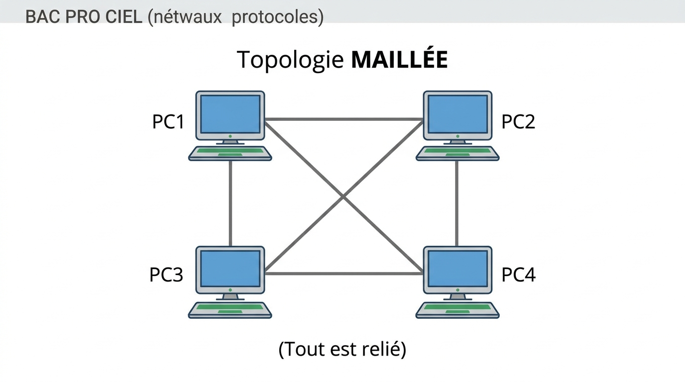
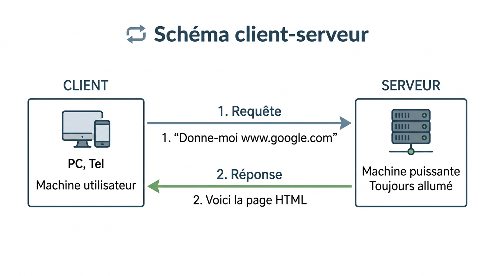

# 📖 FICHE DE COURS - S1 E31
## Topologies LAN/WAN - Modèle Client-Serveur

**Nom : ________________  Prénom : ________________  Classe : BAC PRO CIEL Année 1**

---

## 🎯 OBJECTIFS

À la fin de cette séance, je serai capable de :
- ✅ Différencier **LAN** et **WAN**
- ✅ Reconnaître les **4 topologies** principales
- ✅ Expliquer le modèle **client-serveur**
- ✅ Donner des **exemples concrets**

---

## 1️⃣ LAN vs WAN

### 📝 Définitions

**LAN** = **L**ocal **A**rea **N**etwork (Réseau Local)
> Réseau dans une zone géographique limitée (maison, bureau, école)

**WAN** = **W**ide **A**rea **N**etwork (Réseau Étendu)
> Réseau sur une grande zone géographique (ville, pays, monde)

### 📊 Tableau comparatif

| **Critère** | **LAN** | **WAN** |
|------------|---------|---------|
| **Zone couverte** | Bâtiment, campus (< 1 km) | Ville, pays, monde (> 1 km) |
| **Vitesse** | Très rapide (100 Mbps - 10 Gbps) | Variable (1 Mbps - 1 Gbps) |
| **Propriétaire** | Entreprise, particulier | Opérateur (Orange, SFR, Free...) |
| **Coût** | Faible | Élevé (abonnement) |
| **Technologie** | Ethernet, WiFi | Fibre, ADSL, 4G/5G |
| **Exemple** | Réseau du lycée | Internet |

### 🏠 Analogie

> **LAN** = Le réseau de ta **maison** (WiFi, PC, imprimante, TV)  
> **WAN** = **Internet**, qui relie toutes les maisons du monde

---

## 2️⃣ TOPOLOGIES DE RÉSEAU

### 📝 Qu'est-ce qu'une topologie ?

> Une **topologie** est la **façon dont les équipements** (ordinateurs, switchs...) sont **connectés entre eux**.

### 🔵 Topologie BUS

**Description :** Tous les équipements connectés sur **un seul câble** (ligne unique)

**Schéma :**

```
PC1 ---- PC2 ---- PC3 ---- PC4
         |
      (Bus unique)
```

**Avantages :**
- ✅ Simple
- ✅ Économique (peu de câbles)

**Inconvénients :**
- ❌ Si le câble principal casse → **Tout le réseau tombe**
- ❌ Débit partagé (lent si beaucoup d'équipements)

**Utilisation aujourd'hui :** ❌ **Obsolète** (plus utilisé)

---

### ⭐ Topologie ÉTOILE

**Description :** Tous les équipements connectés à **un point central** (switch ou hub)

**Schéma :**

```
        PC1
         |
PC4 --- SWITCH --- PC2
         |
        PC3
```

**Avantages :**
- ✅ Si un PC tombe, **les autres continuent**
- ✅ Facile à dépanner
- ✅ Ajout facile d'équipements

**Inconvénients :**
- ❌ Si le switch tombe → Tout le réseau tombe
- ❌ Coût du switch

**Utilisation aujourd'hui :** ✅ **TRÈS COURANT** (standard actuel)

**Exemple :** Réseau du lycée, entreprises, box Internet chez toi

---

### 🔴 Topologie ANNEAU

**Description :** Les équipements forment un **cercle fermé**

**Schéma :**

```
   PC1 ---- PC2
    |        |
   PC4 ---- PC3
   (Cercle fermé)
```

**Avantages :**
- ✅ Équitable (chacun son tour)
- ✅ Pas de collision

**Inconvénients :**
- ❌ Si un PC tombe → **Rupture du cercle**
- ❌ Complexe à installer

**Utilisation aujourd'hui :** ⚠️ **Rare** (sauf Token Ring ancien)

---

### 🟢 Topologie MAILLÉE

**Description :** Tous les équipements connectés **entre eux** (toutes les combinaisons)

**Schéma :**



??? note "🔤 Schéma texte original"
    ```
       PC1 ---- PC2
        | \    / |
        |   X   |
        | /    \ |
       PC3 ---- PC4
       (Tout est relié)
    ```


**Avantages :**
- ✅ **Très fiable** (plusieurs chemins possibles)
- ✅ Si un lien casse → Les autres compensent

**Inconvénients :**
- ❌ Très **coûteux** (beaucoup de câbles)
- ❌ **Complexe** à gérer

**Utilisation aujourd'hui :** ⚠️ **Réservé aux infrastructures critiques** (Internet mondial, data centers)

---

### 📊 Tableau récapitulatif

| **Topologie** | **Schéma** | **Avantage principal** | **Inconvénient principal** | **Usage actuel** |
|--------------|-----------|---------------------|--------------------------|----------------|
| **Bus** | Ligne | Économique | Pas fiable | ❌ Obsolète |
| **Étoile** | Point central | Fiable, facile | Coût switch | ✅ Standard |
| **Anneau** | Cercle | Équitable | Rupture fatale | ⚠️ Rare |
| **Maillée** | Tout connecté | Très fiable | Complexe, cher | ⚠️ Infrastructures critiques |

**💡 À retenir :** La topologie **ÉTOILE** est **LA plus utilisée** aujourd'hui !

---

## 3️⃣ MODÈLE CLIENT-SERVEUR

### 📝 Principe

> Le modèle **client-serveur** est une architecture où :
> - Le **client** **demande** un service
> - Le **serveur** **fournit** le service

**Analogie restaurant :**

| **Rôle** | **Restaurant** | **Réseau** |
|---------|---------------|-----------|
| **Client** | Toi (tu commandes) | PC, smartphone (tu demandes une page web) |
| **Serveur** | Cuisine (prépare le plat) | Serveur web (envoie la page) |
| **Requête** | "Je veux une pizza" | "Donne-moi google.com" |
| **Réponse** | La pizza arrive | La page web s'affiche |

---

### 🔵 Caractéristiques

**CLIENT :**
- Ordinateur, smartphone, tablette
- Fait des **demandes** (requêtes)
- Interface utilisateur (navigateur, application)
- Peut être éteint la nuit

**SERVEUR :**
- Machine **puissante**
- **Toujours allumé** (24h/24, 7j/7)
- Stocke les données
- Répond aux demandes de **plusieurs clients** en même temps

---

### 📌 Exemples concrets

| **Service** | **Client** | **Serveur** | **Que fait le serveur ?** |
|------------|-----------|-----------|-------------------------|
| **Web** | Navigateur Chrome | Serveur Google | Envoie la page d'accueil |
| **Email** | Outlook, Gmail app | Serveur Exchange/Gmail | Stocke et envoie les emails |
| **Fichiers** | PC au bureau | Serveur de fichiers | Partage les dossiers entreprise |
| **Jeux** | Console PS5 | Serveur Fortnite | Gère la partie multijoueur |
| **Streaming** | App Netflix | Serveurs Netflix | Envoie le film en streaming |

---

### 🔄 Schéma client-serveur



??? note "🔤 Schéma texte original"
    ```
    ┌──────────┐                    ┌──────────┐
    │  CLIENT  │                    │ SERVEUR  │
    │          │                    │          │
    │ PC, Tel  │  1. Requête        │ Machine  │
    │          │ ───────────────>   │ puissante│
    │          │                    │          │
    │          │  2. Réponse        │ Toujours │
    │          │ <───────────────   │ allumé   │
    └──────────┘                    └──────────┘

    Exemple :
    1. "Donne-moi www.google.com"
    2. Voici la page HTML
    ```


---

### ⚖️ Client-Serveur vs Peer-to-Peer (P2P)

| **Critère** | **Client-Serveur** | **Peer-to-Peer (P2P)** |
|------------|------------------|---------------------|
| **Rôles** | Séparés (client ≠ serveur) | **Chacun est client ET serveur** |
| **Serveur** | Machine dédiée | Pas de serveur central |
| **Exemple** | Netflix, Gmail | BitTorrent, Skype |
| **Avantage** | Centralisé, sécurisé | Pas besoin de serveur |
| **Inconvénient** | Si serveur tombe → service stop | Moins fiable |

**💡 Aujourd'hui :** Client-serveur **dominant** (90% des services Internet)

---

## 📚 VOCABULAIRE TECHNIQUE

| **Terme** | **Définition** |
|-----------|----------------|
| **LAN** | Local Area Network (réseau local) |
| **WAN** | Wide Area Network (réseau étendu) |
| **Topologie** | Façon dont équipements sont connectés |
| **Switch** | Équipement central (topologie étoile) |
| **Client** | Équipement qui demande un service |
| **Serveur** | Équipement qui fournit un service |
| **Requête** | Demande du client au serveur |
| **Réponse** | Retour du serveur au client |
| **P2P** | Peer-to-Peer (pair à pair) |

---

## ✅ AUTO-ÉVALUATION

**Je peux répondre à ces questions :**

- [ ] Quelle est la différence entre LAN et WAN ?
- [ ] Quelle topologie est la plus utilisée aujourd'hui ?
- [ ] Pourquoi la topologie bus n'est plus utilisée ?
- [ ] Qu'est-ce qu'un client ? Un serveur ?
- [ ] Donne 3 exemples de services client-serveur

**Si non :** Relis la fiche ou demande au formateur !

---

## 📌 POINTS-CLÉS À RETENIR

1. **LAN** = réseau local (lycée, maison) | **WAN** = réseau étendu (Internet)
2. **Topologie étoile** = standard actuel (switch central)
3. **Client** = demande | **Serveur** = fournit
4. **Exemples** : Web, email, fichiers, streaming = client-serveur

---

## 📸 POUR LE PORTFOLIO

**À conserver :**
- Cette fiche complétée
- Schémas des 4 topologies (dessinés)
- Exemple client-serveur personnel (Netflix, jeux...)

---

## 🏠 POUR ALLER PLUS LOIN (Optionnel)

**Chez toi :**
- Observe ta box Internet : combien d'appareils connectés ? (= LAN)
- Identifie la topologie de ton réseau domestique (étoile ?)
- Liste 5 services que tu utilises (YouTube, WhatsApp...) → Tous en client-serveur !

---

**Document - BAC PRO CIEL - Version 1.0 - Février 2026**  
*Séance S1 E31 - Diagnostic & Introduction*
