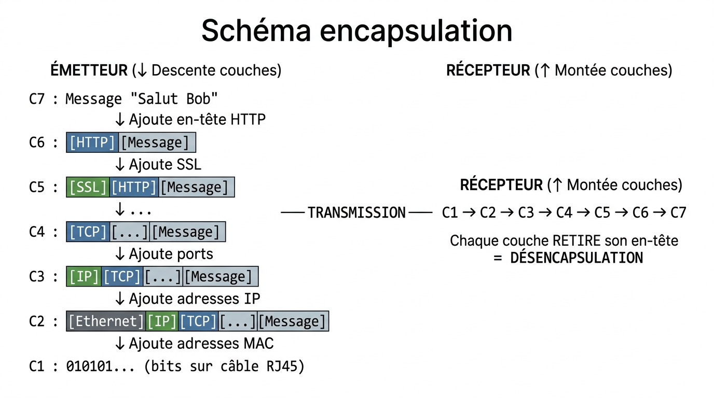

# 📖 FICHE COURS - S3 E31
## Modèle OSI 7 Couches

**Nom : ________________  Prénom : ________________**

---

## 🎯 OBJECTIFS

- ✅ Nommer les 7 couches OSI
- ✅ Expliquer rôle de chaque couche
- ✅ Comprendre l'encapsulation
- ✅ Identifier protocoles par couche

---

## 1️⃣ QU'EST-CE QUE LE MODÈLE OSI ?

**OSI** = **O**pen **S**ystems **I**nterconnection

> Modèle de référence qui découpe la communication réseau en **7 couches**.

**Créé par :** ISO en 1984  
**But :** Standardiser communication entre systèmes différents

---

## 2️⃣ LES 7 COUCHES (de bas en haut)

### **Mnémotechnique**

> **"P**ierre **L**e **R**at **T**rouve **S**on **P**ain **A**ujourd'hui"

### **Tableau récapitulatif**

| **C** | **Nom** | **Rôle** | **Équipement** | **Protocoles** | **Unité** |
|------|---------|----------|---------------|---------------|----------|
| **7** | Application | Interface utilisateur | - | HTTP, FTP, SMTP | Message |
| **6** | Présentation | Format, chiffrement | - | SSL/TLS | - |
| **5** | Session | Gestion connexions | - | NetBIOS | - |
| **4** | Transport | Fiabilité bout-en-bout | - | TCP, UDP | Segment |
| **3** | Réseau | Routage inter-réseaux | Routeur | IP, ICMP | Paquet |
| **2** | Liaison | Transmission locale | Switch | Ethernet, WiFi | Trame |
| **1** | Physique | Bits sur câble | **Câble RJ45 (S2)** | - | Bits |

---

## 3️⃣ DÉTAIL DES COUCHES

### **C1 : PHYSIQUE**

**Rôle :** Transmettre **bits** (0 et 1) sur support physique

**Équipements :**
- **Câble RJ45** (fabriqué en S2 !)
- Câble fibre optique
- Ondes WiFi
- Hub, répéteur

**💡 LIEN S2 :** Le câble que vous avez fabriqué = Couche 1

---

### **C2 : LIAISON (Data Link)**

**Rôle :** Transmission entre 2 équipements **voisins** (même réseau local)

**Équipements :** **Switch**, pont

**Adresse :** **MAC** (48 bits, ex: AA:BB:CC:DD:EE:FF)

**Protocoles :** Ethernet, WiFi (802.11)

**Unité :** **Trame** (frame)

**💡 LIEN S5 :** On verra le switch (couche 2) en S5

---

### **C3 : RÉSEAU (Network)**

**Rôle :** **Routage** entre réseaux différents

**Équipements :** **Routeur**

**Adresse :** **IP** (32 bits IPv4, ex: 192.168.1.1)

**Protocoles :** IP, ICMP (ping), ARP

**Unité :** **Paquet**

---

### **C4 : TRANSPORT**

**Rôle :** Communication **bout en bout**, fiabilité

**Équipements :** (Logiciel, pas physique)

**Protocoles :**
- **TCP** : Fiable, avec connexion (web, email)
- **UDP** : Rapide, sans connexion (streaming, jeux)

**Ports :** 0-65535 (ex: HTTP = port 80)

**Unité :** **Segment**

**Différence TCP vs UDP :**

| **TCP** | **UDP** |
|---------|---------|
| Fiable (accusés réception) | Pas fiable |
| Connexion établie | Pas de connexion |
| Lent mais sûr | Rapide |
| Web, Email, FTP | Streaming, Jeux en ligne |

---

### **C5-6-7 : Session, Présentation, Application**

**C5 SESSION :**
- Gestion connexions (ouverture, maintien, fermeture)
- Exemples : SSH, RDP

**C6 PRÉSENTATION :**
- Format données (chiffrement, compression)
- Exemples : SSL/TLS, JPEG, MP3

**C7 APPLICATION :**
- Interface utilisateur
- Protocoles : **HTTP** (web), **FTP** (fichiers), **SMTP** (email)

---

## 4️⃣ ENCAPSULATION

### **Définition**

> **Encapsulation** = Processus d'ajout d'**en-têtes** (headers) par chaque couche.

**Analogie :** Poupées russes ou enveloppes gigognes

### **Schéma encapsulation**



??? note "🔤 Schéma texte original"
    ```
    ÉMETTEUR (↓ Descente couches)

    C7 : Message "Salut Bob"
           ↓ Ajoute en-tête HTTP
    C6 : [HTTP][Message]
           ↓ Ajoute SSL
    C5 : [SSL][HTTP][Message]
           ↓ ...
    C4 : [TCP][...][Message]
           ↓ Ajoute ports
    C3 : [IP][TCP][...][Message]
           ↓ Ajoute adresses IP
    C2 : [Ethernet][IP][TCP][...][Message]
           ↓ Ajoute adresses MAC
    C1 : 010101... (bits sur câble RJ45)

    ────── TRANSMISSION ──────

    RÉCEPTEUR (↑ Montée couches)

    C1 → C2 → C3 → C4 → C5 → C6 → C7

    Chaque couche RETIRE son en-tête
    = DÉSENCAPSULATION
    ```


---

## 5️⃣ PROTOCOLES PAR COUCHE

| **Couche** | **Protocoles principaux** |
|-----------|--------------------------|
| **C7** | HTTP, HTTPS, FTP, SMTP, DNS |
| **C6** | SSL/TLS |
| **C5** | NetBIOS |
| **C4** | TCP, UDP |
| **C3** | IP, ICMP, ARP |
| **C2** | Ethernet, WiFi (802.11) |
| **C1** | - (physique) |

---

## 6️⃣ EXEMPLE : NAVIGATION WEB

**Action :** Vous tapez `www.google.com`

**Traversée 7 couches (émetteur) :**

**C7 :** Navigateur crée requête HTTP  
**C6 :** Chiffrement HTTPS (SSL)  
**C5 :** Gestion session  
**C4 :** TCP ajoute ports (source: 49152, dest: 443)  
**C3 :** IP ajoute adresses (votre IP → IP Google)  
**C2 :** Ethernet ajoute MAC (votre MAC → MAC routeur)  
**C1 :** Transmission bits sur câble RJ45  

**Traversée 7 couches (récepteur Google) :**

**C1 → C2 → C3 → C4 → C5 → C6 → C7**

Chaque couche retire son en-tête

**C7 (Google) :** Reçoit requête HTTP, renvoie page web

**Retour :** Même processus inverse

---

## ✅ AUTO-ÉVALUATION

- [ ] Je connais les 7 couches dans l'ordre
- [ ] Je différencie TCP et UDP
- [ ] Je comprends l'encapsulation
- [ ] Je place HTTP, TCP, IP dans bonnes couches

---

## 📚 VOCABULAIRE

| **Terme** | **Définition** |
|-----------|----------------|
| **OSI** | Modèle 7 couches (référence) |
| **Encapsulation** | Ajout en-têtes par couches |
| **Désencapsulation** | Retrait en-têtes |
| **En-tête** | Informations ajoutées par couche |
| **Trame** | Unité couche 2 |
| **Paquet** | Unité couche 3 |
| **Segment** | Unité couche 4 |
| **TCP** | Protocole fiable C4 |
| **UDP** | Protocole rapide C4 |
| **IP** | Protocole adressage C3 |

---

## 📌 POINTS-CLÉS

1. **7 couches** : Physique → Liaison → Réseau → Transport → Session → Présentation → Application
2. **Câble RJ45** (S2) = Couche 1
3. **Switch** = C2, **Routeur** = C3
4. **Encapsulation** = Ajout en-têtes (descente)
5. **TCP** = Fiable, **UDP** = Rapide

---

## 📸 PORTFOLIO

- Schéma 7 couches annoté
- Schéma encapsulation
- Exemple navigation web

---

**Document - BAC PRO CIEL - Version 1.0 - Février 2026**
