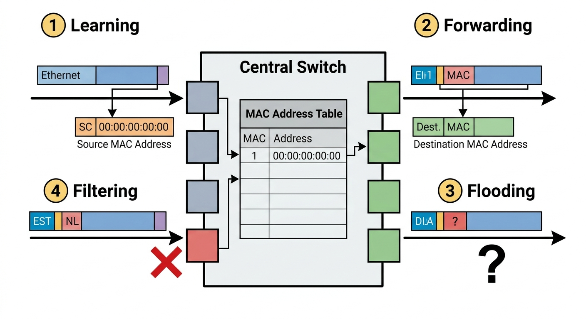

# FICHE DE COURS ÉLÈVE - U31 Réseaux Informatiques
## Semaine 5 - Switch Ethernet : Table MAC, Domaines et VLANs

---

**Nom :** _________________________ **Prénom :** _________________________

**Classe :** Bac Pro CIEL - Année 1 **Date :** ___/___/______

---

## 🎯 OBJECTIFS DE LA SÉANCE

À la fin de ce cours, tu seras capable de :

- ✅ Expliquer le fonctionnement d'un switch Ethernet
- ✅ Analyser une table MAC
- ✅ Différencier domaine de collision et domaine de broadcast
- ✅ Se connecter à un switch en CLI (ligne de commande)
- ✅ Créer des VLANs et configurer des ports en mode access
- ✅ Identifier le VLAN natif et son rôle

---

## 📚 PARTIE 1 : LE SWITCH ETHERNET

### 1.1 Qu'est-ce qu'un switch ?

**Switch** (commutateur réseau) = Équipement qui **relie plusieurs ordinateurs** sur un même réseau local (LAN).

**Couche du modèle OSI :** Couche 2 (Liaison de données)

**Rôle principal :**
- Créer des **connexions temporaires** entre les ports
- **Filtrer** le trafic en fonction des **adresses MAC**
- Augmenter les **performances** du réseau

---

### 1.2 Hub vs Switch : Quelle différence ?

**Hub (ancien, obsolète) :**

```
         HUB
        / | \
      PC1 PC2 PC3
```

- Couche 1 (physique) : Simple **répéteur**
- Envoie **tous les paquets à tous les ports**
- **Aucune intelligence** → Collisions fréquentes
- **1 seul domaine de collision** (partagé)

---

**Switch (moderne) :**

```
       SWITCH
        / | \
      PC1 PC2 PC3
```

- Couche 2 (liaison) : **Intelligence** basée sur les adresses MAC
- Envoie les paquets **uniquement au bon port**
- **1 domaine de collision par port** (isolation)
- **Full-duplex** : Communication bidirectionnelle simultanée

---

**Tableau comparatif :**

| **Caractéristique** | **Hub** | **Switch** |
|-------------------|---------|-----------|
| Couche OSI | 1 (Physique) | 2 (Liaison) |
| Décision | Aucune (répète tout) | Intelligente (adresse MAC) |
| Domaine de collision | 1 seul | 1 par port |
| Collisions | Fréquentes | Aucune (full-duplex) |
| Performance | Faible | Élevée |
| Prix | Très bas | Abordable |

**💡 À retenir :** Les hubs ne sont **plus utilisés** aujourd'hui. On utilise exclusivement des switches.

---

## 📚 PARTIE 2 : LA TABLE MAC

### 2.1 Qu'est-ce que la table MAC ?

La **table MAC** (aussi appelée **CAM table** - Content Addressable Memory) est une **base de données interne** du switch.

**Elle contient :**
- **Adresse MAC** : Identifiant unique de chaque carte réseau (format : 00:1A:2B:3C:4D:5E)
- **Numéro de port** : Port physique du switch où est branché l'équipement
- **VLAN** : Réseau virtuel auquel appartient ce port
- **Type** : Dynamique (appris) ou Statique (configuré manuellement)

**Exemple de table MAC :**

| **Adresse MAC** | **Port** | **VLAN** | **Type** |
|----------------|----------|----------|----------|
| 00:0C:29:5A:3B:1F | Fa0/1 | 10 | DYNAMIC |
| 00:1A:2B:3C:4D:5E | Fa0/5 | 10 | DYNAMIC |
| 00:50:56:AB:CD:EF | Fa0/10 | 20 | DYNAMIC |
| 00:AA:BB:CC:DD:EE | Fa0/24 | 1 | STATIC |

---

### 2.2 Les 4 processus du switch

Le switch utilise 4 processus pour gérer le trafic réseau :

#### 1️⃣ Learning (Apprentissage)

**Quand une trame arrive sur un port, le switch :**
- **Lit** l'adresse MAC **source**
- **Enregistre** dans sa table : "Cette MAC est sur ce port"
- **Met à jour** si la MAC existait déjà sur un autre port

**Durée de vie :** Par défaut, une entrée reste **5 minutes** (300 secondes). C'est le **aging** (vieillissement).

**Exemple :**

```
Trame arrive sur port Fa0/5 :
  Source MAC : 00:1A:2B:3C:4D:5E

Switch ajoute dans sa table :
  00:1A:2B:3C:4D:5E → Port Fa0/5
```

---

#### 2️⃣ Forwarding (Acheminement)

**Quand le switch connaît la destination :**
- **Lit** l'adresse MAC **destination**
- **Consulte** sa table MAC
- **Envoie** la trame **uniquement sur le bon port**

**Avantage :** Pas de trafic inutile → **Optimisation de la bande passante**

**Exemple :**

```
Trame arrive avec destination : 00:50:56:AB:CD:EF

Switch consulte table :
  00:50:56:AB:CD:EF → Port Fa0/10

Switch envoie SEULEMENT sur port Fa0/10
```

---

#### 3️⃣ Flooding (Inondation)

**Quand le switch NE connaît PAS la destination :**
- **Envoie** la trame sur **tous les ports** (sauf celui d'origine)
- **Attend** une réponse pour apprendre la MAC

**Cas typiques :**
- Première trame d'un nouvel équipement
- Trame de broadcast (FF:FF:FF:FF:FF:FF)
- Trame multicast

**Exemple :**

```
Trame arrive avec destination : 00:DE:AD:BE:EF:00

Switch consulte table :
  00:DE:AD:BE:EF:00 → PAS DANS LA TABLE !

Switch envoie sur TOUS les ports (sauf port d'origine)
```

---

#### 4️⃣ Filtering (Filtrage)

**Si source et destination sont sur le même port :**
- Le switch **ignore** la trame (pas besoin de la transmettre)

**Cas typique :** Deux machines virtuelles sur le même serveur physique.

---

**Schéma récapitulatif des 4 processus :**



---

### 2.3 Afficher la table MAC (commande CLI)

**Commande Cisco IOS :**

```
Switch# show mac address-table
```

**Résultat typique :**

```
Mac Address Table
-------------------------------------------

Vlan    Mac Address       Type        Ports
----    -----------       --------    -----
  10    000c.295a.3b1f    DYNAMIC     Fa0/1
  10    001a.2b3c.4d5e    DYNAMIC     Fa0/5
  20    0050.56ab.cdef    DYNAMIC     Fa0/10
   1    00aa.bbcc.ddee    STATIC      Fa0/24
Total Mac Addresses for this criterion: 4
```

**Lecture du résultat :**
- **VLAN 10** : 2 équipements (ports Fa0/1 et Fa0/5)
- **VLAN 20** : 1 équipement (port Fa0/10)
- **VLAN 1** : 1 équipement configuré en statique (port Fa0/24)

---

## 📚 PARTIE 3 : DOMAINES DE COLLISION ET BROADCAST

### 3.1 Domaine de collision

**Définition :**

Un **domaine de collision** est une zone du réseau où deux trames peuvent **entrer en collision** si elles sont envoyées simultanément.

---

**Avec un HUB :**

```
       HUB
      / | \
    PC1 PC2 PC3
  └────────────┘
  1 seul domaine
```

- **1 seul domaine de collision** pour tous les ports
- Si PC1 et PC2 envoient en même temps → **Collision** → Retransmission

---

**Avec un SWITCH :**

```
     SWITCH
      / | \
    PC1 PC2 PC3
    │   │   │
    └───┴───┘
  3 domaines
```

- **1 domaine de collision par port**
- PC1 et PC2 peuvent envoyer **simultanément** sans collision
- Communication **full-duplex** (bidirectionnelle)

**💡 À retenir :**
- Switch = **1 domaine de collision par port**
- Plus de collisions possibles !

---

### 3.2 Domaine de broadcast

**Définition :**

Un **domaine de broadcast** est une zone du réseau où une trame de **broadcast** (FF:FF:FF:FF:FF:FF) est **diffusée à tous** les équipements.

---

**Avec un switch SANS VLAN :**

```
       SWITCH
        /|\
       / | \
     PC1 PC2 PC3
    └──────────┘
   1 domaine broadcast
```

- **1 seul domaine de broadcast** (tous les ports)
- Un broadcast envoyé par PC1 est reçu par PC2 et PC3

---

**Avec un switch AVEC VLANs :**

```
      SWITCH
       / | \
   VLAN 10  VLAN 20
     / \      |
   PC1 PC2   PC3
   └──┘      └─┘
  Domaine 1  Domaine 2
```

- **1 domaine de broadcast par VLAN**
- Un broadcast dans VLAN 10 ne traverse **pas** vers VLAN 20

---

**Qui sépare les domaines de broadcast ?**

| **Équipement** | **Domaines de broadcast** |
|---------------|---------------------------|
| Hub | 1 seul (tous les ports) |
| Switch sans VLAN | 1 seul (tous les ports) |
| Switch avec VLANs | 1 par VLAN |
| **Routeur** | **1 par interface** ✅ |

**💡 À retenir :**
- Switch simple = **NE SÉPARE PAS** les domaines de broadcast
- Switch avec VLANs = **1 domaine par VLAN**
- Routeur = **SÉPARE** toujours les domaines de broadcast

---

**Tableau récapitulatif :**

| **Équipement** | **Domaines de collision** | **Domaines de broadcast** |
|----------------|---------------------------|---------------------------|
| Hub | 1 seul | 1 seul |
| Switch 8 ports (sans VLAN) | 8 (1 par port) | 1 seul |
| Switch 8 ports (2 VLANs) | 8 (1 par port) | 2 (1 par VLAN) |
| Routeur 2 interfaces | 2 (1 par interface) | 2 (1 par interface) |

---

## 📚 PARTIE 4 : LES VLANs (Virtual LAN)

### 4.1 Qu'est-ce qu'un VLAN ?

**VLAN** = **V**irtual **L**ocal **A**rea **N**etwork (Réseau Local Virtuel)

> Un VLAN est une **segmentation logique** d'un réseau physique. Il permet de **diviser un switch** en plusieurs réseaux **isolés**.

**Analogie :**

Imagine un immeuble de bureaux :
- **Sans VLAN** : Open space géant, tout le monde se voit et s'entend
- **Avec VLAN** : Bureaux cloisonnés, chaque service est isolé

---

**Schéma conceptuel :**

```
         SWITCH PHYSIQUE
         (1 seul switch)
              │
      ┌───────┴───────┐
      │               │
   VLAN 10         VLAN 20
  (Logique)       (Logique)
      │               │
   Ports 1-5       Ports 6-10
   Comptabilité    Production
```

**Résultat :** C'est comme si tu avais **2 switches séparés**, mais physiquement il n'y en a qu'un seul !

---

### 4.2 Avantages des VLANs

| **Avantage** | **Explication** | **Exemple** |
|-------------|----------------|-------------|
| **🔒 Sécurité** | Isoler les départements sensibles | Comptabilité ≠ Production |
| **⚡ Performance** | Réduire la taille des domaines de broadcast | Moins de trafic inutile |
| **🎯 Flexibilité** | Regrouper par fonction, pas par lieu | Tous les profs, même dans des salles différentes |
| **🛠️ Gestion** | Déplacer un poste de VLAN sans le débrancher | Changement de service |

---

**Exemple concret : École**

```
VLAN 10 - Administration
  ├─ Direction
  ├─ Secrétariat
  └─ Comptabilité

VLAN 20 - Enseignants
  ├─ Salle des profs
  ├─ CDI
  └─ Laboratoires

VLAN 30 - Élèves
  ├─ Salles informatiques
  └─ CDI élèves
```

→ Un élève ne peut **pas** accéder aux fichiers de l'administration (isolation VLAN)

---

### 4.3 Types de VLANs

| **Type** | **Numéro** | **Usage** |
|----------|-----------|-----------|
| **VLAN par défaut** | 1 | Tous les ports non configurés |
| **VLANs de données** | 10-999 | Trafic utilisateur normal |
| **VLAN voix** | 100-199 | Téléphonie IP (priorité QoS) |
| **VLAN management** | 99 | Administration du switch (SSH) |
| **VLAN natif** | 1 (défaut) | Trafic non taggé sur trunk |

**Plages réservées :**
- **VLAN 1** : VLAN par défaut (ne peut pas être supprimé)
- **VLAN 1002-1005** : Réservés (Token Ring, FDDI) - Ne pas utiliser

**💡 Bonne pratique :**
- Ne **pas** utiliser VLAN 1 pour du trafic utilisateur (sécurité)
- Créer un VLAN dédié pour le management (ex: VLAN 99)

---

### 4.4 VLAN natif (Native VLAN)

**Définition :**

Le **VLAN natif** est le VLAN utilisé pour le trafic **non taggé** (sans étiquette 802.1Q) sur un **trunk** (lien entre switches).

**Par défaut :** VLAN 1

**Important à comprendre :**

- Sur un port **access** : Tout le trafic appartient au VLAN configuré (pas de tag)
- Sur un port **trunk** : Le trafic du VLAN natif **n'a pas de tag** 802.1Q, les autres VLANs sont taggés

**Exemple :**

```
Switch A ────TRUNK────> Switch B

Trafic VLAN 10 : Tagged (802.1Q tag = 10)
Trafic VLAN 20 : Tagged (802.1Q tag = 20)
Trafic VLAN 1 (natif) : Non-tagged (pas de tag)
```

**⚠️ Risque de sécurité :**

Le VLAN natif peut être exploité pour des attaques **VLAN hopping**. Il est recommandé de :
- Changer le VLAN natif (mettre VLAN 999 par exemple)
- Ne pas utiliser VLAN 1 comme natif

**(On verra les trunks en détail en S13)**

---

## 📚 PARTIE 5 : MODE ACCESS

### 5.1 Qu'est-ce qu'un port en mode access ?

**Mode Access** = Le port appartient à **un seul VLAN**.

**Utilisation :** Connecter des **équipements terminaux** (PC, imprimante, téléphone IP, serveur).

**Schéma :**

```
   PC ───────> [Port Fa0/5 (Access)]
                   VLAN 10
```

Le PC est dans le **VLAN 10** uniquement.

---

### 5.2 Configuration d'un port en mode access

**Commandes Cisco IOS :**

```
Switch# configure terminal
Switch(config)# interface fastethernet 0/5
Switch(config-if)# switchport mode access
Switch(config-if)# switchport access vlan 10
Switch(config-if)# description PC_Comptabilité
Switch(config-if)# exit
```

**Explication ligne par ligne :**

| **Commande** | **Signification** |
|-------------|-------------------|
| `configure terminal` | Entrer en mode configuration globale |
| `interface fastethernet 0/5` | Sélectionner le port Fa0/5 |
| `switchport mode access` | Définir le port en mode access |
| `switchport access vlan 10` | Affecter le port au VLAN 10 |
| `description PC_Comptabilité` | Ajouter une description (optionnel mais recommandé) |
| `exit` | Sortir du mode configuration interface |

---

### 5.3 Configurer plusieurs ports simultanément

**Commande `interface range` :**

```
Switch(config)# interface range fastethernet 0/1 - 10
Switch(config-if-range)# switchport mode access
Switch(config-if-range)# switchport access vlan 20
Switch(config-if-range)# description Postes_Enseignants
Switch(config-if-range)# exit
```

**Effet :** Les ports Fa0/1 à Fa0/10 (10 ports) sont configurés en **une seule fois** dans le VLAN 20.

**💡 Gain de temps énorme sur de gros switches (24 ou 48 ports) !**

---

### 5.4 Vérifier la configuration

**Afficher les VLANs et leurs ports :**

```
Switch# show vlan brief
```

**Résultat :**

```
VLAN Name                             Status    Ports
---- -------------------------------- --------- -------------------------------
1    default                          active
10   ADMIN                            active    Fa0/1, Fa0/2, Fa0/3
20   PROFS                            active    Fa0/4, Fa0/5, Fa0/6
30   ELEVES                           active    Fa0/7, Fa0/8, Fa0/9, Fa0/10
```

---

**Afficher les détails d'un port :**

```
Switch# show interfaces fastethernet 0/5 switchport
```

**Résultat (extrait) :**

```
Name: Fa0/5
Switchport: Enabled
Administrative Mode: access
Operational Mode: access
Access Mode VLAN: 20 (PROFS)
```

---

## 📚 PARTIE 6 : CRÉER DES VLANs

### 6.1 Création d'un VLAN

**Commandes Cisco IOS :**

```
Switch# configure terminal
Switch(config)# vlan 10
Switch(config-vlan)# name ADMINISTRATION
Switch(config-vlan)# exit
```

**Explication :**
- `vlan 10` : Créer le VLAN numéro 10
- `name ADMINISTRATION` : Donner un nom descriptif (optionnel mais recommandé)
- `exit` : Sortir du mode configuration VLAN

---

**Créer plusieurs VLANs d'un coup :**

```
Switch(config)# vlan 10
Switch(config-vlan)# name ADMIN
Switch(config-vlan)# exit

Switch(config)# vlan 20
Switch(config-vlan)# name PROFS
Switch(config-vlan)# exit

Switch(config)# vlan 30
Switch(config-vlan)# name ELEVES
Switch(config-vlan)# exit
```

---

### 6.2 Vérifier les VLANs créés

```
Switch# show vlan brief
```

**Résultat :**

```
VLAN Name                             Status    Ports
---- -------------------------------- --------- -------------------------------
1    default                          active    Fa0/1, Fa0/2, ... (tous)
10   ADMIN                            active
20   PROFS                            active
30   ELEVES                           active
```

**Interprétation :**
- Les VLANs 10, 20, 30 sont créés mais **aucun port** n'est encore affecté
- Tous les ports sont encore dans le **VLAN 1** (par défaut)

---

### 6.3 Supprimer un VLAN

**Commande :**

```
Switch(config)# no vlan 30
```

**⚠️ Attention :** Les ports qui étaient dans ce VLAN retournent dans le **VLAN 1** (par défaut).

---

## 📚 PARTIE 7 : MODES CLI CISCO IOS

### 7.1 Les 3 modes principaux

**Mode Utilisateur (User EXEC) :**

```
Switch>
```

- Commandes de **consultation basique** uniquement
- Pas de modification possible
- Prompt : `>`

---

**Mode Privilégié (Privileged EXEC) :**

```
Switch> enable
Switch#
```

- Accès aux commandes `show` **avancées**
- Accès aux commandes de débogage
- Pas encore de configuration
- Prompt : `#`

---

**Mode Configuration Globale :**

```
Switch# configure terminal
Switch(config)#
```

- **Modification** de la configuration du switch
- Création de VLANs, configuration des ports
- Prompt : `(config)#`

---

**Mode Configuration Interface :**

```
Switch(config)# interface fastethernet 0/5
Switch(config-if)#
```

- Configuration d'un **port spécifique**
- Prompt : `(config-if)#`

---

**Retour en arrière :**

```
Switch(config-if)# exit
Switch(config)# exit
Switch# disable
Switch>
```

Ou raccourci : `Ctrl+Z` pour revenir directement en mode privilégié

---

### 7.2 Commandes essentielles

**Afficher la configuration courante (en mémoire RAM) :**

```
Switch# show running-config
```

---

**Afficher la configuration sauvegardée (en mémoire NVRAM) :**

```
Switch# show startup-config
```

---

**Sauvegarder la configuration :**

```
Switch# write memory
```

**ou**

```
Switch# copy running-config startup-config
```

**⚠️ IMPORTANT :** Sans sauvegarde, toute la configuration sera **perdue au redémarrage** !

---

**Effacer la configuration :**

```
Switch# erase startup-config
Switch# reload
```

---

## 📝 VOCABULAIRE TECHNIQUE À MAÎTRISER

| **Terme** | **Définition** | **Exemple** |
|-----------|----------------|-------------|
| **Switch** | Équipement réseau de couche 2 qui filtre par adresse MAC | "Le switch connecte 24 PC" |
| **Table MAC** | Base de données associant MAC ↔ Port ↔ VLAN | "La table contient 50 entrées" |
| **Learning** | Processus d'apprentissage des adresses MAC | "Le switch apprend MAC-A sur port 5" |
| **Forwarding** | Acheminement direct vers le bon port | "Le switch envoie sur port 10 uniquement" |
| **Flooding** | Diffusion sur tous les ports (destination inconnue) | "Le switch flood car MAC inconnue" |
| **Filtering** | Blocage d'une trame (source = destination sur même port) | "Trame filtrée, pas de transmission" |
| **Domaine de collision** | Zone où des collisions peuvent se produire | "1 domaine par port sur un switch" |
| **Domaine de broadcast** | Zone où les broadcasts sont diffusés | "1 domaine par VLAN" |
| **VLAN** | Segmentation logique d'un réseau physique | "VLAN 10 pour l'administration" |
| **Mode Access** | Port appartenant à un seul VLAN | "Port Fa0/5 en access VLAN 20" |
| **VLAN natif** | VLAN pour trafic non taggé sur trunk | "VLAN 1 par défaut" |
| **Aging** | Durée de vie d'une entrée MAC (300 sec par défaut) | "Après 5 min, l'entrée disparaît" |

---

## ✅ POINTS CLÉS À RETENIR

### Les essentiels (à connaître par cœur)

1. **Switch = Couche 2**, décision basée sur **adresse MAC**

2. **Table MAC** = Association MAC ↔ Port ↔ VLAN

3. **4 processus** : Learning, Forwarding, Flooding, Filtering

4. **Domaines :**
   - **Collision** : 1 par port (switch)
   - **Broadcast** : 1 par VLAN

5. **VLAN** = Segmentation logique, **isolation des réseaux**

6. **Mode Access** = Port dans **1 seul VLAN** (pour équipements terminaux)

7. **VLAN natif** = VLAN 1 par défaut (trafic non taggé)

8. **Sauvegarder** : `write memory` (sinon perte au reboot !)

---

## 🎯 POUR ALLER PLUS LOIN

### Questions de réflexion

1. Pourquoi un switch est plus performant qu'un hub ?
2. Que se passe-t-il si la table MAC est pleine (saturation) ?
3. Pourquoi séparer un réseau en VLANs plutôt qu'acheter plusieurs switches ?
4. Comment faire communiquer 2 VLANs différents ?
5. Quelle est la différence entre mode access et mode trunk ?

### Défis pratiques

- Configurer un switch 24 ports avec 3 VLANs (Packet Tracer)
- Analyser une table MAC réelle avec `show mac address-table`
- Créer un VLAN voix pour téléphones IP
- Mesurer le temps de convergence de la table MAC (aging)

---

## 📋 AUTOÉVALUATION

**Entoure le niveau que tu penses avoir atteint :**

| **Compétence** | **Niveau** |
|----------------|------------|
| Expliquer le fonctionnement d'un switch | 😐 Fragile  🙂 Acquis  😃 Maîtrisé |
| Analyser une table MAC | 😐 Fragile  🙂 Acquis  😃 Maîtrisé |
| Différencier collision et broadcast | 😐 Fragile  🙂 Acquis  😃 Maîtrisé |
| Créer des VLANs en CLI | 😐 Fragile  🙂 Acquis  😃 Maîtrisé |
| Configurer un port en mode access | 😐 Fragile  🙂 Acquis  😃 Maîtrisé |

**Questions pour toi :**
- Qu'est-ce qui t'a semblé le plus difficile aujourd'hui ?
- As-tu compris la différence entre domaine de collision et domaine de broadcast ?
- Te sens-tu capable de configurer un switch seul(e) ?

---

**📚 Document à conserver dans ton classeur pour révisions et examens !**

**Date de création :** 24/02/2026  
**Version :** 1.0  
**Auteur :** Équipe pédagogique CFA
