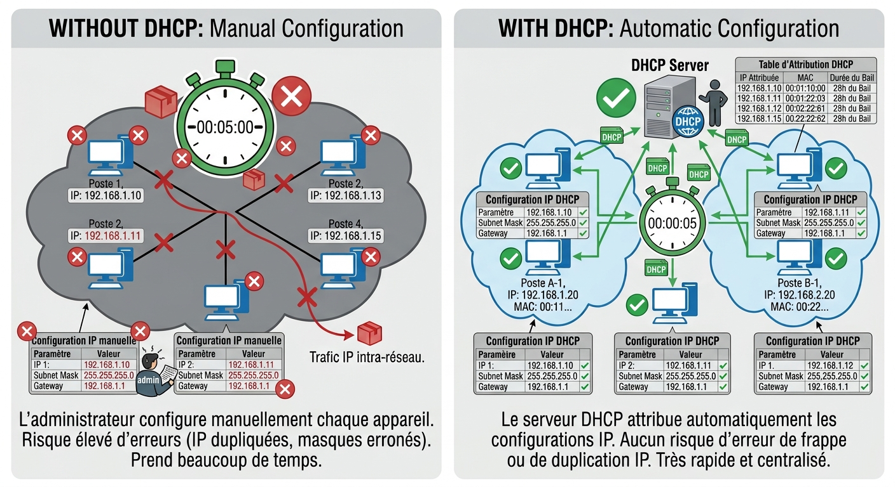
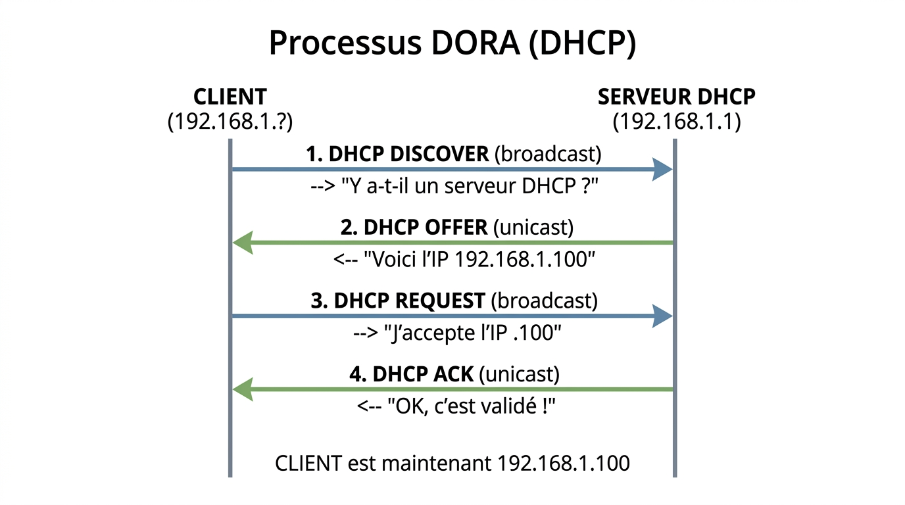
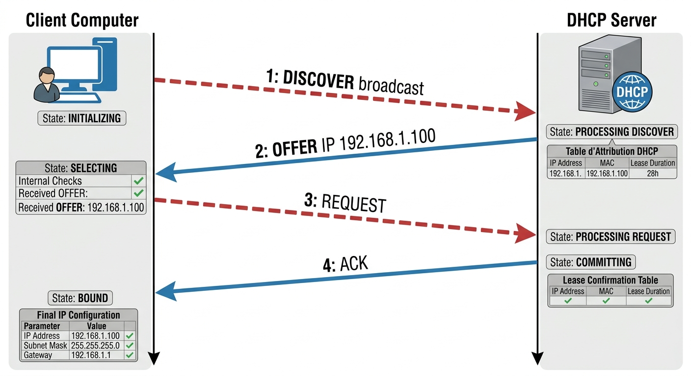
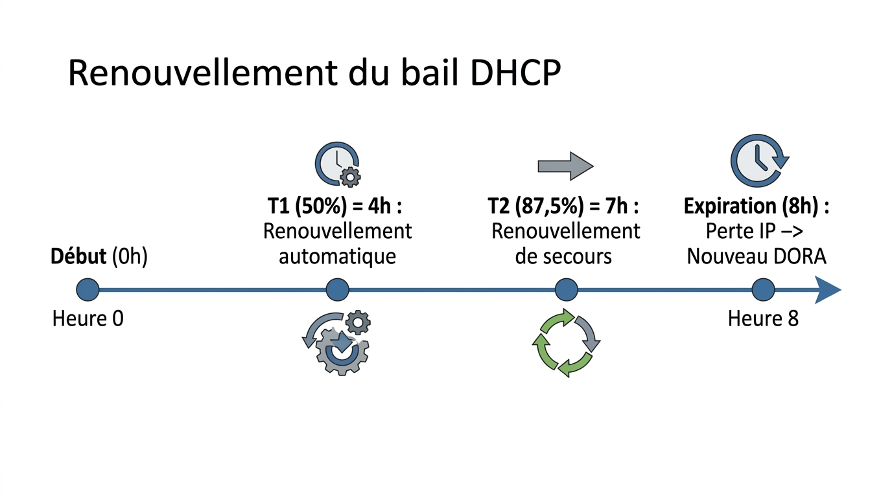
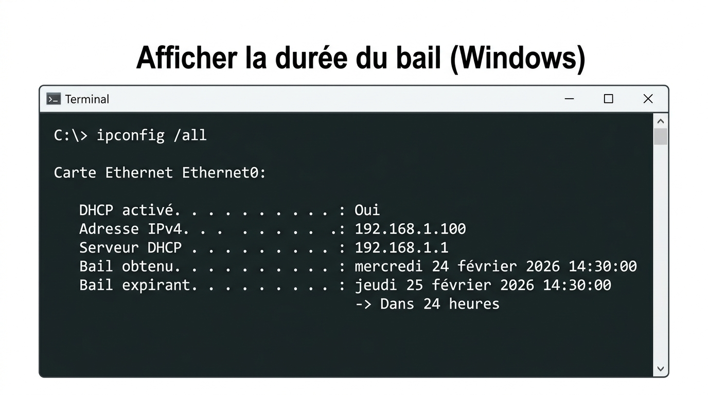
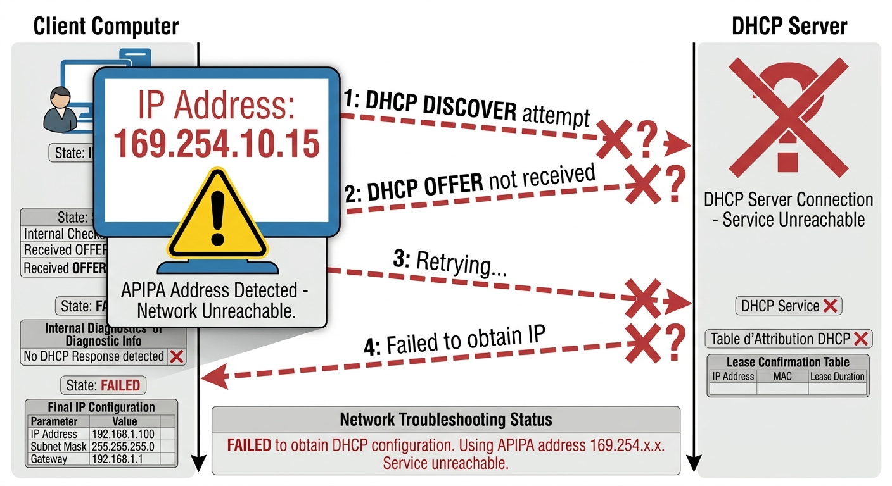
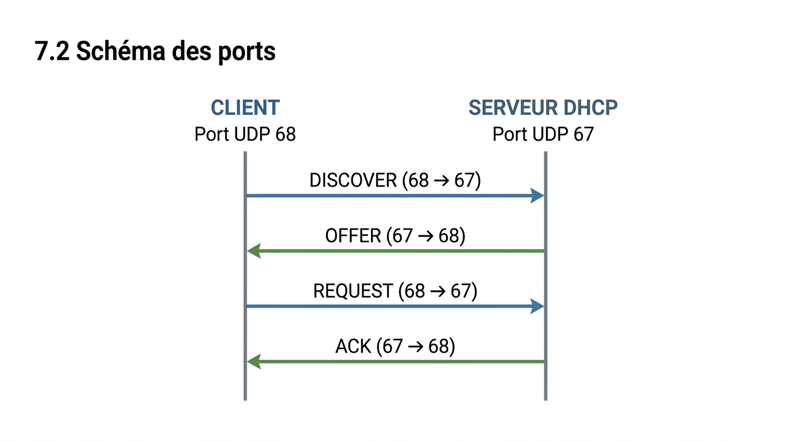

# FICHE DE COURS ÉLÈVE - U31 Réseaux Informatiques
## Semaine 7 - DHCP Client : Obtention Automatique d'Adresse IP

---

**Nom :** _________________________ **Prénom :** _________________________

**Classe :** Bac Pro CIEL - Année 1 **Date :** ___/___/______

---

## 🎯 OBJECTIFS DE LA SÉANCE

À la fin de ce cours, tu seras capable de :

- ✅ Expliquer le rôle du protocole DHCP
- ✅ Décrire les 4 étapes du processus DORA
- ✅ Configurer un client DHCP sur Windows et Linux
- ✅ Utiliser les commandes `ipconfig /release` et `/renew`
- ✅ Diagnostiquer une adresse APIPA (169.254.x.x)
- ✅ Analyser une capture Wireshark d'une transaction DHCP

---

## 📚 PARTIE 1 : QU'EST-CE QUE LE DHCP ?

### 1.1 Définition

**DHCP** = **D**ynamic **H**ost **C**onfiguration **P**rotocol  
(Protocole de Configuration Dynamique des Hôtes)

> **Protocole réseau** permettant d'**attribuer automatiquement** des paramètres de configuration IP aux équipements d'un réseau.

---

### 1.2 Le problème avant DHCP

Avant l'invention du DHCP (années 1990), il fallait configurer **manuellement** chaque ordinateur :

**Configuration manuelle (IP statique) :**
1. Ouvrir les paramètres réseau
2. Saisir l'adresse IP : 192.168.1.10
3. Saisir le masque : 255.255.255.0
4. Saisir la passerelle : 192.168.1.1
5. Saisir les serveurs DNS : 8.8.8.8

**Problèmes rencontrés :**
- ⏱️ **Temps** : 5-10 minutes par poste
- ❌ **Erreurs** : Risque de doublon d'adresse IP (2 PC avec la même IP)
- 🔧 **Maintenance** : Changement de réseau = reconfigurer TOUS les postes
- 📝 **Documentation** : Tenir à jour un tableau Excel de toutes les IP

---

### 1.3 La solution : DHCP (Configuration automatique)

**Avec DHCP :**
1. Brancher le câble réseau
2. Allumer l'ordinateur
3. **C'est tout !** ✅

Le serveur DHCP se charge automatiquement de :
- Attribuer une adresse IP disponible
- Fournir le masque de sous-réseau
- Indiquer la passerelle par défaut
- Donner les serveurs DNS

**Avantages :**
- ⏱️ Configuration en **quelques secondes**
- ✅ **Aucun doublon** d'adresse IP
- 🎯 **Gestion centralisée** (un seul serveur pour tout le réseau)
- ♻️ **Récupération automatique** des adresses non utilisées



---

## 📚 PARTIE 2 : LE PROCESSUS DORA

### 2.1 Les 4 messages DHCP

Le processus d'obtention d'une adresse IP se déroule en **4 étapes** :

1. **D**iscover (Découverte)
2. **O**ffer (Offre)
3. **R**equest (Requête)
4. **A**cknowledge (Accusé de réception)

💡 **Moyen mnémotechnique** : **DORA** l'exploratrice va chercher une adresse IP !

---

### 2.2 Schéma du processus DORA



??? note "🔤 Schéma texte original"
    ```
         CLIENT                          SERVEUR DHCP
      (192.168.1.?)                      (192.168.1.1)
           │                                   │
           │  1️⃣ DHCP DISCOVER (broadcast)    │
           │ ──────────────────────────────>  │
           │    "Y a-t-il un serveur DHCP ?"  │
           │                                   │
           │  2️⃣ DHCP OFFER (unicast)         │
           │ <──────────────────────────────  │
           │    "Voici l'IP 192.168.1.100"    │
           │                                   │
           │  3️⃣ DHCP REQUEST (broadcast)     │
           │ ──────────────────────────────>  │
           │    "J'accepte l'IP .100"         │
           │                                   │
           │  4️⃣ DHCP ACK (unicast)           │
           │ <──────────────────────────────  │
           │    "OK, c'est validé !"          │
           │                                   │
       CLIENT est maintenant 192.168.1.100
    ```




---

### 2.3 Détail de chaque étape

#### Étape 1️⃣ : DHCP DISCOVER (Découverte)

**Contexte :**
Le client vient d'être branché au réseau. Il n'a **pas encore d'adresse IP**.

**Action du client :**
- Envoie un message **en broadcast** (à tout le monde)
- Contenu : *"Y a-t-il un serveur DHCP sur ce réseau ?"*

**Adresses utilisées :**
- **Source** : 0.0.0.0 (le client n'a pas encore d'IP)
- **Destination** : 255.255.255.255 (broadcast = à tous)
- **Ports UDP** : 68 (client) → 67 (serveur)

**💡 Pourquoi en broadcast ?**
Le client ne connaît pas encore l'adresse du serveur DHCP, il doit donc diffuser sa demande à tout le réseau.

---

#### Étape 2️⃣ : DHCP OFFER (Offre)

**Contexte :**
Le serveur DHCP a reçu le message DISCOVER.

**Action du serveur :**
- Sélectionne une adresse IP **disponible** dans son pool
- Propose cette adresse au client
- Contenu : *"Tu peux utiliser l'IP 192.168.1.100"*

**Informations fournies :**
- Adresse IP proposée : 192.168.1.100
- Masque de sous-réseau : 255.255.255.0
- Passerelle par défaut : 192.168.1.1
- Serveurs DNS : 8.8.8.8 et 8.8.4.4
- Durée du bail : 86400 secondes (24 heures)

**Adresses utilisées :**
- **Source** : 192.168.1.1 (serveur DHCP)
- **Destination** : 255.255.255.255 (broadcast) ou adresse MAC du client
- **Ports UDP** : 67 (serveur) → 68 (client)

**💡 Important :**
Le client n'est **pas encore autorisé** à utiliser cette adresse ! C'est juste une proposition.

---

#### Étape 3️⃣ : DHCP REQUEST (Requête)

**Contexte :**
Le client a reçu une (ou plusieurs) offres d'adresse IP.

**Action du client :**
- Choisit une des offres (généralement la première reçue)
- Envoie un message **en broadcast** pour informer tous les serveurs
- Contenu : *"J'accepte l'IP 192.168.1.100 du serveur 192.168.1.1"*

**Adresses utilisées :**
- **Source** : 0.0.0.0 (le client n'a toujours pas d'IP officiellement)
- **Destination** : 255.255.255.255 (broadcast)
- **Ports UDP** : 68 (client) → 67 (serveur)

**💡 Pourquoi en broadcast ?**
Si plusieurs serveurs DHCP ont fait une offre, le broadcast permet d'informer **tous les serveurs** du choix du client. Les serveurs non choisis récupèrent l'adresse proposée.

---

#### Étape 4️⃣ : DHCP ACKNOWLEDGE (Accusé de réception)

**Contexte :**
Le serveur DHCP a reçu le message REQUEST du client.

**Action du serveur :**
- **Confirme** l'attribution de l'adresse IP
- **Enregistre** le bail dans sa base de données
- Contenu : *"OK, tu peux utiliser l'IP 192.168.1.100 pendant 24h"*

**Base de données du serveur (exemple) :**

| **Adresse IP** | **Adresse MAC** | **Bail obtenu** | **Bail expire** |
|----------------|----------------|----------------|----------------|
| 192.168.1.100 | 00:0C:29:5A:3B:1F | 14:30:00 | 14:30:00 (+24h) |

**Adresses utilisées :**
- **Source** : 192.168.1.1 (serveur DHCP)
- **Destination** : 192.168.1.100 (unicast vers le client)
- **Ports UDP** : 67 (serveur) → 68 (client)

**💡 C'est validé !**
Le client peut **maintenant utiliser l'adresse IP** pour communiquer sur le réseau et accéder à Internet.

---

### 2.4 Tableau récapitulatif

| **Message** | **Envoyé par** | **IP Source** | **IP Dest** | **Type** | **Signification** |
|-------------|----------------|---------------|-------------|----------|-------------------|
| **DISCOVER** | Client | 0.0.0.0 | 255.255.255.255 | Broadcast | "Cherche serveur DHCP" |
| **OFFER** | Serveur | IP serveur | 255.255.255.255 | Broadcast | "Voici une IP disponible" |
| **REQUEST** | Client | 0.0.0.0 | 255.255.255.255 | Broadcast | "J'accepte cette IP" |
| **ACK** | Serveur | IP serveur | IP client | Unicast | "C'est confirmé" |

---

## 📚 PARTIE 3 : LE BAIL DHCP (Lease Time)

### 3.1 Qu'est-ce qu'un bail ?

**Bail DHCP** = Durée pendant laquelle le client peut **utiliser** l'adresse IP qui lui a été attribuée.

**Analogie :**
Louer un appartement :
- Tu signes un contrat de location pour **1 an** (= bail)
- Pendant cette année, l'appartement est **à toi**
- À la fin de l'année, tu peux **renouveler** le bail ou **partir**

C'est pareil avec une adresse IP !

---

### 3.2 Durées typiques de bail

| **Type de réseau** | **Durée de bail** | **Justification** |
|-------------------|------------------|-------------------|
| **Entreprise** (postes fixes) | 7-30 jours | Les postes restent allumés, peu de rotation |
| **WiFi public** (aéroport, café) | 2-4 heures | Forte rotation d'utilisateurs |
| **Événement** (salon, conférence) | 30 min - 1 heure | Très forte rotation |
| **Salle de TP** (école) | 1 heure | Une classe = un créneau |

**💡 Principe :**
Plus il y a de rotation, plus le bail doit être **court** pour libérer rapidement les adresses.

---

### 3.3 Renouvellement du bail

Le client ne garde pas l'adresse jusqu'à expiration. Il tente de **renouveler** automatiquement :

| **Moment** | **Action du client** | **Nom technique** |
|------------|---------------------|-------------------|
| **50% de la durée** | Tentative de renouvellement auprès du serveur qui a donné l'IP | **T1** (Timer 1) |
| **87,5% de la durée** | Si échec, nouvelle tentative auprès de **n'importe quel** serveur DHCP | **T2** (Timer 2) |
| **100% de la durée** | Si échec, le bail **expire**, le client doit relancer un DORA complet | **Expiration** |

**Exemple avec un bail de 8 heures :**



??? note "🔤 Schéma texte original"
    ```
    Heure 0   ─────────────────────────────────────> Heure 8
    │         │                  │                   │
    Début     T1 (50%)           T2 (87,5%)          Expiration
              4h                 7h                  8h
              Renouvellement     Renouvellement      Perte IP
              automatique        de secours          → Nouveau DORA
    ```


**💡 En pratique :**
Tu ne vois jamais ça ! Le renouvellement se fait **en arrière-plan**, de manière transparente.

---

### 3.4 Afficher la durée du bail (Windows)



??? note "🔤 Schéma texte original"
    ```
    C:\> ipconfig /all

    Carte Ethernet Ethernet0:

       DHCP activé. . . . . . . . . . . . . . : Oui
       Adresse IPv4. . . . . . . . . . . . . .: 192.168.1.100
       Serveur DHCP . . . . . . . . . . . . . : 192.168.1.1
       Bail obtenu. . . . . . . . . . . . . . : mercredi 24 février 2026 14:30:00
       Bail expirant. . . . . . . . . . . . . : jeudi 25 février 2026 14:30:00
                                                └─> Dans 24 heures
    ```


**Calcul du renouvellement :**
- Bail de 24h
- T1 (50%) : Renouvellement à **14:30 + 12h = 02:30** (le lendemain matin)
- T2 (87,5%) : Renouvellement de secours à **14:30 + 21h = 11:30** (le lendemain)

---

## 📚 PARTIE 4 : LES COMMANDES DHCP

### 4.1 Commandes Windows

#### Afficher la configuration réseau

```cmd
C:\> ipconfig
```

**Résultat (simplifié) :**

```
Carte Ethernet Ethernet0:

   Adresse IPv4. . . . . . . . . . . . . .: 192.168.1.100
   Masque de sous-réseau. . . . . . . . . : 255.255.255.0
   Passerelle par défaut. . . . . . . . . : 192.168.1.1
```

---

#### Afficher la configuration détaillée

```cmd
C:\> ipconfig /all
```

**Résultat (complet) :**

```
Carte Ethernet Ethernet0:

   Suffixe DNS propre à la connexion. . . : entreprise.local
   Description. . . . . . . . . . . . . . : Intel(R) Ethernet Adapter
   Adresse physique . . . . . . . . . . . : 00-0C-29-5A-3B-1F
   DHCP activé. . . . . . . . . . . . . . : Oui       ← DHCP actif
   Configuration automatique activée. . . : Oui
   Adresse IPv4. . . . . . . . . . . . . .: 192.168.1.100
   Masque de sous-réseau. . . . . . . . . : 255.255.255.0
   Passerelle par défaut. . . . . . . . . : 192.168.1.1
   Serveur DHCP . . . . . . . . . . . . . : 192.168.1.1  ← Serveur qui a donné l'IP
   Serveurs DNS. . .  . . . . . . . . . . : 8.8.8.8
                                            8.8.4.4
   Bail obtenu. . . . . . . . . . . . . . : mercredi 24 février 2026 14:30:00
   Bail expirant. . . . . . . . . . . . . : jeudi 25 février 2026 14:30:00
```

---

#### Libérer l'adresse IP (Release)

```cmd
C:\> ipconfig /release
```

**Effet :**
- Le client envoie un message **DHCP RELEASE** au serveur
- L'adresse IP est **libérée** et redevient disponible dans le pool
- Le client n'a **plus d'adresse IP** (0.0.0.0)
- **Connexion réseau perdue** ❌

**Vérification :**

```cmd
C:\> ipconfig

Carte Ethernet Ethernet0:

   Adresse IPv4. . . . . . . . . . . . . .: 0.0.0.0
   Masque de sous-réseau. . . . . . . . . : 0.0.0.0
   Passerelle par défaut. . . . . . . . . :
```

---

#### Renouveler l'adresse IP (Renew)

```cmd
C:\> ipconfig /renew
```

**Effet :**
- Le client relance un processus **DORA**
- Il obtient une **nouvelle adresse IP** (peut être la même ou différente)
- **Connexion réseau rétablie** ✅

**Vérification :**

```cmd
C:\> ipconfig

Carte Ethernet Ethernet0:

   Adresse IPv4. . . . . . . . . . . . . .: 192.168.1.101  ← Nouvelle IP
   Masque de sous-réseau. . . . . . . . . : 255.255.255.0
   Passerelle par défaut. . . . . . . . . : 192.168.1.1
```

---

### 4.2 Commandes Linux

#### Afficher la configuration réseau

```bash
$ ip addr show
```

**ou (ancienne commande) :**

```bash
$ ifconfig
```

**Résultat :**

```
2: eth0: <BROADCAST,MULTICAST,UP,LOWER_UP> mtu 1500
    inet 192.168.1.100/24 brd 192.168.1.255 scope global dynamic eth0
       valid_lft 86400sec preferred_lft 86400sec
```

---

#### Libérer l'adresse IP (Release)

```bash
$ sudo dhclient -r eth0
```

- `-r` = release (libérer)
- `eth0` = nom de l'interface réseau (peut être `enp0s3`, `ens33`, etc.)

---

#### Renouveler l'adresse IP (Renew)

```bash
$ sudo dhclient eth0
```

**Note :** Sous Linux, on utilise le client DHCP `dhclient`. D'autres distributions peuvent utiliser `dhcpcd` ou `NetworkManager`.

---

### 4.3 Tableau comparatif Windows / Linux

| **Action** | **Windows** | **Linux** |
|------------|-------------|-----------|
| Afficher config | `ipconfig`<br>`ipconfig /all` | `ip addr show`<br>`ifconfig` |
| Libérer IP | `ipconfig /release` | `sudo dhclient -r eth0` |
| Renouveler IP | `ipconfig /renew` | `sudo dhclient eth0` |
| Vider cache DNS | `ipconfig /flushdns` | `sudo systemd-resolve --flush-caches` |

---

## 📚 PARTIE 5 : LES OPTIONS DHCP

### 5.1 Qu'est-ce qu'une option DHCP ?

Le serveur DHCP ne fournit **pas seulement l'adresse IP**, mais aussi **d'autres paramètres réseau** appelés **options DHCP**.

### 5.2 Options principales

| **Option** | **Code** | **Description** | **Exemple** |
|------------|----------|-----------------|-------------|
| Masque de sous-réseau | 1 | Masque du réseau | 255.255.255.0 |
| **Passerelle par défaut** | **3** | Adresse du routeur | 192.168.1.1 |
| **Serveur DNS** | **6** | Serveurs de résolution de noms | 8.8.8.8, 8.8.4.4 |
| Nom de domaine | 15 | Suffixe DNS | entreprise.local |
| Serveur NTP | 42 | Synchronisation de l'heure | ntp.pool.org |
| Serveur WINS | 44 | Résolution NetBIOS (Windows) | 192.168.1.2 |
| **Durée de bail** | **51** | Temps de validité de l'IP | 86400 sec (24h) |

**💡 Les plus importantes à retenir :**
- **Option 3** : Passerelle (pour accéder à Internet)
- **Option 6** : DNS (pour résoudre les noms de domaine)
- **Option 51** : Durée du bail

---

### 5.3 Exemple de configuration complète fournie par DHCP

Quand un client fait une demande DHCP, il reçoit un **package complet** :


??? note "🔤 Schéma texte original"
    ```
    ┌──────────────────────────────────────────┐
    │   CONFIGURATION FOURNIE PAR DHCP         │
    ├──────────────────────────────────────────┤
    │ Adresse IP : 192.168.1.100               │
    │ Masque : 255.255.255.0                   │
    │ Passerelle : 192.168.1.1                 │
    │ DNS primaire : 8.8.8.8                   │
    │ DNS secondaire : 8.8.4.4                 │
    │ Nom de domaine : entreprise.local        │
    │ Serveur NTP : time.windows.com           │
    │ Durée de bail : 86400 sec (24 heures)    │
    └──────────────────────────────────────────┘
    ```


**Résultat :** Le client est **prêt à communiquer** sur le réseau et sur Internet **sans aucune configuration manuelle** !

---

## 📚 PARTIE 6 : ADRESSE APIPA ET DÉPANNAGE

### 6.1 Qu'est-ce qu'une adresse APIPA ?

**APIPA** = **A**utomatic **P**rivate **IP** **A**ddressing

> Si un client **ne parvient pas** à contacter un serveur DHCP, il s'attribue **automatiquement** une adresse IP de la plage **169.254.0.0/16**.

**Exemple d'adresse APIPA :**
- 169.254.42.137
- 169.254.123.89
- 169.254.0.1

---

### 6.2 Quand une adresse APIPA apparaît-elle ?

**Causes possibles :**

1. **Serveur DHCP éteint ou en panne**
2. **Câble réseau débranché** ou défectueux
3. **Switch éteint** ou en panne
4. **Firewall** bloquant les ports UDP 67/68
5. **Pool DHCP saturé** (plus d'adresses disponibles)
6. **Problème de configuration** du serveur DHCP

---

### 6.3 Comment reconnaître une adresse APIPA ?

```cmd
C:\> ipconfig

Carte Ethernet Ethernet0:

   Adresse IPv4. . . . . . . . . . . . . .: 169.254.53.127  ← APIPA !
   Masque de sous-réseau. . . . . . . . . : 255.255.0.0
   Passerelle par défaut. . . . . . . . . :              ← Vide !
```

**Signes distinctifs :**
- Adresse commence par **169.254**
- **Pas de passerelle** par défaut
- **Pas de connexion Internet** ❌



---

### 6.4 Diagnostic et résolution

#### Étape 1 : Identifier le problème

```cmd
C:\> ipconfig /all
```

**Si tu vois 169.254.x.x :**
→ Le client n'a **pas pu contacter** le serveur DHCP

---

#### Étape 2 : Vérifier la connexion physique

- ✅ Le câble réseau est-il **bien branché** ?
- ✅ La **LED du port** sur le switch est-elle allumée ?
- ✅ Le **switch** est-il allumé ?

---

#### Étape 3 : Forcer un renouvellement

```cmd
C:\> ipconfig /release
C:\> ipconfig /renew
```

**Résultat possible :**

- ✅ **Si ça marche** : Tu obtiens une vraie IP (192.168.x.x)
- ❌ **Si ça échoue** : Tu retrouves une adresse APIPA → Problème plus profond

---

#### Étape 4 : Contacter l'administrateur réseau

Si le problème persiste après les vérifications :
- Vérifier l'état du serveur DHCP
- Vérifier les logs du serveur (baux disponibles ?)
- Tester avec un autre PC sur le même port

---

### 6.5 Scénarios courants

| **Symptôme** | **Cause probable** | **Solution** |
|--------------|-------------------|--------------|
| Adresse APIPA | Serveur DHCP injoignable | Vérifier connexion physique, relancer DHCP |
| IP en double | 2 clients ont la même IP (rare) | Libérer l'IP puis renouveler |
| Bail expiré | PC éteint trop longtemps | Renouvellement automatique au démarrage |
| Pool saturé | Plus d'adresses disponibles | Augmenter le pool ou réduire durée de bail |

---

## 📚 PARTIE 7 : PORTS UDP UTILISÉS

### 7.1 Les ports DHCP

Le protocole DHCP utilise **UDP** (User Datagram Protocol) pour la rapidité.

| **Port** | **Utilisation** | **Description** |
|----------|----------------|-----------------|
| **UDP 67** | Serveur DHCP | Le serveur **écoute** sur ce port |
| **UDP 68** | Client DHCP | Le client **écoute** sur ce port |

**💡 Analogie :**
- Port 67 = Boîte aux lettres du serveur (il reçoit les demandes)
- Port 68 = Boîte aux lettres du client (il reçoit les réponses)

---

### 7.2 Schéma des ports



??? note "🔤 Schéma texte original"
    ```
         CLIENT                          SERVEUR DHCP
       Port UDP 68                        Port UDP 67
           │                                   │
           │  DISCOVER (68 → 67)              │
           │ ──────────────────────────────>  │
           │                                   │
           │  OFFER (67 → 68)                 │
           │ <──────────────────────────────  │
           │                                   │
           │  REQUEST (68 → 67)               │
           │ ──────────────────────────────>  │
           │                                   │
           │  ACK (67 → 68)                   │
           │ <──────────────────────────────  │
    ```


---

## 📝 VOCABULAIRE TECHNIQUE À MAÎTRISER

| **Terme** | **Définition** | **Exemple** |
|-----------|----------------|-------------|
| **DHCP** | Dynamic Host Configuration Protocol - Attribution automatique d'adresse IP | "Le serveur DHCP distribue les adresses IP" |
| **DORA** | Discover, Offer, Request, Acknowledge - Les 4 étapes DHCP | "Le processus DORA prend quelques secondes" |
| **Bail (Lease)** | Durée pendant laquelle une IP est attribuée à un client | "Mon bail DHCP expire dans 12 heures" |
| **Pool DHCP** | Plage d'adresses IP disponibles pour distribution | "Le pool va de 192.168.1.100 à .200" |
| **APIPA** | Automatic Private IP Addressing - Adresse auto-attribuée (169.254.x.x) | "Mon PC a une adresse APIPA, il n'a pas trouvé le serveur DHCP" |
| **Release** | Libérer volontairement l'adresse IP | "J'exécute ipconfig /release" |
| **Renew** | Demander une nouvelle adresse IP | "J'exécute ipconfig /renew" |
| **T1 / T2** | Timers de renouvellement automatique (50% et 87,5%) | "Le client renouvelle à T1 (50% du bail)" |
| **Broadcast** | Message envoyé à tous les équipements du réseau | "Le DISCOVER est envoyé en broadcast" |
| **Unicast** | Message envoyé à un équipement spécifique | "L'ACK est envoyé en unicast au client" |
| **Option DHCP** | Paramètre additionnel fourni par le serveur (DNS, passerelle, etc.) | "L'option 3 contient la passerelle par défaut" |

---

## ✅ POINTS CLÉS À RETENIR

### Les essentiels (à connaître par cœur)

1. **DHCP** = Attribution **automatique** d'adresse IP

2. **Processus DORA** :
   - **D**iscover : Client cherche serveur (broadcast)
   - **O**ffer : Serveur propose une IP
   - **R**equest : Client accepte l'IP (broadcast)
   - **A**cknowledge : Serveur confirme (unicast)

3. **Ports UDP** : 67 (serveur) et 68 (client)

4. **Bail DHCP** = Durée de validité de l'IP (renouvelable)

5. **Commandes Windows** :
   - `ipconfig /all` → Afficher config
   - `ipconfig /release` → Libérer IP
   - `ipconfig /renew` → Renouveler IP

6. **Adresse APIPA (169.254.x.x)** = Échec de connexion au serveur DHCP

---

## 🎯 POUR ALLER PLUS LOIN

### Questions de réflexion

1. Pourquoi les messages DISCOVER et REQUEST sont-ils envoyés en broadcast ?
2. Dans quel cas une entreprise préférerait-elle des IP statiques plutôt que DHCP ?
3. Que se passe-t-il si un client est déplacé d'un réseau à un autre (ex: PC portable) ?
4. Comment le serveur DHCP évite-t-il de donner la même IP à 2 clients ?

### Défis pratiques

- Observer le processus DORA avec Wireshark
- Calculer les moments T1 et T2 pour un bail de 48 heures
- Configurer un serveur DHCP sous Ubuntu Server
- Créer une réservation DHCP (IP fixe basée sur l'adresse MAC)

---

## 📋 AUTOÉVALUATION

**Entoure le niveau que tu penses avoir atteint :**

| **Compétence** | **Niveau** |
|----------------|------------|
| Expliquer le rôle du DHCP | 😐 Fragile  🙂 Acquis  😃 Maîtrisé |
| Décrire les 4 étapes DORA | 😐 Fragile  🙂 Acquis  😃 Maîtrisé |
| Utiliser ipconfig /release et /renew | 😐 Fragile  🙂 Acquis  😃 Maîtrisé |
| Identifier une adresse APIPA | 😐 Fragile  🙂 Acquis  😃 Maîtrisé |
| Analyser une capture Wireshark DHCP | 😐 Fragile  🙂 Acquis  😃 Maîtrisé |

**Questions pour toi :**
- Qu'est-ce qui t'a semblé le plus difficile aujourd'hui ?
- As-tu compris la notion de bail DHCP ?
- Peux-tu expliquer DORA à quelqu'un d'autre ?

---

**📚 Document à conserver dans ton classeur pour révisions et examens !**

**Date de création :** 24/02/2026  
**Version :** 1.0  
**Auteur :** Yahn LE PRETTRE
