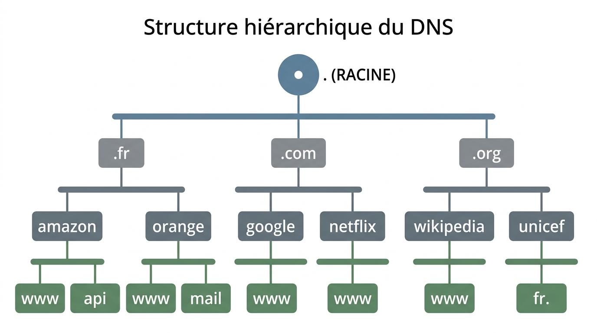
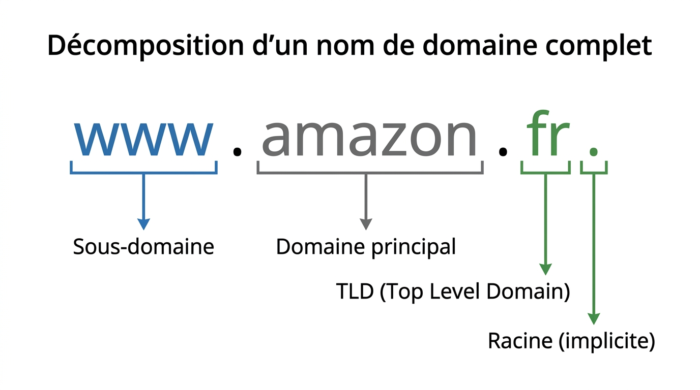
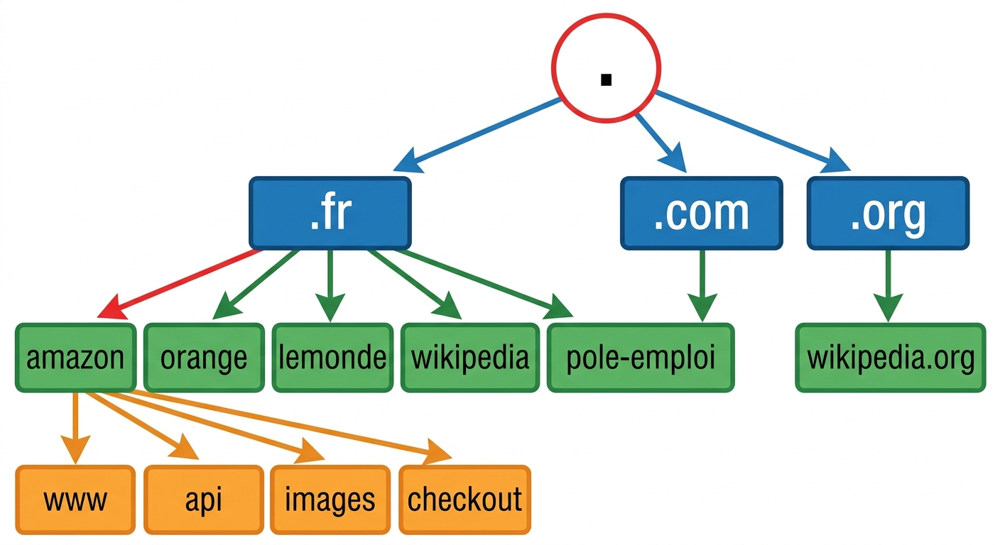
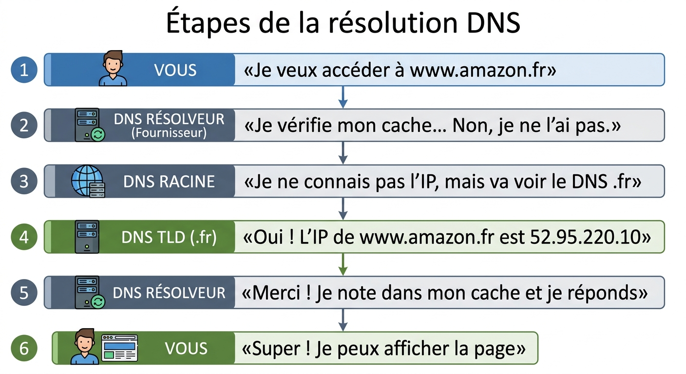

# 📘 FICHE DE COURS ÉLÈVE - U31 RÉSEAUX - SEMAINE 8

## 🌐 LE DNS : SYSTÈME DE NOMS DE DOMAINE

---

## 📋 INFORMATIONS

| **Élément** | **Détail** |
|-------------|------------|
| **Bloc** | U31 - Mise en œuvre de réseaux informatiques |
| **Semaine** | S8 / Année 1 |
| **Thématique** | DNS : Résolution, Nslookup, dig, Hiérarchie DNS |
| **Durée cours** | 45 minutes |

---

## 🎯 OBJECTIFS D'APPRENTISSAGE

À la fin de ce cours, je serai capable de :

✅ Expliquer ce qu'est le DNS et son utilité  
✅ Décrire la hiérarchie DNS (racine, TLD, domaine)  
✅ Utiliser les commandes `nslookup` et `dig`  
✅ Interpréter les résultats d'une requête DNS  
✅ Identifier les principaux types d'enregistrements DNS  

---

## 1️⃣ QU'EST-CE QUE LE DNS ?

### 📖 Définition

Le **DNS** (Domain Name System = Système de Noms de Domaine) est un service réseau qui traduit les **noms de domaine** (faciles à retenir pour les humains) en **adresses IP** (utilisées par les machines).

**Analogie :** Le DNS fonctionne comme un **annuaire téléphonique géant** d'Internet.

| **Ce que je tape** | **Ce que l'ordinateur comprend** |
|-------------------|----------------------------------|
| `www.google.com` | `142.250.178.78` |
| `www.amazon.fr` | `52.95.220.10` |
| `www.youtube.com` | `172.217.22.206` |

### 🤔 Pourquoi le DNS est-il nécessaire ?

**Problème :** Les ordinateurs communiquent avec des adresses IP (suite de chiffres), mais les humains préfèrent des noms comme "google.com".

**Solution :** Le DNS fait la traduction automatiquement !

**Exemple concret :**

1. Je tape `www.netflix.com` dans mon navigateur
2. Mon ordinateur demande au DNS : *"Quelle est l'IP de netflix.com ?"*
3. Le DNS répond : *"C'est 52.84.255.10"*
4. Mon navigateur se connecte à `52.84.255.10` et affiche Netflix


---

## 2️⃣ LA HIÉRARCHIE DNS : UNE ORGANISATION EN ARBRE

### 🌳 Structure hiérarchique

Le DNS est organisé comme un **arbre inversé** avec plusieurs niveaux :



??? note "🔤 Schéma texte original"
    ```
                        . (RACINE)
                          |
            ┌─────────────┼─────────────┐
            │             │             │
           .fr          .com          .org
            │             │             │
        ────┼────     ────┼────     ────┼────
        │        │    │        │    │        │
     amazon  orange google  netflix wikipedia unicef
        │        │    │        │    │        │
      ──┼──    ──┼──  ──┼──  ──┼──  ──┼──  ──┼──
      www  api  www  mail www  www  www  fr.
    ```


### 📊 Les niveaux de la hiérarchie DNS

| **Niveau** | **Nom technique** | **Exemple** | **Rôle** |
|------------|------------------|-------------|----------|
| **Niveau 0** | Racine | `.` (point) | Top de la hiérarchie, connaît tous les TLD |
| **Niveau 1** | TLD (Top Level Domain) | `.fr`, `.com`, `.org` | Gère les domaines d'une extension |
| **Niveau 2** | Domaine | `amazon`, `google`, `wikipedia` | Nom principal du site |
| **Niveau 3** | Sous-domaine | `www`, `mail`, `api` | Subdivision du domaine principal |

### 🔍 Décomposition d'un nom de domaine complet

Prenons l'exemple : **www.amazon.fr.**



??? note "🔤 Schéma texte original"
    ```
    www   .  amazon  .  fr  .
     │        │         │    └─── Racine (implicite)
     │        │         └──────── TLD (Top Level Domain)
     │        └────────────────── Domaine principal
     └─────────────────────────── Sous-domaine
    ```


**Lecture de droite à gauche :**
1. `.` = Racine DNS (invisible mais toujours là)
2. `.fr` = Domaine de premier niveau (TLD France)
3. `amazon` = Domaine principal (entreprise Amazon)
4. `www` = Sous-domaine (serveur web)



---

## 3️⃣ LE PROCESSUS DE RÉSOLUTION DNS

### 🔄 Comment fonctionne une requête DNS ?

Quand vous tapez `www.amazon.fr` dans votre navigateur, voici ce qui se passe **en coulisses** :

#### Étapes de la résolution :



??? note "🔤 Schéma texte original"
    ```
    ┌─────────────┐
    │  1. VOUS    │  "Je veux accéder à www.amazon.fr"
    └──────┬──────┘
           │
           ▼
    ┌─────────────────────┐
    │ 2. DNS RÉSOLVEUR    │  "Je vérifie mon cache... Non, je ne l'ai pas."
    │    (Fournisseur)    │
    └──────┬──────────────┘
           │
           ▼
    ┌─────────────────────┐
    │ 3. DNS RACINE       │  "Je ne connais pas l'IP, mais va voir le DNS .fr"
    └──────┬──────────────┘
           │
           ▼
    ┌─────────────────────┐
    │ 4. DNS TLD (.fr)    │  "Oui ! L'IP de www.amazon.fr est 52.95.220.10"
    └──────┬──────────────┘
           │
           ▼
    ┌─────────────────────┐
    │ 5. DNS RÉSOLVEUR    │  "Merci ! Je note dans mon cache et je réponds"
    └──────┬──────────────┘
           │
           ▼
    ┌─────────────────────┐
    │ 6. VOUS             │  "Super ! Je peux afficher la page"
    └─────────────────────┘
    ```


**⏱️ Temps total :** Environ 20-100 millisecondes (très rapide !)

### 💾 Le cache DNS : accélérer les requêtes

**Problème :** Faire tout ce processus à chaque fois serait **trop lent**.

**Solution :** Les serveurs DNS **mémorisent** les réponses pendant un certain temps (appelé **TTL = Time To Live**).

**Exemple :**
- 1ère visite de `www.google.com` → 80 ms (résolution complète)
- 2ème visite dans les 5 minutes → 5 ms (réponse depuis le cache)

---

## 4️⃣ LES TYPES D'ENREGISTREMENTS DNS

Le DNS ne stocke pas que des adresses IP ! Il contient différents types d'informations.

### 📋 Types d'enregistrements courants

| **Type** | **Signification** | **Fonction** | **Exemple** |
|----------|------------------|--------------|-------------|
| **A** | Address | Associe un nom → IPv4 | `www.google.com` → `142.250.178.78` |
| **AAAA** | IPv6 Address | Associe un nom → IPv6 | `www.google.com` → `2a00:1450:4007:817::200e` |
| **CNAME** | Canonical Name | Alias (nom alternatif) | `www.example.com` → `server01.hosting.com` |
| **MX** | Mail eXchange | Serveur de messagerie | `@gmail.com` → `smtp.google.com` |
| **NS** | Name Server | Serveur DNS autoritaire | `google.com` → `ns1.google.com` |
| **TXT** | Text | Informations textuelles | Vérification de domaine, SPF, DKIM |

### 🔎 Exemple concret : Domaine `example.com`

| **Enregistrement** | **Type** | **Valeur** |
|-------------------|----------|------------|
| `example.com` | A | `93.184.216.34` |
| `www.example.com` | CNAME | `example.com` |
| `example.com` | MX | `mail.example.com` (priorité 10) |
| `example.com` | NS | `ns1.example.com` |
| `example.com` | TXT | `"v=spf1 include:_spf.google.com ~all"` |

---

## 5️⃣ LES OUTILS DE DIAGNOSTIC DNS

### 🔧 Outil 1 : `nslookup`

**Définition :** Commande simple pour interroger un serveur DNS.

**Disponibilité :** Windows, Linux, macOS (préinstallé)

#### Syntaxe de base :

```bash
nslookup [nom_de_domaine]
```

#### Exemples d'utilisation :

**Exemple 1 : Résolution classique**
```bash
nslookup www.google.com
```

**Résultat attendu :**
```
Serveur :   dns.google
Address:    8.8.8.8

Réponse ne faisant pas autorité :
Nom :    www.google.com
Addresses:  2a00:1450:4007:817::200e
            142.250.178.78
```

**Exemple 2 : Rechercher les serveurs mail (MX)**
```bash
nslookup -type=MX gmail.com
```

**Résultat attendu :**
```
gmail.com       MX preference = 5, mail exchanger = gmail-smtp-in.l.google.com
gmail.com       MX preference = 10, mail exchanger = alt1.gmail-smtp-in.l.google.com
```

**Exemple 3 : Rechercher les serveurs DNS (NS)**
```bash
nslookup -type=NS google.com
```

### 🛠️ Outil 2 : `dig`

**Définition :** Outil professionnel pour des requêtes DNS avancées.

**Disponibilité :** Linux (préinstallé), macOS (préinstallé), Windows (nécessite BIND tools)

#### Syntaxe de base :

```bash
dig [nom_de_domaine]
```

#### Exemples d'utilisation :

**Exemple 1 : Résolution classique**
```bash
dig www.wikipedia.org
```

**Résultat attendu :**
```
; <<>> DiG 9.16.1 <<>> www.wikipedia.org
;; QUESTION SECTION:
;www.wikipedia.org.             IN      A

;; ANSWER SECTION:
www.wikipedia.org.      600     IN      A       208.80.154.224

;; Query time: 25 msec
;; SERVER: 8.8.8.8#53(8.8.8.8)
;; WHEN: Mon Feb 25 10:30:45 CET 2026
;; MSG SIZE  rcvd: 63
```

**Exemple 2 : Résolution courte (IP uniquement)**
```bash
dig +short www.facebook.com
```

**Résultat :**
```
157.240.22.35
```

**Exemple 3 : Interroger un serveur DNS spécifique**
```bash
dig @1.1.1.1 www.cloudflare.com
```

**Exemple 4 : Tracer la résolution complète**
```bash
dig +trace www.amazon.fr
```

### ⚖️ Comparaison `nslookup` vs `dig`

| **Critère** | **nslookup** | **dig** |
|-------------|--------------|---------|
| **Facilité** | ⭐⭐⭐⭐⭐ Très simple | ⭐⭐⭐ Moins intuitif |
| **Détails** | ⭐⭐ Basique | ⭐⭐⭐⭐⭐ Très détaillé |
| **Usage professionnel** | ⭐⭐ Occasionnel | ⭐⭐⭐⭐⭐ Standard |
| **Disponibilité Windows** | ✅ Natif | ⚠️ Installation requise |
| **Scripts automatiques** | ⭐⭐ Difficile | ⭐⭐⭐⭐⭐ Facile |

**Recommandation :**
- **Débutant / diagnostic rapide** → Utilisez `nslookup`
- **Professionnel / analyse avancée** → Utilisez `dig`

---

## 6️⃣ SERVEURS DNS PUBLICS POPULAIRES

Vous pouvez configurer votre ordinateur pour utiliser différents serveurs DNS.

| **Fournisseur** | **Adresses DNS** | **Caractéristiques** |
|----------------|------------------|---------------------|
| **Google Public DNS** | `8.8.8.8` et `8.8.4.4` | Rapide, fiable, gratuit |
| **Cloudflare** | `1.1.1.1` et `1.0.0.1` | Très rapide, respecte la vie privée |
| **OpenDNS** | `208.67.222.222` et `208.67.220.220` | Filtrage contenu, sécurité |
| **Quad9** | `9.9.9.9` | Bloque les sites malveillants |
| **FAI (Fournisseur)** | Dépend de votre FAI | Automatique, parfois lent |

**💡 Astuce :** Changer de DNS peut parfois résoudre des problèmes de connexion !

---

## 📝 VOCABULAIRE CLÉ À MAÎTRISER

| **Terme** | **Définition** |
|-----------|----------------|
| **DNS** | Domain Name System - Système qui traduit noms → IP |
| **Nom de domaine** | Adresse textuelle d'un site (ex: google.com) |
| **Adresse IP** | Adresse numérique unique d'un ordinateur sur Internet |
| **Résolution DNS** | Processus de traduction nom → IP |
| **TLD** | Top Level Domain - Extension (.fr, .com, .org) |
| **Sous-domaine** | Subdivision d'un domaine (www, mail, api) |
| **Enregistrement A** | Associe un nom à une adresse IPv4 |
| **Enregistrement AAAA** | Associe un nom à une adresse IPv6 |
| **Enregistrement MX** | Indique le serveur mail d'un domaine |
| **Enregistrement CNAME** | Alias (nom alternatif) pour un autre nom |
| **Enregistrement NS** | Indique le serveur DNS autoritaire |
| **Cache DNS** | Mémoire temporaire des réponses DNS |
| **TTL** | Time To Live - Durée de vie d'une info dans le cache |
| **Serveur DNS racine** | Serveur au sommet de la hiérarchie DNS |
| **Résolveur DNS** | Serveur qui effectue les requêtes pour vous |

---

## ✅ AUTO-ÉVALUATION : AI-JE COMPRIS ?

Cochez les affirmations vraies :

- [ ] Le DNS traduit les noms de domaine en adresses IP
- [ ] Les ordinateurs préfèrent les noms comme "google.com" plutôt que les adresses IP
- [ ] Le DNS Racine connaît directement toutes les adresses IP du monde
- [ ] Un enregistrement A associe un nom à une adresse IPv4
- [ ] `nslookup` et `dig` servent à interroger le DNS
- [ ] Le cache DNS permet d'accélérer les résolutions
- [ ] Un TLD est un domaine de premier niveau comme .fr ou .com
- [ ] `www.amazon.fr.` se lit de gauche à droite (www → amazon → fr)

**Réponses :**
✅ Vrai : 1, 4, 5, 6, 7  
❌ Faux : 2 (les ordinateurs préfèrent les IP), 3 (le DNS Racine connaît les TLD, pas les IP), 8 (se lit de droite à gauche)

---

## 🔗 POUR ALLER PLUS LOIN

### 📚 Ressources complémentaires

- 🎥 **Vidéo** : "Le DNS expliqué simplement" - Cookie Connecté (YouTube)
- 🌐 **Outil en ligne** : [https://dnschecker.org](https://dnschecker.org) - Vérifier la propagation DNS
- 📖 **Article** : "Comment fonctionne le DNS ?" - Cloudflare Learning Center
- 🛠️ **Simulateur** : [https://messwithdns.net](https://messwithdns.net) - Créer son propre DNS de test

### 🎯 Exercices pratiques suggérés

1. Trouvez l'adresse IP de votre site web préféré avec `nslookup`
2. Comparez les temps de réponse de Google DNS (8.8.8.8) vs Cloudflare (1.1.1.1)
3. Identifiez les serveurs mail de `gmail.com` avec `nslookup -type=MX`

---

## 🏢 APPLICATION EN ENTREPRISE

**Situations professionnelles où vous utiliserez le DNS :**

✅ **Diagnostic réseau** : "Pourquoi ce site ne s'affiche pas ?" → Vérifier la résolution DNS  
✅ **Configuration serveur** : Paramétrer un nom de domaine pour une application interne  
✅ **Migration site web** : Vérifier que le nouveau DNS est bien propagé  
✅ **Sécurité** : Détecter des redirections DNS malveillantes (DNS hijacking)  
✅ **Support utilisateur** : Résoudre des problèmes "Internet ne fonctionne pas"  

**Missions possibles en entreprise cette semaine :**
- Documenter les serveurs DNS utilisés par l'entreprise
- Tester la résolution DNS depuis différents postes
- Créer un guide "Changer de DNS sur Windows" pour les utilisateurs

---

**📅 Fiche rédigée le :** 25/02/2026  
**✍️ Auteur :** Équipe pédagogique CFA  
**📧 Questions :** formation@cfa-exemple.fr  
**🔄 Prochaine mise à jour :** Juin 2026

---

**💡 ASTUCE RÉVISION :** Relisez cette fiche avant votre devoir et surlignez les mots-clés ! Bonne chance ! 🎓
