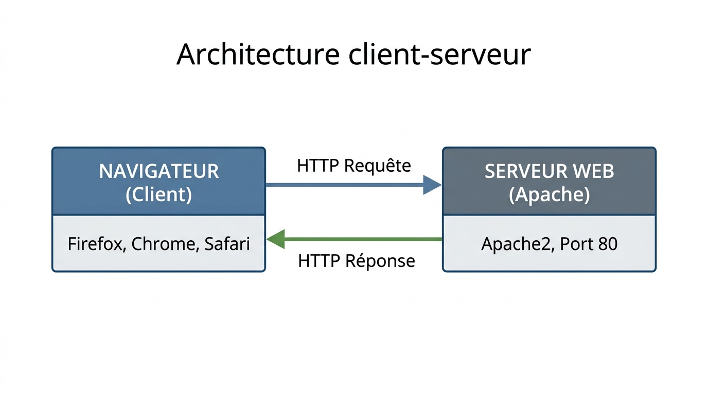
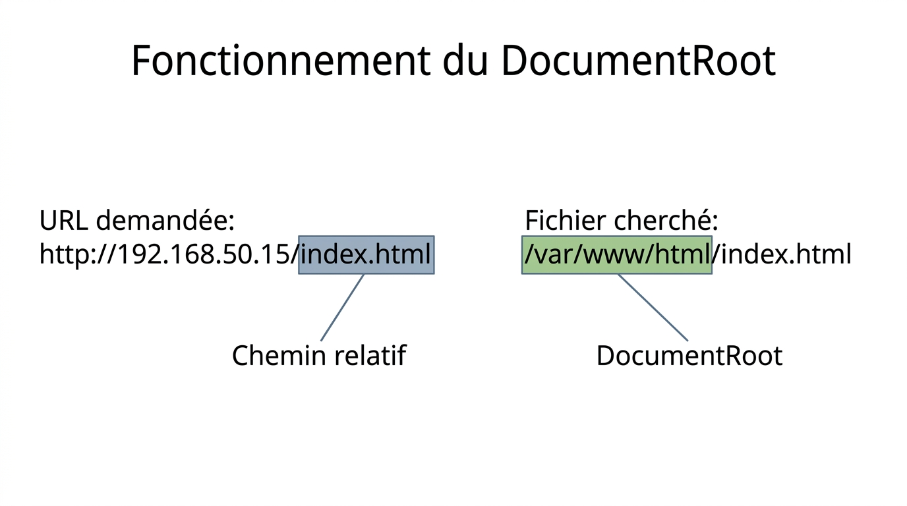
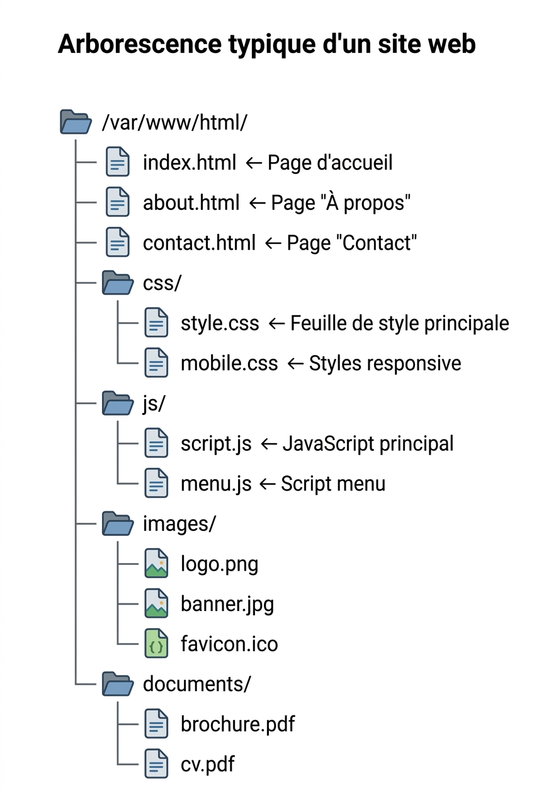

# FICHE DE COURS ÉLÈVE - U31 Réseaux Informatiques
## Semaine 9 - Serveur Web Apache : Installation et Configuration

---

**Nom :** _________________________ **Prénom :** _________________________

**Classe :** Bac Pro CIEL - Année 1 **Date :** ___/___/______

---

## 🎯 OBJECTIFS DE LA SÉANCE

À la fin de ce cours, tu seras capable de :

- ✅ Expliquer le fonctionnement du protocole HTTP
- ✅ Installer Apache2 sur Ubuntu/Debian Linux
- ✅ Créer et déployer une page HTML statique
- ✅ Identifier le DocumentRoot (`/var/www/html`)
- ✅ Configurer un VirtualHost basique
- ✅ Diagnostiquer des erreurs courantes (404, 403, 500)

---

## 📚 PARTIE 1 : LE PROTOCOLE HTTP

### 1.1 Qu'est-ce que HTTP ?

**HTTP** = **H**yper**T**ext **T**ransfer **P**rotocol  
(Protocole de Transfert Hypertexte)

> Protocole de communication utilisé pour transférer des pages web entre un **serveur** et un **client** (navigateur).

**Couche du modèle OSI :** Couche 7 (Application)

**Ports par défaut :**
- **TCP 80** : HTTP (non chiffré)
- **TCP 443** : HTTPS (chiffré avec SSL/TLS)

---

### 1.2 Architecture client-serveur



??? note "🔤 Schéma texte original"
    ```
    ┌──────────────┐         ┌──────────────┐
    │  NAVIGATEUR  │         │  SERVEUR WEB │
    │   (Client)   │         │   (Apache)   │
    ├──────────────┤         ├──────────────┤
    │              │  HTTP   │              │
    │  Firefox     │ ──────> │   Apache2    │
    │  Chrome      │ <────── │              │
    │  Safari      │         │   Port 80    │
    └──────────────┘         └──────────────┘
        Requête                  Réponse
    ```


**Fonctionnement :**

1. **Client** : Le navigateur envoie une **requête HTTP**
2. **Serveur** : Apache traite la requête et renvoie une **réponse HTTP**
3. **Affichage** : Le navigateur affiche la page reçue

---

### 1.3 Requête HTTP

**Structure d'une requête HTTP :**

```
GET /index.html HTTP/1.1
Host: www.example.com
User-Agent: Mozilla/5.0
Accept: text/html
```

**Décomposition :**

| **Élément** | **Signification** | **Exemple** |
|------------|------------------|-------------|
| **Méthode** | Action à effectuer | GET, POST, PUT, DELETE |
| **URL** | Ressource demandée | /index.html |
| **Version** | Version du protocole | HTTP/1.1 ou HTTP/2 |
| **En-têtes** | Informations supplémentaires | Host, User-Agent, Accept |

---

**Méthodes HTTP principales :**

| **Méthode** | **Usage** | **Exemple** |
|------------|-----------|-------------|
| **GET** | Récupérer une page | Afficher un site web |
| **POST** | Envoyer des données | Soumettre un formulaire |
| **PUT** | Mettre à jour une ressource | Modifier un article |
| **DELETE** | Supprimer une ressource | Effacer un compte |
| **HEAD** | Récupérer juste les en-têtes | Vérifier si une page existe |

**💡 Dans cette séance :** On utilise uniquement **GET** (pages statiques).

---

### 1.4 Réponse HTTP

**Structure d'une réponse HTTP :**

```
HTTP/1.1 200 OK
Content-Type: text/html
Content-Length: 1234
Server: Apache/2.4.52

<html>
  <head><title>Ma Page</title></head>
  <body><h1>Bienvenue</h1></body>
</html>
```

**Décomposition :**

- **Ligne de statut** : `HTTP/1.1 200 OK`
- **En-têtes** : `Content-Type`, `Content-Length`, `Server`
- **Corps** : Le contenu HTML de la page

---

### 1.5 Codes de statut HTTP

Les codes de statut indiquent si la requête a réussi ou échoué.

**Classification par famille :**

| **Famille** | **Signification** | **Exemples** |
|------------|------------------|--------------|
| **1xx** | Informationnel | 100 Continue, 101 Switching Protocols |
| **2xx** | Succès | 200 OK, 201 Created |
| **3xx** | Redirection | 301 Moved Permanently, 302 Found |
| **4xx** | Erreur client | 400 Bad Request, 404 Not Found |
| **5xx** | Erreur serveur | 500 Internal Server Error, 503 Service Unavailable |

---

**Codes les plus courants :**

| **Code** | **Nom** | **Signification** | **Cause typique** |
|----------|---------|------------------|-------------------|
| **200** | OK | Requête réussie | Page trouvée et renvoyée |
| **301** | Moved Permanently | Redirection permanente | Le site a changé d'URL |
| **302** | Found | Redirection temporaire | Page déplacée temporairement |
| **400** | Bad Request | Requête mal formée | Syntaxe HTTP incorrecte |
| **401** | Unauthorized | Authentification requise | Login/mot de passe nécessaire |
| **403** | Forbidden | Accès interdit | Permissions insuffisantes |
| **404** | Not Found | Page introuvable | Le fichier n'existe pas |
| **500** | Internal Server Error | Erreur serveur | Bug PHP, base de données inaccessible |
| **502** | Bad Gateway | Proxy/passerelle défaillant | Serveur backend injoignable |
| **503** | Service Unavailable | Service indisponible | Serveur surchargé ou en maintenance |

**💡 À retenir :**
- **200** : Tout va bien ✅
- **404** : Page pas trouvée ❌ (erreur la plus connue !)
- **500** : Problème côté serveur 🔥

---

## 📚 PARTIE 2 : APACHE - LE SERVEUR WEB

### 2.1 Qu'est-ce qu'Apache ?

**Apache HTTP Server** (souvent appelé simplement "Apache") est un serveur web **open source** créé en 1995.

**Chiffres clés :**
- Part de marché : ~30% des sites web mondiaux
- Serveur web le plus utilisé de 1996 à 2019
- Gratuit et open source (licence Apache)
- Multiplateforme (Linux, Windows, macOS)

---

**Alternatives à Apache :**

| **Serveur** | **Part de marché** | **Points forts** |
|------------|-------------------|------------------|
| **Nginx** | ~35% | Performance, proxy inverse |
| **Apache** | ~30% | Stabilité, modules, documentation |
| **IIS** | ~10% | Intégration Windows Server |
| **LiteSpeed** | ~5% | Performance WordPress |

**💡 Pourquoi apprendre Apache ?**

- Standard de l'industrie
- Documentation exhaustive
- Grande communauté
- Très modulaire (modules pour PHP, SSL, etc.)

---

### 2.2 Installation d'Apache sur Ubuntu/Debian

**Commandes d'installation :**

```bash
# Mettre à jour les dépôts de paquets
sudo apt update

# Installer Apache2
sudo apt install apache2 -y

# Vérifier l'installation
sudo systemctl status apache2
```

**Résultat attendu :**

```
● apache2.service - The Apache HTTP Server
     Loaded: loaded (/lib/systemd/system/apache2.service; enabled)
     Active: active (running) since Mon 2026-02-24 14:30:00 CET
```

**Indicateurs de succès :**
- `Loaded: loaded` → Service chargé
- `Active: active (running)` → Service en cours d'exécution
- `enabled` → Démarre automatiquement au boot

---

### 2.3 Commandes de gestion Apache

**Démarrer Apache :**

```bash
sudo systemctl start apache2
```

---

**Arrêter Apache :**

```bash
sudo systemctl stop apache2
```

---

**Redémarrer Apache :**

```bash
sudo systemctl restart apache2
```

**Utiliser quand :** Après modification de configuration majeure

---

**Recharger la configuration (sans interruption) :**

```bash
sudo systemctl reload apache2
```

**Utiliser quand :** Après modification mineure (VirtualHost, etc.)

---

**Vérifier le statut :**

```bash
sudo systemctl status apache2
```

---

**Activer Apache au démarrage du système :**

```bash
sudo systemctl enable apache2
```

---

**Tester la configuration (sans redémarrer) :**

```bash
sudo apache2ctl configtest
```

**Résultat si OK :**

```
Syntax OK
```

---

## 📚 PARTIE 3 : DOCUMENTROOT

### 3.1 Qu'est-ce que le DocumentRoot ?

Le **DocumentRoot** est le **répertoire racine** où Apache cherche les fichiers du site web.

**Emplacement par défaut (Ubuntu/Debian) :**

```
/var/www/html
```

**Sur Windows (XAMPP) :**

```
C:\xampp\htdocs
```

---

### 3.2 Fonctionnement du DocumentRoot

**Principe :**

Apache fait une **correspondance directe** entre l'URL demandée et le chemin du fichier.

**Exemple :**



??? note "🔤 Schéma texte original"
    ```
    URL demandée : http://192.168.50.15/index.html
                                         └─────────┘
                                         Chemin relatif

    Fichier cherché : /var/www/html/index.html
                      └──────────────┘
                      DocumentRoot
    ```


---

**Tableau de correspondance :**

| **URL** | **Fichier cherché** |
|---------|---------------------|
| `http://192.168.50.15/` | `/var/www/html/index.html` |
| `http://192.168.50.15/about.html` | `/var/www/html/about.html` |
| `http://192.168.50.15/css/style.css` | `/var/www/html/css/style.css` |
| `http://192.168.50.15/images/logo.png` | `/var/www/html/images/logo.png` |

**💡 Note :** Quand on demande `/` (juste le domaine), Apache cherche automatiquement `index.html` (ou `index.php`, `index.htm`).

---

### 3.3 Arborescence typique d'un site web



??? note "🔤 Schéma texte original"
    ```
    /var/www/html/
    ├── index.html          ← Page d'accueil
    ├── about.html          ← Page "À propos"
    ├── contact.html        ← Page "Contact"
    ├── css/
    │   ├── style.css       ← Feuille de style principale
    │   └── mobile.css      ← Styles responsive
    ├── js/
    │   ├── script.js       ← JavaScript principal
    │   └── menu.js         ← Script menu
    ├── images/
    │   ├── logo.png
    │   ├── banner.jpg
    │   └── favicon.ico
    └── documents/
        ├── brochure.pdf
        └── cv.pdf
    ```


---

### 3.4 Permissions importantes

**Propriétaire et groupe :**

Les fichiers doivent appartenir à l'utilisateur **www-data** (utilisateur Apache).

```bash
sudo chown -R www-data:www-data /var/www/html
```

---

**Permissions recommandées :**

```bash
# Dossiers : 755 (rwxr-xr-x)
sudo chmod 755 /var/www/html

# Fichiers HTML/CSS/JS : 644 (rw-r--r--)
sudo chmod 644 /var/www/html/*.html
```

**Explication des permissions :**

| **Code** | **Signification** | **Propriétaire** | **Groupe** | **Autres** |
|----------|------------------|-----------------|------------|-----------|
| 755 | rwxr-xr-x | Lecture+Écriture+Exécution | Lecture+Exécution | Lecture+Exécution |
| 644 | rw-r--r-- | Lecture+Écriture | Lecture | Lecture |

**💡 Pourquoi ces permissions ?**

- Apache doit pouvoir **lire** les fichiers (r)
- Apache doit pouvoir **entrer** dans les dossiers (x)
- Seul l'admin doit pouvoir **modifier** (w)

---

## 📚 PARTIE 4 : CRÉER UNE PAGE HTML

### 4.1 Structure de base HTML5

**Fichier minimal :**

```html
<!DOCTYPE html>
<html lang="fr">
<head>
    <meta charset="UTF-8">
    <title>Titre de la page</title>
</head>
<body>
    <h1>Mon premier site</h1>
    <p>Bienvenue sur mon serveur Apache !</p>
</body>
</html>
```

**Décomposition :**

| **Balise** | **Rôle** |
|-----------|----------|
| `<!DOCTYPE html>` | Déclare le document comme HTML5 |
| `<html>` | Racine du document |
| `<head>` | Métadonnées (titre, charset, CSS) |
| `<meta charset="UTF-8">` | Encodage des caractères (accents) |
| `<title>` | Titre affiché dans l'onglet du navigateur |
| `<body>` | Contenu visible de la page |
| `<h1>` | Titre de niveau 1 (le plus grand) |
| `<p>` | Paragraphe de texte |

---

### 4.2 Balises HTML courantes

**Titres :**

```html
<h1>Titre niveau 1</h1>
<h2>Titre niveau 2</h2>
<h3>Titre niveau 3</h3>
```

---

**Texte :**

```html
<p>Paragraphe normal</p>
<strong>Texte en gras</strong>
<em>Texte en italique</em>
<br>  <!-- Saut de ligne -->
```

---

**Liens :**

```html
<a href="https://www.google.com">Aller sur Google</a>
<a href="about.html">Page À propos</a>
```

---

**Images :**

```html

```

---

**Listes :**

```html
<!-- Liste non ordonnée -->
<ul>
    <li>Élément 1</li>
    <li>Élément 2</li>
</ul>

<!-- Liste ordonnée -->
<ol>
    <li>Étape 1</li>
    <li>Étape 2</li>
</ol>
```

---

### 4.3 Ajouter du style (CSS)

**CSS inline (dans la balise `<style>`) :**

```html
<!DOCTYPE html>
<html>
<head>
    <title>Mon Site</title>
    <style>
        body {
            font-family: Arial, sans-serif;
            background-color: #f0f0f0;
            text-align: center;
        }
        h1 {
            color: #333;
            font-size: 3em;
        }
    </style>
</head>
<body>
    <h1>Bienvenue</h1>
</body>
</html>
```

---

**CSS externe (fichier séparé) :**

**Fichier `style.css` :**

```css
body {
    font-family: Arial;
    background-color: #f0f0f0;
}
h1 {
    color: #333;
}
```

**Fichier `index.html` :**

```html
<head>
    <link rel="stylesheet" href="css/style.css">
</head>
```

---

## 📚 PARTIE 5 : VIRTUALHOST (HÔTE VIRTUEL)

### 5.1 Qu'est-ce qu'un VirtualHost ?

Un **VirtualHost** permet d'héberger **plusieurs sites web** sur un **seul serveur** Apache.

**Exemple :**

```
Serveur avec 1 IP : 192.168.50.15

Site 1 : http://site1.local → /var/www/site1
Site 2 : http://site2.local → /var/www/site2
Site 3 : http://site3.local → /var/www/site3
```

**Principe :**

Apache identifie le site demandé grâce à l'en-tête HTTP **Host:** de la requête.

```
GET / HTTP/1.1
Host: site1.local   ← Apache sait quel site servir
```

---

### 5.2 Configuration d'un VirtualHost

**Fichier de configuration :**

```
/etc/apache2/sites-available/monsite.conf
```

**Contenu du fichier :**

```apache
<VirtualHost *:80>
    ServerName monsite.local
    ServerAlias www.monsite.local
    
    DocumentRoot /var/www/monsite
    
    <Directory /var/www/monsite>
        Options Indexes FollowSymLinks
        AllowOverride None
        Require all granted
    </Directory>
    
    ErrorLog ${APACHE_LOG_DIR}/monsite_error.log
    CustomLog ${APACHE_LOG_DIR}/monsite_access.log combined
</VirtualHost>
```

**Explication ligne par ligne :**

| **Directive** | **Signification** |
|--------------|-------------------|
| `<VirtualHost *:80>` | Écoute sur le port 80, toutes les interfaces |
| `ServerName` | Nom de domaine principal du site |
| `ServerAlias` | Alias (variante du nom) |
| `DocumentRoot` | Répertoire racine du site |
| `<Directory>` | Permissions d'accès au répertoire |
| `Options Indexes` | Afficher la liste des fichiers si pas d'index.html |
| `AllowOverride` | Autoriser .htaccess (None = désactivé) |
| `Require all granted` | Autoriser l'accès à tous |
| `ErrorLog` | Fichier de logs des erreurs |
| `CustomLog` | Fichier de logs des accès |

---

### 5.3 Activer un VirtualHost

**Commandes :**

```bash
# Créer le répertoire du site
sudo mkdir -p /var/www/monsite

# Créer une page HTML
sudo nano /var/www/monsite/index.html

# Créer la configuration VirtualHost
sudo nano /etc/apache2/sites-available/monsite.conf

# Activer le site
sudo a2ensite monsite.conf

# Recharger Apache
sudo systemctl reload apache2

# Ajouter l'entrée DNS locale (pour tester)
sudo nano /etc/hosts
# Ajouter : 127.0.0.1   monsite.local
```

---

**Commandes de gestion des sites :**

| **Commande** | **Action** |
|-------------|------------|
| `sudo a2ensite monsite.conf` | Activer un site |
| `sudo a2dissite monsite.conf` | Désactiver un site |
| `sudo apache2ctl -S` | Lister tous les VirtualHosts actifs |

---

## 📚 PARTIE 6 : DIAGNOSTIC ET DÉPANNAGE

### 6.1 Erreur 404 - Page introuvable

**Symptôme :**

Le navigateur affiche "404 Not Found".

**Causes possibles :**

1. Le fichier n'existe pas
2. Le fichier est dans le mauvais répertoire
3. Erreur de casse (Linux est sensible : `Index.html` ≠ `index.html`)
4. DocumentRoot mal configuré

**Solution :**

```bash
# Vérifier l'existence du fichier
ls -l /var/www/html/index.html

# Vérifier le DocumentRoot dans la config
grep DocumentRoot /etc/apache2/sites-enabled/000-default.conf

# Consulter les logs
sudo tail -f /var/log/apache2/error.log
```

---

### 6.2 Erreur 403 - Accès interdit

**Symptôme :**

Le navigateur affiche "403 Forbidden".

**Causes possibles :**

1. Permissions incorrectes sur les fichiers
2. Directive `Require` trop restrictive
3. Fichier index.html manquant et `Options Indexes` désactivé

**Solution :**

```bash
# Vérifier les permissions
ls -ld /var/www/html
ls -l /var/www/html/

# Corriger si nécessaire
sudo chown -R www-data:www-data /var/www/html
sudo chmod -R 755 /var/www/html

# Vérifier la config
grep "Require" /etc/apache2/sites-enabled/000-default.conf
# Doit être : Require all granted
```

---

### 6.3 Erreur 500 - Erreur serveur

**Symptôme :**

Le navigateur affiche "500 Internal Server Error".

**Causes possibles :**

1. Erreur de syntaxe dans un fichier de configuration Apache
2. Bug dans un script PHP
3. Permissions incorrectes
4. Module Apache manquant

**Solution :**

```bash
# Tester la configuration
sudo apache2ctl configtest

# Consulter les logs d'erreur
sudo tail -n 50 /var/log/apache2/error.log

# Redémarrer Apache
sudo systemctl restart apache2
```

---

### 6.4 Apache ne démarre pas

**Symptôme :**

```bash
sudo systemctl start apache2
Job for apache2.service failed...
```

**Causes possibles :**

1. Port 80 déjà utilisé par un autre programme
2. Erreur de syntaxe dans la configuration
3. Module manquant

**Solution :**

```bash
# Vérifier quel processus utilise le port 80
sudo ss -tlnp | grep :80
# ou
sudo netstat -tlnp | grep :80

# Tester la configuration
sudo apache2ctl configtest

# Consulter les logs système
sudo journalctl -xe -u apache2
```

---

## 📚 PARTIE 7 : FICHIERS DE LOGS

### 7.1 Logs d'accès

**Emplacement :**

```
/var/log/apache2/access.log
```

**Contenu :**

Chaque ligne = une requête HTTP reçue.

**Exemple :**

```
192.168.50.10 - - [24/Feb/2026:14:30:15 +0100] "GET /index.html HTTP/1.1" 200 1234
```

**Décomposition :**

- `192.168.50.10` : IP du client
- `24/Feb/2026:14:30:15` : Date et heure
- `GET /index.html HTTP/1.1` : Requête
- `200` : Code de statut (succès)
- `1234` : Taille de la réponse (en octets)

---

### 7.2 Logs d'erreur

**Emplacement :**

```
/var/log/apache2/error.log
```

**Contenu :**

Erreurs rencontrées par Apache (fichiers manquants, permissions, bugs PHP, etc.).

**Exemple :**

```
[Mon Feb 24 14:30:00.123456 2026] [core:error] [pid 1234] (2)No such file or directory: [client 192.168.50.10:54321] AH00132: file permissions deny server access: /var/www/html/secret.html
```

---

### 7.3 Consulter les logs en temps réel

```bash
# Afficher les 50 dernières lignes
sudo tail -n 50 /var/log/apache2/error.log

# Suivre les logs en temps réel
sudo tail -f /var/log/apache2/access.log

# Rechercher une erreur spécifique
sudo grep "404" /var/log/apache2/access.log
```

---

## 📝 VOCABULAIRE TECHNIQUE À MAÎTRISER

| **Terme** | **Définition** | **Exemple** |
|-----------|----------------|-------------|
| **HTTP** | Protocole de transfert de pages web | GET /index.html |
| **HTTPS** | HTTP sécurisé (chiffré avec SSL/TLS) | Port 443 |
| **Apache** | Serveur web open source | Apache2 sur Ubuntu |
| **DocumentRoot** | Répertoire racine du site web | /var/www/html |
| **VirtualHost** | Configuration pour héberger plusieurs sites | monsite.conf |
| **Code 200** | Requête réussie | Page trouvée |
| **Code 404** | Page introuvable | Fichier n'existe pas |
| **Code 403** | Accès interdit | Permissions insuffisantes |
| **Code 500** | Erreur serveur | Bug PHP, crash |
| **GET** | Méthode HTTP pour récupérer une page | GET /about.html |
| **POST** | Méthode HTTP pour envoyer des données | Formulaire de contact |

---

## ✅ POINTS CLÉS À RETENIR

### Les essentiels (à connaître par cœur)

1. **HTTP** = Protocole web, port **80** (443 pour HTTPS)

2. **Architecture** : Client (navigateur) ↔ Serveur (Apache)

3. **Installation Apache** :
   ```bash
   sudo apt update
   sudo apt install apache2 -y
   ```

4. **DocumentRoot par défaut** : `/var/www/html`

5. **Codes HTTP** :
   - 200 = OK ✅
   - 404 = Not Found ❌
   - 403 = Forbidden 🚫
   - 500 = Server Error 🔥

6. **Permissions** :
   - Dossiers : 755
   - Fichiers : 644
   - Propriétaire : www-data

7. **Activer un site** :
   ```bash
   sudo a2ensite monsite.conf
   sudo systemctl reload apache2
   ```

---

## 🎯 POUR ALLER PLUS LOIN

### Questions de réflexion

1. Quelle différence entre `restart` et `reload` Apache ?
2. Pourquoi les fichiers doivent-ils appartenir à www-data ?
3. Comment héberger 10 sites sur un seul serveur ?
4. Quelle différence entre HTTP et HTTPS ?
5. Comment activer PHP sur Apache ?

### Défis pratiques

- Créer un site web avec 5 pages HTML liées entre elles
- Configurer 3 VirtualHosts différents
- Installer un certificat SSL (Let's Encrypt)
- Ajouter un module Apache (mod_rewrite)

---

## 📋 AUTOÉVALUATION

**Entoure le niveau que tu penses avoir atteint :**

| **Compétence** | **Niveau** |
|----------------|------------|
| Installer Apache sur Linux | 😐 Fragile  🙂 Acquis  😃 Maîtrisé |
| Créer une page HTML statique | 😐 Fragile  🙂 Acquis  😃 Maîtrisé |
| Identifier le DocumentRoot | 😐 Fragile  🙂 Acquis  😃 Maîtrisé |
| Configurer un VirtualHost | 😐 Fragile  🙂 Acquis  😃 Maîtrisé |
| Diagnostiquer une erreur 404 ou 403 | 😐 Fragile  🙂 Acquis  😃 Maîtrisé |

**Questions pour toi :**
- Qu'est-ce qui t'a semblé le plus difficile aujourd'hui ?
- As-tu réussi à accéder à ton site depuis un autre PC ?
- Te sens-tu capable de créer un site web complet ?

---

**📚 Document à conserver dans ton classeur pour révisions et examens !**

**Date de création :** 24/02/2026  
**Version :** 1.0  
**Auteur :** Yahn LE PRETTRE
