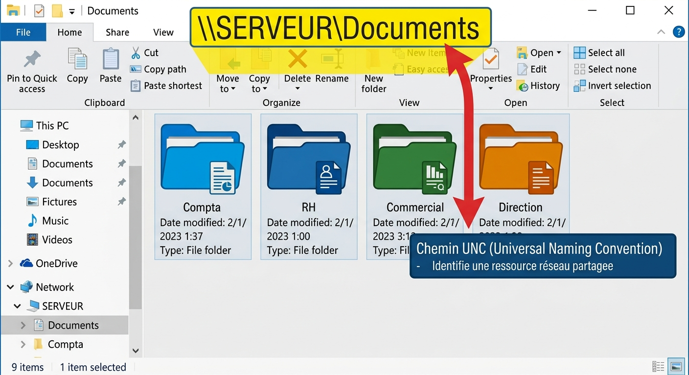
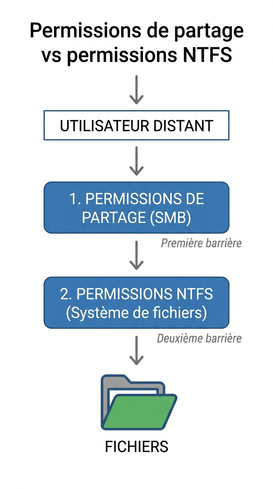
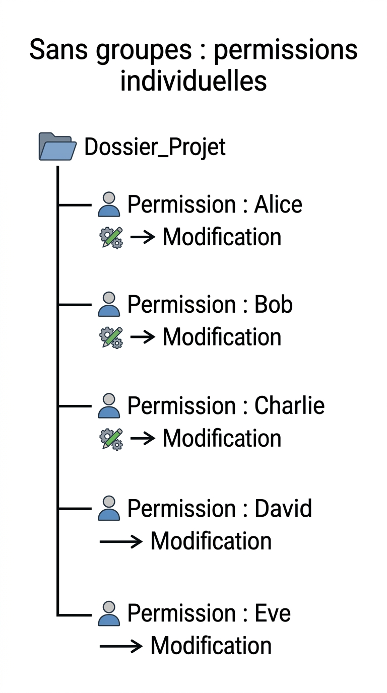
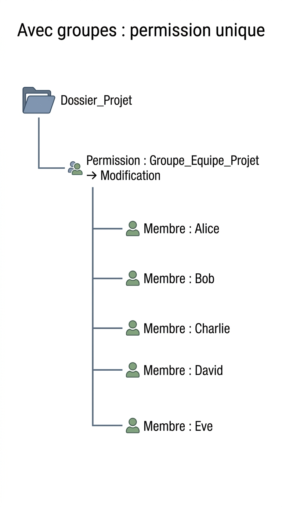
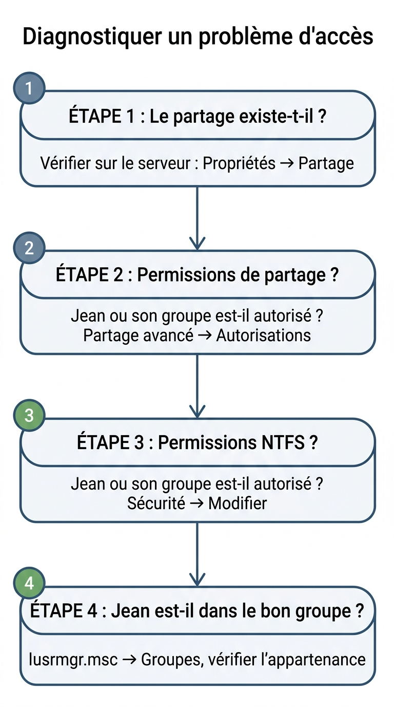

# 📘 FICHE DE COURS ÉLÈVE - U31 RÉSEAUX - SEMAINE 10

## 🔒 PARTAGES DE FICHIERS ET PERMISSIONS NTFS

---

## 📋 INFORMATIONS

| **Élément** | **Détail** |
|-------------|------------|
| **Bloc** | U31 - Mise en œuvre de réseaux informatiques |
| **Semaine** | S10 / Année 1 |
| **Thématique** | Partages fichiers, Permissions NTFS, Groupes utilisateurs |
| **Durée cours** | 50 minutes |

---

## 🎯 OBJECTIFS D'APPRENTISSAGE

À la fin de ce cours, je serai capable de :

✅ Créer un partage de fichiers sur Windows  
✅ Différencier permissions de partage et permissions NTFS  
✅ Configurer les permissions NTFS appropriées  
✅ Créer et gérer des groupes utilisateurs locaux  
✅ Appliquer le principe du moindre privilège  
✅ Diagnostiquer un problème d'accès aux fichiers  

---

## 1️⃣ QU'EST-CE QU'UN PARTAGE DE FICHIERS ?

### 📖 Définition

Un **partage de fichiers** est un dossier situé sur un ordinateur qui est rendu accessible à d'autres utilisateurs du réseau.

**Analogie :** Un partage de fichiers, c'est comme une **bibliothèque commune** : plusieurs personnes peuvent accéder aux mêmes livres (fichiers), mais certaines peuvent seulement les lire, tandis que d'autres peuvent les modifier.

### 🤔 Pourquoi partager des fichiers ?

**Avantages du partage :**

| **Avantage** | **Explication** | **Exemple** |
|-------------|----------------|-------------|
| **Collaboration** | Plusieurs personnes travaillent sur les mêmes fichiers | Équipe qui rédige un document commun |
| **Centralisation** | Les fichiers sont à un seul endroit | Serveur de fichiers de l'entreprise |
| **Économie** | Pas besoin de dupliquer les fichiers | Un seul exemplaire du catalogue produits |
| **Sauvegarde** | Plus facile de sauvegarder un emplacement central | Backup automatique du serveur |

### 🔗 Accéder à un partage réseau

**Chemin UNC (Universal Naming Convention) :**

```
\\NOM-ORDINATEUR\NOM-PARTAGE
```

**Exemple :**
```
\\SERVEUR-COMPTA\Factures
\\PC-JEAN\Documents_Projet
```

**Sous Windows :**
- Ouvrir l'Explorateur de fichiers
- Dans la barre d'adresse, taper : `\\NOM-ORDINATEUR\NOM-PARTAGE`
- Appuyer sur Entrée



---

## 2️⃣ LES DEUX NIVEAUX DE PERMISSIONS

### 🆚 Permissions de PARTAGE vs Permissions NTFS

**Il existe DEUX niveaux de sécurité sur Windows :**



??? note "🔤 Schéma texte original"
    ```
    ┌─────────────────────────────────────────┐
    │         UTILISATEUR DISTANT             │
    │                  │                      │
    │                  ▼                      │
    │     ┌────────────────────────┐         │
    │     │  1. PERMISSIONS DE     │         │
    │     │     PARTAGE (SMB)      │  ◄───── Première barrière
    │     └────────────────────────┘         │
    │                  │                      │
    │                  ▼                      │
    │     ┌────────────────────────┐         │
    │     │  2. PERMISSIONS NTFS   │  ◄───── Deuxième barrière
    │     │     (Système fichiers) │         │
    │     └────────────────────────┘         │
    │                  │                      │
    │                  ▼                      │
    │            📁 FICHIERS                  │
    └─────────────────────────────────────────┘
    ```


### 📊 Comparaison détaillée

| **Critère** | **Permissions de partage** | **Permissions NTFS** |
|------------|---------------------------|----------------------|
| **S'applique à** | Accès réseau uniquement (SMB) | Accès local ET réseau |
| **Granularité** | Grossière (3 niveaux) | Fine (13 permissions détaillées) |
| **Niveaux** | Lecture, Modification, Contrôle total | Lecture, Écriture, Modification, Contrôle total + 9 autres |
| **Héritage** | Non | Oui (dossiers → sous-dossiers) |
| **Où configurer** | Propriétés → Onglet "Partage" | Propriétés → Onglet "Sécurité" |

### 🔐 Règle de combinaison

**IMPORTANT :** Quand un utilisateur accède à un fichier via le réseau :

> **La permission effective = La PLUS RESTRICTIVE entre (Partage ET NTFS)**

**Exemple :**

| **Scénario** | **Permission Partage** | **Permission NTFS** | **Résultat final** |
|-------------|----------------------|---------------------|-------------------|
| 1 | Modification | Lecture | **Lecture** (plus restrictif) |
| 2 | Lecture | Contrôle total | **Lecture** (plus restrictif) |
| 3 | Contrôle total | Modification | **Modification** |
| 4 | Modification | Modification | **Modification** (égales) |

**Analogie :** C'est comme deux portes en série : il faut passer les deux. Si une seule est fermée, on ne passe pas !

---

## 3️⃣ LES PERMISSIONS DE PARTAGE

### 📋 Les 3 niveaux de permissions de partage

| **Permission** | **Peut** | **Ne peut pas** | **Usage** |
|---------------|---------|----------------|-----------|
| 🔍 **Lecture** | • Voir les fichiers<br>• Ouvrir les fichiers<br>• Copier les fichiers | • Modifier<br>• Supprimer<br>• Créer de nouveaux fichiers | Consultation uniquement |
| ✏️ **Modification** | • Tout ce que fait Lecture<br>• Créer des fichiers<br>• Modifier des fichiers<br>• Supprimer des fichiers | • Changer les permissions | Travail collaboratif |
| 👑 **Contrôle total** | • Tout ce que fait Modification<br>• Changer les permissions<br>• Prendre possession | Rien | Administrateurs |

### 🛠️ Comment configurer les permissions de partage

**Procédure :**

1. Clic droit sur le dossier → **Propriétés**
2. Onglet **"Partage"** → Bouton **"Partage avancé..."**
3. Cocher **"Partager ce dossier"**
4. Cliquer sur **"Autorisations"**
5. Ajouter/Modifier les utilisateurs ou groupes
6. Cocher les cases : Lecture / Modification / Contrôle total
7. **OK** → **Appliquer**

---

## 4️⃣ LES PERMISSIONS NTFS

### 📋 Les permissions NTFS de base

| **Permission** | **Description** | **Détails** |
|---------------|----------------|------------|
| 📖 **Lecture** | Voir le contenu des fichiers et dossiers | • Lire les fichiers<br>• Voir les propriétés |
| 📝 **Écriture** | Créer des fichiers et sous-dossiers | • Créer de nouveaux fichiers<br>• Modifier les attributs |
| 🎯 **Lecture et exécution** | Lecture + exécuter des programmes | • Tout de Lecture<br>• Exécuter des .exe |
| 📂 **Affichage du contenu** | Lister le contenu d'un dossier | • Voir la liste des fichiers |
| ✏️ **Modification** | Lecture + Écriture + Suppression | • Tout sauf changer les permissions |
| 👑 **Contrôle total** | Tous les droits | • Tout + changer les permissions |

### 🛠️ Comment configurer les permissions NTFS

**Procédure :**

1. Clic droit sur le dossier → **Propriétés**
2. Onglet **"Sécurité"**
3. Cliquer sur **"Modifier..."**
4. Sélectionner un utilisateur/groupe OU cliquer **"Ajouter..."**
5. Cocher les cases dans les colonnes **"Autoriser"** ou **"Refuser"**
6. **OK** → **Appliquer**

### ⚠️ REFUSER vs NE PAS AUTORISER

**Différence importante :**

| **Cas** | **Signification** | **Exemple** |
|---------|------------------|-------------|
| ❌ **Refuser coché** | Permission explicitement REFUSÉE (prioritaire) | Jean ne peut JAMAIS accéder, même s'il est dans un groupe autorisé |
| ⬜ **Case vide** | Permission non accordée (par défaut) | Jean n'a pas cette permission, sauf s'il est dans un groupe autorisé |

**Règle d'or :** Le **Refuser** gagne TOUJOURS sur l'**Autoriser**.

---

## 5️⃣ LES GROUPES UTILISATEURS

### 📖 Définition

Un **groupe utilisateurs** est un ensemble d'utilisateurs regroupés pour faciliter la gestion des permissions.

**Analogie :** Un groupe, c'est comme une **équipe sportive** : au lieu de donner des instructions à chaque joueur individuellement, on parle à toute l'équipe.

### 🎯 Pourquoi utiliser des groupes ?

**Sans groupes (mauvaise pratique) :**


??? note "🔤 Schéma texte original"
    ```
    Dossier_Projet
      ├─ Permission : Alice → Modification
      ├─ Permission : Bob → Modification
      ├─ Permission : Charlie → Modification
      ├─ Permission : David → Modification
      └─ Permission : Eve → Modification
    ```

➡️ **5 permissions à gérer individuellement** (ingérable si 50 utilisateurs !)

**Avec groupes (bonne pratique) :**


??? note "🔤 Schéma texte original"
    ```
    Dossier_Projet
      └─ Permission : Groupe_Equipe_Projet → Modification
           ├─ Membre : Alice
           ├─ Membre : Bob
           ├─ Membre : Charlie
           ├─ Membre : David
           └─ Membre : Eve
    ```

➡️ **1 seule permission à gérer** (beaucoup plus simple !)

### 📊 Groupes Windows par défaut

| **Groupe** | **Description** | **Permissions typiques** |
|-----------|----------------|-------------------------|
| **Administrateurs** | Contrôle total du système | Tout faire |
| **Utilisateurs** | Utilisateurs standards | Utiliser le PC, mais pas installer de logiciels |
| **Utilisateurs avec pouvoir** | Entre Admin et Utilisateurs | Quelques tâches admin |
| **Invités** | Accès très limité | Accès temporaire minimal |

### 🛠️ Créer un groupe local

**Procédure :**

1. **Windows + R** → Taper `lusrmgr.msc` → **Entrée**
   - ⚠️ **Attention** : Nécessite Windows **Pro** ou **Enterprise** (pas Famille)
2. Cliquer sur **"Groupes"** dans le volet gauche
3. Clic droit dans le volet central → **"Nouveau groupe..."**
4. Donner un nom : exemple `Equipe_Compta`
5. Ajouter une description (optionnel)
6. Cliquer sur **"Ajouter..."** pour ajouter des membres
7. **Créer**

### 👥 Ajouter un utilisateur à un groupe

**Procédure :**

1. Dans `lusrmgr.msc`, ouvrir le groupe
2. Cliquer sur **"Ajouter..."**
3. Taper le nom de l'utilisateur (ex : `jean`)
4. Cliquer sur **"Vérifier les noms"**
5. **OK**

---

## 6️⃣ LE PRINCIPE DU MOINDRE PRIVILÈGE

### 📖 Définition

Le **principe du moindre privilège** consiste à donner à chaque utilisateur uniquement les droits **strictement nécessaires** pour accomplir son travail, **et rien de plus**.

**Analogie :** Donner la clé d'une seule pièce à quelqu'un, pas le trousseau de toutes les clés du bâtiment.

### ✅ Bonne pratique vs ❌ Mauvaise pratique

| **Scénario** | ❌ **Mauvaise pratique** | ✅ **Bonne pratique** |
|-------------|------------------------|---------------------|
| **Stagiaire** | Contrôle total sur tout | Lecture seule sur les dossiers nécessaires |
| **Commercial** | Accès aux salaires (Compta) | Accès uniquement à la base clients |
| **Comptable** | Accès aux dossiers RH | Accès uniquement aux dossiers financiers |

### 🎯 Règles d'or

1. **Toujours donner le minimum de droits nécessaires**
2. **Utiliser des groupes** (pas des utilisateurs individuels)
3. **Refuser explicitement seulement si nécessaire** (sinon, juste ne pas autoriser)
4. **Réviser régulièrement les permissions** (supprimer les accès inutiles)
5. **Révoquer immédiatement les accès** quand un employé part

---

## 7️⃣ PROCÉDURES COMPLÈTES

### 🛠️ Procédure 1 : Créer un partage sécurisé

**Objectif :** Partager le dossier `Documents_Equipe` avec le groupe `Equipe_Marketing` en Modification.

**Étapes :**

1. **Créer le groupe** (si pas encore créé)
   - `Windows + R` → `lusrmgr.msc`
   - Groupes → Nouveau groupe → `Equipe_Marketing`
   - Ajouter les membres (Alice, Bob, Charlie)

2. **Créer le dossier**
   - Créer `C:\Partages\Documents_Equipe`

3. **Configurer le partage**
   - Clic droit → Propriétés → Partage → Partage avancé
   - Cocher "Partager ce dossier"
   - Nom du partage : `Documents_Equipe`
   - Autorisations → Ajouter `Equipe_Marketing` → Modification
   - Retirer "Tout le monde" (sécurité)

4. **Configurer les permissions NTFS**
   - Onglet Sécurité → Modifier
   - Ajouter `Equipe_Marketing` → Modification
   - Retirer "Utilisateurs" (si trop permissif)

5. **Tester l'accès**
   - Depuis un autre PC : `\\NOM-PC\Documents_Equipe`

---

### 🛠️ Procédure 2 : Diagnostiquer un problème d'accès

**Symptôme :** Jean ne peut pas accéder à `\\SERVEUR\Compta`

**Méthodologie de diagnostic :**



??? note "🔤 Schéma texte original"
    ```
    ┌─────────────────────────────────────┐
    │ ÉTAPE 1 : Le partage existe-t-il ? │
    └─────────────────────────────────────┘
             │
             ▼
        Vérifier sur le serveur :
        Propriétés → Partage
             │
             ▼
    ┌─────────────────────────────────────┐
    │ ÉTAPE 2 : Permissions de partage ?  │
    └─────────────────────────────────────┘
             │
             ▼
        Jean ou son groupe est-il autorisé ?
        Partage avancé → Autorisations
             │
             ▼
    ┌─────────────────────────────────────┐
    │ ÉTAPE 3 : Permissions NTFS ?        │
    └─────────────────────────────────────┘
             │
             ▼
        Jean ou son groupe est-il autorisé ?
        Sécurité → Modifier
             │
             ▼
    ┌─────────────────────────────────────┐
    │ ÉTAPE 4 : Jean est-il dans le       │
    │          bon groupe ?                │
    └─────────────────────────────────────┘
             │
             ▼
        lusrmgr.msc → Groupes
        Vérifier l'appartenance
    ```


**Causes fréquentes :**

| **Problème** | **Solution** |
|-------------|-------------|
| Partage inexistant | Créer le partage |
| Pas de permission de partage | Ajouter Jean ou son groupe |
| Pas de permission NTFS | Ajouter Jean ou son groupe |
| Jean pas dans le bon groupe | Ajouter Jean au groupe |
| Permission "Refuser" explicite | Retirer le Refuser |

---

## 📝 VOCABULAIRE CLÉ À MAÎTRISER

| **Terme** | **Définition** |
|-----------|----------------|
| **Partage (Share)** | Dossier rendu accessible sur le réseau |
| **Permissions de partage** | Autorisations réseau (SMB) - 3 niveaux |
| **Permissions NTFS** | Autorisations système de fichiers - Très granulaires |
| **Groupe utilisateurs** | Ensemble d'utilisateurs pour faciliter la gestion |
| **Principe du moindre privilège** | Donner uniquement les droits nécessaires |
| **Lecture** | Consulter les fichiers sans les modifier |
| **Modification** | Lire, créer, modifier, supprimer |
| **Contrôle total** | Tous les droits + changer les permissions |
| **Autoriser** | Accorder une permission |
| **Refuser** | Bloquer explicitement une permission (prioritaire) |
| **Héritage** | Transmission des permissions d'un dossier parent aux sous-dossiers |
| **UNC** | Universal Naming Convention (`\\SERVEUR\Partage`) |
| **SMB** | Server Message Block (protocole de partage Windows) |
| **lusrmgr.msc** | Console de gestion des utilisateurs et groupes locaux |

---

## ✅ AUTO-ÉVALUATION : AI-JE COMPRIS ?

Cochez les affirmations vraies :

- [ ] Un partage de fichiers rend un dossier accessible sur le réseau
- [ ] Les permissions de partage et NTFS sont identiques
- [ ] La permission finale = la plus RESTRICTIVE entre partage et NTFS
- [ ] Il est préférable de donner des permissions à des groupes plutôt qu'à des utilisateurs
- [ ] "Refuser" a la priorité sur "Autoriser"
- [ ] Le principe du moindre privilège consiste à donner tous les droits à tout le monde
- [ ] `lusrmgr.msc` permet de gérer les groupes utilisateurs
- [ ] Contrôle total permet de changer les permissions

**Réponses :**
✅ Vrai : 1, 3, 4, 5, 7, 8  
❌ Faux : 2 (elles sont différentes : partage = réseau, NTFS = local + réseau), 6 (au contraire : donner le minimum)

---

## 🔗 POUR ALLER PLUS LOIN

### 📚 Ressources complémentaires

- 🎥 **Vidéo** : "Permissions NTFS expliquées" - IT-Connect (YouTube)
- 📄 **Article** : "Best practices pour les partages de fichiers" - Microsoft Docs
- 🛠️ **Outil** : `icacls` (commande pour gérer les permissions NTFS en ligne de commande)
- 📖 **Documentation** : Microsoft - File and folder permissions

### 🎯 Exercices pratiques suggérés

1. Créer un partage "Documents_Test" sur votre PC
2. Configurer des permissions différentes pour 2 utilisateurs
3. Créer un groupe local et y ajouter un utilisateur
4. Tester l'accès depuis un autre PC

---

## 🏢 APPLICATION EN ENTREPRISE

**Situations professionnelles où vous utiliserez les partages :**

✅ **Créer un dossier partagé** pour une équipe projet  
✅ **Configurer les permissions** pour protéger les documents sensibles (RH, Compta)  
✅ **Diagnostiquer** pourquoi un utilisateur ne peut pas accéder à un dossier  
✅ **Gérer les groupes** pour faciliter l'attribution des droits  
✅ **Appliquer le RGPD** en limitant l'accès aux données personnelles  

**Missions possibles en entreprise cette semaine :**
- Documenter les partages de fichiers existants
- Vérifier les permissions d'un dossier sensible
- Créer un groupe pour un nouveau projet

---

## 🛠️ COMMANDES UTILES

### Windows

**Afficher les partages existants :**
```cmd
net share
```

**Créer un partage en ligne de commande :**
```cmd
net share MonPartage=C:\Dossier /GRANT:Groupe_Marketing,CHANGE
```

**Gérer les permissions NTFS en ligne de commande :**
```cmd
icacls C:\Dossier /grant Groupe_Marketing:(M)
```

---

**📅 Fiche rédigée le :** 26/02/2026  
**✍️ Auteur :** Yahn LE PRETTRE  
**📧 Questions :** yahn.leprettre@mfr.asso.fr  
**🔄 Prochaine mise à jour :** Juin 2026

---

**💡 ASTUCE RÉVISION :** Retenez la règle "PARTAGE + NTFS = Le plus restrictif gagne" ! C'est la clé pour comprendre les permissions Windows. Relisez cette fiche et pratiquez sur votre propre PC ! 🔒**
