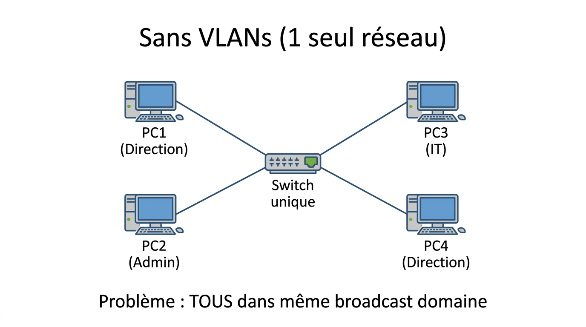
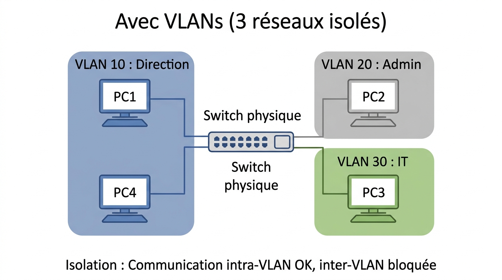
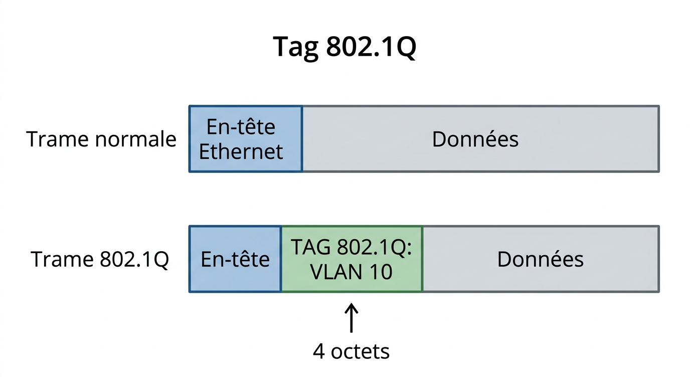

# 📖 FICHE COURS - S13 E31
## VLANs - 802.1Q - Segmentation

**Nom : ________________  Prénom : ________________**

---

## 🎯 OBJECTIFS

- ✅ Créer VLANs sur switch
- ✅ Configurer ports access/trunk
- ✅ Comprendre 802.1Q tagging
- ✅ Segmenter réseau (DMZ, prod, admin)

---

## 1️⃣ QU'EST-CE QU'UN VLAN ?

### **Définition**

> **VLAN** (Virtual LAN) = Réseau local **virtuel** créé sur un switch **physique**.

**Principe :** 1 switch physique = plusieurs réseaux logiques isolés

### **Analogie**

> VLAN = Étages d'un immeuble cloisonnés

**Lien OSI (S3) :** VLAN = **Couche 2** (Liaison)

---

## 2️⃣ SANS vs AVEC VLANs

### **SANS VLANs (1 seul réseau)**



??? note "🔤 Schéma texte original"
    ```
    Switch unique
       │
       ├─ PC1 (Direction)
       ├─ PC2 (Admin)
       ├─ PC3 (IT)
       └─ PC4 (Direction)

    Problème : TOUS dans même broadcast domaine
    ```


**Inconvénients :**
- ❌ Aucune isolation
- ❌ Broadcast à tous
- ❌ Sécurité faible

---

### **AVEC VLANs (3 réseaux isolés)**



??? note "🔤 Schéma texte original"
    ```
    Switch physique
       │
       ├─ VLAN 10 : Direction (PC1, PC4)
       ├─ VLAN 20 : Admin (PC2)
       └─ VLAN 30 : IT (PC3)

    Isolation : Communication intra-VLAN OK, inter-VLAN bloquée
    ```


**Avantages :**
- ✅ Isolation services
- ✅ Broadcast confinés
- ✅ Sécurité renforcée
- ✅ 1 switch = N réseaux

---

## 3️⃣ NUMÉROTATION VLANs

| **VLAN ID** | **Nom** | **Usage** |
|------------|---------|----------|
| **VLAN 1** | Default | VLAN par défaut (tous ports) |
| **VLAN 2-1001** | Standard | VLANs utilisateur |
| **VLAN 1002-1005** | Réservés | Token Ring, FDDI |
| **VLAN 1006-4094** | Extended | Nécessite VTP transparent |

**⚠️ VLAN 1 :** Ne pas utiliser (sécurité)

---

## 4️⃣ CRÉER VLANs (Cisco CLI)

### **Étape 1 : Créer VLAN**

```
Switch> enable
Switch# configure terminal
Switch(config)# vlan 10
Switch(config-vlan)# name Direction
Switch(config-vlan)# exit
```

**Répéter pour VLAN 20 (Admin), 30 (IT)**

---

### **Étape 2 : Vérifier**

```
Switch# show vlan brief
```

**Affichage attendu :**
```
VLAN Name        Status   Ports
10   Direction   active   
20   Admin       active   
30   IT          active   
```

---

## 5️⃣ PORTS ACCESS vs TRUNK

| **Critère** | **Port Access** | **Port Trunk** |
|------------|----------------|---------------|
| **Connexion** | 1 PC (end device) | 1 Switch |
| **VLANs** | 1 seul VLAN | Tous VLANs (multiple) |
| **Tagging** | Non tagué | Tagué 802.1Q |
| **Usage** | PC utilisateur | Lien inter-switches |

---

## 6️⃣ PORT ACCESS

### **Configuration**

```
Switch(config)# interface fa0/1
Switch(config-if)# switchport mode access
Switch(config-if)# switchport access vlan 10
Switch(config-if)# exit
```

**Résultat :** Port Fa0/1 dans VLAN 10

**Vérifier :**
```
Switch# show vlan brief
```

---

## 7️⃣ PORT TRUNK & 802.1Q

### **Définition**

> **Port trunk** = Porte qui transporte **plusieurs VLANs** entre switches.

**Protocole :** **802.1Q** (tagging standard IEEE)

### **Tag 802.1Q**

**Principe :** Ajouter étiquette VLAN ID dans trame Ethernet



??? note "🔤 Schéma texte original"
    ```
    Trame normale :
    [En-tête Ethernet][Données]

    Trame 802.1Q :
    [En-tête][TAG 802.1Q: VLAN 10][Données]
               ↑
            4 octets
    ```


---

### **Configuration Trunk**

**Sur les 2 switches (bidirectionnel) :**

```
Switch(config)# interface fa0/24
Switch(config-if)# switchport mode trunk
Switch(config-if)# switchport trunk allowed vlan 10,20,30
Switch(config-if)# exit
```

**Vérifier :**
```
Switch# show interfaces trunk
```

---

## 8️⃣ VLAN NATIF

### **Définition**

> **VLAN natif** = VLAN **non tagué** sur trunk (par défaut VLAN 1)

**Utilité :** Compatibilité équipements anciens

**⚠️ Sécurité :** Changer VLAN natif (pas 1)

**Configuration :**
```
switchport trunk native vlan 99
```

---

## 9️⃣ SEGMENTATION RÉSEAU

### **3 zones entreprise**

**🔴 DMZ (VLAN 10)**
- Serveurs publics (web, email)
- Accès Internet
- **Risque** : Exposition piratage

**🔵 Production (VLAN 20)**
- PC employés
- Applications métier
- **Protection** : Isolée de DMZ

**🟢 Administration (VLAN 30)**
- Serveurs critiques (AD, fichiers)
- Comptes admin
- **Sécurité max** : Accès restreint

---

### **Plan IP par VLAN**

| **VLAN** | **Réseau** | **Masque** |
|---------|-----------|-----------|
| VLAN 10 (DMZ) | 192.168.10.0 | /24 |
| VLAN 20 (Prod) | 192.168.20.0 | /24 |
| VLAN 30 (Admin) | 192.168.30.0 | /24 |

**⚠️ Important :** Réseau IP **différent** par VLAN

---

## 🔟 TESTER ISOLATION

### **Test ping intra-VLAN**

**PC1 (VLAN 10) → PC2 (VLAN 10)**
```
ping 192.168.10.2
```
**Résultat :** ✅ **Réussi**

---

### **Test ping inter-VLAN**

**PC1 (VLAN 10) → PC3 (VLAN 20)**
```
ping 192.168.20.3
```
**Résultat :** ❌ **Échec** (isolation)

**Pour communiquer :** Besoin **routeur** (routage inter-VLAN, A2)

---

## 📚 VOCABULAIRE

| **Terme** | **Définition** |
|-----------|----------------|
| **VLAN** | Virtual LAN (réseau virtuel) |
| **Access** | Port 1 VLAN (PC) |
| **Trunk** | Port multi-VLANs (switch) |
| **802.1Q** | Protocole tagging VLAN |
| **Tag** | Étiquette VLAN ID |
| **VLAN natif** | VLAN non tagué trunk |
| **DMZ** | Zone démilitarisée |

---

## ✅ AUTO-ÉVALUATION

- [ ] Je crée VLANs sur switch
- [ ] Je configure port access
- [ ] Je configure port trunk
- [ ] Je comprends 802.1Q tagging
- [ ] Je conçois segmentation réseau

---

## 📌 POINTS-CLÉS

1. **VLAN** = Réseau virtuel sur switch physique
2. **Access** = 1 VLAN (PC), **Trunk** = N VLANs (switch)
3. **802.1Q** = Tag VLAN ID (4 octets)
4. **Segmentation** : DMZ / Production / Admin
5. **Isolation** : Ping inter-VLAN = échec

---

**Document - Version 1.0 - Février 2026**
