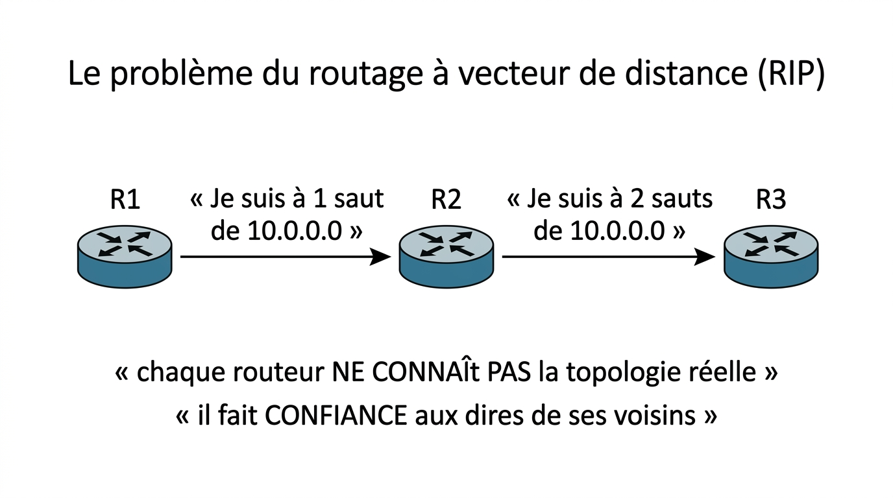
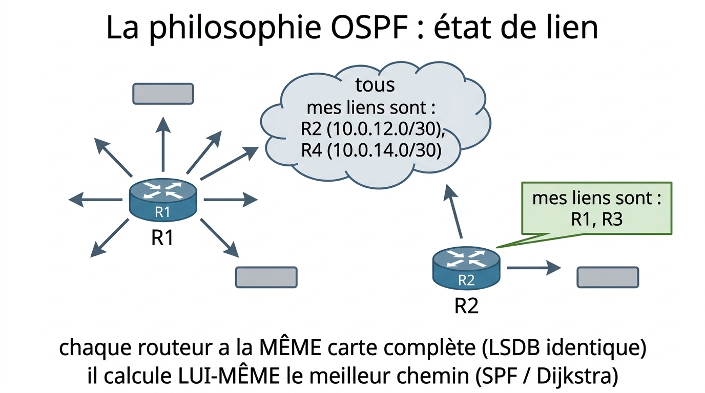
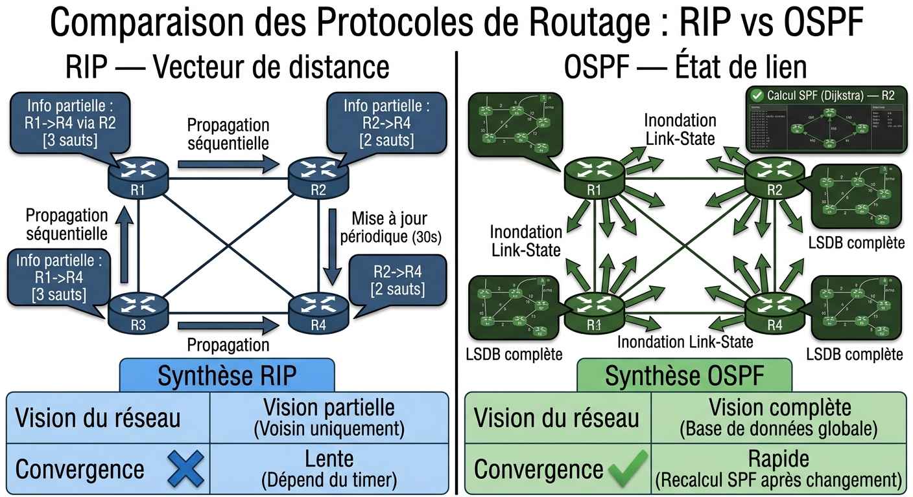
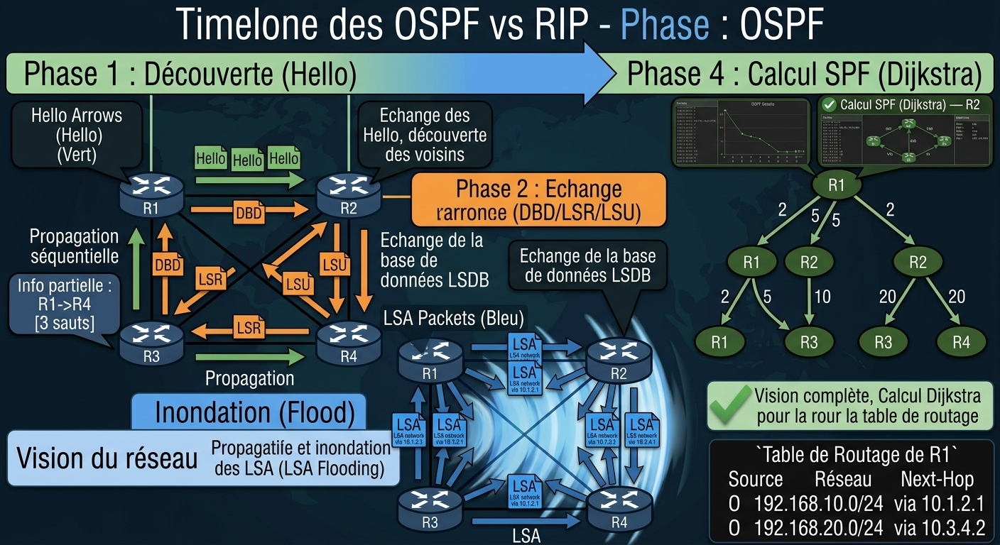
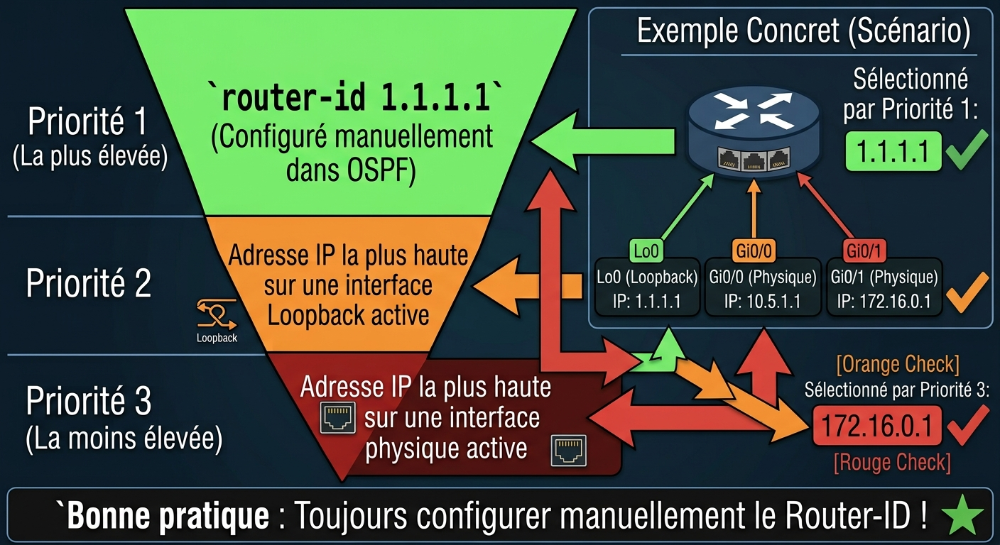
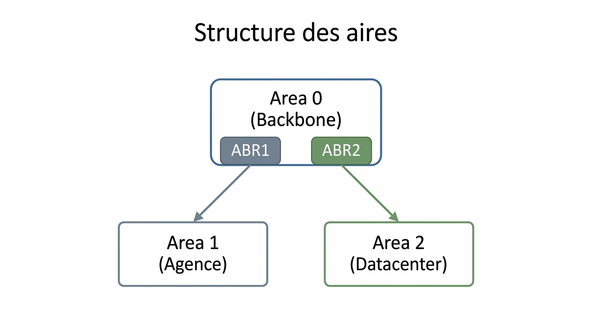
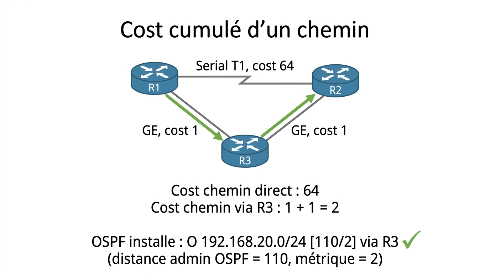
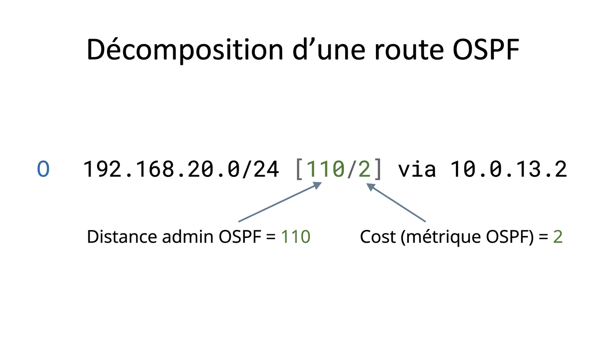
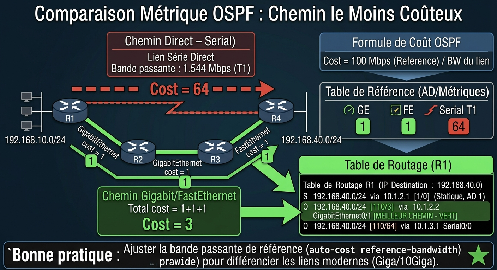
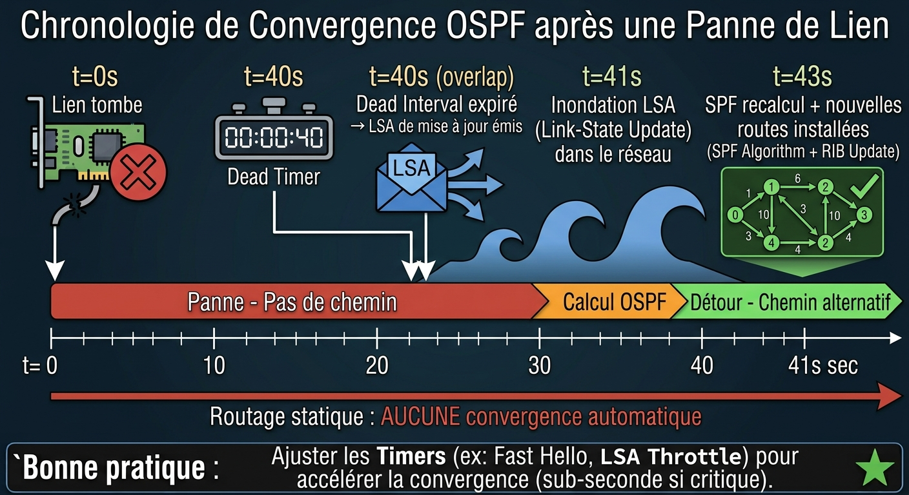

# 📘 FICHE DE COURS — S3 · 2ᵉ ANNÉE · E31
## OSPF : Fonctionnement à état de lien · Aires · Router-ID · Cost

---

> **Nom** : ___________________________
> **Date** : ___________________________
> **Compétences travaillées** : S2.3 · S2.4 · C2.1 · C2.3

---

## 🔑 Vocabulaire clé à maîtriser

| Terme | Définition |
|---|---|
| **OSPF** | Open Shortest Path First — protocole de routage dynamique à état de lien, standard ouvert (RFC 2328) |
| **Link-State** | État de lien — chaque routeur connaît l'état de TOUS les liens du réseau |
| **LSA** | Link-State Advertisement — message décrivant les liens et réseaux d'un routeur |
| **LSDB** | Link-State Database — base de données locale qui stocke TOUS les LSA reçus → carte complète |
| **SPF** | Shortest Path First — algorithme de Dijkstra calculant le chemin le plus court depuis la LSDB |
| **Hello packet** | Paquet envoyé régulièrement pour détecter et maintenir les voisins OSPF |
| **Voisinage** (adjacence) | Relation OSPF établie entre deux routeurs directement connectés |
| **Router-ID** | Identifiant unique d'un routeur OSPF — format adresse IP (ex : 1.1.1.1) |
| **Aire (Area)** | Groupe logique de routeurs OSPF partageant la même LSDB |
| **Area 0** | Aire backbone — obligatoire, toutes les autres aires doivent s'y connecter |
| **Cost** | Métrique OSPF d'un lien — inversement proportionnel à la bande passante |
| **Convergence** | Moment où tous les routeurs ont la même vision du réseau après un changement |
| **DR / BDR** | Designated Router / Backup DR — élus sur les réseaux multi-accès pour réduire les LSA |

---

## 1️⃣ — OSPF vs RIP : deux philosophies opposées

### Le problème du routage à vecteur de distance (RIP)

RIP (Routing Information Protocol) fonctionne comme une rumeur :
- Chaque routeur dit à ses voisins : *"Je suis à X sauts de tel réseau"*
- Les voisins répercutent l'information à leurs propres voisins
- Résultat : lent, inexact, limité à 15 sauts, **convergence lente**



??? note "🔤 Schéma texte original"
    ```
    RIP :  R1 ──"Je suis à 1 saut de 10.0.0.0"──► R2
                                                    R2 ──"Je suis à 2 sauts de 10.0.0.0"──► R3
           → chaque routeur NE CONNAÎT PAS la topologie réelle
           → il fait CONFIANCE aux dires de ses voisins
    ```


### La philosophie OSPF : état de lien

OSPF fonctionne comme une **carte partagée** :
- Chaque routeur diffuse la liste de ses propres liens (LSA)
- Tout le monde reçoit la carte complète de tout le monde (LSDB)
- Chaque routeur calcule **lui-même** le meilleur chemin (SPF)



??? note "🔤 Schéma texte original"
    ```
    OSPF : R1 ──LSA "mes liens sont : R2 (10.0.12.0/30), R4 (10.0.14.0/30)"──► tous
           R2 ──LSA "mes liens sont : R1, R3"──► tous
           → chaque routeur a la MÊME carte complète (LSDB identique)
           → il calcule LUI-MÊME le meilleur chemin (SPF / Dijkstra)
    ```


| Critère | RIP | OSPF |
|---|---|---|
| Type | Vecteur de distance | État de lien |
| Métrique | Nombre de sauts (max 15) | Cost (lié au débit) |
| Connaissance du réseau | Partielle (rumeur) | Complète (carte) |
| Convergence après panne | Lente (minutes) | Rapide (secondes) |
| Scalabilité | Petits réseaux | Grands réseaux |
| Standard | Propriétaire Cisco non | Ouvert (RFC) |

---

**🖼️ ILLUSTRATION 1**
> *Légende* : Comparaison côte à côte RIP vs OSPF sur la même topologie à 4 routeurs. Côté RIP : chaque routeur n'a qu'une vue partielle (bulles de dialogue avec "X sauts vers réseau Y"), flèches graduelles montrant la propagation lente. Côté OSPF : chaque routeur tient une carte complète identique (LSDB), les LSA se propagent en flood simultané, l'algorithme SPF est représenté par un graphe de Dijkstra simplifié. Contraste visuel fort entre les deux philosophies.
>
> 

---

## 2️⃣ — Les 4 phases de fonctionnement OSPF

### Phase 1 — DISCOVERY (découverte des voisins)

Au démarrage, un routeur OSPF envoie des **paquets Hello** via toutes ses interfaces OSPF.

```
Hello packet contient :
  • Router-ID de l'expéditeur
  • Area-ID (identifiant de l'aire)
  • Hello Interval (fréquence d'envoi — défaut : 10 s)
  • Dead Interval (délai avant de déclarer un voisin mort — défaut : 40 s)
  • Adresse du DR/BDR (sur réseaux multi-accès)
```

Deux routeurs deviennent **voisins** si :
- Ils se reçoivent mutuellement leurs Hello
- Ils sont dans la **même aire** (Area-ID identique)
- Ils ont les **mêmes Hello/Dead Intervals**
- Ils ont des **sous-réseaux en commun** (même masque réseau)

### Phase 2 — EXCHANGE (échange de la base de données)

Les voisins s'échangent leurs LSDB pour synchroniser leurs informations.

```
→ DBD (Database Description) : résumé des LSA que le routeur possède
→ LSR (Link-State Request)   : demande des LSA manquants
→ LSU (Link-State Update)    : envoi des LSA demandés
→ LSAck (Acknowledgment)     : accusé de réception
```

### Phase 3 — FLOOD (inondation des LSA)

Chaque routeur **retransmet** les LSA reçus à tous ses autres voisins.
Résultat : tous les routeurs de l'aire ont une **LSDB identique**.

```
R1 reçoit LSA de R2 → retransmet à R4 (pas à R2)
R4 reçoit ce LSA → retransmet à R3 (pas à R1)
R3 reçoit ce LSA → retransmet à R2 (qui l'ignore — il l'a déjà)
→ L'information de R2 a atteint tout le réseau
```

> Les LSA ont un **numéro de séquence** : si un routeur reçoit un LSA avec un numéro déjà connu, il l'ignore → évite les boucles de flood.

### Phase 4 — SPF (calcul du meilleur chemin)

Chaque routeur exécute **l'algorithme de Dijkstra** sur sa LSDB :

```
1. Le routeur se place lui-même comme racine de l'arbre
2. Il calcule le cost vers chaque réseau connu
3. Il retient le chemin de cost minimum vers chaque destination
4. Il installe ces chemins dans sa table de routage (code "O")
```

---

**🖼️ ILLUSTRATION 2**
> *Légende* : Diagramme chronologique en 4 lignes horizontales (une par phase), avec des flèches bidirectionnelles entre les routeurs montrant les échanges de paquets à chaque phase. Phase 1 : paquets Hello verts. Phase 2 : paquets DBD/LSR/LSU oranges. Phase 3 : flood de LSA bleus se propageant en vague. Phase 4 : SPF représenté par un arbre de décision avec les costs annotés sur chaque branche.
>
> 

---

## 3️⃣ — Le Router-ID : l'identité OSPF d'un routeur

### Définition

Le **Router-ID** est un identifiant **unique** dans un domaine OSPF.
Il est au format d'une adresse IPv4 (ex : `1.1.1.1`) mais ce n'est **pas forcément** une adresse routable.

### Règle de sélection (par priorité décroissante)

```
Priorité 1 — Configuré manuellement :
  Router(config-router)# router-id 1.1.1.1   ← MEILLEURE PRATIQUE

Priorité 2 — Adresse IP la plus haute sur une Loopback active :
  Lo0 : 192.168.1.1   Lo1 : 10.0.0.1   → Router-ID = 192.168.1.1
  (la loopback est toujours UP — stabilité garantie)

Priorité 3 — Adresse IP la plus haute sur une interface physique active :
  Gi0/0 : 10.1.2.1   Gi0/1 : 172.16.1.1   → Router-ID = 172.16.1.1
```

> ⚠️ **Problème** si le Router-ID change pendant l'exécution d'OSPF : les adjacences sont réinitialisées.
> **Bonne pratique** : toujours configurer le Router-ID manuellement dès le début.

### Exemple pratique

```cisco
R1(config)# router ospf 1
R1(config-router)# router-id 1.1.1.1

R1# show ip ospf
  Routing Process "ospf 1" with ID 1.1.1.1   ← confirmation
```

---

**🖼️ ILLUSTRATION 3**
> *Légende* : Diagramme de priorité du Router-ID sous forme de pyramide inversée à 3 niveaux. Niveau 1 (haut, vert, "Priorité maximale") : "router-id configuré manuellement". Niveau 2 (orange) : "adresse la plus haute sur Loopback active". Niveau 3 (rouge, "Priorité minimale") : "adresse la plus haute sur interface physique active". À droite, un exemple concret avec les 3 interfaces d'un routeur et le Router-ID résultant dans chaque cas. En dessous, la recommandation professionnelle en gras.
>
> 

---

## 4️⃣ — Les Aires OSPF

### Pourquoi des aires ?

Dans un très grand réseau, si tous les routeurs sont dans la même aire :
- La LSDB devient **énorme** (des milliers de LSA)
- Chaque modification force un recalcul SPF **sur tous les routeurs**
- La bande passante est gaspillée en floods

**Solution : diviser le réseau en aires.**

```
SANS aires : 100 routeurs → chacun stocke 100 × tous les LSA → charge CPU/mémoire énorme
AVEC aires  : 5 aires × 20 routeurs → chaque routeur ne stocke que les LSA de son aire
```

### Structure des aires



??? note "🔤 Schéma texte original"
    ```
                        ┌─────────────────┐
                        │    Area 0       │
                        │   (Backbone)    │
                        │   ABR1   ABR2  │
                        └────┬───────┬───┘
                             │       │
                   ┌─────────┘       └─────────┐
                   │                           │
              ┌────┴────┐                 ┌────┴────┐
              │  Area 1 │                 │  Area 2 │
              │ Agence  │                 │Datacenter│
              └─────────┘                 └─────────┘
    ```


### Règles des aires

| Règle | Détail |
|---|---|
| **Area 0 obligatoire** | L'aire backbone (area 0) doit exister |
| **Toutes les aires connectées à Area 0** | Une aire qui n'est pas connectée à Area 0 ne fonctionne pas correctement |
| **LSDB par aire** | Les LSA d'une aire ne se propagent pas dans les autres aires |
| **ABR** | Area Border Router — routeur à cheval entre deux aires — fait le lien |
| **Route inter-aire** | Apparaît dans la table comme `O IA` (inter-area) |

### En pratique pour un réseau de petite taille

> Pour un réseau avec moins de 50 routeurs : **une seule aire (Area 0) suffit**.
> C'est le cas de la plupart des TP et de l'épreuve E31.

---

## 5️⃣ — Le Cost : la métrique OSPF

### Formule du cost

> **Formule :** `Cost = Bande passante de référence / Bande passante du lien`
>
> Bande passante de référence par défaut : **100 Mbps**

### Tableau des costs par défaut

| Interface | Débit | Cost par défaut |
|---|---|---|
| **GigabitEthernet** | 1 000 Mbps | **1** ← arrondi (min) |
| **FastEthernet** | 100 Mbps | **1** ← 100/100 = 1 |
| **Serial (T1)** | 1,544 Mbps | **64** ← 100/1,544 ≈ 64 |
| **Serial (E1)** | 2,048 Mbps | **48** |

> ⚠️ **Problème** : GigabitEthernet et FastEthernet ont le **même cost (1)** alors que GE est 10× plus rapide.
>
> **Solution** : modifier la bande passante de référence à 1 000 Mbps :
> ```cisco
> Router(config-router)# auto-cost reference-bandwidth 1000
> ```
> Avec 1 000 Mbps comme référence :
> - GigabitEthernet : **1**
> - FastEthernet : **10**
> - Serial T1 : **647**

### Cost cumulé d'un chemin

> Le cost d'un chemin = **somme des costs des interfaces en sortie** sur ce chemin.
> OSPF choisit toujours le chemin de **cost total le plus faible**.

**Exemple :**



??? note "🔤 Schéma texte original"
    ```
    Topologie :
      R1 ─(Serial T1, cost 64)─ R2 (chemin direct)
      R1 ─(GE, cost 1)─ R3 ─(GE, cost 1)─ R2 (chemin via R3)

    Cost chemin direct    : 64
    Cost chemin via R3    : 1 + 1 = 2

    OSPF installe : O 192.168.20.0/24 [110/2] via R3 ✓
                    (distance admin OSPF = 110, métrique = 2)
    ```


**À retenir dans `show ip route` :**



??? note "🔤 Schéma texte original"
    ```
    O    192.168.20.0/24 [110/2] via 10.0.13.2
                          │   │
                          │   └─ Cost (métrique OSPF) = 2
                          └───── Distance admin OSPF = 110
    ```


---

**🖼️ ILLUSTRATION 4**
> *Légende* : Topologie réseau avec 4 routeurs montrant deux chemins de R1 à R4, avec les costs annotés sur chaque lien. Chemin 1 via Serial (cost 64 sur un seul lien). Chemin 2 via deux liens GigabitEthernet (cost 1+1=2). Les deux chemins sont représentés par des couleurs différentes (rouge pour le mauvais, vert pour celui choisi par OSPF). En bas, la formule cost = 100/BW et le tableau des costs courants. La table de routage résultante est affichée à droite.
>
> 

---

## 6️⃣ — Les paquets Hello et la détection de pannes

### Rôle du Hello

Le paquet Hello est le **"battement de cœur"** d'OSPF :
- Envoyé toutes les **10 secondes** (Hello Interval)
- Si un routeur ne reçoit plus de Hello depuis **40 secondes** (Dead Interval = 4 × Hello) :
  → Le voisin est déclaré **mort**
  → Un nouveau LSA est émis pour informer tout le réseau
  → Recalcul SPF sur tous les routeurs de l'aire
  → Nouvelles routes installées dans les tables

```
Timeline d'une panne OSPF :
t=0s   : Lien R1-R2 tombe
t=40s  : Dead Interval expiré → R1 déclare R2 mort
t=40s  : R1 envoie un LSA "R2 est injoignable"
t=41s  : Tous les routeurs reçoivent le LSA (flood)
t=42s  : SPF recalcul sur tous les routeurs
t=43s  : Nouvelles routes installées → convergence ✓

Total : ~43 secondes (contre des minutes pour RIP, ∞ pour le statique)
```

---

**🖼️ ILLUSTRATION 5**
> *Légende* : Chronologie de convergence OSPF après une panne de lien. Axe horizontal = temps (0 à 45 secondes). 5 événements marqués : t=0 (lien coupe, croix rouge), t=40 (Dead Interval expiré, icône minuterie), t=40 (LSA de mise à jour envoyé, icône enveloppe), t=41 (flood LSA, onde bleue), t=43 (SPF recalcul + nouvelles routes, checkmark vert). La ligne de temps passe du rouge au vert. Comparaison avec une ligne secondaire montrant "routage statique : aucune convergence automatique".
>
> 

---

## 📌 Les essentiels à retenir pour l'examen

> ✅ OSPF = protocole à **état de lien** — chaque routeur connaît la topologie complète
> ✅ **4 phases** : Discovery (Hello) → Exchange (DBD) → Flood (LSA) → SPF (Dijkstra)
> ✅ **LSDB identique** sur tous les routeurs d'une même aire
> ✅ **Router-ID** : manuel > loopback la plus haute > interface physique la plus haute
> ✅ **Cost** = 100 Mbps / BW du lien → GE=1, FE=1, Serial T1≈64
> ✅ **Cost d'un chemin** = somme des costs des interfaces en sortie → OSPF choisit le minimum
> ✅ Dans la table : `O [110/cost]` → 110 = distance admin OSPF
> ✅ **Area 0 (backbone)** obligatoire, toutes les autres aires s'y connectent
> ✅ **Convergence** en ~40 secondes (Dead Interval) — automatique, sans intervention

---

*Fiche de Cours — BAC PRO CIEL | E31 Infrastructure Réseau | 2ᵉ année S3*
*Compétences : S2.3 · S2.4 · C2.1 · C2.3*
