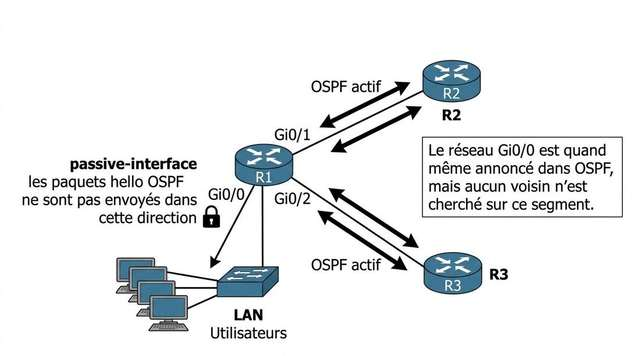
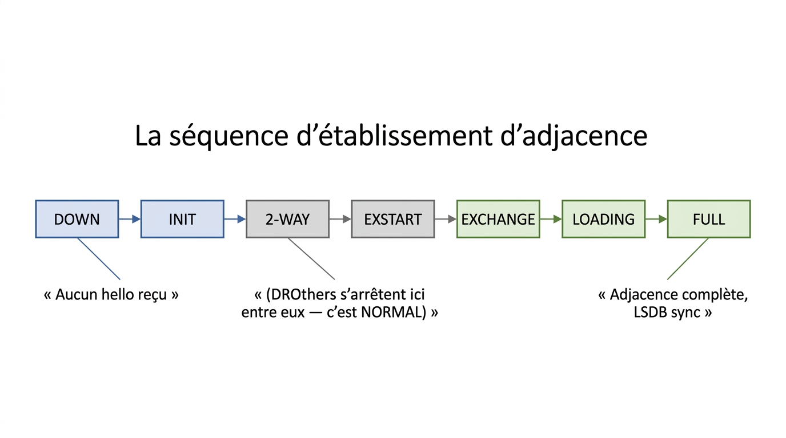
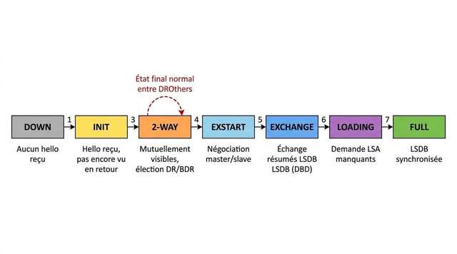
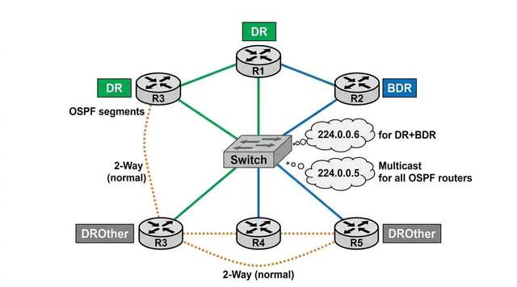
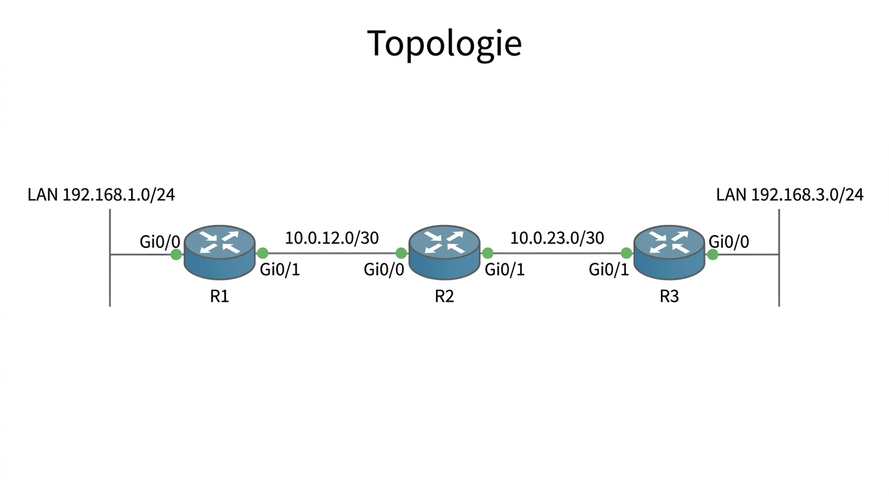

# 📖 FICHE COURS – S4 ANNÉE 2 – E31
## OSPF : Network Statements, DR/BDR, États d'Adjacence, show ip ospf neighbor

**Nom : ________________  Prénom : ________________**

---

## 🎯 OBJECTIFS DE LA SÉANCE

- ✅ Maîtriser la syntaxe `network <adresse> <wildcard> area <n>` et calculer le wildcard
- ✅ Expliquer le rôle DR/BDR et les critères d'élection
- ✅ Décrire la séquence des états d'adjacence OSPF
- ✅ Lire et interpréter `show ip ospf neighbor`
- ✅ Influencer l'élection DR/BDR via `ip ospf priority`

---

## 1️⃣ LE NETWORK STATEMENT OSPF

### Syntaxe

```ios
Router(config)# router ospf <process-id>
Router(config-router)# network <adresse_réseau> <wildcard_mask> area <numéro_area>
```

| **Champ** | **Signification** | **Exemple** |
|---|---|---|
| `process-id` | Identifiant local du processus OSPF (1–65535, n'a pas à être identique entre routeurs) | 1 |
| `adresse_réseau` | Réseau à annoncer dans OSPF (adresse réseau, pas une IP hôte) | 192.168.1.0 |
| `wildcard_mask` | Masque inversé indiquant quels bits sont significatifs | 0.0.0.255 |
| `area` | Numéro de zone OSPF auquel appartient ce réseau | 0 |

**Exemple complet :**

```ios
R1(config)# router ospf 1
R1(config-router)# router-id 1.1.1.1
R1(config-router)# network 192.168.1.0 0.0.0.255 area 0
R1(config-router)# network 10.0.0.0 0.0.0.3 area 0
```

---

### Le Wildcard Mask — Masque Inversé

> Le **wildcard mask** est l'**inverse bit-à-bit** du masque réseau. Les bits à **0** dans le wildcard signifient "ce bit doit correspondre exactement". Les bits à **1** signifient "ce bit est ignoré".

**Formule de calcul :**

$$\boxed{\text{Wildcard} = 255.255.255.255 - \text{Masque réseau}}$$

**Table de référence :**

| **Masque réseau** | **Wildcard** | **Préfixe** |
|---|---|---|
| 255.255.255.0 | **0.0.0.255** | /24 |
| 255.255.255.128 | **0.0.0.127** | /25 |
| 255.255.255.192 | **0.0.0.63** | /26 |
| 255.255.255.224 | **0.0.0.31** | /27 |
| 255.255.255.240 | **0.0.0.15** | /28 |
| 255.255.255.248 | **0.0.0.7** | /29 |
| 255.255.255.252 | **0.0.0.3** | /30 |
| 255.255.255.255 | **0.0.0.0** | /32 (host route) |

> ⚠️ **PIÈGE CLASSIQUE :** Le wildcard n'est PAS le masque réseau. Pour /24, le masque est 255.255.255.0 et le wildcard est **0.0.0.255** — c'est l'inverse.

---

### Cas particulier : tout activer avec un seul network statement

```ios
! Activer OSPF sur TOUTES les interfaces du routeur :
R1(config-router)# network 0.0.0.0 255.255.255.255 area 0
```

> Ce raccourci est pratique mais peu précis en production : il inclut toutes les interfaces, y compris celles vers Internet ou les serveurs qu'on ne veut pas annoncer.

---

### Passive interface

> Pour qu'OSPF annonce un réseau **sans envoyer de hello** sur cette interface (ex: interface vers les PCs — on n'a pas de voisin OSPF à y découvrir) :

```ios
R1(config-router)# passive-interface GigabitEthernet0/0
```

> 💡 **Bonne pratique :** Rendre passives toutes les interfaces orientées vers les LAN utilisateurs. OSPF ne cherchera pas de voisin là, mais annoncera quand même le réseau.

---



> **Légende :** La directive `passive-interface` empêche OSPF d'envoyer des paquets Hello sur l'interface LAN (inutile — aucun routeur OSPF n'est présent de ce côté), tout en continuant à annoncer ce réseau dans la LSDB. Cela économise de la bande passante et évite les attentes de voisins fantômes.

---

## 2️⃣ LE ROUTER-ID OSPF

> Le **router-id** est l'identifiant unique d'un routeur dans le domaine OSPF. C'est une adresse IPv4 de 32 bits qui n'a pas à être routable — elle sert uniquement à identifier le routeur.

### Règle de sélection automatique (ordre de priorité)

```
1. Router-ID configuré manuellement → TOUJOURS utilisé en premier
        router ospf 1
          router-id 1.1.1.1   ← explicite, bonne pratique

2. Adresse IP la plus haute sur une interface LOOPBACK active
        interface Loopback0
          ip address 1.1.1.1 255.255.255.255

3. Adresse IP la plus haute sur n'importe quelle interface physique active
        (risque d'instabilité si l'interface flap)
```

> ⚠️ **Bonne pratique :** Toujours configurer le router-id manuellement ou via une loopback. Dépendre d'une interface physique pour le router-id cause des problèmes : si l'interface tombe, OSPF peut tenter de changer de router-id, ce qui réinitialise toutes les adjacences.

**Vérification du router-id :**

```ios
R1# show ip ospf
 Routing Process "ospf 1" with ID 1.1.1.1
```

---

## 3️⃣ LES ÉTATS D'ADJACENCE OSPF

> Quand deux routeurs OSPF se découvrent, leur relation évolue à travers **7 états** successifs. Comprendre ces états est indispensable pour déboguer OSPF.

### La séquence d'établissement d'adjacence



??? note "🔤 Schéma texte original"
    ```
    DOWN ──→ INIT ──→ 2-WAY ──→ EXSTART ──→ EXCHANGE ──→ LOADING ──→ FULL
     │                  │                                              │
     │                  │ (DROthers s'arrêtent ici                    │
     │                   │  entre eux — c'est NORMAL)                  │
     │                                                                │
     └─ Aucun hello reçu               Adjacence complète, LSDB sync ─┘
    ```


---



> **Légende :** Séquence des états d'adjacence OSPF. Sur un lien point-à-point, les deux routeurs progressent directement jusqu'à l'état Full. Sur un segment multi-accès (LAN), les routeurs DROther restent en état 2-Way entre eux (normal), tandis qu'ils atteignent l'état Full uniquement avec le DR et le BDR.

---

### Description de chaque état

| **État** | **Ce qui se passe** | **Normal ou transitoire ?** |
|---|---|---|
| **DOWN** | Aucun paquet Hello reçu du voisin | Anormal si le lien est Up |
| **INIT** | Un Hello du voisin reçu, mais notre router-id n'est pas encore dans sa liste de voisins | Transitoire (quelques secondes) |
| **2-WAY** | Les deux routeurs se voient mutuellement. Sur multi-accès : élection DR/BDR ici. | **Final entre DROthers** |
| **EXSTART** | Négociation master/slave pour déterminer qui envoie en premier les DBD | Transitoire |
| **EXCHANGE** | Échange des Database Description (DBD) — résumés des entrées LSDB | Transitoire |
| **LOADING** | Envoi de LSR (Link State Request) pour les LSA non connus | Transitoire |
| **FULL** | Les deux routeurs ont une LSDB identique — adjacence complète | **État cible** |

> 💡 **À retenir :**
> - **Full** est l'état **cible** sur tous les liens point-à-point et entre chaque routeur et son DR/BDR
> - **2-Way** est l'état **normal et correct** entre deux DROthers sur un LAN
> - Un état bloqué en **EXSTART/EXCHANGE** signale souvent un MTU mismatch

---

## 🏷️⃣ DR, BDR ET DROTHER

### Le problème des LAN multi-accès

> Sur un réseau Ethernet, plusieurs routeurs peuvent être connectés au même switch. Sans mécanisme spécial, OSPF formerait **N×(N-1)/2** adjacences Full, ce qui générerait un flood massif de LSA.

**Avec N = 5 routeurs :** 5×4/2 = **10 adjacences** sans DR → **4 adjacences** avec DR.

---

### Les trois rôles sur un LAN OSPF

| **Rôle** | **Nb sur un segment** | **Adjacences** | **Description** |
|---|---|---|---|
| **DR** (Designated Router) | 1 | Full avec TOUS | Point de collecte et redistribution des LSA |
| **BDR** (Backup DR) | 1 | Full avec TOUS | Prêt à devenir DR si le DR tombe |
| **DROther** | N-2 | Full avec DR+BDR uniquement ; **2-Way** avec les autres DROthers | Routeurs ordinaires sur le segment |

---



> **Légende :** Organisation DR/BDR sur un segment LAN. Le DR (R1, vert) et le BDR (R2, bleu) maintiennent une adjacence Full avec tous les routeurs du segment. Les DROthers (R3, R4, R5) n'ont une adjacence Full qu'avec DR et BDR — entre eux, l'état 2-Way est normal et attendu. Quand un DROther a un nouveau LSA, il l'envoie au DR/BDR via l'adresse multicast 224.0.0.6, puis le DR redistribue à tous via 224.0.0.5.

---

### Critères d'élection DR/BDR

**Critère 1 — Priorité d'interface OSPF (décisif)**

```ios
interface GigabitEthernet0/0
  ip ospf priority <0-255>
  ! Défaut = 1
  ! 0 = ne participe JAMAIS à l'élection (ni DR ni BDR)
  ! Plus haute valeur gagne
```

**Critère 2 — Router-ID (départage en cas d'égalité de priorité)**

> Le routeur avec le **router-id numérique le plus élevé** gagne.

**Tableau de décision :**

```
Comparer les priorités de tous les routeurs :
  → Le plus haute priorité = DR
  → La deuxième plus haute = BDR
  → Les autres = DROther

En cas d'égalité de priorité :
  → Comparer les router-id → le plus élevé gagne
```

> ⚠️ **L'élection est NON-PRÉEMPTIVE :**
> Une fois le DR élu, il conserve son rôle même si un routeur avec une priorité plus élevée rejoint le réseau. Pour forcer une re-élection :
> ```ios
> R1# clear ip ospf process
> ```
> ⚠️ Cette commande interrompt brièvement le routage OSPF sur le routeur.

---

### Flux des LSA sur un LAN multi-accès

```
Un DROther détecte un changement de topologie (un lien tombe) :

Étape 1 : DROther envoie le LSA vers 224.0.0.6 (DR + BDR uniquement)
Étape 2 : Le DR accuse réception et retransmet le LSA vers 224.0.0.5 (tous les routeurs OSPF)
Étape 3 : Tous les routeurs du segment reçoivent le LSA et mettent à jour leur LSDB
Étape 4 : Algorithme SPF recalcule les meilleures routes → table de routage mise à jour
```

---

## 5️⃣ SHOW IP OSPF NEIGHBOR — LECTURE ET INTERPRÉTATION

### Sortie type et décryptage

```
R1# show ip ospf neighbor

Neighbor ID     Pri   State           Dead Time   Address         Interface
2.2.2.2           1   FULL/DR         00:00:39    10.0.0.2        Gi0/0
3.3.3.3           1   FULL/BDR        00:00:34    10.0.0.3        Gi0/0
4.4.4.4           1   2WAY/DROTHER    00:00:36    10.0.0.4        Gi0/0
5.5.5.5           0   2WAY/DROTHER    00:00:31    10.0.0.5        Gi0/0
```

**Colonnes décryptées :**

| **Colonne** | **Signification** | **Points d'attention** |
|---|---|---|
| **Neighbor ID** | Router-ID du voisin | Sert à l'identifier de façon unique |
| **Pri** | Priorité OSPF du voisin sur ce segment | 0 = ne peut pas être DR/BDR |
| **State** | État de l'adjacence / Rôle du voisin | Full/DR, Full/BDR, 2WAY/DROTHER, ou états transitoires |
| **Dead Time** | Temps restant avant de considérer le voisin mort | Défaut = 40 s (si tombe à 0 → voisin mort → reconvergence) |
| **Address** | Adresse IP du voisin sur ce segment | Adresse physique (pas le router-id) |
| **Interface** | Interface locale par laquelle le voisin est vu | Permet de localiser la liaison |

---

### Interprétation des états de la sortie `show ip ospf neighbor`

| *"État affiché** | **Signification** | **Normal ?** |
|---|---|---|
| `FULL/DR` | Voisin adjacent complet, c'est le DR du segment | ✅ Attendu |
| `FULL/BDR` | Voisin adjacent complet, c'est le BDR | ✅ Attendu |
| `FULL/ -` | Adjacent complet sur lien point-à-point (pas de DR) | ✅ Attendu |
| `2WAY/DROTHER` | Voisin vu mutuellement, c'est un DROther | ✅ Normal entre DROthers |
| `INIT/ -` | On reçoit ses hello, il ne nous voit pas encore | ⚠️ Transitoire |
| `EXSTART/ -` | Bloqué en négociation master/slave | ❌ Problème probable (MTU mismatch) |
| `EXCHANGE/ -` | Bloqué en échange de DBD | ❌ Problème probable |
| `DOWN` | Plus aucun hello reçu | ❌ Lien mort ou OSPF désactivé |

---

### Commandes de vérification associées

```ios
! Vue complète de toutes les adjacences
R1# show ip ospf neighbor

! Détails complets (timers, DR/BDR adresses, LSA count...)
R1# show ip ospf neighbor detail

! Infos OSPF par interface (priority, DR/BDR élus, hello/dead timers)
R1# show ip ospf interface GigabitEthernet0/0

! Table de routage (routes apprises via OSPF marquées O)
R1# show ip route ospf

! Informations générales du processus OSPF
R1# show ip ospf
```

---

## 6️⃣ MODIFIER LA PRIORITÉ ET FORCER L'ÉLECTION

### Augmenter la priorité d'une interface

```ios
R1(config)# interface GigabitEthernet0/0
R1(config-if)# ip ospf priority 100
```

> **Résultat :** Si R1 n'est pas encore DR, il le deviendra lors de la prochaine élection. Si une élection est déjà en cours (tous les routeurs viennent de démarrer), R1 sera élu DR.

### Empêcher un routeur d'être élu

```ios
R3(config)# interface GigabitEthernet0/0
R3(config-if)# ip ospf priority 0
```

> **Résultat :** R3 ne sera jamais DR ni BDR sur ce segment, quels que soient ses router-id. Utile pour les routeurs d'accès ou les équipements qui ne doivent pas prendre de charge supplémentaire.

### Forcer la re-élection

```ios
R1# clear ip ospf process
Reset ALL OSPF processes? [no]: yes
```

> **⚠️ Impact :** Toutes les adjacences OSPF sont coupées et rétablies — bref interruption du routage (quelques secondes à quelques minutes selon la taille du réseau). **À n'utiliser qu'en dehors des heures de production.**

---

## 7️⃣ EXEMPLE DE CONFIGURATION COMPLÈTE

### Topologie



??? note "🔤 Schéma texte original"
    ```
    [LAN 192.168.1.0/24]           [LAN 192.168.3.0/24]
            │                                │
          R1 Gi0/0                     R3 Gi0/0
          R1 Gi0/1 ─── 10.0.12.0/30 ─── R2 Gi0/0
                                        R2 Gi0/1 ─── 10.0.23.0/30 ─── R3 Gi0/1
    ```


### Configuration R1

```ios
R1(config)# router ospf 1
R1(config-router)# router-id 1.1.1.1
R1(config-router)# network 192.168.1.0 0.0.0.255 area 0
R1(config-router)# network 10.0.12.0 0.0.0.3 area 0
R1(config-router)# passive-interface GigabitEthernet0/0
```

### Configuration R2

```ios
R2(config)# router ospf 1
R2(config-router)# router-id 2.2.2.2
R2(config-router)# network 10.0.12.0 0.0.0.3 area 0
R2(config-router)# network 10.0.23.0 0.0.0.3 area 0
```

### Configuration R3

```ios
R3(config)# router ospf 1
R3(config-router)# router-id 3.3.3.3
R3(config-router)# network 10.0.23.0 0.0.0.3 area 0
R3(config-router)# network 192.168.3.0 0.0.0.255 area 0
R3(config-router)# passive-interface GigabitEthernet0/0
```

### Vérification

```ios
R2# show ip ospf neighbor
Neighbor ID  Pri  State    Dead Time  Address      Interface
1.1.1.1        1  FULL/ -  00:00:36   10.0.12.1    Gi0/0
3.3.3.3        1  FULL/ -  00:00:39   10.0.23.2    Gi0/1

! "FULL/ -" = lien point-à-point, pas d'élection DR/BDR → normal ✅

R2# show ip route ospf
O  192.168.1.0/24 [110/2] via 10.0.12.1, 00:02:15, Gi0/0
O  192.168.3.0/24 [110/2] via 10.0.23.2, 00:02:15, Gi0/1
```

---

## ✅ AUTO-ÉVALUATION

- [ ] Je sais écrire un `network statement` avec le bon wildcard
- [ ] Je sais calculer un wildcard mask depuis un masque réseau
- [ ] Je sais à quoi sert `passive-interface`
- [ ] Je comprends les 7 états d'adjacence et lesquels sont normaux / anormaux
- [ ] Je sais que 2-Way entre DROthers est normal (pas une erreur)
- [ ] Je connais les critères d'élection DR/BDR (priority > router-id)
- [ ] Je sais lire `show ip ospf neighbor` colonne par colonne
- [ ] Je sais que `priority 0` exclut un routeur de l'élection
- [ ] Je comprends pourquoi l'élection est non-préemptive

---

## 📚 VOCABULAIRE CLEF

| **Terme** | **Définition** |
|---|---|
| **Wildcard mask** | Masque inversé (255.255.255.255 − masque) utilisé dans les network statements OSPF |
| **Router-ID** | Identifiant unique du routeur dans le domaine OSPF (adresse IPv4 de 32 bits) |
| **DR** | Designated Router — représentant du segment, collecte et redistribue les LSA |
| **BDR** | Backup Designated Router — prend la relève si le DR tombe |
| **DROther** | Routeur ordinaire sur un LAN — adjacence Full uniquement avec DR et BDR |
| **État Full** | Adjacence complète : LSDB synchronisée entre les deux voisins |
| **État 2-Way** | Voisinage bidirectionnel visible mais sans échange de LSDB (normal entre DROthers) |
| **Passive-interface** | Empêche l'envoi de hello sur une interface tout en annonçant son réseau |
| **224.0.0.5** | Adresse multicast AllSPFRouters — hello envoyés à TOUS les routeurs OSPF |
| *"224.0.0.6** | Adresse multicast AllDRouters — LSA envoyés au DR+BDR uniquement par les DROthers |
| **Non-préemptif** | Une fois élu, le DR garde son rôle sans être remis en cause automatiquement |

---

## 📌 POINTS-CLÉS À RETENIR

1. **Wildcard** = 255.255.255.255 − masque réseau (inverse bit-à-bit)
2. Le **network statement** active OSPF sur les interfaces dont l'IP correspond
3. **router-id** : configurer manuellement ou via loopback — jamais laisser par défaut sur interface physique
4. **Élection DR/BDR** : priority la plus haute → sinon router-id le plus élevé
5. **priority 0** = exclus de l'élection pour toujours (ni DR ni BDR)
6. **Non-préemptif** : `clear ip ospf process` pour forcer une re-élection
7. **2-Way entre DROthers = NORMAL** — ne pas confondre avec une erreur
8. **show ip ospf neighbor** : la colonne State dit tout (Full / 2-Way / états intermédiaires)

---

**Document – BAC PRO CIEL – A2 – E31/U31 – Version 1.0 – 2026**
