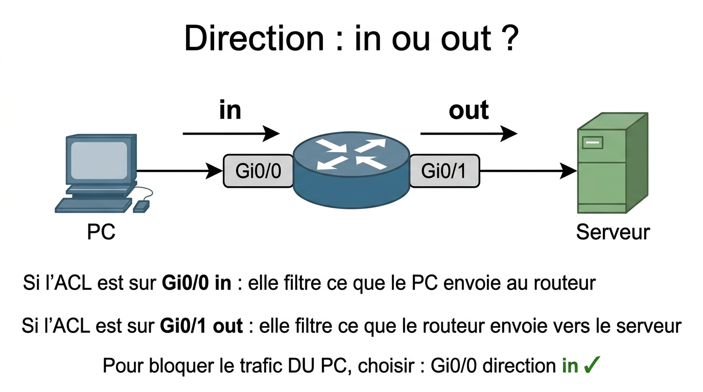
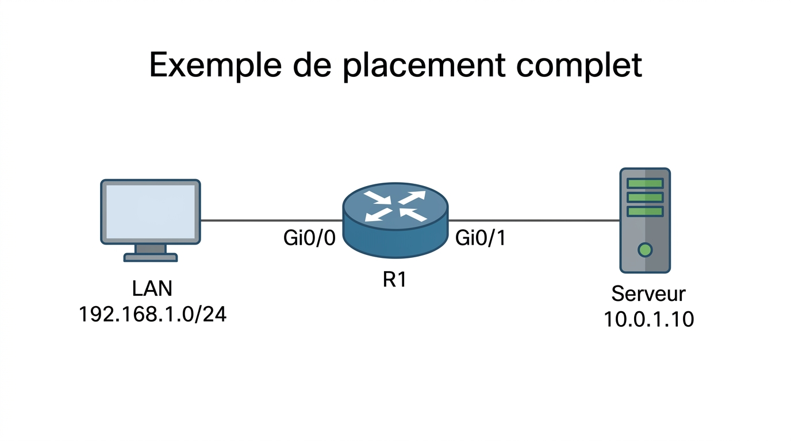

# 📖 FICHE COURS – S5 ANNÉE 2 – E31
## ACL Étendues : Filtrage Port & Protocole, Placement, Vérification

**Nom : ________________  Prénom : ________________**

---

## 🎯 OBJECTIFS DE LA SÉANCE

- ✅ Écrire une ACL étendue filtrant par source, destination, protocole et port
- ✅ Appliquer la règle de placement (étendue = proche source)
- ✅ Utiliser `show ip access-lists` pour vérifier et déboguer
- ✅ Traduire une politique de sécurité en ACL IOS

---

## 1️⃣ RAPPEL : LIMITES DES ACL STANDARD

> Les **ACL standard** (numéros 1–99) ne filtrent que sur l'**adresse source IP**. Elles ne permettent pas de filtrer par port, protocole ou adresse de destination.

| **Critère** | **ACL Standard** | **ACL Étendue** |
|---|---|---|
| Source IP | ✅ | ✅ |
| Destination IP | ❌ | ✅ |
| Protocole (TCP/UDP/ICMP) | ❌ | ✅ |
| Port (HTTP=80, SSH=22…) | ❌ | ✅ |
| Placement recommandé | Près de la **destination** | Près de la **source** |
| Numéros | 1–99 | **100–199** |

---

## 2️⃣ SYNTAXE D'UNE ACL ÉTENDUE

### Format numéroté (100–199)

```ios
access-list <100-199> {permit|deny} <protocole> <src> <wildcard_src> <dst> <wildcard_dst> [eq <port>]
```

### Format nommé (recommandé en production)

```ios
ip access-list extended <NOM>
  {permit|deny} <protocole> <src> <wildcard_src> <dst> <wildcard_dst> [eq <port>]
  remark <commentaire optionnel>
  ...
```

### Application sur interface

```ios
interface <interface>
  ip access-group <numéro|NOM> {in|out}
```

---

### Décomposition champ par champ

```
access-list 110  deny   tcp   192.168.1.0 0.0.0.255   any   eq 22
           [1]  [2]    [3]       [4]           [5]     [6]   [7][8]

[1] Numéro ACL étendue (100–199)
[2] Action : permit (autoriser) ou deny (refuser)
[3] Protocole : tcp | udp | icmp | ip (= tous protocols)
[4] Adresse source
[5] Wildcard source (0.0.0.255 = tout le /24)
[6] Adresse destination (any = n'importe quelle destination)
[7] Opérateur de port : eq (égal) | gt | lt | range
[8] Numéro de port destination
```

---

📷 **[ILLUSTRATION 1]**
*Schéma d'un paquet IP traversant un routeur. Le paquet est représenté comme une enveloppe annotée avec ses champs : adresse IP source (en vert), adresse IP destination (en bleu), protocole (TCP/UDP/ICMP, en orange), port destination (en rouge). Une loupe représentant l'ACL étendue examine simultanément les 4 champs. À côté, une ACL standard avec une loupe plus petite qui ne regarde que le champ source IP. Style infographie pédagogique, fond blanc, couleurs distinctes par champ.*

> **Légende :** Une ACL étendue examine quatre champs du paquet : l'adresse source, l'adresse destination, le protocole de couche 4 et le numéro de port. L'ACL standard n'examine que l'adresse source. Plus l'ACL est précise, plus le placement près de la source est justifié — le trafic indésirable est arrêté avant de voyager inutilement dans le réseau.

---

### Mots-clés pratiques pour source/destination

| **Syntaxe** | **Signification** | **Équivalent explicite** |
|---|---|---|
| `any` | N'importe quelle adresse | `0.0.0.0 255.255.255.255` |
| `host 192.168.1.10` | Cette adresse exacte | `192.168.1.10 0.0.0.0` |
| `192.168.1.0 0.0.0.255` | Tout le réseau /24 | — |
| `192.168.1.0 0.0.0.31` | Tout le réseau /27 | — |

---

## 3️⃣ LES PROTOCOLES ET LES PORTS

### Protocoles à connaître

| **Mot-clé** | **Signification** | **Quand l'utiliser** |
|---|---|---|
| `ip` | Tous les protocoles IP | Règle générale (permit/deny tout) |
| `tcp` | TCP uniquement | HTTP, HTTPS, SSH, Telnet, FTP... |
| `udp` | UDP uniquement | DNS, DHCP, TFTP, SNMP... |
| `icmp` | ICMP uniquement | Ping, traceroute |

### Ports standards indispensables

| **Service** | **Port** | **Proto** | **Usage** |
|---|---|---|---|
| SSH | **22** | TCP | Administration sécurisée |
| Telnet | **23** | TCP | Administration non sécurisée (à éviter) |
| DNS | **53** | TCP + UDP | Résolution de noms |
| HTTP | **80** | TCP | Web non chiffré |
| HTTPS | **443** | TCP | Web chiffré |
| FTP | **20-21** | TCP | Transfert de fichiers |
| SMTP | **25** | TCP | Envoi e-mail |
| RDP | **3389** | TCP | Bureau à distance Windows |
| SNMP | **161** | UDP | Supervision réseau |

### Opérateurs de comparaison de port

| **Opérateur** | **Syntaxe** | **Signification** |
|---|---|---|
| `eq` | `eq 80` | Port exactement égal à 80 |
| `neq` | `neq 23` | Tout port sauf 23 |
| `gt` | `gt 1023` | Port > 1023 (ports éphémères) |
| `lt` | `lt 1024` | Port < 1024 (ports système) |
| `range` | `range 20 21` | Ports de 20 à 21 inclus |

---

## 4️⃣ EXEMPLES D'ACL ÉTENDUES COMMENTÉES

### Exemple 1 — Bloquer SSH depuis le LAN

**Objectif :** Les machines du réseau 192.168.1.0/24 ne peuvent pas accéder en SSH à aucune destination.

```ios
access-list 110 deny   tcp  192.168.1.0 0.0.0.255  any  eq 22
access-list 110 permit ip   any                    any
! ↑ OBLIGATOIRE — sans cette ligne, TOUT est bloqué (deny implicite)
```

---

### Exemple 2 — Autoriser HTTP et HTTPS uniquement vers un serveur

**Objectif :** Le LAN peut accéder au serveur 10.0.1.10 seulement en HTTP et HTTPS.

```ios
ip access-list extended FILTRE_WEB
  permit tcp  192.168.1.0 0.0.0.255  host 10.0.1.10  eq 80
  permit tcp  192.168.1.0 0.0.0.255  host 10.0.1.10  eq 443
  deny   ip   any                    host 10.0.1.10
  permit ip   any                    any
```

---

### Exemple 3 — Bloquer le ping depuis Internet

**Objectif :** Bloquer les requêtes ICMP provenant de l'extérieur (Internet) vers le réseau interne.

```ios
ip access-list extended ANTI_PING
  deny   icmp  any  192.168.0.0 0.0.255.255  echo
  permit ip    any  any
```

> `echo` est un type ICMP spécifique (le ping). On peut aussi utiliser `deny icmp any any` pour bloquer tout ICMP.

---

### Exemple 4 — ACL complexe : politique DMZ complète

**Objectif :** LAN-Admin peut tout faire. LAN-Users ne peut faire que HTTP/HTTPS. Personne ne peut accéder en Telnet.

```ios
ip access-list extended POLITIQUE_SORTIE
  remark === Admin : acces complet ===
  permit ip   192.168.2.0 0.0.0.255  any
  remark === Users : HTTP et HTTPS uniquement ===
  permit tcp  192.168.1.0 0.0.0.255  any  eq 80
  permit tcp  192.168.1.0 0.0.0.255  any  eq 443
  remark === Bloquer Telnet pour tout le monde ===
  deny   tcp  any  any  eq 23
  remark === Autoriser le reste ===
  permit ip   any  any
```

---

📷 **[ILLUSTRATION 2]**
*Diagramme de flux d'une ACL IOS. Un paquet arrive à gauche. Une séquence de boîtes numérotées de haut en bas représente les règles ACL dans l'ordre : Règle 1 (permit Admin), Règle 2 (permit HTTP), Règle 3 (permit HTTPS), Règle 4 (deny Telnet), Règle 5 (permit ip any any), Règle implicite (deny any any). Pour chaque règle, une branche "Match ?" : si OUI → action (permit=vert/deny=rouge) ; si NON → descendre à la règle suivante. Tout paquet atteignant la règle implicite est bloqué. Style organigramme de traitement réseau, fond blanc.*

> **Légende :** Traitement d'un paquet par une ACL IOS. Les règles sont évaluées de haut en bas. Dès qu'une règle correspond (match), l'action est appliquée et l'évaluation s'arrête. Si aucune règle ne correspond, la règle implicite `deny any any` s'applique — c'est pourquoi il faut toujours terminer par `permit ip any any` si on ne veut pas bloquer tout le trafic non explicitement traité.

---

## 5️⃣ LA RÈGLE DU DENY IMPLICITE

> ⚠️ **RÈGLE ABSOLUE :** Toute ACL IOS se termine par une règle implicite **`deny any any`** invisible. Tout trafic ne correspondant à aucune règle explicite est **bloqué**.

**Conséquence pratique :**

```ios
! ACL dangereuse (bloque TOUT sauf SSH Admin) :
access-list 110 permit tcp  host 192.168.2.1  any  eq 22
! → Tout autre trafic est bloqué ! Même le ping, HTTP, OSPF...

! ACL correcte :
access-list 110 permit tcp  host 192.168.2.1  any  eq 22
access-list 110 permit ip   any               any
! → Seulement les connexions SSH non-admin sont traitées spécifiquement
```

**La règle d'or :**

> *"Si tu veux bloquer SEULEMENT certains flux, autorise tout le reste en dernier."*

---

## 6️⃣ PLACEMENT DES ACL

### La règle fondamentale

$$\boxed{\text{ACL Étendue} \rightarrow \text{Proche de la SOURCE}}$$
$$\boxed{\text{ACL Standard} \rightarrow \text{Proche de la DESTINATION}}$$

---

### Pourquoi cette règle ?

**Pour les ACL étendues :**

> Une ACL étendue identifie précisément le trafic à bloquer (source + destination + port). En la plaçant près de la source, on évite que le trafic bloqué traverse inutilement tout le réseau avant d'être rejeté.

**Pour les ACL standard :**

> Une ACL standard ne filtre que la source. Si on la place près de la source, on risque de bloquer le trafic de cette source vers TOUTES les destinations — même celles qu'on ne veut pas bloquer. En la plaçant près de la destination, on cible précisément le flux concerné.

---

📷 **[ILLUSTRATION 3]**
*Topologie réseau avec deux sites : Site-A (gauche) contenant un PC utilisateur et R1 ; Site-B (droite) contenant R2 et un Serveur. Deux scénarios côte à côte. Scénario 1 : ACL étendue placée sur R1 Gi0/0 in (proche source) — le paquet bloqué est stoppé dès R1, ne traverse pas le WAN. Texte : "Trafic bloqué ici : économise la bande passante WAN". Scénario 2 : ACL étendue placée sur R2 Gi0/1 in (proche destination) — le paquet voyage tout le long du réseau avant d'être bloqué. Texte : "Trafic inutile traverse le WAN". Style diagramme réseau comparatif, fond blanc, flèches rouges pour trafic bloqué.*

> **Légende :** Illustration du principe de placement des ACL étendues. En plaçant l'ACL près de la source (R1), le trafic à bloquer est rejeté immédiatement, sans consommer de bande passante sur les liaisons intermédiaires. Un placement près de la destination gaspille de la bande passante et augmente la charge des routeurs intermédiaires.

---

### Direction : `in` ou `out` ?

> La direction se définit **du point de vue de l'interface du routeur** :

| **Direction** | **Signification** | **Quand l'utiliser** |
|---|---|---|
| `in` | Trafic **entrant** dans le routeur **via** cette interface | ACL étendue sur l'interface d'entrée (côté source) |
| `out` | Trafic **sortant** du routeur **vers** cette interface | ACL standard ou filtrages sur le chemin de sortie |

**Mémo visuel :**



??? note "🔤 Schéma texte original"
    ```
    PC ──────► [Gi0/0 ROUTEUR Gi0/1] ──────► Serveur
                    ↑ in           ↑ out

    Si l'ACL est sur Gi0/0 in : elle filtre ce que le PC envoie au routeur
    Si l'ACL est sur Gi0/1 out : elle filtre ce que le routeur envoie vers le serveur

    → Pour bloquer le trafic DU PC, choisir : Gi0/0 direction in ✅
    ```


---

### Exemple de placement complet

**Topologie :**



??? note "🔤 Schéma texte original"
    ```
    [LAN 192.168.1.0/24] ── Gi0/0 ── [R1] ── Gi0/1 ── [Serveur 10.0.1.10]
    ```


**Objectif :** Bloquer SSH depuis le LAN vers le serveur.

```ios
! Étape 1 : Écrire l'ACL
ip access-list extended BLOQUER_SSH_LAN
  deny   tcp  192.168.1.0 0.0.0.255  host 10.0.1.10  eq 22
  permit ip   any  any

! Étape 2 : Appliquer sur l'interface SOURCE, direction IN
interface GigabitEthernet0/0
  ip access-group BLOQUER_SSH_LAN in

! Résultat : les paquets SSH venant du LAN sont rejetés dès qu'ils entrent sur Gi0/0
```

---

## 7️⃣ VÉRIFICATION AVEC `show ip access-lists`

### Commande et sortie type

```ios
R1# show ip access-lists

Extended IP access list BLOQUER_SSH_LAN
    10 deny tcp 192.168.1.0 0.0.0.255 host 10.0.1.10 eq 22 (15 matches)
    20 permit ip any any (342 matches)

Extended IP access list ANTI_PING
    10 deny icmp any any echo (0 matches)
    20 permit ip any any (89 matches)
```

### Lecture des colonnes

| **Champ** | **Signification** |
|---|---|
| `10`, `20`... | Numéro de séquence de la règle (10, 20, 30… par défaut) |
| `deny tcp ...` | Action + protocole + critères |
| `(15 matches)` | **Compteur de hits** : nombre de paquets qui ont correspondu à cette règle |
| `(0 matches)` | Aucun paquet n'a encore correspondu — règle jamais déclenchée |

### Ce que les compteurs vous disent

| **Situation** | **Interprétation** |
|---|---|
| Règle `deny` avec 0 matches | La règle n'a jamais bloqué quoi que ce soit — trafic ne correspond pas, ou règle jamais atteinte |
| Règle `permit ip any any` avec beaucoup de matches | La grande majorité du trafic passe → les règles au-dessus sont trop spécifiques |
| Règle `deny` avec beaucoup de matches | Le trafic ciblé est bien bloqué |
| Toutes les règles à 0 matches | L'ACL n'est peut-être pas appliquée sur l'interface (vérifier `show ip interface`) |

---

### Commandes de vérification associées

```ios
! Voir quelle ACL est appliquée sur quelle interface
R1# show ip interface GigabitEthernet0/0
  Inbound  access list is BLOQUER_SSH_LAN   ← ACL in
  Outbound access list is not set

! Voir la config ACL dans la configuration courante
R1# show run | section access-list
R1# show run | section ip access-list

! Voir les interfaces avec ACL appliquée
R1# show ip interface | include access list

! Remettre les compteurs de matches à zéro
R1# clear ip access-list counters BLOQUER_SSH_LAN
```

---

## 8️⃣ ACL NOMMÉES VS NUMÉROTÉES — COMPARATIF

| **Critère** | **ACL Numérotée (100–199)** | **ACL Nommée** |
|---|---|---|
| **Syntaxe** | `access-list 110 deny tcp...` | `ip access-list extended NOM` puis règles indentées |
| **Suppression règle individuelle** | ❌ Impossible (doit supprimer toute l'ACL) | ✅ `no 10` (supprime la règle n°10) |
| **Numéros de séquence** | Automatiques | Configurables (`10`, `15`, `20`…) |
| **Insertion entre deux règles** | ❌ Impossible | ✅ Insérer `15` entre `10` et `20` |
| **Lisibilité** | Moins lisible | Plus lisible avec des noms explicites |
| **Usage recommandé** | Configs simples / compatibilité | **Production — toujours préférer les nommées** |

### Supprimer une règle dans une ACL nommée

```ios
R1(config)# ip access-list extended BLOQUER_SSH_LAN
R1(config-ext-nacl)# no 10
! La règle de séquence 10 est supprimée

! Insérer une nouvelle règle à la position 15 :
R1(config-ext-nacl)# 15 deny udp any any eq 53
```

---

## 9️⃣ MÉTHODE : DE LA POLITIQUE À L'ACL

**Processus en 5 étapes :**

```
ÉTAPE 1 — Lire la politique en langage naturel
          "Le LAN ne peut pas accéder en SSH au serveur 10.0.1.10"

ÉTAPE 2 — Identifier les 4 critères
          Source     : 192.168.1.0/24  → wildcard 0.0.0.255
          Destination: 10.0.1.10       → host 10.0.1.10
          Protocole  : SSH = TCP
          Port       : eq 22

ÉTAPE 3 — Rédiger la règle ACL
          deny tcp 192.168.1.0 0.0.0.255 host 10.0.1.10 eq 22

ÉTAPE 4 — Ajouter le permit final (si on ne veut pas tout bloquer)
          permit ip any any

ÉTAPE 5 — Décider du placement
          ACL étendue → proche de la source → interface du LAN, direction IN
```

---

## ✅ AUTO-ÉVALUATION

- [ ] Je connais la différence entre ACL standard et étendue
- [ ] Je sais calculer le wildcard mask
- [ ] Je connais les 4 champs d'une ACL étendue (src, dst, proto, port)
- [ ] Je connais les mots-clés : `any`, `host`, `eq`, `tcp`, `udp`, `icmp`, `ip`
- [ ] Je sais les ports : SSH=22, HTTP=80, HTTPS=443, Telnet=23, DNS=53
- [ ] Je n'oublie jamais le `permit ip any any` final quand nécessaire
- [ ] Je sais placer une ACL étendue (proche de la source, direction in)
- [ ] Je lis les compteurs dans `show ip access-lists`
- [ ] Je sais vérifier quelle ACL est appliquée avec `show ip interface`

---

## 📚 VOCABULAIRE CLEF

| **Terme** | **Définition** |
|---|---|
| **ACL étendue** | Liste de contrôle d'accès filtrant par source, destination, protocole et port |
| **Deny implicite** | Règle invisible en fin d'ACL qui bloque tout trafic non explicitement autorisé |
| **Wildcard mask** | Masque inversé (0 = bit vérifié, 1 = bit ignoré) |
| **`eq`** | Opérateur "égal à" pour la comparaison de numéro de port |
| **`any`** | Raccourci pour 0.0.0.0 255.255.255.255 (toutes adresses) |
| **`host`** | Raccourci pour une adresse exacte (wildcard 0.0.0.0) |
| **`in` / `out`** | Direction du trafic par rapport à l'interface du routeur |
| **Match / Hit** | Correspondance d'un paquet avec une règle ACL (visible dans `show ip access-lists`) |
| **ACL nommée** | ACL identifiée par un nom plutôt qu'un numéro — permet l'édition individuelle des règles |
| **`passive-interface`** | Empêche OSPF d'envoyer des hello (non lié aux ACL mais fréquemment confondu) |

---

## 📌 POINTS-CLÉS À RETENIR

1. ACL étendue = filtrage **src + dst + protocole + port** (numéros 100–199)
2. **Syntaxe :** `{permit|deny} <proto> <src> <wc_src> <dst> <wc_dst> [eq <port>]`
3. Toujours terminer par **`permit ip any any`** si on ne veut pas tout bloquer
4. **ACL étendue = proche de la SOURCE** (direction `in` sur l'interface d'entrée)
5. `show ip access-lists` : vérifier les **hits (matches)** pour confirmer l'activation
6. `show ip interface` : vérifier qu'une ACL est bien **appliquée** sur l'interface
7. Préférer les **ACL nommées** en production (suppression individuelle de règles)
8. `host X.X.X.X` = `X.X.X.X 0.0.0.0` ; `any` = `0.0.0.0 255.255.255.255`

---

**Document – BAC PRO CIEL – A2 – E31/U31 – Version 1.0 – 2026**
