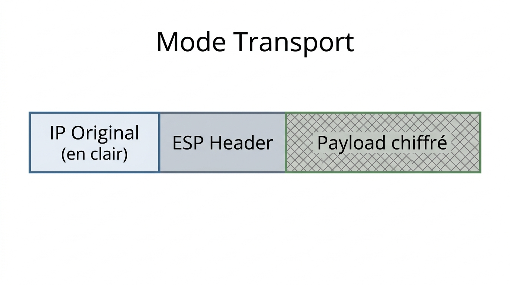
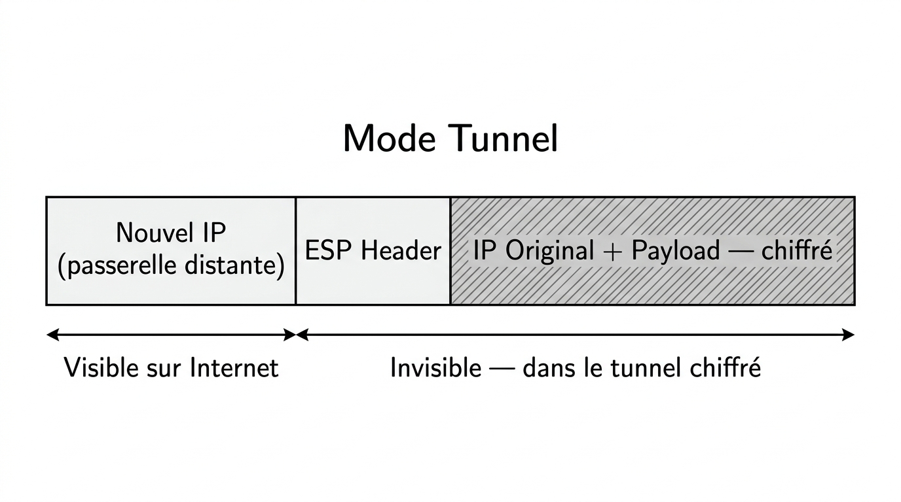
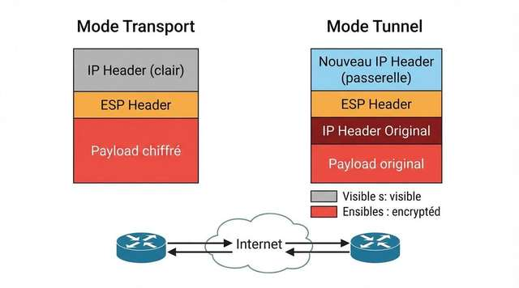
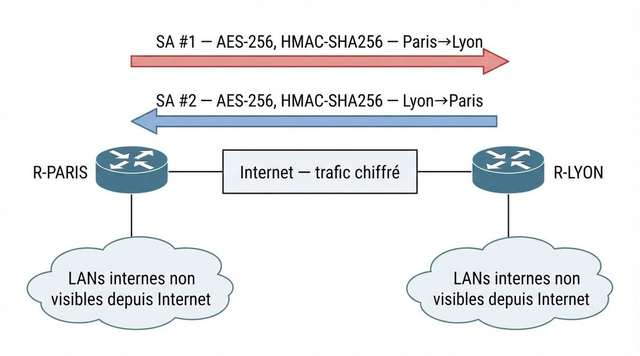
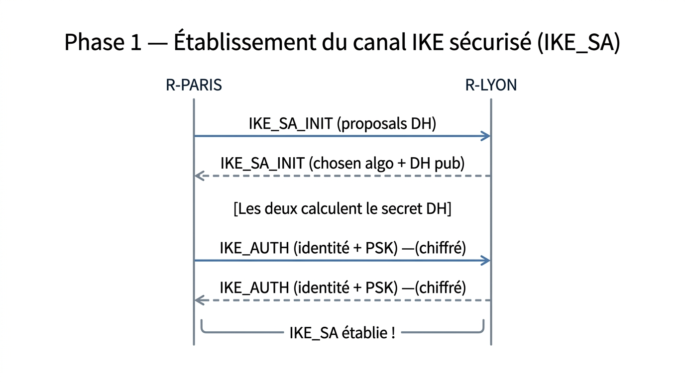
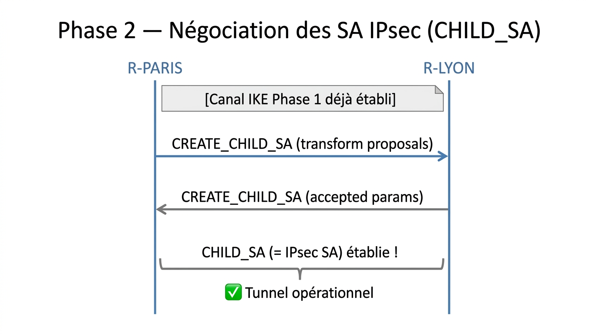
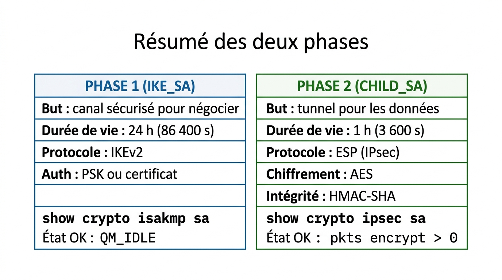
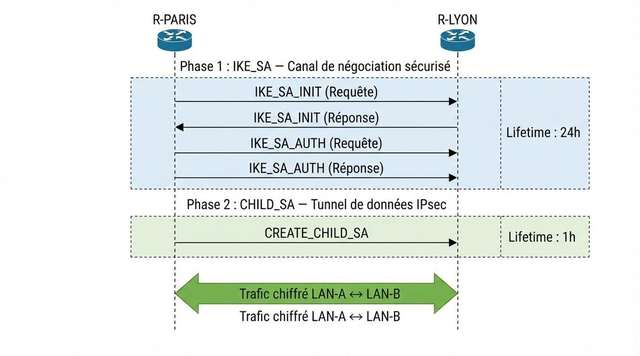
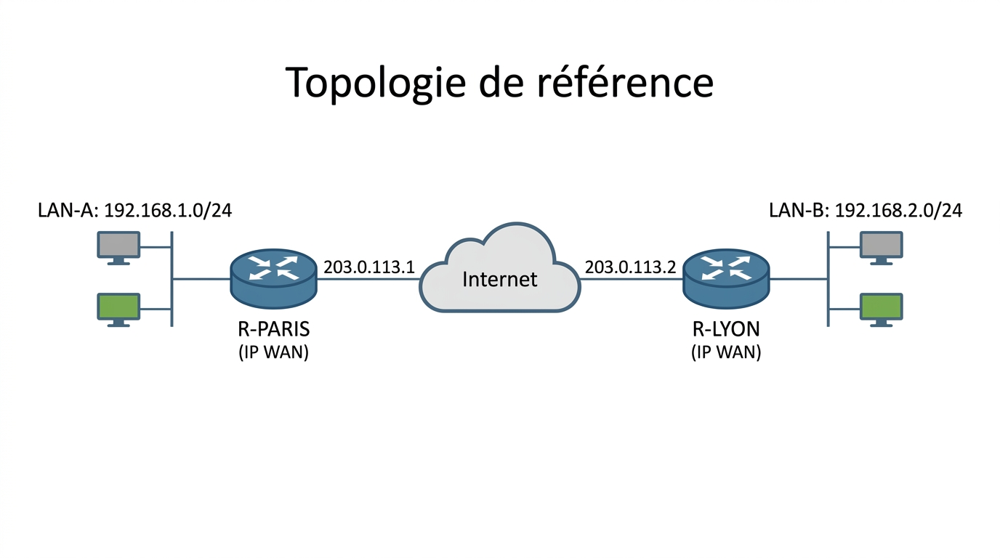
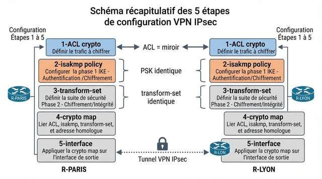

# 📖 FICHE COURS – S7 ANNÉE 2 – E31
## VPN IPsec : Modes Tunnel & Transport, SA, IKEv2, Phase 1 & 2, Config Cisco

**Nom : ________________  Prénom : ________________**

---

## 🎯 OBJECTIFS DE LA SÉANCE

- ✅ Définir IPsec et ses trois propriétés de sécurité
- ✅ Distinguer les modes tunnel et transport
- ✅ Comprendre SA, IKEv2, Phase 1 et Phase 2
- ✅ Configurer un VPN IPsec site-à-site en 5 étapes sur Cisco IOS
- ✅ Vérifier avec `show crypto isakmp sa` et `show crypto ipsec sa`

---

## 1️⃣ QU'EST-CE QU'UN VPN IPSEC ?

### Définition

> Un **VPN IPsec** (Virtual Private Network / Internet Protocol Security) est un tunnel chiffré établi entre deux équipements réseau (routeurs, firewalls) via un réseau public (Internet). Il garantit que les données qui traversent Internet sont **illisibles, intactes et authentifiées**.

### Les trois propriétés de sécurité

| **Propriété** | **Définition** | **Mécanisme IPsec** |
|---|---|---|
| **Confidentialité** | Personne ne peut lire les données en transit | Chiffrement **AES** (128 ou 256 bits) |
| **Intégrité** | Personne ne peut modifier les données sans que ça se détecte | Code **HMAC-SHA** (256 ou 384) |
| **Authenticité** | On est certain de parler au bon équipement distant | Clé pré-partagée **PSK** ou certificat PKI |

### Protocoles IPsec

| **Protocole** | **Rôle** | **Chiffre les données ?** | **Authentifie le header ?** |
|---|---|---|---|
| **AH** (Authentication Header) | Intégrité + authenticité | ❌ Non | ✅ Oui (inclut IP externe) |
| **ESP** (Encapsulating Security Payload) | Confidentialité + intégrité + authenticité | ✅ Oui | ✅ Partiel (IP externe non incluse) |

> 💡 **En pratique** : on utilise presque toujours **ESP** car il chiffre les données. AH seul ne chiffre pas et est peu utilisé en production.

---

## 2️⃣ MODES : TUNNEL ET TRANSPORT

### Mode Transport

> Le **mode transport** chiffre uniquement le **payload** (données de couche 4 et au-dessus). L'en-tête IP original est conservé en clair.



??? note "🔤 Schéma texte original"
    ```
    ┌─────────────────────────────────────────────────┐
    │  IP Original  │  ESP Header  │  [Payload chiffré]│
    │  (en clair)   │              │                   │
    └─────────────────────────────────────────────────┘
    ```


**Usage :** communication sécurisée entre deux **hôtes** qui se connaissent directement (end-to-end). Exemple : poste de travail → serveur dans le même réseau avec besoin de sécurité.

---

### Mode Tunnel

> Le **mode tunnel** encapsule **l'intégralité du paquet IP original** dans un nouveau paquet IP avec un nouvel en-tête. L'adresse de destination visible est le routeur distant, pas l'hôte final.



??? note "🔤 Schéma texte original"
    ```
    ┌───────────────────────────────────────────────────────────────────┐
    │  Nouvel IP   │  ESP Header  │  [IP Original + Payload — chiffré]  │
    │  (passerelle │              │                                      │
    │   distante)  │              │                                      │
    └───────────────────────────────────────────────────────────────────┘
      ↑ Visible sur Internet        ↑ Invisible — dans le tunnel chiffré
    ```


**Usage :** VPN **site-à-site** entre deux routeurs (cas le plus courant). Le trafic des LANs distants semble passer par un lien direct sécurisé.

---



> **Légende :** Comparaison mode transport et mode tunnel IPsec. En mode transport, l'adresse IP source et destination originales restent visibles — un observateur sur Internet sait qui parle à qui. En mode tunnel (site-à-site), le paquet original est entièrement encapsulé : un observateur ne voit que la communication entre les deux routeurs passerelles, pas les machines internes.

---

### Tableau comparatif

| **Critère** | **Mode Transport** | **Mode Tunnel** |
|---|---|---|
| Ce qui est chiffré | Payload uniquement | Tout le paquet original |
| IP source/destination | Visible | Masquée (IP des passerelles visible) |
| Usage typique | Host-to-host | **Site-to-site** (le plus fréquent) |
| Overhead | Faible | Plus important (+20 octets minimum) |
| Cisco IOS | `mode transport` | `mode tunnel` (défaut) |

---

## 3️⃣ SECURITY ASSOCIATION (SA)

### Définition

> Une **Security Association (SA)** est un "contrat de sécurité" **unidirectionnel** entre deux équipements IPsec. Elle définit tous les paramètres utilisés pour protéger le trafic dans UNE direction.

**Une SA contient :**

| **Paramètre** | **Exemple** |
|---|---|
| Algorithme de chiffrement | AES-256 |
| Algorithme d'intégrité | HMAC-SHA-256 |
| Clés (dérivées du DH) | [Générées lors de la négociation] |
| Durée de vie | 3 600 s (1 heure) ou 50 Mo |
| SPI (Security Parameter Index) | Identifiant unique de cette SA |
| Mode | Tunnel ou Transport |

> ⚠️ **Une SA = UNE direction.** Pour une communication bidirectionnelle Paris ↔ Lyon, il faut **DEUX SA** :
> - SA 1 : Paris → Lyon
> - SA 2 : Lyon → Paris

---



> **Légende :** Les SA sont unidirectionnelles. Un VPN IPsec opérationnel entre deux sites nécessite deux SA distinctes — une pour chaque sens de communication. Elles peuvent avoir des paramètres identiques ou différents selon la politique de sécurité.

---

## 4️⃣ IKEv2 : LA NÉGOCIATION EN DEUX PHASES

> **IKEv2** (Internet Key Exchange version 2) est le protocole qui négocie et gère les SA IPsec. Il opère en **deux phases**.

### Phase 1 — Établissement du canal IKE sécurisé (IKE_SA)

**Objectif :** Créer un canal chiffré et authentifié pour que les deux routeurs puissent négocier en sécurité.

**Ce qui se passe :**



??? note "🔤 Schéma texte original"
    ```
    R-PARIS                                      R-LYON
       │                                            │
       │── IKE_SA_INIT (proposals DH) ──────────►  │
       │◄── IKE_SA_INIT (chosen algo + DH pub) ──  │
       │                                            │
       │  [Les deux calculent le secret DH]         │
       │                                            │
       │── IKE_AUTH (identité + PSK) ─(chiffré)►   │
       │◄── IKE_AUTH (identité + PSK) ─(chiffré) ─ │
       │                                            │
       └── IKE_SA établie ! ──────────────────────┘
    ```


**Paramètres négociés en Phase 1 :**

| **Paramètre** | **Exemples de valeurs** |
|---|---|
| Algorithme de chiffrement IKE | AES-256, AES-128 |
| Algorithme d'intégrité IKE | SHA-256, SHA-384 |
| Groupe Diffie-Hellman | Group 14 (2048 bits), Group 19 (ECC 256 bits) |
| Méthode d'authentification | PSK (pré-shared key) ou RSA (certificats) |
| Durée de vie IKE_SA | 86 400 s (24 heures) |

---

### Phase 2 — Négociation des SA IPsec (CHILD_SA)

**Objectif :** Utiliser le canal sécurisé de la Phase 1 pour négocier les paramètres du tunnel de données réel.

**Ce qui se passe :**



??? note "🔤 Schéma texte original"
    ```
    R-PARIS                                      R-LYON
       │  [Canal IKE Phase 1 déjà établi]           │
       │── CREATE_CHILD_SA (transform proposals) ►  │
       │◄── CREATE_CHILD_SA (accepted params) ────  │
       │                                            │
       └── CHILD_SA (= IPsec SA) établie ! ────────┘
           ✅ Tunnel opérationnel
    ```


**Paramètres négociés en Phase 2 :**

| **Paramètre** | **Exemples de valeurs** |
|---|---|
| Protocole IPsec | ESP (Encapsulating Security Payload) |
| Algorithme de chiffrement | AES-256, AES-128 |
| Algorithme d'intégrité | HMAC-SHA-256 |
| Trafic couvert | Défini par l'ACL crypto (les réseaux à protéger) |
| Durée de vie SA | 3 600 s (1 heure) ou 50 Mo |
| Perfect Forward Secrecy (PFS) | Optionnel — nouveau DH pour chaque SA |

---

### Résumé des deux phases



??? note "🔤 Schéma texte original"
    ```
    ┌─────────────────────────────────────────────────────────────────────┐
    │  PHASE 1 (IKE_SA)                   │  PHASE 2 (CHILD_SA)           │
    │                                     │                                │
    │  But : canal sécurisé pour négocier │  But : tunnel pour les données │
    │  Durée de vie : 24 h (86 400 s)     │  Durée de vie : 1 h (3 600 s)  │
    │  Protocole : IKEv2                  │  Protocole : ESP (IPsec)        │
    │  Auth : PSK ou certificat           │  Chiffrement : AES              │
    │                                     │  Intégrité : HMAC-SHA           │
    │  show crypto isakmp sa              │  show crypto ipsec sa           │
    │  État OK : QM_IDLE                  │  État OK : pkts encrypt > 0    │
    └─────────────────────────────────────────────────────────────────────┘
    ```


---



> **Légende :** IKEv2 opère en deux phases distinctes. La Phase 1 établit un canal IKE sécurisé et authentifié (IKE_SA, durée de vie 24h) qui est utilisé pour la Phase 2. La Phase 2 négocie les SA IPsec réelles (CHILD_SA, durée de vie 1h) qui protègeront le trafic des LANs. La Phase 1 est renégociée moins souvent que la Phase 2.

---

## 5️⃣ ALGORITHMES ET PARAMÈTRES CRYPTOGRAPHIQUES

### Groupes Diffie-Hellman

| **Groupe DH** | **Longueur clé** | **Recommandé ?** |
|---|---|---|
| Group 1 | 768 bits | ❌ Déprécié (trop faible) |
| Group 2 | 1 024 bits | ❌ Déprécié |
| **Group 14** | 2 048 bits | ✅ Minimum recommandé |
| **Group 19** | ECC 256 bits | ✅✅ Recommandé moderne |
| **Group 20** | ECC 384 bits | ✅✅ Haute sécurité |

### Algorithmes de chiffrement

| **Algorithme** | **Taille clé** | **Recommandé ?** |
|---|---|---|
| 3DES | 168 bits | ❌ Déprécié |
| **AES-128** | 128 bits | ✅ Acceptable |
| **AES-256** | 256 bits | ✅✅ Recommandé |

### Algorithmes d'intégrité (HMAC)

| **Algorithme** | **Sortie** | **Recommandé ?** |
|---|---|---|
| MD5 | 128 bits | ❌ Faible |
| SHA-1 | 160 bits | ❌ Déprécié |
| **SHA-256** | 256 bits | ✅ Standard actuel |
| **SHA-384** | 384 bits | ✅✅ Haute sécurité |

---

## 6️⃣ CONFIGURATION VPN IPsec SITE-À-SITE — 5 ÉTAPES

### Topologie de référence



??? note "🔤 Schéma texte original"
    ```
    [LAN-A: 192.168.1.0/24]                    [LAN-B: 192.168.2.0/24]
             │                                           │
         R-PARIS ── 203.0.113.1 ─ Internet ─ 203.0.113.2 ── R-LYON
         (IP WAN)                                      (IP WAN)
    ```


---

### ÉTAPE 1 — ACL Crypto (Trafic intéressant)

> L'**ACL crypto** définit quel trafic doit être protégé par le VPN. Elle est parfois appelée "interesting traffic" ACL.

```ios
! Sur R-PARIS :
ip access-list extended CRYPTO_ACL_PARIS
  permit ip 192.168.1.0 0.0.0.255  192.168.2.0 0.0.0.255
  !           ↑ Source LAN-A         ↑ Destination LAN-B

! Sur R-LYON (MIROIR de R-PARIS — source et destination inversées) :
ip access-list extended CRYPTO_ACL_LYON
  permit ip 192.168.2.0 0.0.0.255  192.168.1.0 0.0.0.255
  !           ↑ Source LAN-B         ↑ Destination LAN-A
```

> ⚠️ **RÈGLE ABSOLUE :** L'ACL crypto de R-LYON est le **miroir exact** de celle de R-PARIS. Source et destination sont **inversées**. C'est l'erreur la plus fréquente.

---

### ÉTAPE 2 — Phase 1 : Politique ISAKMP

> Configure les paramètres de la Phase 1 (IKE_SA). Le numéro de politique (ici 10) est local — il n'a pas à être identique sur les deux routeurs.

```ios
! Sur R-PARIS ET R-LYON (identiques) :
crypto isakmp policy 10
  encryption aes 256        ! Chiffrement Phase 1
  hash sha256               ! Intégrité Phase 1
  authentication pre-share  ! Méthode d'authentification : PSK
  group 14                  ! Groupe Diffie-Hellman (2048 bits)
  lifetime 86400            ! Durée de vie : 24 heures

! Clé pré-partagée (PSK) — IDENTIQUE des deux côtés
crypto isakmp key CIEL2026@Secure address 203.0.113.2  ! Sur R-PARIS → vers R-LYON
crypto isakmp key CIEL2026@Secure address 203.0.113.1  ! Sur R-LYON → vers R-PARIS
```

> ⚠️ Le mot-clé PSK doit être **strictement identique** sur les deux routeurs. Une seule majuscule différente et la Phase 1 échoue.

---

### ÉTAPE 3 — Phase 2 : Transform-Set

> Configure les algorithmes de protection des données (CHILD_SA).

```ios
! Sur R-PARIS ET R-LYON (IDENTIQUE — doit matcher) :
crypto ipsec transform-set TS_VPN esp-aes 256 esp-sha256-hmac
  mode tunnel   ! Mode tunnel (défaut) — pour site-à-site
```

| **Champ** | **Valeur** | **Signification** |
|---|---|---|
| `TS_VPN` | Nom local | Identifie ce transform-set |
| `esp-aes 256` | AES-256 | Protocole + algorithme de chiffrement |
| `esp-sha256-hmac` | HMAC-SHA-256 | Algorithme d'intégrité |
| `mode tunnel` | Tunnel | Encapsule le paquet IP complet |

---

### ÉTAPE 4 — Crypto Map

> La **crypto map** est le "chef d'orchestre" : elle relie l'ACL crypto (trafic à protéger), le transform-set (comment protéger) et le peer distant (avec qui).

```ios
! Sur R-PARIS :
crypto map CMAP_VPN 10 ipsec-isakmp
  set peer 203.0.113.2         ! IP WAN du routeur distant (R-LYON)
  set transform-set TS_VPN     ! Utiliser le transform-set défini à l'étape 3
  match address CRYPTO_ACL_PARIS ! ACL qui définit le trafic intéressant

! Sur R-LYON :
crypto map CMAP_VPN 10 ipsec-isakmp
  set peer 203.0.113.1         ! IP WAN de R-PARIS
  set transform-set TS_VPN
  match address CRYPTO_ACL_LYON
```

---

### ÉTAPE 5 — Application sur l'Interface WAN

> La crypto map doit être **appliquée sur l'interface WAN** (celle qui est côté Internet).

```ios
! Sur R-PARIS :
interface GigabitEthernet0/1     ! Interface WAN de R-PARIS
  crypto map CMAP_VPN

! Sur R-LYON :
interface GigabitEthernet0/1     ! Interface WAN de R-LYON
  crypto map CMAP_VPN
```

> 💡 **Déclenchement du tunnel :** Le VPN s'établit automatiquement dès qu'un paquet correspondant à l'ACL crypto est envoyé (ex : premier ping depuis LAN-A vers LAN-B). La Phase 1 puis la Phase 2 se négocient en quelques secondes.

---



> **Légende :** Les 5 étapes de configuration d'un VPN IPsec site-à-site sur Cisco IOS. Les éléments en vert doivent être identiques des deux côtés (PSK, transform-set). L'ACL crypto doit être un miroir (source et destination inversées). Seul le nom de la crypto map peut différer — c'est un nom local.

---

## 7️⃣ VÉRIFICATION DU VPN

### show crypto isakmp sa — Phase 1

```ios
R-PARIS# show crypto isakmp sa

IPv4 Crypto ISAKMP SA
dst             src             state          conn-id  slot
203.0.113.2     203.0.113.1     QM_IDLE           1001     0
```

| **Champ** | **Signification** |
|---|---|
| `dst` | IP du routeur distant |
| `src` | IP locale (ce routeur) |
| `state` | État de la Phase 1 |
| `QM_IDLE` | ✅ Phase 1 établie — canal IKE opérationnel |
| `MM_NO_STATE` | ❌ Phase 1 pas encore établie |

---

### show crypto ipsec sa — Phase 2

```ios
R-PARIS# show crypto ipsec sa

interface: GigabitEthernet0/1
    Crypto map tag: CMAP_VPN, local addr 203.0.113.1

   protected vrf: (none)
   local  ident (addr/mask/prot/port): (192.168.1.0/255.255.255.0/0/0)
   remote ident (addr/mask/prot/port): (192.168.2.0/255.255.255.0/0/0)
   current_peer 203.0.113.2 port 500

    #pkts encaps: 25, #pkts encrypt: 25, #pkts digest: 25
    #pkts decaps: 23, #pkts decrypt: 23, #pkts verify: 23
    #pkts send errors: 0, #recv errors: 0
```

| **Champ** | **Ce qu'il indique** |
|---|---|
| `local ident` | Réseau LAN local protégé (selon ACL crypto) |
| `remote ident` | Réseau LAN distant protégé |
| `#pkts encaps/encrypt` | Paquets envoyés **chiffrés** vers le site distant |
| `#pkts decaps/decrypt` | Paquets reçus et **déchiffrés** depuis le site distant |
| Compteurs > 0 | ✅ Phase 2 opérationnelle — trafic circule dans le tunnel |
| Compteurs = 0 | ❌ Phase 2 établie mais aucun trafic ne circule (vérifier routage + ACL) |

---

### Processus de débogage

```ios
! Si Phase 1 ne s'établit pas :
R-PARIS# debug crypto isakmp
! Chercher : "ISAKMP: No pre-shared key found" → PSK incorrecte ou non configurée
! Chercher : "ISAKMP: proposal rejected" → algorithmes incompatibles

! Si Phase 2 ne s'établit pas :
R-PARIS# debug crypto ipsec
! Chercher : "IPsec: no ACL match" → ACL crypto incorrecte

! Désactiver le debug :
R-PARIS# undebug all
```

---

## 8️⃣ TABLEAU RÉCAPITULATIF — CE QUI DOIT ÊTRE IDENTIQUE / MIROIR / LIBRE

| **Élément** | **Doit être identique ?** | **Remarque** |
|---|---|---|
| Algorithme Phase 1 (AES-256, SHA-256) | ✅ OUI | Les deux routeurs doivent proposer les mêmes algos |
| Groupe DH | ✅ OUI | group 14 des deux côtés |
| PSK | ✅ OUI | Identique à la lettre |
| Transform-set (AES-256, SHA-256, tunnel) | ✅ OUI | Doit matcher exactement |
| ACL crypto | 🔄 MIROIR | Source/destination inversées |
| Peer IP | 🔄 INVERSÉ | R-PARIS → IP de R-LYON ; R-LYON → IP de R-PARIS |
| Nom de la crypto map | 🆓 LIBRE | Nom local, pas besoin d'être identique |
| Process-ID ISAKMP policy | 🆓 LIBRE | Numéro local (10, 20...) |
| Nom ACL crypto | 🆓 LIBRE | Nom local |

---

## ✅ AUTO-ÉVALUATION

- [ ] Je sais définir IPsec et ses 3 propriétés (confidentialité, intégrité, authenticité)
- [ ] Je distingue mode tunnel (site-à-site, IP originale cachée) et mode transport (host-to-host)
- [ ] Je sais qu'une SA est unidirectionnelle → besoin de 2 SA pour une com bidirectionnelle
- [ ] Je comprends la Phase 1 (IKE_SA) : canal sécurisé pour négocier
- [ ] Je comprends la Phase 2 (CHILD_SA) : tunnel de données réel
- [ ] Je sais écrire l'ACL crypto et son miroir sur le routeur distant
- [ ] Je connais les 5 étapes de configuration IOS
- [ ] Je lis `show crypto isakmp sa` : QM_IDLE = Phase 1 OK
- [ ] Je lis `show crypto ipsec sa` : compteurs encrypt/decrypt > 0 = tunnel actif

---

## 📚 VOCABULAIRE CLEF

| **Terme** | **Définition** |
|---|---|
| **VPN** | Réseau privé virtuel — tunnel chiffré sur un réseau public |
| **IPsec** | Suite de protocoles sécurisant les communications IP (AH, ESP, IKE) |
| **ESP** | Encapsulating Security Payload — chiffrement + intégrité des données |
| **AH** | Authentication Header — intégrité uniquement, pas de chiffrement |
| **SA** | Security Association — contrat de sécurité unidirectionnel |
| **SPI** | Security Parameter Index — identifiant unique d'une SA |
| **IKEv2** | Protocole de négociation des SA IPsec (remplacement d'IKEv1) |
| **Phase 1** | Établissement du canal IKE sécurisé (IKE_SA) — durée 24h |
| **Phase 2** | Négociation des SA IPsec réelles (CHILD_SA) — durée 1h |
| **PSK** | Pre-Shared Key — clé pré-partagée pour l'authentification IKE |
| **DH** | Diffie-Hellman — protocole d'échange de clés sécurisé |
| **Transform-set** | Ensemble d'algorithmes pour Phase 2 (chiffrement + intégrité) |
| **Crypto map** | Configuration reliant ACL crypto + transform-set + peer |
| **ACL crypto** | ACL définissant le "trafic intéressant" à protéger par le VPN |
| **Trafic intéressant** | Trafic qui déclenche et voyage dans le tunnel VPN |
| **Mode tunnel** | ESP encapsule tout le paquet IP original |
| **Mode transport** | ESP ne chiffre que le payload, l'IP original reste visible |

---

## 📌 POINTS-CLÉS À RETENIR

1. IPsec = **confidentialité** (AES) + **intégrité** (HMAC-SHA) + **authenticité** (PSK/certificat)
2. **Mode tunnel** = site-à-site — encapsule tout le paquet ; **mode transport** = host-to-host
3. **SA = unidirectionnel** → 2 SA pour une com bidirectionnelle
4. **Phase 1** (IKEv2) = canal sécurisé pour négocier — état OK : **QM_IDLE**
5. **Phase 2** (IPsec SA) = tunnel de données — état OK : **#pkts encrypt > 0**
6. **ACL crypto MIROIR** sur les deux routeurs (source/dest inversées)
7. **PSK identique** des deux côtés — et **transform-set identique**
8. **5 étapes IOS** : ACL crypto → isakmp policy → transform-set → crypto map → appliquer sur interface

---

**Document – BAC PRO CIEL – A2 – E31/U31 – Version 1.0 – 2026**
