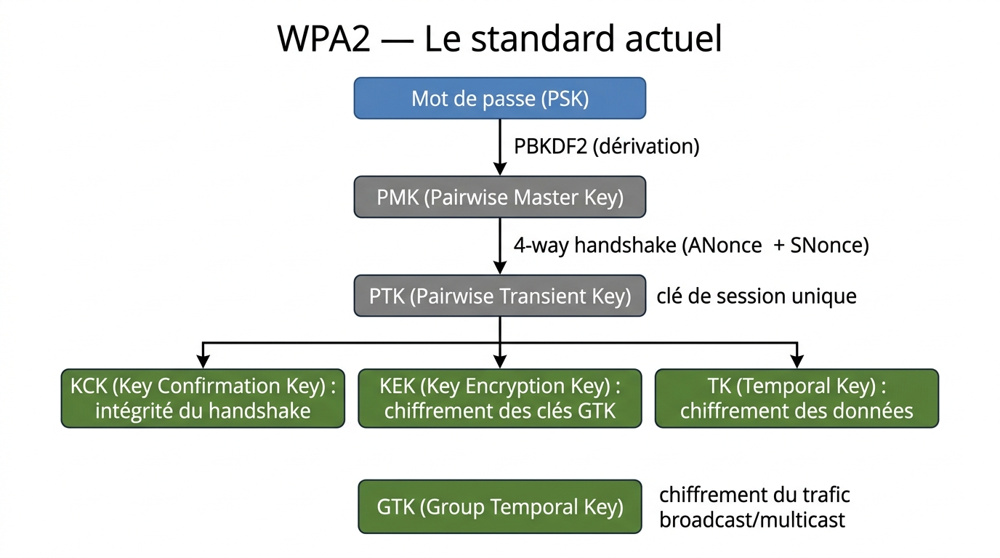
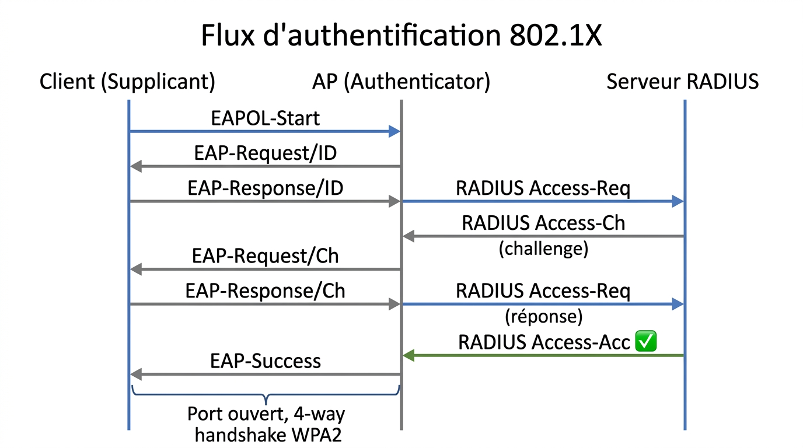

# 📖 FICHE COURS – S8 ANNÉE 2 – E31
## Sécurité Wi-Fi : WPA2/WPA3, 802.1X, RADIUS, Attaques et Contre-mesures

**Nom : ________________  Prénom : ________________**

---

## 🎯 OBJECTIFS DE LA SÉANCE

- ✅ Comprendre l'évolution WEP → WPA → WPA2 → WPA3
- ✅ Distinguer WPA2/WPA3 Personal et Enterprise
- ✅ Expliquer 802.1X : Supplicant, Authenticator, RADIUS
- ✅ Configurer un SSID sécurisé (WPA2-Personal et WPA2-Enterprise)
- ✅ Identifier les attaques Wi-Fi courantes et les contre-mesures

---

## 1️⃣ ÉVOLUTION DES PROTOCOLES DE SÉCURITÉ WI-FI

### Le contexte

> Le Wi-Fi (IEEE 802.11) diffuse les données par ondes radio — n'importe qui à portée peut théoriquement capter les trames. La sécurité consiste à **chiffrer** ces trames pour qu'elles soient illisibles sans la clé, et à **authentifier** les utilisateurs légitimes.

### Tableau comparatif complet

| **Protocole** | **Année** | **Chiffrement** | **Intégrité** | **Authentification** | **Statut** |
|---|---|---|---|---|---|
| **WEP** | 1997 | RC4 (40 ou 104 bits) | CRC-32 | Clé statique partagée | ❌ **Interdit** — cassé en < 5 min |
| **WPA** | 2003 | TKIP (RC4 amélioré) | MIC (Michael) | PSK ou 802.1X | ⚠️ Déprécié — ne plus utiliser |
| **WPA2** | 2004 | **AES-CCMP** (128 bits) | CCMP | **PSK ou 802.1X** | ✅ Standard actuel |
| **WPA3** | 2018 | **AES-GCMP-256** | GCMP | **SAE ou 802.1X-192** | ✅✅ Recommandé |

---

### WEP — Pourquoi est-il cassé ?

> WEP utilise le chiffrement **RC4** avec un vecteur d'initialisation (IV) de seulement **24 bits**. Avec un réseau chargé, les mêmes IV se répètent rapidement (après ~5 000 paquets). En analysant statistiquement les répétitions, un attaquant peut déduire la clé WEP en quelques minutes avec des outils comme **Aircrack-ng**.

**À retenir :** WEP = ne jamais utiliser, même pour "dépanner".

---

### WPA2 — Le standard actuel

> WPA2 remplace RC4 par **AES-CCMP** (Counter Mode CBC-MAC Protocol), un chiffrement symétrique robuste. Le processus d'établissement de session utilise un **4-way handshake** pour dériver des clés de session uniques à chaque connexion.

**Hiérarchie des clés WPA2 :**



??? note "🔤 Schéma texte original"
    ```
    Mot de passe (PSK)
           ↓ PBKDF2 (dérivation)
         PMK (Pairwise Master Key)
           ↓ 4-way handshake (ANonce + SNonce)
         PTK (Pairwise Transient Key) ← clé de session unique
           ├── KCK (Key Confirmation Key) : intégrité du handshake
           ├── KEK (Key Encryption Key)   : chiffrement des clés GTK
           └── TK  (Temporal Key)         : chiffrement des données

         GTK (Group Temporal Key) ← chiffrement du trafic broadcast/multicast
    ```


> 💡 **PMK** = dérivée du mot de passe (statique, la même pour tous avec le même PSK)  
> **PTK** = unique par connexion (change à chaque association) — c'est la vraie clé de session

---

📷 **[ILLUSTRATION 1]**
*Schéma du 4-way handshake WPA2. Deux colonnes : Client (gauche) et AP (droite). Quatre échanges numérotés avec flèches bidirectionnelles. Message 1 (AP → Client) : "ANonce". Message 2 (Client → AP) : "SNonce + MIC". Message 3 (AP → Client) : "GTK chiffré + MIC". Message 4 (Client → AP) : "ACK". Entre les colonnes : une boîte verte annotée "PTK = f(PMK, ANonce, SNonce, MAC_client, MAC_AP)". Une note en bas : "Capture du messages 2 → attaque dictionnaire offline possible (WPA2-Personal)". Style diagramme de séquence réseau, fond blanc.*

> **Légende :** Le 4-way handshake WPA2 dérive une clé de session PTK unique à partir de la PMK (elle-même issue du mot de passe), des nonces aléatoires et des adresses MAC. La capture du message 2 permet une attaque dictionnaire offline sur le PSK en WPA2-Personal — c'est la principale faiblesse de WPA2-Personal avec des mots de passe faibles.

---

### WPA3 — Les améliorations clés

**1. SAE (Simultaneous Authentication of Equals) — remplace PSK**

> WPA3-Personal utilise **SAE** (basé sur l'échange Dragonfly/Diffie-Hellman) pour l'authentification. Même si un attaquant capture l'échange d'authentification, il **ne peut pas** faire une attaque dictionnaire offline — chaque tentative de devinette du mot de passe nécessite une interaction réseau réelle avec l'AP.

**2. Forward Secrecy**

> Chaque session utilise une clé dérivée différente. Si un attaquant capture du trafic chiffré et découvre le mot de passe **plus tard**, il ne peut pas déchiffrer les anciens enregistrements. Chaque session passée reste protégée.

**3. Enhanced Open (OWE)**

> Sur les réseaux ouverts (sans mot de passe), WPA3 chiffre quand même le trafic via un échange DH automatique — pas d'authentification mais confidentialité garantie.

**4. Management Frame Protection (MFP) obligatoire**

> Les trames de gestion 802.11 (déauthentification, dissociation) sont désormais authentifiées — cela bloque les attaques de déauthentification forcée (utilisées pour capturer le handshake WPA2).

---

## 2️⃣ PERSONAL VS ENTERPRISE

### WPA2/WPA3 Personal (PSK / SAE)

> Une seule clé partagée pour tous les utilisateurs. Simple à déployer, mais :

| **Avantage** | **Inconvénient** |
|---|---|
| Configuration simple | Si une personne quitte → changer le mot de passe pour tous |
| Pas de serveur supplémentaire | Aucune traçabilité individuelle (qui s'est connecté quand ?) |
| Convient aux particuliers et petites structures | Partage du mot de passe incontrôlable |

**Usage :** domicile, TPE, réseaux visiteurs simples.

---

### WPA2/WPA3 Enterprise (802.1X / EAP)

> Chaque utilisateur a son **propre identifiant et mot de passe** (ou certificat). Un serveur **RADIUS** centralise les autorisations.

| **Avantage** | **Inconvénient** |
|---|---|
| Identifiant individuel → traçabilité complète | Nécessite un serveur RADIUS |
| Révocation individuelle (désactiver un compte) | Configuration plus complexe |
| Attribution de VLAN par utilisateur possible | Nécessite une PKI si EAP-TLS |
| Standard requis en entreprise et administration | — |

**Usage :** entreprises, administrations, universités, hôpitaux.

---

📷 **[ILLUSTRATION 2]**
*Comparaison visuelle Personal vs Enterprise. Deux colonnes. Gauche (Personal) : un AP avec une clé unique en centre, entouré de 5 PC tous reliés à la même clé. Annotation "1 clé = tout le monde". Droite (Enterprise) : un AP relié à un serveur RADIUS, chaque PC ayant son propre badge d'identifiant (user1, user2, user3...). Annotation "1 identifiant par personne". Style infographie pédagogique, fond blanc, couleur verte pour Enterprise (plus sécurisé).*

> **Légende :** WPA2-Personal utilise une clé partagée par tous — si un utilisateur quitte, il faut changer le mot de passe pour tout le monde. WPA2-Enterprise associe un identifiant unique à chaque utilisateur via un serveur RADIUS — on peut révoquer un accès individuel sans perturber les autres.

---

## 3️⃣ 802.1X ET EAP — AUTHENTIFICATION ENTERPRISE

### Architecture 802.1X

> **802.1X** est un standard IEEE d'authentification de port réseau. Il repose sur trois entités :

| **Entité** | **Rôle** | **Exemple** |
|---|---|---|
| **Supplicant** | Le client qui veut s'authentifier | PC, smartphone de l'employé |
| **Authenticator** | Le point d'accès — relai entre client et serveur | AP Wi-Fi, switch 802.1X |
| **Authentication Server** | Décide Accept ou Reject | Serveur **RADIUS** (FreeRADIUS, Windows NPS...) |

---

📷 **[ILLUSTRATION 3]**
*Schéma 802.1X avec trois entités disposées horizontalement. À gauche : le Supplicant (laptop avec icône "EAP"). Au centre : l'Authenticator (AP Wi-Fi avec double rôle annoté "relai EAP" et "porte bloquée avant auth"). À droite : l'Authentication Server (serveur RADIUS avec icône base de données). Protocoles annotés sur les flèches : "EAPOL (EAP over LAN)" entre Supplicant et Authenticator ; "RADIUS" entre Authenticator et Authentication Server. Une porte de couleur rouge en dessous de l'AP qui devient verte après "Access-Accept". Style diagramme réseau technique, fond blanc.*

> **Légende :** Architecture 802.1X. Le Supplicant envoie ses credentials via EAP (encapsulé dans EAPOL sur le lien sans fil). L'Authenticator (AP) relaie ces échanges au serveur RADIUS via le protocole RADIUS/UDP. Si RADIUS répond "Access-Accept", l'AP débloque le port et le client accède au réseau ; sinon "Access-Reject" maintient le port bloqué.

---

### Flux d'authentification 802.1X



??? note "🔤 Schéma texte original"
    ```
    Client (Supplicant)      AP (Authenticator)      Serveur RADIUS
           │                        │                        │
           │── EAPOL-Start ────────►│                        │
           │◄── EAP-Request/ID ─────│                        │
           │── EAP-Response/ID ────►│── RADIUS Access-Req ──►│
           │                        │◄── RADIUS Access-Ch ───│  (challenge)
           │◄── EAP-Request/Ch ─────│                        │
           │── EAP-Response/Ch ────►│── RADIUS Access-Req ──►│  (réponse)
           │                        │◄── RADIUS Access-Acc ──│  ✅
           │◄── EAP-Success ─────────│                        │
           │                        │                        │
           └── Port ouvert, 4-way handshake WPA2 ────────────┘
    ```


---

### Protocoles EAP courants

| **Protocole EAP** | **Authentification** | **Certificat client** | **Usage** |
|---|---|---|---|
| **EAP-TLS** | Certificat mutuel (client + serveur) | ✅ Obligatoire | Haute sécurité (gouvernement, finance) |
| **PEAP** | Login/mdp dans tunnel TLS | ❌ Non (serveur uniquement) | Entreprise courante (AD/LDAP) |
| **EAP-TTLS** | Login/mdp dans tunnel TLS | ❌ Non | Similaire PEAP, multi-OS |
| **EAP-FAST** | PAC (Protected Access Credential) | ❌ Non | Cisco propriétaire |

> 💡 **En pratique :** PEAP est le plus déployé car il utilise les identifiants Active Directory existants sans nécessiter de certificats sur les postes clients.

---

## 4️⃣ ATTAQUES WI-FI ET CONTRE-MESURES

### Principales attaques

| **Attaque** | **Principe** | **Impact** | **Contre-mesure** |
|---|---|---|---|
| **Evil Twin** | AP pirate avec même SSID, signal plus fort | MITM complet | WPA3 (MFP), vérification certificat serveur 802.1X |
| **PMKID Attack** | Capture d'un seul paquet du handshake → attaque dict. offline | Casse PSK faibles | PSK long et complexe ; WPA3-SAE |
| **4-way Handshake Capture** | Enregistrer le handshake lors d'une déauth forcée | Attaque dict. offline | WPA3, MFP (bloque la déauth forcée) |
| **WPS Brute Force** | PIN WPS 8 chiffres = 10^8 mais vulnérable (2×4 chiffres) | Accès réseau en < 24h | **Désactiver WPS impérativement** |
| **Deauth Flood** | Envoi massif de trames déauthentification forgées | DoS, déconnecte tous les clients | MFP (Management Frame Protection) |
| **Rogue AP** | AP non autorisé connecté physiquement au réseau | Accès réseau non sécurisé | Détection Rogue AP (WLC, WIDS) |

---

📷 **[ILLUSTRATION 4]**
*Schéma de l'attaque Evil Twin. À gauche : un AP légitime (vert) nommé "CaféWiFi" relié à Internet. À droite : un attaquant avec un laptop émettant un signal plus puissant (ondes rouges plus larges) avec le même SSID "CaféWiFi". Un smartphone client initialement connecté à l'AP légitime bascule vers l'AP pirate (flèche de connexion rouge vers le laptop attaquant). Une icône "MITM" au-dessus du laptop. Annotation : "Même SSID, signal plus fort = votre appareil bascule automatiquement". Style infographie sécurité réseau, fond blanc, rouge pour les éléments malveillants.*

> **Légende :** L'attaque Evil Twin exploite le comportement des appareils qui se reconnectent automatiquement aux SSID connus. L'attaquant crée un AP avec le même SSID et une puissance supérieure — les clients basculent automatiquement et leur trafic transite par le laptop pirate (Man-in-the-Middle). WPA3 avec MFP et l'authentification 802.1X avec vérification du certificat serveur sont les contre-mesures les plus efficaces.

---

### Contre-mesures récapitulées

| **Mesure** | **Efficacité** | **Commentaire** |
|---|---|---|
| **WPA3** | ✅✅✅ Élevée | SAE résiste aux attaques dict. offline ; MFP obligatoire |
| **WPA2-Enterprise (802.1X)** | ✅✅✅ Élevée | Authentification individuelle + vérification du serveur RADIUS |
| **PSK long et complexe** | ✅✅ Bonne | >20 caractères aléatoires rend l'attaque dict. impraticable |
| **Désactiver WPS** | ✅✅✅ Obligatoire | WPS PIN = vulnérabilité critique à éliminer |
| **MFP activé** | ✅✅ Bonne | Protège contre déauth forcée et Evil Twin basique |
| **SSID caché** | ❌ Illusoire | Le SSID apparaît dans les probe requests — aucune sécurité réelle |
| **Filtrage MAC** | ⚠️ Très limité | MAC spoofable en secondes — mesure complémentaire uniquement |
| **Isolation des clients** | ✅ Utile | Empêche les clients de se voir entre eux (réseaux invités) |

> ⚠️ **À dire clairement :** Le SSID caché et le filtrage MAC sont des **faux-semblants de sécurité**. Ils n'apportent aucune protection réelle contre un attaquant équipé. Ne jamais s'y fier comme mesure principale.

---

## 5️⃣ CONFIGURATION WI-FI SÉCURISÉE

### WPA2-Personal sur AP Cisco (Packet Tracer)

**Via interface graphique (GUI) de l'AP :**

```
AP → Config → Wireless
  SSID Name   : CIEL-SECURE
  Authentication : WPA2-PSK
  Encryption  : AES
  PSK Pass Phrase : MonMotDePasse2026!
```

**Sur le client PC (Packet Tracer) :**

```
PC → Config → Wireless
  SSID : CIEL-SECURE
  Auth : WPA2-PSK
  PSK  : MonMotDePasse2026!
```

---

### WPA2-Enterprise / 802.1X (schéma de config)

**1. Serveur RADIUS (serveur AAA dans Packet Tracer) :**

```
Services → AAA
  Client Name : AP_CISCO (nom de l'AP)
  Client IP   : IP de l'AP
  Secret      : RadiusSecret123   ← clé partagée AP ↔ RADIUS
  
  User Setup :
    Username : alice   Password : Alice2026!
    Username : bob     Password : Bob2026!
```

**2. AP (Authenticator) :**

```
AP → Config → Wireless
  SSID Name   : CIEL-ENTERPRISE
  Authentication : WPA2-Enterprise
  Encryption  : AES
  
  → Configurer l'adresse IP du serveur RADIUS
  → Configurer le secret partagé (RadiusSecret123)
```

**3. Client (Supplicant) :**

```
PC → Config → Wireless
  SSID       : CIEL-ENTERPRISE
  Auth       : WPA2-Enterprise
  Username   : alice
  Password   : Alice2026!
```

---

## 6️⃣ BILAN : CHOISIR LA BONNE SOLUTION

| **Contexte** | **Solution recommandée** |
|---|---|
| Domicile / particulier | WPA3-SAE (ou WPA2-PSK si WPA3 non dispo) |
| PME < 10 personnes, budget limité | WPA2-PSK avec mot de passe très long et complexe |
| PME / entreprise avec AD (Active Directory) | WPA2-Enterprise (PEAP) ou WPA3-Enterprise |
| Administration / hôpital / finance | WPA3-Enterprise 192-bit + EAP-TLS avec certificats |
| Réseau visiteur / invité | WPA2-PSK séparé + isolation clients + VLAN dédié |
| Site industriel / IoT | WPA2-Enterprise ou WPA3, réseau VLAN dédié séparé du SI |

---

## ✅ AUTO-ÉVALUATION

- [ ] Je sais pourquoi WEP est cassé (IV 24 bits, RC4)
- [ ] Je distingue WPA2-Personal (PSK) et WPA2-Enterprise (802.1X)
- [ ] Je connais les 3 entités 802.1X (Supplicant, Authenticator, RADIUS)
- [ ] Je sais ce que le RADIUS répond : Access-Accept ou Access-Reject
- [ ] Je comprends pourquoi WPA3-SAE résiste aux attaques dictionnaire offline
- [ ] Je sais que SSID caché et filtrage MAC ne sont pas des sécurités réelles
- [ ] Je sais configurer un SSID WPA2-Personal dans Packet Tracer
- [ ] Je connais l'attaque Evil Twin et sa contre-mesure (MFP, WPA3)
- [ ] Je sais pourquoi désactiver WPS est impératif

---

## 📚 VOCABULAIRE CLEF

| **Terme** | **Définition** |
|---|---|
| **WEP** | Wired Equivalent Privacy — premier chiffrement Wi-Fi, cassé (à ne jamais utiliser) |
| **WPA2** | Wi-Fi Protected Access 2 — chiffrement AES-CCMP, standard actuel |
| **WPA3** | Amélioration WPA2 avec SAE, Forward Secrecy et MFP obligatoire |
| **PSK** | Pre-Shared Key — mot de passe Wi-Fi partagé par tous |
| **SAE** | Simultaneous Authentication of Equals — remplacement de PSK dans WPA3 |
| **PMK** | Pairwise Master Key — clé dérivée du PSK |
| **PTK** | Pairwise Transient Key — clé de session unique dérivée du PMK + nonces |
| **4-way handshake** | Échange de 4 messages pour dériver la PTK et le GTK |
| **802.1X** | Standard IEEE d'authentification de port réseau |
| **EAP** | Extensible Authentication Protocol — protocole d'authentification extensible |
| **EAPOL** | EAP over LAN — transport d'EAP sur le lien sans fil |
| **RADIUS** | Remote Authentication Dial-In User Service — serveur d'authentification centralisé |
| **Supplicant** | Client qui s'authentifie (laptop, smartphone) |
| **Authenticator** | Point d'accès — relai entre client et RADIUS |
| **PEAP** | Protected EAP — EAP dans un tunnel TLS (login/mdp sans certif. client) |
| **EAP-TLS** | EAP avec certificat mutuel client+serveur (haute sécurité) |
| **Evil Twin** | AP pirate imitant un AP légitime pour capter le trafic |
| **MFP** | Management Frame Protection — authentification des trames de gestion 802.11 |
| **Forward Secrecy** | Garantie que la découverte de la clé actuelle ne compromet pas les sessions passées |

---

## 📌 POINTS-CLÉS À RETENIR

1. **WEP = interdit** (cassé en < 5 min) ; **WPA3 = recommandé** (SAE + Forward Secrecy)
2. **WPA2-Personal** : 1 PSK pour tous → simple mais aucune traçabilité individuelle
3. **WPA2-Enterprise** : login individuel via 802.1X + RADIUS → traçabilité + révocation
4. **802.1X** : Supplicant → Authenticator (AP, relai) → RADIUS (décide)
5. **4-way handshake** : dérive la PTK unique par session à partir du PMK
6. **Capturer le handshake WPA2** → attaque dictionnaire offline sur PSK faible
7. **WPA3-SAE** résiste à cette attaque (pas de handshake capturable offline)
8. **SSID caché + filtrage MAC = illusion de sécurité** — ne pas s'y fier
9. **Désactiver WPS impérativement** — vulnérabilité critique facilement exploitable
10. **MFP** bloque les attaques de déauth forcée (Evil Twin, Deauth Flood)

---

**Document – BAC PRO CIEL – A2 – E31/U31 – Version 1.0 – 2026**
