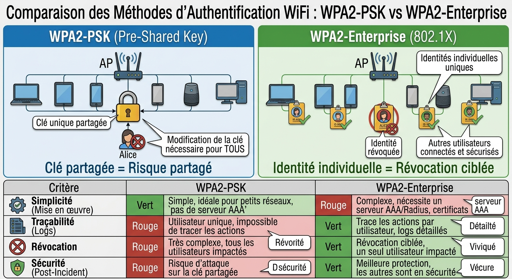
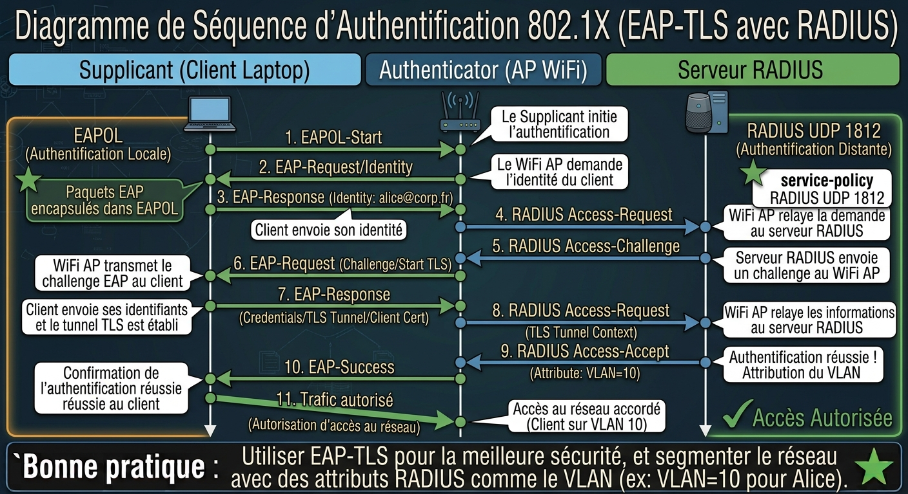
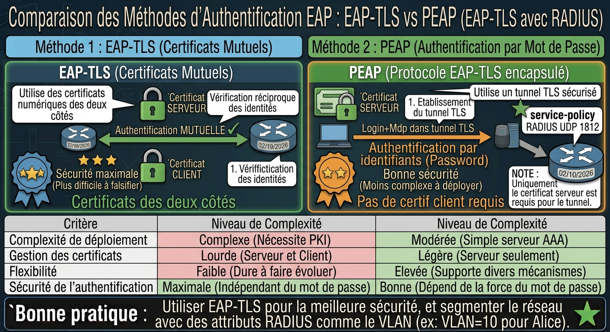
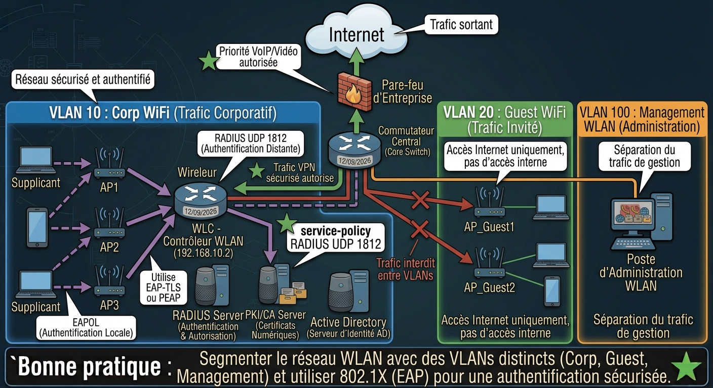
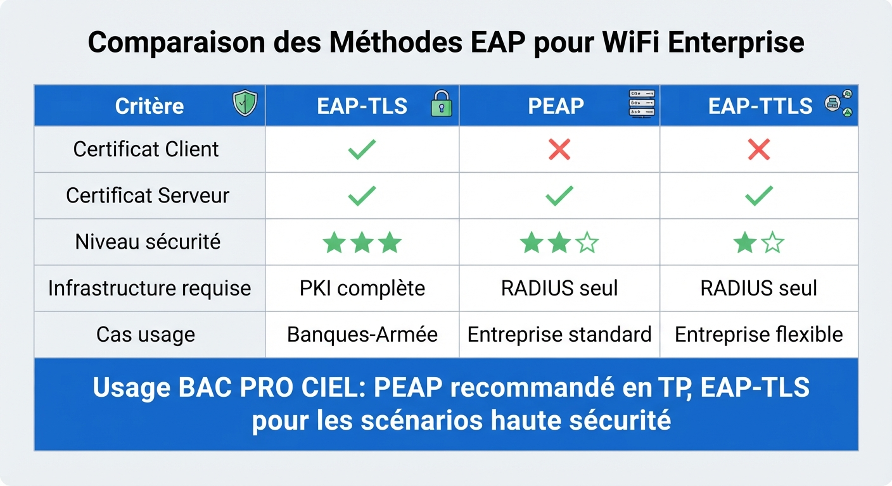

# 📘 FICHE DE COURS — S9 · 2ᵉ ANNÉE · E32
## WiFi Entreprise : 802.1X · RADIUS · EAP-TLS · Architecture WLAN sécurisée

---

> **Nom** : ___________________________
> **Date** : ___________________________
> **Compétences travaillées** : S4.1 · S4.2 · S4.3 · S4.4 · S4.5 · C2.2 · C3.2

---

## 🔑 Vocabulaire clé à maîtriser

| Terme | Définition |
|---|---|
| **802.1X** | Norme IEEE d'authentification basée sur les ports — contrôle l'accès au réseau avant toute communication |
| **AAA** | Authentication (qui es-tu ?) · Authorization (que peux-tu faire ?) · Accounting (qu'as-tu fait ?) |
| **RADIUS** | Remote Authentication Dial-In User Service — protocole AAA utilisé pour centraliser l'authentification |
| **Supplicant** | Entité qui demande l'accès réseau (PC, smartphone, laptop) |
| **Authenticator** | Équipement réseau qui filtre l'accès (borne WiFi, switch 802.1X) — relaie entre supplicant et serveur |
| **Serveur d'authentification** | Serveur RADIUS qui vérifie les credentials et décide d'autoriser ou refuser |
| **EAP** | Extensible Authentication Protocol — protocole d'authentification extensible, transporté dans RADIUS |
| **EAP-TLS** | Variante EAP utilisant des certificats mutuels (client + serveur) — méthode la plus sécurisée |
| **PEAP** | Protected EAP — tunnelise les credentials dans TLS côté serveur seulement (pas de certif client) |
| **PKI** | Public Key Infrastructure — infrastructure de gestion des certificats numériques |
| **CA** | Certificate Authority — autorité de certification qui signe et délivre les certificats |
| **Certificat X.509** | Format standard d'un certificat numérique : identité + clé publique + signature CA |
| **WPA2-Enterprise** | Mode WiFi utilisant 802.1X et EAP pour l'authentification (vs WPA2-Personal = PSK) |
| **WLC** | Wireless LAN Controller — équipement central qui gère tous les points d'accès WiFi d'une entreprise |

---

## 1️⃣ — WPA2-PSK vs WPA2-Enterprise : pourquoi changer ?

### WPA2-Personal (PSK)

Un seul mot de passe partagé entre tous les utilisateurs.

```
Avantages : Simple · Pas de serveur · Déploiement rapide
Inconvénients :
  → Si un employé part → changer le mot de passe pour TOUT LE MONDE
  → Pas de traçabilité individuelle (qui s'est connecté quand ?)
  → Mot de passe souvent faible ou partagé à l'extérieur
  → Usage : domicile, TPE, réseau invité isolé
```

### WPA2-Enterprise (802.1X)

Chaque utilisateur s'authentifie avec ses propres credentials.

```
Avantages :
  → Révocation individuelle (bloquer Alice sans impacter les autres)
  → Traçabilité complète (logs RADIUS : qui, quand, depuis où)
  → Attribution dynamique de VLAN par utilisateur ou groupe
  → Résistant aux attaques par dictionnaire (certificats ≠ mots de passe)
Inconvénients :
  → Nécessite un serveur RADIUS · PKI si EAP-TLS
  → Configuration plus complexe
  → Usage : entreprise, école, hôpital
```

---

**🖼️ ILLUSTRATION 1**
> *Légende* : Comparaison côte à côte WPA2-PSK vs WPA2-Enterprise. Gauche (PSK) : tous les appareils partagent la même clé, une croix rouge montre qu'en cas de départ d'Alice il faut tout changer. Droite (Enterprise) : chaque appareil a sa propre identité, une seule icône Alice est révoquée sans impacter les autres. En dessous, tableau 4 critères (Simplicité, Traçabilité, Révocation, Sécurité) avec rouge/vert.
>
> 

---

## 2️⃣ — Les 3 acteurs de 802.1X

### Architecture fondamentale

```
                  EAP over LAN (EAPOL)           RADIUS (UDP 1812)
  ┌────────────┐ ◄─────────────────────► ┌────────────┐ ◄──────────────────► ┌──────────────┐
  │ SUPPLICANT │                         │AUTHENTICATOR│                      │   SERVEUR    │
  │  (Laptop)  │                         │ (Borne WiFi)│                      │   RADIUS     │
  └────────────┘                         └────────────┘                      └──────────────┘
  Demande l'accès                        Filtre le trafic                    Décide : OUI / NON
  Prouve son identité                    Relaie les messages                 Vérifie les credentials
  Reçoit l'accès (ou non)               N'accorde pas lui-même l'accès      Assigne VLAN / droits
```

### Rôle détaillé de chaque acteur

**Supplicant** — l'appareil client
- Logiciel d'authentification 802.1X installé sur le poste (natif dans Windows, Linux, macOS)
- Possède les credentials : login/mot de passe OU certificat client
- Initie l'authentification dès qu'il détecte le SSID

**Authenticator** — la borne WiFi (ou le switch en 802.1X filaire)
- Bloque tout le trafic sur le port/canal tant que l'authentification n'est pas terminée
- Seuls les paquets EAP (EAPOL) passent avant authentification
- Relaie les messages entre supplicant et serveur RADIUS
- Applique la décision du serveur (ouvre le port, assigne le VLAN)

**Serveur d'authentification (RADIUS)**
- Base de données des utilisateurs (locale ou connectée à Active Directory / LDAP)
- Vérifie les credentials, valide les certificats
- Répond : Access-Accept (avec attributs VLAN) ou Access-Reject
- Journalise toutes les connexions (Accounting)

---

**🖼️ ILLUSTRATION 2**
> *Légende* : Diagramme de séquence à 3 colonnes (Supplicant / Authenticator / Serveur RADIUS). Les échanges sont représentés par des flèches horizontales numérotées : 1-EAPOL-Start, 2-EAP-Request/Identity, 3-EAP-Response/Identity, 4-RADIUS Access-Request, 5-RADIUS Access-Challenge (EAP), 6-EAP-Request (retransmis), 7-EAP-Response (credentials), 8-RADIUS Access-Request (credentials), 9-RADIUS Access-Accept + VLAN, 10-EAP-Success, 11-Trafic réseau autorisé. Protocoles annotés sur les flèches : EAPOL à gauche, RADIUS à droite.
>
> 

---

## 3️⃣ — Le protocole RADIUS : flux AAA

### Les messages RADIUS principaux

| Message | Direction | Signification |
|---|---|---|
| **Access-Request** | AP → RADIUS | "Cet utilisateur veut se connecter, voici ses credentials" |
| **Access-Challenge** | RADIUS → AP | "Demande-lui des informations supplémentaires" (ex : certificat) |
| **Access-Accept** | RADIUS → AP | "Autorisé ✓ — voici ses droits et son VLAN" |
| **Access-Reject** | RADIUS → AP | "Refusé ✗ — credentials invalides ou compte désactivé" |
| **Accounting-Request** | AP → RADIUS | "Cet utilisateur vient de se connecter / déconnecter" |

### Attributs RADIUS importants dans Access-Accept

```
Tunnel-Type       = VLAN         ← type de tunnel
Tunnel-Medium-Type = 802         ← medium Ethernet/WiFi
Tunnel-Private-Group-ID = "10"   ← numéro du VLAN à assigner

→ Le switch / AP place automatiquement le client dans VLAN 10
```

### Secret partagé AP ↔ RADIUS

> Les messages RADIUS sont chiffrés avec un **secret partagé** configuré à la fois sur l'AP et sur le serveur RADIUS.
> Ce secret n'est jamais transmis en clair — il sert à calculer un HMAC-MD5.
> Si le secret est absent ou incorrect → tous les Access-Request seront ignorés.

---

## 4️⃣ — EAP et ses variantes

### EAP : le protocole d'authentification extensible

EAP n'est pas un protocole d'authentification lui-même — c'est un **cadre** qui transporte différentes méthodes d'authentification.

```
Dans EAPOL (entre supplicant et AP) :
  EAP est transporté directement dans des trames Ethernet

Dans RADIUS (entre AP et serveur) :
  EAP est encapsulé dans des attributs RADIUS (attribut EAP-Message)
```

### Comparatif des 3 variantes principales

| Méthode | Certificat client | Certificat serveur | Sécurité | Complexité déploiement |
|---|---|---|---|---|
| **EAP-TLS** | ✅ Obligatoire | ✅ Obligatoire | ⭐⭐⭐ Maximale | ⚠️ Élevée (PKI complète) |
| **PEAP** | ❌ Non requis | ✅ Obligatoire | ⭐⭐ Bonne | ✅ Modérée |
| **EAP-TTLS** | ❌ Non requis | ✅ Obligatoire | ⭐⭐ Bonne | ✅ Modérée |

### EAP-TLS en détail

EAP-TLS réalise une **authentification mutuelle** : le serveur prouve son identité au client ET le client prouve son identité au serveur, tous deux par certificats.

```
Déroulement simplifié :
1. Le client envoie son certificat X.509 au serveur
2. Le serveur vérifie : la CA est-elle de confiance ? Le certif est-il expiré ? Révoqué ?
3. Le serveur envoie son propre certificat au client
4. Le client vérifie le certificat du serveur (même processus)
5. Si tout est valide → session TLS établie → authentification réussie
6. RADIUS envoie Access-Accept avec les attributs VLAN

Avantage clé : même si un attaquant intercepte le trafic,
il ne peut pas accéder sans son propre certificat signé par la CA de l'entreprise.
```

### PEAP en détail

PEAP est plus simple à déployer : seul le serveur RADIUS a un certificat.

```
Déroulement :
1. Tunnel TLS établi avec le certificat du SERVEUR
2. Dans ce tunnel sécurisé : le client envoie login + mot de passe (MSCHAPv2)
3. RADIUS vérifie les credentials dans Active Directory
4. Access-Accept ou Reject

Usage : entreprises qui ne veulent pas gérer une PKI complète
Limitation : si l'utilisateur accepte un faux certificat serveur → attaque MITM possible
```

---

**🖼️ ILLUSTRATION 3**
> *Légende* : Schéma comparatif EAP-TLS vs PEAP en deux colonnes. Colonne EAP-TLS : deux cadenas (un vert pour serveur, un vert pour client) reliés par une double flèche "authentification mutuelle", mention "Certif client requis (PKI complète)". Colonne PEAP : un cadenas vert (serveur seulement) et une flèche unidirectionnelle depuis le client avec "login/mdp dans tunnel TLS", mention "Certif client non requis". En bas, comparaison sécurité/complexité.
>
> 

---

## 5️⃣ — La PKI : délivrer et gérer les certificats

### Pourquoi une PKI ?

Pour que EAP-TLS fonctionne, chaque utilisateur doit posséder un **certificat numérique** signé par une autorité de confiance. La PKI est l'infrastructure qui gère ces certificats.

### Les composants d'une PKI

```
┌─────────────────────────────────────────────────────────┐
│                     PKI de l'entreprise                  │
│                                                          │
│  ┌──────────────┐   signe   ┌──────────────────────┐    │
│  │ Root CA      │ ────────► │ Certificats émis :   │    │
│  │ (autorité    │           │  - Serveur RADIUS    │    │
│  │  racine)     │           │  - Alice (certif.    │    │
│  └──────────────┘           │    client EAP-TLS)   │    │
│         │                   │  - Bob (certif.      │    │
│  confiance                  │    client EAP-TLS)   │    │
│  installée                  └──────────────────────┘    │
│  sur tous                                               │
│  les appareils                                          │
└─────────────────────────────────────────────────────────┘
```

### Structure d'un certificat X.509

| Champ | Exemple | Rôle |
|---|---|---|
| **Subject** | CN=alice, O=Corp, C=FR | Identité du titulaire |
| **Issuer** | CN=Corp-CA | Autorité qui a signé |
| **Valid From / To** | 01/01/2024 – 31/12/2024 | Période de validité |
| **Public Key** | RSA 2048 bits | Clé publique du titulaire |
| **Signature** | (signature CA) | Preuve d'authenticité |
| **Serial Number** | 0x1A2B3C | Identifiant unique |

### Révocation des certificats

> Quand un employé part, son certificat est ajouté à la **CRL** (Certificate Revocation List).
> Le serveur RADIUS consulte la CRL à chaque tentative de connexion.
> Résultat : même si l'ex-employé possède encore son certificat → refus immédiat.

---

## 6️⃣ — Architecture WLAN sécurisée d'entreprise

### Les composants de l'architecture

```
INTERNET
    │
[Pare-feu / UTM]
    │
    ├──────────────────────────────────────────────────────────┐
    │                    CŒUR DE RÉSEAU                        │
    │                                                          │
    │   [WLC]──────────────── [AP1] [AP2] [AP3]               │
    │  (Contrôleur           (Points d'accès                  │
    │   WiFi centralisé)      gérés centralement)             │
    │       │                     │                           │
    │       │              SSID "Corp-Secure" → VLAN 10       │
    │       │              SSID "Guest"        → VLAN 20      │
    │       │                                                  │
    │   [Serveur RADIUS] ←→ [Active Directory / LDAP]         │
    │   [Serveur PKI / CA]                                    │
    │                                                          │
    │   VLAN 10 : Utilisateurs Corp (192.168.10.0/24)        │
    │   VLAN 20 : Invités (192.168.20.0/24) — accès Internet  │
    │   VLAN 100 : Serveurs / Administration                  │
    └──────────────────────────────────────────────────────────┘
```

### Rôle du WLC (Wireless LAN Controller)

| Fonction | Sans WLC | Avec WLC |
|---|---|---|
| Configuration AP | 1 par 1 manuellement | Centrale, une seule fois |
| Mise à jour firmware | 1 par 1 | Automatique et simultanée |
| Itinérance (roaming) | Coupure lors du changement d'AP | Transparente (handoff) |
| Politiques SSID | Dupliquées sur chaque AP | Définies une fois, déployées partout |
| Surveillance | Limitée | Tableau de bord centralisé |

### Bonnes pratiques de sécurité WLAN

```
✅ SSID invité isolé dans un VLAN séparé → pas d'accès au réseau interne
✅ Désactiver la diffusion SSID (SSID hidden) pour les SSID sensibles
✅ Activer la détection des rogue AP (points d'accès non autorisés)
✅ Configurer 802.1X sur tous les switchs (pas seulement le WiFi)
✅ Limiter la puissance d'émission pour éviter la fuite du signal hors du bâtiment
✅ Logs RADIUS archivés (conformité RGPD, traçabilité)
✅ Rotation annuelle des certificats avec rappel automatique
```

---

**🖼️ ILLUSTRATION 4**
> *Légende* : Schéma d'architecture WLAN d'entreprise complet et annoté. Les éléments sont : Internet (nuage), pare-feu, WLC central, 3 AP, serveur RADIUS, CA/PKI, Active Directory. Les VLANs sont représentés par des zones colorées distinctes (bleu = VLAN 10 Corp, vert = VLAN 20 Guest, orange = VLAN 100 Mgmt). Les flux 802.1X sont indiqués par des flèches pointillées violettes. Le flux de trafic autorisé est en vert. Les noms des protocoles sont annotés sur chaque lien.
>
> 

---

**🖼️ ILLUSTRATION 5**
> *Légende* : Comparatif des 3 méthodes EAP sous forme de tableau visuel avec des colonnes colorées. Pour chaque méthode (EAP-TLS, PEAP, EAP-TTLS) : icône de certificat (présent=vert, absent=rouge) côté client et côté serveur, indicateur de niveau de sécurité en étoiles, indication de l'infrastructure requise, cas d'usage typique. En bas, une ligne "Recommandation BAC PRO CIEL" pointant vers PEAP (le plus courant en TP) avec note EAP-TLS pour les environnements haute sécurité.
>
> 

---

## 📌 Les essentiels à retenir pour l'examen

> ✅ **3 acteurs** 802.1X : supplicant (client) · authenticator (AP/switch) · serveur RADIUS
> ✅ **RADIUS** : UDP 1812 (auth) · UDP 1813 (accounting) · secret partagé AP↔RADIUS
> ✅ **Flux** : EAPOL entre supplicant et AP · RADIUS entre AP et serveur
> ✅ **EAP-TLS** = certificat CLIENT + SERVEUR → authentification mutuelle → sécurité maximale
> ✅ **PEAP** = certificat SERVEUR seulement + login/mdp dans tunnel TLS → déploiement plus simple
> ✅ **PKI/CA** : signe les certificats X.509 · révocation via CRL
> ✅ **WPA2-Enterprise** = 802.1X + RADIUS + EAP → révocation individuelle, VLAN dynamique
> ✅ Architecture WLAN : WLC + APs + RADIUS + PKI + VLANs séparés (Corp / Guest / Mgmt)

---

*Fiche de Cours — BAC PRO CIEL | E32 Cybersécurité | 2ᵉ année S9*
*Compétences : S4.1 · S4.2 · S4.3 · S4.4 · S4.5 · C2.2 · C3.2*
