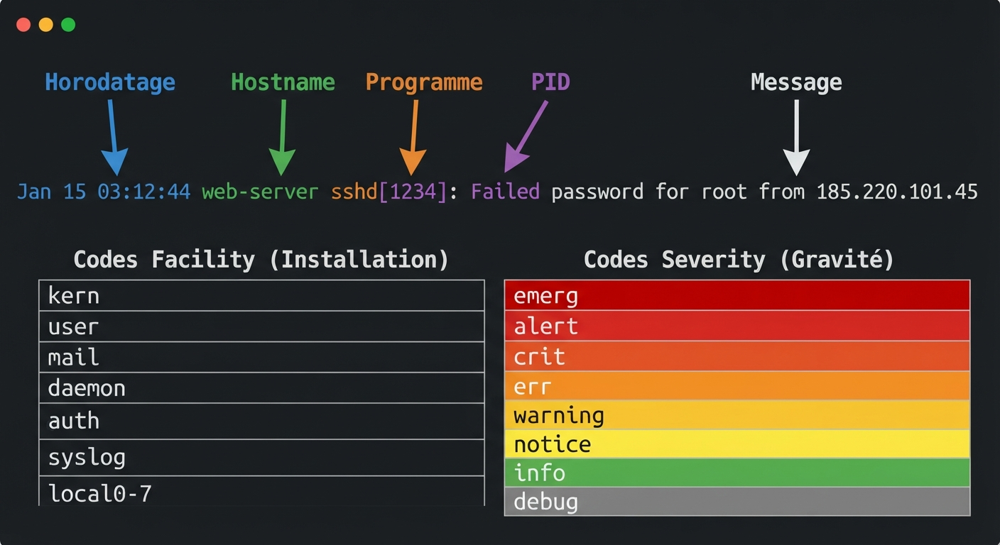
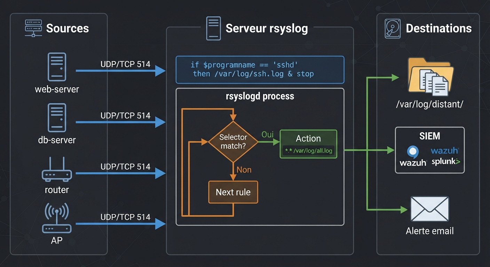
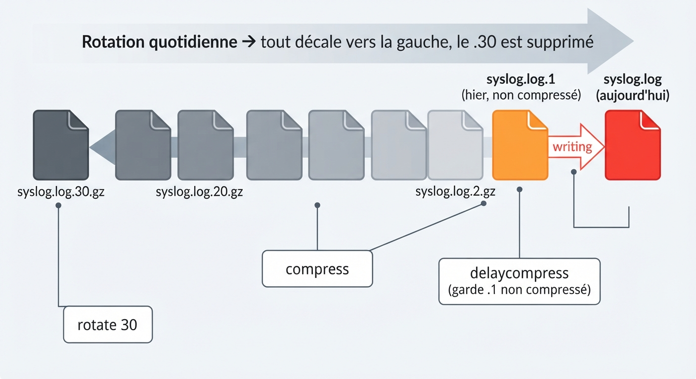
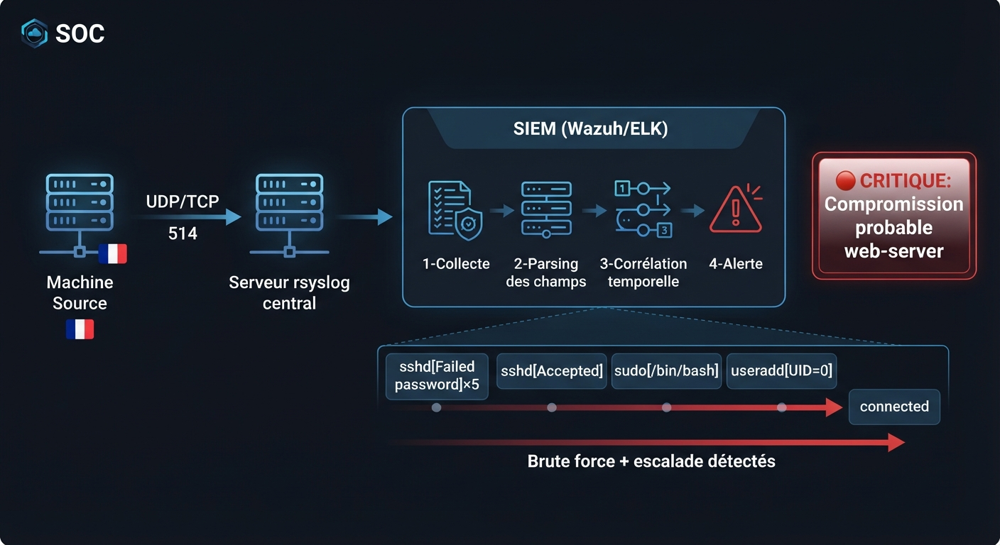
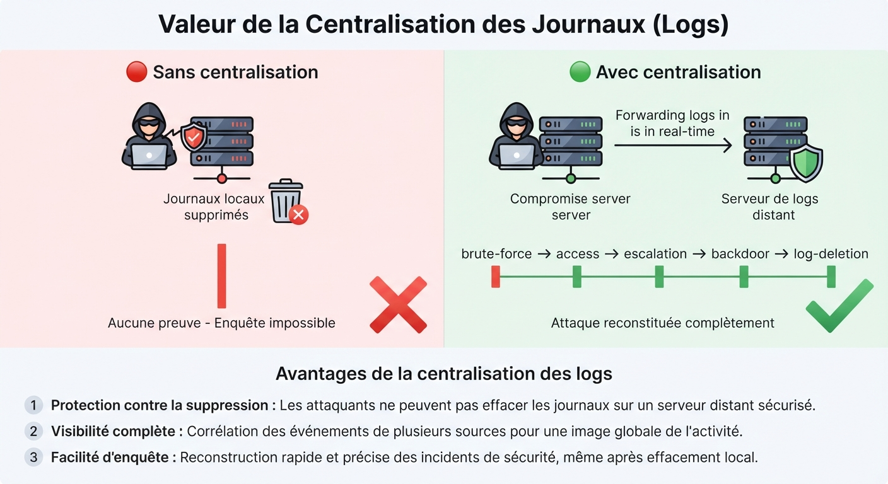

# 📘 FICHE DE COURS — S11 · 2ᵉ ANNÉE · E31
## Syslog centralisé : rsyslog · Filtres & Rules · Rotation · Corrélation SIEM

---

> **Nom** : ___________________________
> **Date** : ___________________________
> **Compétences travaillées** : S5.1 · S5.2 · S5.3 · S5.4 · S5.5 · C2.4 · C3.1

---

## 🔑 Vocabulaire clé à maîtriser

| Terme | Définition |
|---|---|
| **Syslog** | Protocole standard (RFC 5424) de journalisation des événements système — UDP ou TCP port 514 |
| **rsyslog** | Implémentation moderne et évoluée de Syslog sous Linux (remplace sysklogd) |
| **Facility** | Catégorie source du message (auth, kern, daemon, mail, local0-7…) |
| **Severity** | Niveau de gravité (0=emerg à 7=debug) |
| **Log centralisé** | Tous les équipements envoient leurs logs vers un seul serveur central |
| **Selector** | Combinaison `facility.severity` qui filtre les messages (ex : `auth.warning`) |
| **Action** | Ce qu'rsyslog fait avec le message filtré (écrire dans un fichier, envoyer à un serveur…) |
| **Template** | Modèle de formatage du message log dans rsyslog |
| **logrotate** | Outil Linux qui fait tourner (archiver/comprimer/supprimer) les fichiers de logs |
| **SIEM** | Security Information and Event Management — agrège et corrèle les logs de toutes les sources |
| **RELP** | Reliable Event Logging Protocol — transport fiable pour rsyslog (TCP + accusé de réception) |
| **Forwarding** | Envoi des logs locaux vers un serveur distant |

---

## 1️⃣ — Le protocole Syslog : format d'un message

### RFC 5424 — Anatomie d'un message Syslog

```
<34>1 2024-01-15T03:12:44Z web-server sshd 1234 - Failed password for root from 185.220.101.45
 │   │         │               │         │   │  │          │
 │   │         │               │         │   │  │          └─ Message
 │   │         │               │         │   │  └─ Structured Data (- = vide)
 │   │         │               │         │   └─ ProcID (PID du processus)
 │   │         │               │         └─ AppName (programme)
 │   │         │               └─ Hostname (machine source)
 │   │         └─ Timestamp ISO 8601
 │   └─ Version Syslog (1)
 └─ Priority = (Facility × 8) + Severity = (4 × 8) + 2 = 34
              auth (4) + crit (2)
```

### Format traditionnel BSD (le plus courant dans /var/log)

```
Jan 15 03:12:44 web-server sshd[1234]: Failed password for root from 185.220.101.45 port 52341
   │                │          │                         │
   └─ Date/heure    └─ Hostname └─ Programme[PID]        └─ Message libre
```

### Calcul de la priorité (PRI)

> `PRI = (Facility × 8) + Severity`
>
> Exemple : `auth.warning` → Facility=4, Severity=4 → PRI = (4×8)+4 = **36** → `<36>`

---

**🖼️ ILLUSTRATION 1**
> *Légende* : Schéma d'anatomie d'une ligne de log syslog avec 6 flèches annotées pointant vers chaque champ. La ligne exemple est colorée par champ : timestamp en bleu, hostname en vert, programme en orange, PID en violet, message en blanc. En dessous, le tableau Facility (kern=0, user=1, mail=2, daemon=3, auth=4…) et Severity (emerg=0, alert=1, crit=2, err=3, warning=4, notice=5, info=6, debug=7) avec code couleur de gravité (rouge→orange→jaune→vert→gris).
>
> 

---

## 2️⃣ — Architecture centralisée : serveur rsyslog

### Pourquoi centraliser ?

```
SANS centralisation :               AVEC centralisation :
  Chaque serveur garde ses logs       Tous les logs → 1 serveur central
  └─ Si compromise → logs effacés     └─ Logs préservés même si la source est compromise
  └─ Pas de vue globale               └─ Détection de patterns multi-machines
  └─ Consultation machine par machine └─ Recherche unifiée
  └─ Pas d'alerte en temps réel       └─ Alertes SIEM automatiques
```

### Architecture type

```
  ┌─────────────────┐   Syslog UDP/TCP 514   ┌─────────────────────┐
  │  Client 1       ├──────────────────────► │                     │
  │  (web-server)   │                        │  SERVEUR RSYSLOG    │
  ├─────────────────┤                        │  (log-server)       │
  │  Client 2       ├──────────────────────► │                     │
  │  (db-server)    │                        │  /var/log/distant/  │
  ├─────────────────┤                        │    web-server.log   │
  │  Client 3       ├──────────────────────► │    db-server.log    │
  │  (mail-server)  │                        │    mail-server.log  │
  └─────────────────┘                        └──────────┬──────────┘
  Équipements réseau                                    │
  (routeurs, switches, AP)                              │ Forwarding
     └───────────────────────────────────────────────►  │
                                                        ▼
                                               ┌─────────────────┐
                                               │    SIEM         │
                                               │  (Wazuh/Splunk) │
                                               └─────────────────┘
```

---

## 3️⃣ — Configuration rsyslog serveur

### Fichier principal : `/etc/rsyslog.conf`

```bash
# Activer l'écoute UDP sur le port 514
module(load="imudp")
input(type="imudp" port="514")

# Activer l'écoute TCP sur le port 514 (recommandé pour fiabilité)
module(load="imtcp")
input(type="imtcp" port="514")
```

### Séparer les logs par machine source (template)

```bash
# Définir un template : un fichier par hostname
template(name="RemoteLogs" type="string"
         string="/var/log/distant/%HOSTNAME%/%PROGRAMNAME%.log")

# Appliquer ce template pour tous les messages reçus
if $FROMHOST != "127.0.0.1" then {
    action(type="omfile" DynaFile="RemoteLogs")
    stop
}
```

> Ce template crée automatiquement :
> - `/var/log/distant/web-server/sshd.log`
> - `/var/log/distant/db-server/mysql.log`
> - etc.

---

## 4️⃣ — Configuration rsyslog client (forwarding)

### Fichier : `/etc/rsyslog.d/50-forwarding.conf`

```bash
# Envoyer TOUS les logs vers le serveur centralisé

# Via UDP (rapide, mais perte possible)
*.* @192.168.50.10:514

# Via TCP (plus fiable, garanti)
*.* @@192.168.50.10:514

# Explication de la syntaxe :
#   *.*       = tous les facility, toutes les severity
#   @         = UDP
#   @@        = TCP
#   IP:port   = destination
```

### Sélecteurs courants

```bash
# Syntaxe : facility.severity   action

auth.warning        /var/log/auth_warnings.log   # auth niveau warning et +
kern.*              /var/log/kernel.log           # tous les messages kernel
*.emerg             /dev/console                  # urgences sur la console
mail.none;auth.none /var/log/messages             # tout SAUF mail et auth
daemon.!debug       /var/log/daemons.log          # daemon SAUF debug
local7.*            @@192.168.50.10:514           # local7 vers serveur central
```

---

## 5️⃣ — Écrire des règles et filtres avancés

### Syntaxe moderne RainerScript

```bash
# Filtrer par contenu du message (mot-clé)
if $msg contains "Failed password" then {
    action(type="omfile" file="/var/log/ssh_failures.log")
    action(type="omfwd" target="192.168.50.10" port="514" protocol="tcp")
}

# Filtrer par facility ET severity (ET logique)
if $syslogfacility-text == "auth" and $syslogseverity <= 4 then {
    action(type="omfile" file="/var/log/auth_alert.log")
}

# Ignorer les messages debug inutiles
if $syslogseverity == 7 then stop

# Filtrer par nom d'hôte
if $hostname == "web-server" then {
    action(type="omfile" file="/var/log/distant/web-server.log")
}
```

### Variables rsyslog utiles

| Variable | Contenu |
|---|---|
| `$HOSTNAME` | Nom de la machine source |
| `$FROMHOST` | IP source (si distant) |
| `$PROGRAMNAME` | Nom du programme (sshd, nginx…) |
| `$msg` | Corps du message |
| `$syslogfacility-text` | Facility en texte (auth, kern…) |
| `$syslogseverity` | Severity numérique (0-7) |
| `$timereported` | Horodatage du message |

---

**🖼️ ILLUSTRATION 2**
> *Légende* : Schéma de flux rsyslog avec 3 zones. Zone gauche "Sources" : 4 machines (web, db, router, AP) avec des flèches UDP/TCP vers la zone centrale. Zone centrale "Serveur rsyslog" : boîte rsyslogd avec à l'intérieur un organigramme de filtrage (Selector → si match → Action, sinon → suivant). Zone droite "Destinations" : 3 sorties (fichiers /var/log/distant/*.log, SIEM via forwarding, alerte email). Les règles if/then sont visibles dans la zone centrale.
>
> 

---

## 6️⃣ — Rotation des logs avec logrotate

### Pourquoi la rotation ?

Sans rotation, les fichiers de logs grossissent indéfiniment → disque plein → serveur planté → plus de logs.

### Fichier de configuration : `/etc/logrotate.d/rsyslog-distant`

```bash
/var/log/distant/*/*.log {
    daily               # Rotation quotidienne
    missingok           # Ne pas échouer si le fichier n'existe pas
    rotate 30           # Conserver 30 jours d'historique
    compress            # Compresser les anciens fichiers (gzip)
    delaycompress       # Ne pas compresser le fichier de la veille (encore utilisé)
    notifempty          # Ne pas tourner si le fichier est vide
    sharedscripts       # Exécuter les scripts une seule fois même pour plusieurs fichiers
    postrotate
        /usr/lib/rsyslog/rsyslog-rotate  # Signal à rsyslog de rouvrir les fichiers
    endscript
    create 0640 syslog adm  # Créer le nouveau fichier avec ces permissions
}
```

### Commandes logrotate utiles

```bash
# Tester la config sans l'exécuter
logrotate --debug /etc/logrotate.d/rsyslog-distant

# Forcer la rotation maintenant (pour tester)
logrotate --force /etc/logrotate.d/rsyslog-distant

# Voir l'état de la rotation
cat /var/lib/logrotate/status
```

### Nommage des fichiers après rotation

```
/var/log/distant/web-server/sshd.log        ← fichier actuel (aujourd'hui)
/var/log/distant/web-server/sshd.log.1      ← hier
/var/log/distant/web-server/sshd.log.2.gz   ← avant-hier (compressé)
/var/log/distant/web-server/sshd.log.3.gz   ← ...
...
/var/log/distant/web-server/sshd.log.30.gz  ← il y a 30 jours
```

---

**🖼️ ILLUSTRATION 3**
> *Légende* : Schéma de rotation logrotate sous forme de frise chronologique. À l'extrême droite : fichier `.log` actuel (en rouge vif, en cours d'écriture). À sa gauche : `.log.1` (hier, non compressé). Plus à gauche : `.log.2.gz` à `.log.30.gz` en gris croissant (compressés, archivés). Une flèche indique "rotation quotidienne → décalage vers la gauche". En bas, les paramètres logrotate correspondants (daily/rotate 30/compress/delaycompress) sont annotés sur chaque zone.
>
> 

---

## 7️⃣ — Corrélation Syslog ↔ SIEM (lien avec S10)

### Comment rsyslog alimente le SIEM

```
Machine source
    │
    │ rsyslog client (forwarding)
    ▼
Serveur rsyslog central
    │
    │ Forwarding vers SIEM (TCP/UDP ou Beats/Filebeat)
    ▼
SIEM (Wazuh / Splunk / ELK)
    │
    ├── Parsing des champs (facility, severity, hostname, programme, message)
    ├── Enrichissement (géolocalisation IP, réputation, MITRE ATT&CK)
    ├── Corrélation (N échecs depuis la même IP en X secondes → alerte)
    └── Tableau de bord → alertes → incidents
```

### Ce que le SIEM peut détecter grâce aux logs rsyslog

| Règle de corrélation | Basée sur | Alerte générée |
|---|---|---|
| Brute force SSH | ≥5 `Failed password` depuis la même IP en < 30s | 🔴 Critique |
| Escalade de privilèges | `sudo` suivi de `COMMAND=/bin/bash` | 🔴 Critique |
| Nouveau compte root | `useradd` avec `UID=0` | 🔴 Critique |
| Connexion hors horaires | `Accepted` entre 0h et 6h | 🟠 Warning |
| Erreurs répétées applicatives | `err` ou `crit` depuis le même programme | 🟡 Attention |
| Suppression de logs | `find /var/log -delete` dans les commandes | 🔴 Critique |

### Format JSON pour ingestion SIEM directe

```bash
# Template rsyslog → JSON (format attendu par Elasticsearch/Wazuh)
template(name="JSONFormat" type="list") {
    constant(value="{")
    constant(value="\"@timestamp\":\"")  property(name="timereported" dateFormat="rfc3339")
    constant(value="\",\"hostname\":\"") property(name="hostname")
    constant(value="\",\"program\":\"")  property(name="programname")
    constant(value="\",\"severity\":\"") property(name="syslogseverity-text")
    constant(value="\",\"facility\":\"") property(name="syslogfacility-text")
    constant(value="\",\"message\":\"")  property(name="msg" format="json")
    constant(value="\"}\n")
}
```

---

**🖼️ ILLUSTRATION 4**
> *Légende* : Schéma de la chaîne complète de surveillance : machine source → rsyslog local → serveur rsyslog central → SIEM. Au niveau SIEM : 4 étapes visuelles (Collecte → Parsing → Corrélation → Alerte). Des exemples concrets de corrélation sont montrés : un graphe de timeline avec des événements sshd[Failed x5] → [Accepted] → [sudo] → [useradd UID=0] reliés par une flèche rouge "Attaque détectée". En bas, le tableau bord SIEM avec les alertes colorées.
>
> 

---

**🖼️ ILLUSTRATION 5**
> *Légende* : Infographie comparative "Sans centralisation vs Avec centralisation". Scénario identique des deux côtés : serveur compromis, logs supprimés, attaquant repart. Colonne gauche (rouge) : logs locaux effacés, enquête impossible, timeline vide "Aucune preuve". Colonne droite (verte) : logs préservés sur le serveur central, timeline complète de l'attaque reconstituée, analyse forensique possible, attaquant identifié par son IP et ses actions. En bas : 3 avantages de la centralisation listés.
>
> 

---

## 📌 Les essentiels à retenir

> ✅ **Format Syslog** : timestamp · hostname · programme[PID] · message
> ✅ **Facility** (qui génère) + **Severity** (à quel niveau de gravité) = le sélecteur
> ✅ **Serveur rsyslog** : écoute UDP/TCP 514, reçoit les logs de tous les clients
> ✅ **Client rsyslog** : `*.* @@IP:514` envoie tout via TCP
> ✅ **Règles** : `if $msg contains "Failed password" then { action(...) }`
> ✅ **logrotate** : `daily` · `rotate 30` · `compress` · `delaycompress`
> ✅ **SIEM** reçoit les logs rsyslog → parse → corrèle → alerte
> ✅ Commandes : `logger` (test) · `rsyslogd -N1` (vérif config) · `tail -f` (suivi)

---

*Fiche de Cours — BAC PRO CIEL | E31 Administration Systèmes | 2ᵉ année S11*
*Compétences : S5.1 · S5.2 · S5.3 · S5.4 · S5.5 · C2.4 · C3.1*
