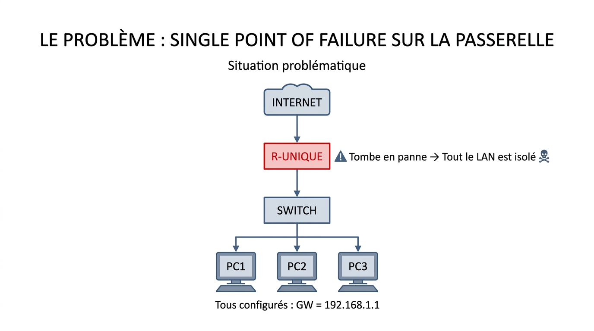
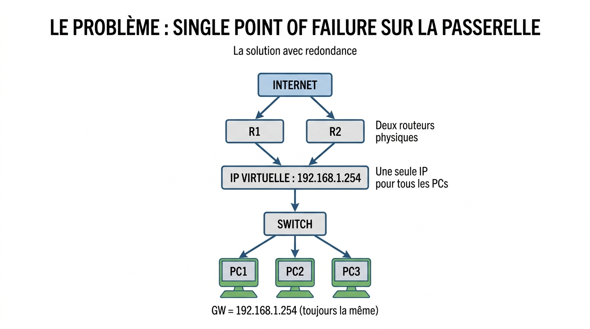
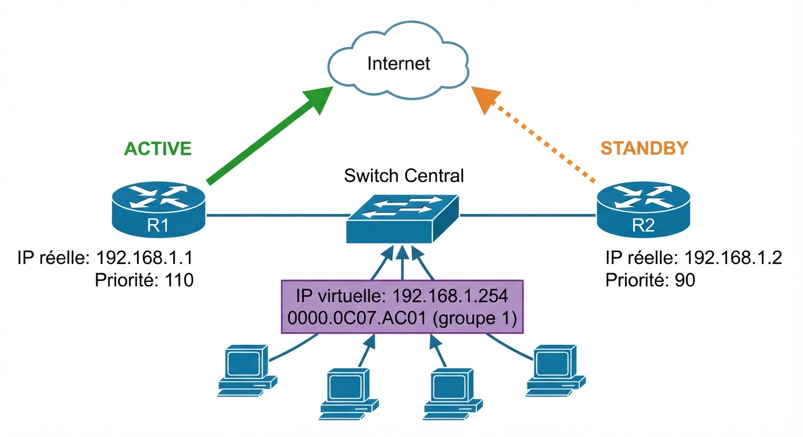
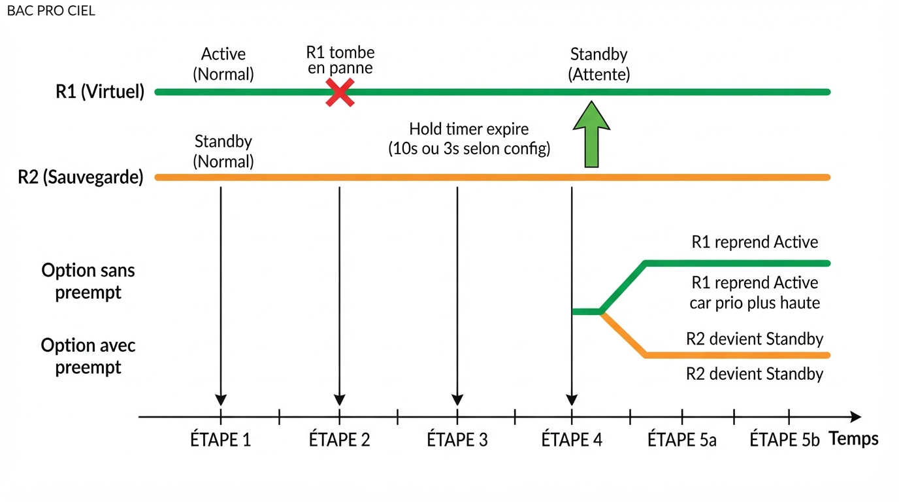
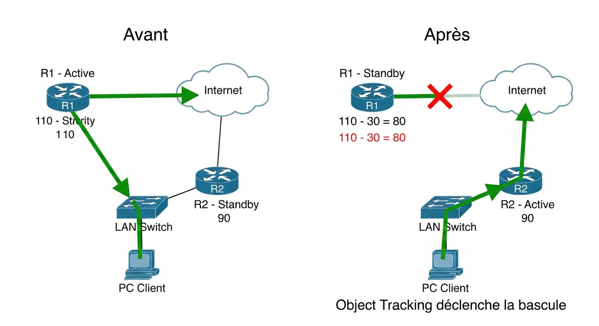

# 📖 FICHE COURS – S12 ANNÉE 2 – E31
## HSRP / VRRP : Redondance de Passerelle, Préemption, Timers, Tracking, Bascule

**Nom : ________________  Prénom : ________________**

---

## 🎯 OBJECTIFS DE LA SÉANCE

- ✅ Comprendre le problème SPOF sur la passerelle et la solution HSRP/VRRP
- ✅ Configurer HSRP (priorité, préemption, timers, tracking)
- ✅ Simuler et analyser une bascule Active → Standby
- ✅ Distinguer HSRP (Cisco) et VRRP (ouvert)
- ✅ Lire et interpréter `show standby`

---

## 1️⃣ LE PROBLÈME : SINGLE POINT OF FAILURE SUR LA PASSERELLE

> Tous les hôtes d'un LAN utilisent la même **passerelle par défaut** pour atteindre les réseaux externes. Si ce routeur unique tombe, **tout le LAN est coupé d'Internet** — aucune reconfiguration automatique n'est possible.



??? note "🔤 Schéma texte original"
    ```
    Situation problématique :
    ━━━━━━━━━━━━━━━━━━━━━━━━━━━━━━━━━━━━━━━
    INTERNET
        │
    [R-UNIQUE] ← Tombe en panne → 💀 Tout le LAN est isolé
        │
    [SWITCH]
      / | \
    PC1  PC2  PC3     ← Tous configurés : GW = 192.168.1.1
    ━━━━━━━━━━━━━━━━━━━━━━━━━━━━━━━━━━━━━━━
    ```


**Solution HSRP/VRRP :**



??? note "🔤 Schéma texte original"
    ```
    INTERNET
       / \
    [R1]  [R2]   ← Deux routeurs physiques
      \   /
       \ /
    [IP VIRTUELLE : 192.168.1.254] ← Une seule IP pour tous les PCs
        │
    [SWITCH]
      / | \
    PC1 PC2 PC3   ← GW = 192.168.1.254 (toujours la même)
    ```


> Si R1 tombe → R2 prend l'IP virtuelle automatiquement → transparence totale pour les PCs.

---

## 2️⃣ HSRP — HOT STANDBY ROUTER PROTOCOL

### Présentation

> **HSRP** est un protocole propriétaire **Cisco** (RFC 2281) qui permet à plusieurs routeurs de partager une **adresse IP virtuelle** et une **adresse MAC virtuelle**, assurant la redondance de la passerelle par défaut.

### Terminologie HSRP

| **Terme** | **Définition** |
|---|---|
| **Groupe HSRP** | Numéro identifiant un groupe de routeurs partageant la même IP virtuelle (0–255) |
| **IP virtuelle** | Adresse IP de la passerelle vue par les PCs — ne correspond à aucune interface physique |
| **MAC virtuelle** | Adresse MAC construite par HSRP : `0000.0C07.ACxx` (xx = numéro de groupe en hex) |
| **Routeur Active** | Celui qui répond effectivement aux requêtes ARP et route le trafic |
| **Routeur Standby** | Prêt à prendre le relais si l'Active disparaît |
| **Hello Timer** | Fréquence des messages HSRP hello (défaut : 3 secondes) |
| **Hold Timer** | Délai avant de déclarer un voisin mort (défaut : 10 secondes) |
| **Priorité** | Valeur 0–255 (défaut 100) — détermine qui devient Active |
| **Préemption** | Permet à un routeur de reprendre le rôle Active s'il a une priorité plus haute |

---



> **Légende :** Architecture HSRP avec deux routeurs. R1 est Active (priorité 110 > 90) et gère tout le trafic via l'IP virtuelle 192.168.1.254. R2 est Standby et surveille R1 via les messages Hello. Les PCs ne savent pas qu'il y a deux routeurs — ils voient uniquement la passerelle virtuelle.

---

### Le 4-way Handshake HSRP simplifié

```
État initial — tous deux démarrent :

  R1 et R2 envoient des messages Hello multicast (224.0.0.2)
  contenant : leur priorité, leur IP, leur état actuel

  Comparaison des priorités :
    R1 (110) > R2 (90) → R1 devient ACTIVE
    R2 reste STANDBY

  États de la machine d'états HSRP :
  INITIAL → LEARN → LISTEN → SPEAK → STANDBY → ACTIVE
```

### États HSRP

| **État** | **Signification** |
|---|---|
| **Initial** | HSRP non encore démarré |
| **Learn** | Attend de découvrir l'IP virtuelle |
| **Listen** | Connaît l'IP virtuelle, surveille les hellos |
| **Speak** | Participe à l'élection, envoie des hellos |
| **Standby** | Prêt à prendre le relais, envoie des hellos |
| **Active** | Route le trafic, répond aux ARP de l'IP virtuelle |

---

## 3️⃣ CONFIGURATION HSRP SUR CISCO IOS

### Syntaxe de base

```ios
interface GigabitEthernet0/0
  ip address <IP_RÉELLE> <MASQUE>
  standby <GROUPE> ip <IP_VIRTUELLE>
  standby <GROUPE> priority <PRIORITÉ>
  standby <GROUPE> preempt
  standby <GROUPE> timers <HELLO> <HOLD>
  no shutdown
```

### Exemple complet — Topologie 192.168.1.0/24

**Configuration R1 (futur Active) :**

```ios
R1(config)# interface GigabitEthernet0/0
R1(config-if)# ip address 192.168.1.1 255.255.255.0
R1(config-if)# standby 1 ip 192.168.1.254      ! IP virtuelle, même valeur sur R1 et R2
R1(config-if)# standby 1 priority 110           ! Supérieur au défaut (100) → sera Active
R1(config-if)# standby 1 preempt                ! R1 reprend Active s'il revient après une panne
R1(config-if)# standby 1 timers 1 3             ! Hello=1s, Hold=3s (plus réactif)
R1(config-if)# no shutdown
```

**Configuration R2 (futur Standby) :**

```ios
R2(config)# interface GigabitEthernet0/0
R2(config-if)# ip address 192.168.1.2 255.255.255.0
R2(config-if)# standby 1 ip 192.168.1.254      ! MÊME IP virtuelle que R1
R2(config-if)# standby 1 priority 90            ! Inférieur à R1 → sera Standby
R2(config-if)# standby 1 preempt                ! R2 reprend Active si R1 tombe ET R1 ne revient pas
R2(config-if)# standby 1 timers 1 3             ! Mêmes timers que R1
R2(config-if)# no shutdown
```

> ⚠️ **L'IP virtuelle doit être IDENTIQUE sur les deux routeurs** — c'est elle que les PCs utilisent comme passerelle.

---

## 4️⃣ PRIORITÉ ET PRÉEMPTION

### La priorité

> La **priorité** (0–255, défaut = 100) détermine quel routeur devient Active lors de l'élection initiale : **le plus haute priorité gagne**.

| **Priorité R1** | **Priorité R2** | **Résultat** |
|---|---|---|
| 110 | 90 | R1 = Active, R2 = Standby |
| 100 (défaut) | 100 (défaut) | Celui avec l'IP la plus haute = Active |
| 200 | 150 | R1 = Active |
| 50 | 100 | R2 = Active |

> En cas d'**égalité de priorité**, le routeur avec l'**IP réelle la plus haute** devient Active.

---

### La préemption

> La **préemption** (`standby X preempt`) permet à un routeur de **reprendre le rôle Active** s'il a une priorité plus haute que le routeur actuellement Active.

**Sans `preempt` (comportement par défaut) :**

```
Séquence :
1. R1 (prio 110) = Active, R2 (prio 90) = Standby
2. R1 tombe → R2 prend le rôle Active ✅
3. R1 revient → R1 reste Standby, R2 garde Active ❌
   (même si R1 a une priorité plus haute !)
```

**Avec `standby 1 preempt` sur R1 :**

```
Séquence :
1. R1 (prio 110) = Active, R2 (prio 90) = Standby
2. R1 tombe → R2 prend le rôle Active ✅
3. R1 revient → R1 détecte que R2 est Active mais a priorité inférieure
               → R1 reprend le rôle Active automatiquement ✅
```

> ⚠️ **Bonne pratique :** Toujours configurer `preempt` sur le routeur "principal" (priorité élevée) pour qu'il reprenne automatiquement son rôle après une panne.

---



> **Légende :** Impact de la préemption sur la récupération après panne. Sans `preempt`, même si R1 (priorité 110) revient, R2 garde le rôle Active — le réseau fonctionne mais n'est plus dans sa configuration optimale. Avec `preempt`, R1 reprend automatiquement Active dès qu'il détecte sa priorité supérieure à R2.

---

## 5️⃣ TIMERS HELLO ET HOLD

### Définition

| **Timer** | **Rôle** | **Défaut** | **Plage** |
|---|---|---|---|
| **Hello Timer** | Fréquence des messages HSRP envoyés entre voisins | **3 secondes** | 1–255 s ou msec |
| **Hold Timer** | Délai après lequel un routeur est déclaré mort si aucun hello n'est reçu | **10 secondes** | 1–255 s ou msec |

### La règle des timers

$$\boxed{\text{Hold Timer} \geq 3 \times \text{Hello Timer}}$$

> Cette règle garantit qu'un bref délai réseau ne déclenche pas une fausse bascule. Si le Hold timer est trop court par rapport au Hello timer, un seul hello manqué peut provoquer une bascule inutile.

### Calcul du délai de bascule

> Le **délai de bascule** (temps entre la panne de l'Active et le moment où Standby prend le relais) est approximativement égal au **Hold Timer**.

| **Config timers** | **Délai de bascule** | **Usage** |
|---|---|---|
| Hello=3s, Hold=10s (défaut) | ≈ 10 secondes | Réseaux classiques |
| Hello=1s, Hold=3s | ≈ 3 secondes | Réseaux sensibles |
| Hello=200ms, Hold=700ms | ≈ 0,7 seconde | Très haute disponibilité (datacenters) |

**Syntaxe :**

```ios
standby 1 timers 1 3          ! Hello=1s, Hold=3s (secondes)
standby 1 timers msec 200 700 ! Hello=200ms, Hold=700ms (millisecondes)
```

> ⚠️ Des timers trop courts (< 1 s) peuvent provoquer des instabilités sur des réseaux chargés. En production, 1s/3s est un bon compromis réactivité/stabilité.

---

## 6️⃣ OBJECT TRACKING — DÉCLENCHER LA BASCULE SUR PANNE WAN

### Le problème du tracking

> Sans tracking, HSRP détecte uniquement la panne d'une **interface LAN**. Mais que se passe-t-il si le routeur Active a son **interface WAN tombée** ? Il reste Active pour le LAN, mais ne peut plus router vers Internet → le trafic du LAN est acheminé vers lui mais ne va nulle part.

```
Scénario sans tracking :
━━━━━━━━━━━━━━━━━━━━━━━━━━━━━━━━━━━━━━━
R1 : interface WAN tombée 💀
     interface LAN toujours UP → reste Active pour HSRP
     → Tout le trafic LAN va vers R1, mais R1 ne peut pas sortir !
━━━━━━━━━━━━━━━━━━━━━━━━━━━━━━━━━━━━━━━

Solution avec tracking :
R1 : interface WAN tombe → tracking baisse la priorité de R1
     → R1 priorité 110 - 30 = 80 < R2 priorité 90
     → Si preempt sur R2 : R2 devient Active ✅
━━━━━━━━━━━━━━━━━━━━━━━━━━━━━━━━━━━━━━━
```

---

### Configuration du tracking d'interface

```ios
! Sur R1 — Tracker l'interface WAN (Gi0/1)
interface GigabitEthernet0/0           ! Interface LAN (où HSRP est configuré)
  standby 1 track GigabitEthernet0/1 30  ! Si Gi0/1 tombe → priorité HSRP - 30
```

> Le **décrément** (ici 30) est soustrait de la priorité HSRP de R1 si l'interface trackée (Gi0/1) tombe.

### Calcul pour que la bascule se produise

```
Condition pour que R2 devienne Active quand WAN de R1 tombe :

Priorité R1 après décrement < Priorité R2

Exemple :
  R1 : priorité initiale = 110, décrement = 30
  R2 : priorité = 90

  Si WAN R1 tombe : R1_prio = 110 - 30 = 80 < 90 (R2) → R2 prend Active ✅
```

> ⚠️ Si le décrement est trop petit, la bascule n'a pas lieu !
> Exemple : R1 prio=110, décrement=5 → R1 prio=105 > R2 prio=90 → R2 ne prend PAS Active.

---



> **Légende :** Sans object tracking, la panne du lien WAN de R1 ne déclenche pas de bascule HSRP — R1 reste Active mais ne peut plus router. Avec `standby 1 track Gi0/1 30`, la priorité de R1 chute de 30 points dès que son interface WAN tombe, permettant à R2 (prio 90 > prio 80 de R1) de prendre le rôle Active.

---

## 7️⃣ VÉRIFICATION — `show standby`

### Sortie type `show standby brief`

```ios
R1# show standby brief

                     P indicates configured to preempt.
                     |
Interface   Grp  Pri P State   Active          Standby         Virtual IP
Gi0/0       1    110 P Active  local           192.168.1.2     192.168.1.254
```

| **Colonne** | **Signification** |
|---|---|
| `Interface` | Interface sur laquelle HSRP est configuré |
| `Grp` | Numéro de groupe HSRP |
| `Pri` | Priorité configurée sur ce routeur |
| `P` | Lettre P présente = preempt activé |
| `State` | État actuel : Active / Standby / Listen |
| `Active` | IP ou "local" du routeur Active |
| `Standby` | IP du routeur Standby |
| `Virtual IP` | IP virtuelle partagée (passerelle des PCs) |

---

### Sortie type `show standby` (détaillée)

```ios
R1# show standby

GigabitEthernet0/0 - Group 1
  State is Active
    3 state changes, last state change 00:02:15
  Virtual IP address is 192.168.1.254
  Active virtual MAC address is 0000.0c07.ac01  ← MAC virtuelle groupe 1
    Local virtual MAC address is 0000.0c07.ac01 (v1 default)
  Hello time 1 sec, hold time 3 sec
    Next hello sent in 0.528 secs
  Preemption enabled
  Active router is local
  Standby router is 192.168.1.2, priority 90 expires in 2.160 sec
  Priority 110 (configured 110)
    Track interface GigabitEthernet0/1 state Up decrement 30
  IP redundancy name is "hsrp-Gi0/0-1" (default)
```

**Ce qu'on cherche dans cette sortie :**

| **Élément** | **Vérification** |
|---|---|
| `State is Active` | Ce routeur est bien Active ✅ |
| `Virtual IP address is 192.168.1.254` | IP virtuelle correcte ✅ |
| `Hello time 1 sec, hold time 3 sec` | Timers modifiés pris en compte ✅ |
| `Preemption enabled` | `preempt` configuré ✅ |
| `Standby router is 192.168.1.2` | R2 est bien détecté comme Standby ✅ |
| `Track interface ... state Up decrement 30` | Tracking en place, WAN toujours UP ✅ |

---

## 8️⃣ HSRP VS VRRP VS GLBP

| **Critère** | **HSRP** | **VRRP** | **GLBP** |
|---|---|---|---|
| Créateur | Cisco (propriétaire) | IETF (RFC 5798) | Cisco (propriétaire) |
| Rôle principal | Active | Master | AVG (Active VG) |
| Rôle de secours | Standby | Backup | AVF (Active VF) |
| Load balancing | ❌ Non | ❌ Non | ✅ Oui (round-robin) |
| Interopérable | ❌ Cisco seulement | ✅ Multi-constructeur | ❌ Cisco seulement |
| MAC virtuelle | `0000.0C07.ACxx` | `0000.5E00.01xx` | Variable |
| Multicast hello | 224.0.0.2 | 224.0.0.18 | 224.0.0.102 |
| Authentification | MD5 / plain | MD5 / plain | MD5 |

> **En pratique :**
> - Réseau **tout Cisco** → HSRP (intégration native, debugging aisé)
> - Réseau **multi-constructeur** (Cisco + Juniper + Fortinet…) → VRRP (obligatoire)
> - Besoin de **répartition de charge** entre deux routeurs → GLBP

---

## 9️⃣ CONFIGURATION VRRP (pour comparaison)

```ios
! Syntaxe VRRP sur Cisco IOS (très similaire à HSRP)
interface GigabitEthernet0/0
  vrrp 1 ip 192.168.1.254        ! IP virtuelle (même concept)
  vrrp 1 priority 110             ! Priorité (même logique)
  vrrp 1 preempt                  ! Préemption (même comportement)
  vrrp 1 timers advertise 1       ! Hello timer = 1 s
  no shutdown
```

> En VRRP, le terme "Master" correspond à "Active" dans HSRP. La configuration est presque identique, seul le mot-clé change (`vrrp` au lieu de `standby`).

---

## ✅ AUTO-ÉVALUATION

- [ ] Je sais expliquer le problème SPOF sur la passerelle par défaut
- [ ] Je comprends le concept d'IP virtuelle et de MAC virtuelle HSRP
- [ ] Je distingue le routeur Active et le routeur Standby
- [ ] Je configure HSRP avec IP virtuelle, priorité et preempt
- [ ] Je calcule le délai de bascule à partir des timers hello/hold
- [ ] Je sais que Hold timer ≥ 3 × Hello timer
- [ ] Je comprends le tracking d'interface et calcule si la bascule aura lieu
- [ ] Je lis `show standby brief` et `show standby` colonne par colonne
- [ ] Je distingue HSRP (Cisco) et VRRP (ouvert) — vocabulaire et MAC

---

## 📚 VOCABULAIRE CLEF

| **Terme** | **Définition** |
|---|---|
| **SPOF** | Single Point of Failure — point unique dont la panne isole le reste du réseau |
| **FHRP** | First Hop Redundancy Protocol — famille de protocoles (HSRP, VRRP, GLBP) |
| **HSRP** | Hot Standby Router Protocol — protocole Cisco de redondance de passerelle |
| **VRRP** | Virtual Router Redundancy Protocol — standard ouvert RFC 5798 |
| **IP virtuelle** | Adresse IP partagée par le groupe HSRP, utilisée comme passerelle par les PCs |
| **MAC virtuelle** | Adresse MAC associée à l'IP virtuelle (HSRP : 0000.0C07.ACxx) |
| **Active** | Routeur qui traite effectivement le trafic en HSRP |
| **Standby** | Routeur de secours prêt à prendre le relais en HSRP |
| **Priorité** | Valeur 0–255 déterminant qui est Active (plus haute = Active) |
| **Preempt** | Permet à un routeur de reprendre Active s'il a une priorité plus haute |
| **Hello Timer** | Fréquence des messages HSRP (défaut 3 s) |
| **Hold Timer** | Délai de déclaration de mort d'un voisin (défaut 10 s = délai de bascule) |
| **Object Tracking** | Mécanisme qui baisse la priorité HSRP si une interface trackée tombe |
| **Décrement** | Valeur soustraite à la priorité lors d'un tracking event |

---

## 📌 POINTS-CLÉS À RETENIR

1. **HSRP** = redondance de passerelle, IP virtuelle partagée → transparence totale pour les PCs
2. **Active** = route le trafic ; **Standby** = surveille et attend ; **Listen** = dans le groupe mais pas élu
3. **Priorité la plus haute** = Active (défaut 100 ; configurer 110/90 pour forcer les rôles)
4. **`preempt`** = le routeur de priorité haute reprend Active après sa panne (sans preempt → ne reprend pas !)
5. **Délai de bascule** ≈ Hold Timer (défaut 10 s, optimisé à 3 s avec Hello=1/Hold=3)
6. **Hold Timer ≥ 3 × Hello Timer** pour éviter les fausses bascules
7. **Tracking** : si WAN tombe → priorité active baisse → Standby prend Active (si preempt actif sur Standby)
8. `show standby brief` : vérifier State, Virtual IP, qui est Active/Standby

---

**Document – BAC PRO CIEL – A2 – E31/U31 – Version 1.0 – 2026**
