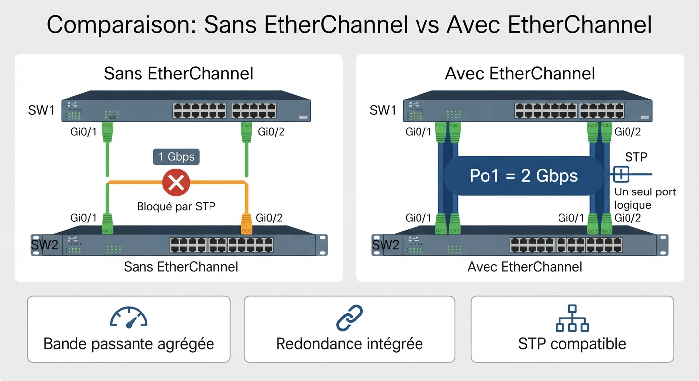
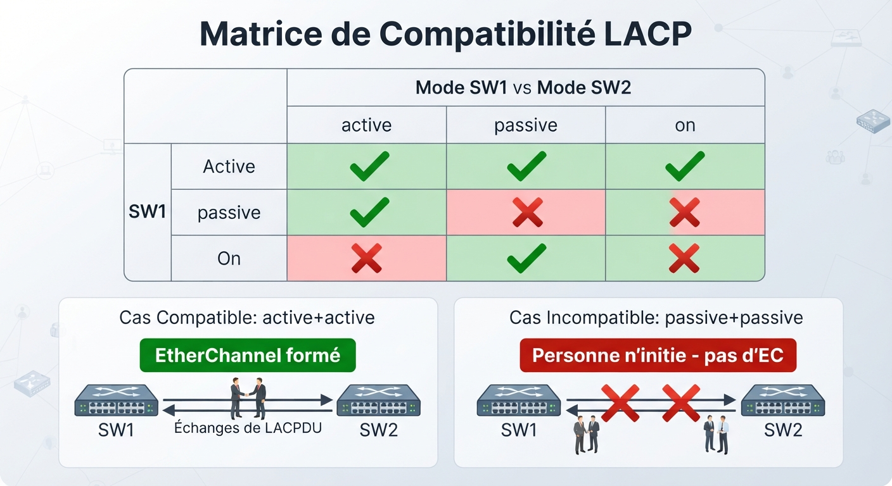
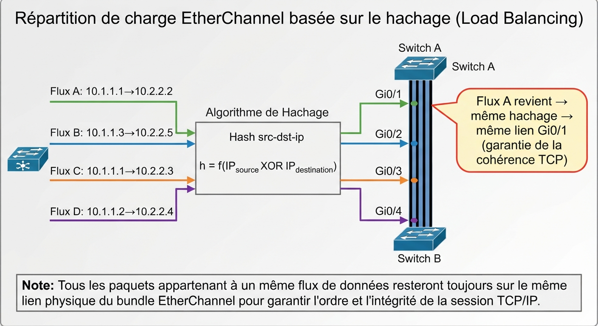
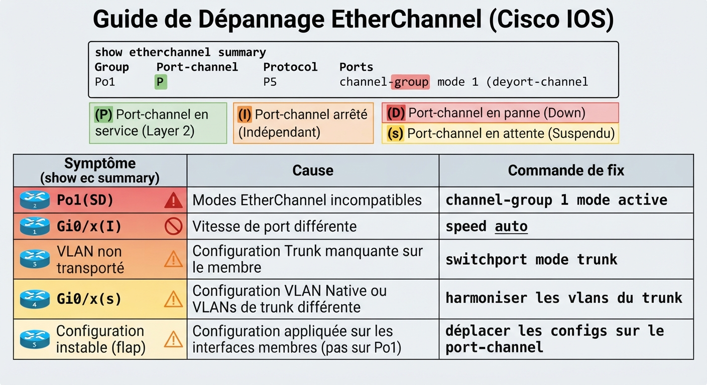
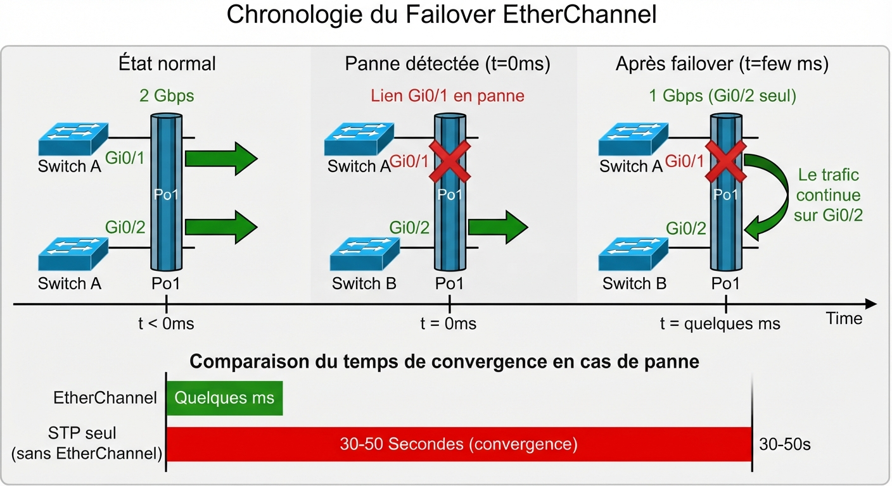

# 📘 FICHE DE COURS — S13 · 2ᵉ ANNÉE · E31
## EtherChannel LACP : Agrégation · Load balancing · Redondance · Dépannage

---

> **Nom** : ___________________________
> **Date** : ___________________________
> **Compétences travaillées** : S2.1 · S2.2 · S2.3 · C2.2 · C2.3 · C3.1

---

## 🔑 Vocabulaire clé à maîtriser

| Terme | Définition |
|---|---|
| **EtherChannel** | Technologie Cisco qui regroupe plusieurs liens physiques Ethernet en un seul lien logique |
| **Port-channel** | Interface logique créée par EtherChannel — vue comme un seul port par STP et les VLANs |
| **LACP** | Link Aggregation Control Protocol — IEEE 802.3ad, standard ouvert de négociation de l'agrégation |
| **PAgP** | Port Aggregation Protocol — propriétaire Cisco, même rôle que LACP |
| **Bundle** | Ensemble des interfaces physiques regroupées dans un port-channel |
| **Member port** | Interface physique appartenant à un port-channel |
| **Load balancing** | Répartition du trafic sur les liens membres du port-channel |
| **Hash** | Calcul déterministe qui décide sur quel lien membre un flux sera envoyé |
| **Active** | Mode LACP qui initie la négociation |
| **Passive** | Mode LACP qui répond mais n'initie pas |
| **Static (on)** | Mode sans protocole de négociation — EtherChannel forcé manuellement |
| **STP** | Spanning Tree Protocol — sans EtherChannel, STP bloquerait les liens redondants |

---

## 1️⃣ — Pourquoi EtherChannel ?

### Le problème : STP bloque les liens redondants

Sans EtherChannel, si tu relies deux switches avec 2 câbles, **STP détecte une boucle et bloque l'un des liens**.

```
Sans EtherChannel :           Avec EtherChannel :
  SW1 ─── Gi0/1 ─── SW2         SW1 ═══ Po1 (Gi0/1+Gi0/2) ═══ SW2
  SW1 ─── Gi0/2 ─── SW2              (2 liens actifs simultanément)
            ↑
    STP bloque Gi0/2
    → 1 Gbps seulement
    → Gi0/2 inutile jusqu'à panne de Gi0/1
```

### Les 3 bénéfices d'EtherChannel

```
1. BANDE PASSANTE AGRÉGÉE
   4 liens × 1 Gbps = 4 Gbps de débit théorique (2 Gbps par sens en full-duplex)

2. REDONDANCE INTÉGRÉE
   Si un lien membre tombe → le trafic continue sur les autres, sans reconvergence STP

3. COMPATIBILITÉ STP
   STP voit le port-channel comme un seul lien → pas de blocage
   Le port-channel hérite de la config VLAN/trunk des membres
```

> 💡 **En pratique** : EtherChannel est utilisé partout où la bande passante et la résilience comptent — liens switch-to-switch dans un datacenter, liens switch-to-routeur en cœur de réseau, liens vers les serveurs NAS critiques.

---

**🖼️ ILLUSTRATION 1**
> *Légende* : Comparaison côte à côte en deux colonnes. Gauche "Sans EtherChannel" : SW1 et SW2 reliés par 2 câbles, Gi0/1 en vert (actif), Gi0/2 en orange avec l'icône STP Block, débit "1 Gbps". Droite "Avec EtherChannel" : SW1 et SW2 reliés par le même câble doublé mais fusionné en une bande large légendée "Po1 = 2 Gbps", les deux interfaces en vert, STP voit un seul port. En dessous, 3 avantages listés.
>
> 

---

## 2️⃣ — Les protocoles : LACP, PAgP, Static

### LACP (IEEE 802.3ad) — Le standard ouvert

LACP envoie des **PDU LACP** (LACPDU) sur chaque lien pour négocier la formation du port-channel.

| Mode | Comportement | Compatibilité |
|---|---|---|
| **active** | Envoie des LACPDU, initie la négociation | active + active ✓ ou active + passive ✓ |
| **passive** | Répond aux LACPDU, n'initie pas | passive + passive ✗ (personne n'initie) |

> ✅ **Recommandation** : configurer les deux côtés en `active` — c'est la combinaison la plus robuste.

### PAgP (Cisco propriétaire)

| Mode | Comportement |
|---|---|
| **desirable** | Équivalent de LACP active |
| **auto** | Équivalent de LACP passive |

> ⚠️ PAgP ne fonctionne **qu'entre équipements Cisco**. LACP est préféré en environnement hétérogène.

### Static (mode `on`)

```
SW1(config-if)# channel-group 1 mode on
SW2(config-if)# channel-group 1 mode on
```

> Pas de protocole de négociation — EtherChannel forcé. **Risque** : si la config est différente des deux côtés, le bundle se forme quand même → erreurs de trafic silencieuses.

### Tableau de compatibilité des modes

```
    SW1 ↓ / SW2 →   active   passive    on    desirable   auto
    active              ✓        ✓       ✗        —         —
    passive             ✓        ✗       ✗        —         —
    on                  ✗        ✗       ✓        —         —
    desirable           —        —       —        ✓         ✓
    auto                —        —       —        ✓         ✗
```

---

**🖼️ ILLUSTRATION 2**
> *Légende* : Tableau de compatibilité LACP/PAgP sous forme de matrice colorée : cases vertes = EC formé, cases rouges = EC non formé. Les lignes sont les modes de SW1, les colonnes les modes de SW2. En dessous, deux schémas de flux LACP : un avec active+active (flèches bidirectionnelles LACPDU, EC formé en vert) et un avec passive+passive (flèches bloquées, EC non formé en rouge).
>
> 

---

## 3️⃣ — Configuration EtherChannel LACP

### Séquence de configuration — 3 étapes

**Étape 1** — Sur chaque interface membre, assigner le groupe et le protocole :

```cisco
SW1(config)# interface range GigabitEthernet0/1-2
SW1(config-if-range)# channel-group 1 mode active
SW1(config-if-range)# exit
```

> La commande `channel-group 1` crée automatiquement l'interface logique `Port-channel 1`.

**Étape 2** — Configurer le port-channel (trunking, VLANs) :

```cisco
SW1(config)# interface port-channel 1
SW1(config-if)# switchport mode trunk
SW1(config-if)# switchport trunk allowed vlan 10,20,30
SW1(config-if)# exit
```

> ⚠️ **Important** : La configuration VLAN/trunk doit être faite sur le **port-channel**, pas sur les interfaces membres individuelles. Les membres héritent automatiquement.

**Étape 3** — Même configuration sur SW2 :

```cisco
SW2(config)# interface range GigabitEthernet0/1-2
SW2(config-if-range)# channel-group 1 mode active
SW2(config-if-range)# exit
SW2(config)# interface port-channel 1
SW2(config-if)# switchport mode trunk
SW2(config-if)# switchport trunk allowed vlan 10,20,30
```

### Configuration complète exemple (4 liens)

```cisco
! Sur SW1 et SW2 (identique)
interface range GigabitEthernet0/1-4
  channel-group 1 mode active
  exit

interface port-channel 1
  switchport mode trunk
  switchport trunk native vlan 1
  switchport trunk allowed vlan all
```

---

## 4️⃣ — Load balancing : comment le trafic est réparti

### Principe du hachage

EtherChannel ne fait pas du **round-robin** (paquet 1 sur lien 1, paquet 2 sur lien 2…).
Il utilise un **hash** calculé depuis les en-têtes des paquets : tous les paquets d'un même flux restent sur le même lien membre → pas de réordonnancement.

```
Flux A (IP 10.1.1.1 → 10.2.2.2) → hash → lien membre 1 (Gi0/1)
Flux B (IP 10.1.1.3 → 10.2.2.5) → hash → lien membre 2 (Gi0/2)
Flux C (IP 10.1.1.1 → 10.2.2.2) → même hash → lien membre 1 (Gi0/1) ← même flux !
```

### Méthodes de load balancing disponibles

```cisco
SW1(config)# port-channel load-balance ?
  dst-ip       Destination IP address
  dst-mac      Destination MAC address
  src-dst-ip   Source and destination IP address (RECOMMENDED)
  src-dst-mac  Source and destination MAC address
  src-ip       Source IP address
  src-mac      Source MAC address
```

| Méthode | Basé sur | Quand l'utiliser |
|---|---|---|
| `src-mac` | MAC source | Réseau L2 avec beaucoup de clients |
| `dst-mac` | MAC destination | Beaucoup de serveurs distincts |
| **`src-dst-ip`** | IP source + destination | **Recommandé** — mixte clients/serveurs |
| `src-ip` | IP source | Clients nombreux et variés |

```cisco
! Configurer le load balancing (globalement sur le switch)
SW1(config)# port-channel load-balance src-dst-ip

! Vérifier
SW1# show etherchannel load-balance
EtherChannel Load-Balancing Method: src-dst-ip
```

> 💡 **Limitation** : Si 10 clients utilisent tous la même paire source-destination IP, TOUS leurs paquets passeront par le MÊME lien → la charge n'est pas distribuée. C'est le problème du "hash polarization".

---

**🖼️ ILLUSTRATION 3**
> *Légende* : Schéma de load balancing EtherChannel avec 4 liens membres (Gi0/1 à Gi0/4). Côté gauche : 4 flux de données différents (représentés par des flèches colorées) avec leurs paires src-dst IP. Au centre : la boîte "Hash EtherChannel" avec la formule hash = f(src-IP XOR dst-IP). Côté droit : les 4 liens avec les flux distribués dessus. Un encadré montre qu'un flux identique src-dst prend toujours le même lien (cohérence pour la session TCP).
>
> 

---

## 5️⃣ — Vérification et dépannage

### Commandes de vérification essentielles

```cisco
! Vue d'ensemble — À connaître par cœur
SW1# show etherchannel summary

! Détail d'un port-channel
SW1# show etherchannel 1 detail

! État du port-channel comme interface
SW1# show interfaces port-channel 1

! Configuration appliquée sur le port-channel
SW1# show interfaces port-channel 1 trunk

! Vérifier le load balancing configuré
SW1# show etherchannel load-balance

! Vérifier les PDU LACP échangés
SW1# show lacp 1 internal
SW1# show lacp 1 neighbor
```

### Décoder `show etherchannel summary`

```
SW1# show etherchannel summary
Flags:  D - down        P - bundled in port-channel
        I - stand-alone s - suspended
        H - Hot-standby (LACP only)
        R - Layer3      S - Layer2
        U - in-use      M - not in use, minimum links not met

Group  Port-channel  Protocol    Ports
------+-------------+-----------+----------------------------
1      Po1(SU)       LACP        Gi0/1(P)  Gi0/2(P)  Gi0/3(D)  Gi0/4(I)
        │  ││                      │          │         │          │
        │  │└─ U = actif           │          │         │          └─ stand-alone (hors bundle)
        │  └── S = Layer2          └──────────┘         └─ down physique
        └─ numéro du groupe   (P) = bundled actifs
```

### Les 4 codes d'état à mémoriser

| Code | État | Cause typique | Correction |
|---|---|---|---|
| **(P)** | Bundled ✓ | — Normal — | Rien |
| **(I)** | Stand-alone | Incompatibilité vitesse/VLAN/mode | Harmoniser la config |
| **(D)** | Down | Câble déconnecté ou interface shutdown | Vérifier câble / `no shutdown` |
| **(s)** | Suspended | Config VLAN incompatible entre membres | Unifier config trunk/VLAN |

---

### Les 5 pannes les plus fréquentes

```
PANNE 1 — Modes incompatibles
  Symptôme : Po1(SD) — port-channel DOWN
  Cause    : active d'un côté, on de l'autre (jamais compatibles)
  Fix      : harmoniser les modes (active/active recommandé)

PANNE 2 — Vitesse différente sur les membres
  Symptôme : un port en (I) alors que le câble est bon
  Cause    : SW1 Gi0/4 forcé à 100Mbps, SW2 à 1Gbps
  Fix      : speed auto ou speed 1000 des deux côtés

PANNE 3 — Trunk absent sur le port-channel
  Symptôme : VLAN autre que le natif ne passe pas
  Cause    : interface po1 sans switchport mode trunk
  Fix      : SW(config-if)# switchport mode trunk

PANNE 4 — VLAN différent sur les membres
  Symptôme : port suspendu (s) dans le bundle
  Cause    : un membre en access VLAN 10, un autre en trunk
  Fix      : unifier la config (tout trunk ou tout access même VLAN)

PANNE 5 — Config sur les membres physiques au lieu du port-channel
  Symptôme : config perdue ou incohérente, trafic instable
  Cause    : VLAN configuré sur Gi0/1 au lieu de Po1
  Fix      : déplacer la config sur l'interface port-channel
```

---

**🖼️ ILLUSTRATION 4**
> *Légende* : Tableau de dépannage EtherChannel en 5 lignes, chacune avec : icône de symptôme (éclair rouge), description du symptôme dans `show etherchannel summary`, cause technique, commande de correction. Chaque ligne a une couleur de fond différente. En haut, la sortie `show etherchannel summary` type avec les codes annotés.
>
> 

---

## 6️⃣ — EtherChannel et STP : la cohabitation

### Comment STP voit EtherChannel

```
Sans EtherChannel :          Avec EtherChannel :
  STP voit 2 ports             STP voit 1 seul port (Po1)
  → détecte une boucle         → pas de boucle détectée
  → bloque l'un des 2          → les 2 liens physiques restent actifs
```

> **Résultat** : STP calcule son arbre sur le port-channel comme sur n'importe quel autre port. Si Po1 est le root port, les deux liens Gi0/1 et Gi0/2 transmettent.

### Impact d'une panne d'un membre

```
Avant panne : Po1 (Gi0/1 active + Gi0/2 active) → 2 Gbps
Gi0/1 tombe
Pendant la reconvergence : Gi0/2 continue de transmettre
Délai de reconvergence : quelques millisecondes (pas de reconvergence STP !)
Après : Po1 (Gi0/2 active seulement) → 1 Gbps

→ Pas de coupure réseau visible par les utilisateurs
→ STP n'intervient PAS (le port-channel est toujours UP)
```

---

**🖼️ ILLUSTRATION 5**
> *Légende* : Timeline de basculement EtherChannel en cas de panne. À gauche : état normal (Po1 = Gi0/1 + Gi0/2, 2 Gbps). Au milieu : instant de la panne de Gi0/1 (croix rouge, flèche indiquant "t=0 : panne Gi0/1"). À droite : nouvel état (Po1 = Gi0/2 seulement, 1 Gbps, mais service continu). En dessous, comparaison avec une panne STP classique (temps de reconvergence 30s vs EtherChannel quelques ms). Barre de temps horizontale avec les délais annotés.
>
> 

---

## 📌 Les essentiels à retenir pour l'examen

> ✅ EtherChannel = agrégation de liens → **bande passante × N** + **redondance** + **STP bypass**
> ✅ **LACP** (802.3ad, standard) : `active`+`active` ou `active`+`passive` → EC formé
> ✅ `active`+`on` → EC **non formé** (incompatible)
> ✅ **3 conditions** pour qu'un membre rejoigne le bundle : même vitesse · même duplex · même config VLAN/trunk
> ✅ Config trunk/VLAN → sur le **port-channel**, pas sur les membres individuels
> ✅ `show etherchannel summary` : (P) = actif · (I) = stand-alone · (D) = down · (s) = suspendu
> ✅ **Load balancing** : `src-dst-ip` recommandé par défaut
> ✅ En cas de panne d'un membre : **pas de reconvergence STP** → continuité de service immédiate

---

*Fiche de Cours — BAC PRO CIEL | E31 Infrastructure Réseau | 2ᵉ année S13*
*Compétences : S2.1 · S2.2 · S2.3 · C2.2 · C2.3 · C3.1*
