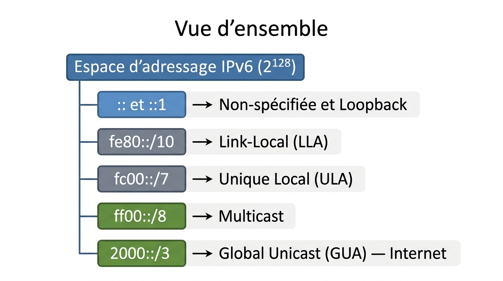
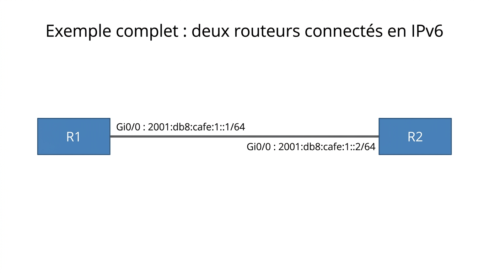

# 📖 FICHE COURS – S15 ANNÉE 2 – E31
## IPv6 : Initiation — Adressage, Notation, Types d'Adresses, Configuration Cisco

**Nom : ________________  Prénom : ________________**

---

## 🎯 OBJECTIFS DE LA PARTIE IPv6

- ✅ Comprendre pourquoi IPv6 existe (épuisement IPv4)
- ✅ Lire et écrire une adresse IPv6 en notation simplifiée (`::`)
- ✅ Identifier les types d'adresses IPv6 (GUA, LLA, ULA, multicast, loopback)
- ✅ Configurer une adresse IPv6 statique sur Cisco IOS
- ✅ Comprendre le lien avec OSPFv3 (A3)

---

## 1️⃣ POURQUOI IPv6 ?

### L'épuisement de l'espace IPv4

> **IPv4** dispose de **2³² = ~4,3 milliards** d'adresses publiques. Avec ~20 milliards d'appareils connectés en 2025 (smartphones, IoT, serveurs, réseaux d'entreprise…), le NAT pallie temporairement le manque, mais les registres régionaux (RIPE, ARIN, APNIC) n'ont plus de blocs disponibles depuis 2011–2019.

### La solution IPv6

> **IPv6** dispose de **2¹²⁸ = 340 undécillions** d'adresses (3,4 × 10³⁸). Cela représente environ **340 billions de milliards** d'adresses par millimètre carré de surface terrestre. L'épuisement est structurellement impossible.

### Tableau comparatif IPv4 / IPv6

| **Critère** | **IPv4** | **IPv6** |
|---|---|---|
| Taille de l'adresse | 32 bits | **128 bits** |
| Notation | Décimale pointée | **Hexadécimale** |
| Nombre d'adresses | ~4,3 milliards | **~3,4 × 10³⁸** |
| En-tête | Variable, complexe | Fixe, simplifié (40 octets) |
| Broadcast | ✅ Oui | ❌ Non (multicast à la place) |
| ARP | ✅ Oui | ❌ Non (NDP à la place) |
| Auto-configuration | DHCP | **SLAAC + DHCPv6** |
| IPsec | Optionnel | **Intégré au standard** |
| Fragmentation | Routeur + hôte | **Hôte uniquement** |
| Taille LAN standard | /24 (254 hôtes) | **/64 (18 × 10¹⁸ adresses)** |

---

## 2️⃣ NOTATION HEXADÉCIMALE IPv6

### Structure d'une adresse IPv6

> Une adresse IPv6 est composée de **128 bits**, représentés en **8 groupes de 4 chiffres hexadécimaux** séparés par des deux-points (`:`).

```
2001:0db8:85a3:0000:0000:8a2e:0370:7334
↑    ↑    ↑    ↑    ↑    ↑    ↑    ↑
 1    2    3    4    5    6    7    8    ← 8 groupes de 16 bits chacun
```

**Rappel hexadécimal :**

| **Hex** | 0 | 1 | 2 | 3 | 4 | 5 | 6 | 7 | 8 | 9 | A | B | C | D | E | F |
|---|---|---|---|---|---|---|---|---|---|---|---|---|---|---|---|---|
| **Déc** | 0 | 1 | 2 | 3 | 4 | 5 | 6 | 7 | 8 | 9 | 10 | 11 | 12 | 13 | 14 | 15 |

> En IPv6, les **lettres A–F sont insensibles à la casse** : `2001:db8` = `2001:DB8`. Cisco IOS utilise les minuscules.

---

### Règles de simplification — La notation `::`

> L'adresse IPv6 complète est longue à écrire. Deux règles de simplification permettent de la raccourcir.

**Règle 1 — Supprimer les zéros non significatifs** dans chaque groupe

| **Groupe complet** | **Simplifié** |
|---|---|
| `0000` | `0` |
| `00a3` | `a3` |
| `0db8` | `db8` |
| `2001` | `2001` (inchangé, pas de zéro non-significatif) |

**Règle 2 — Remplacer une suite consécutive de groupes `0000` par `::`**

> Le `::` ne peut apparaître qu'**une seule fois** dans une adresse. Il remplace la suite de zéros la plus longue.

---

📷 **[ILLUSTRATION 1]**
*Schéma en deux étapes montrant la simplification d'une adresse IPv6. Adresse complète : `2001:0db8:0000:0000:0000:0000:0000:0001`. Étape 1 (application règle 1) : `2001:db8:0:0:0:0:0:1` (zéros non-significatifs supprimés, groupes tout-zéro notés "0"). Étape 2 (application règle 2) : `2001:db8::1` (les 5 groupes de zéros consécutifs remplacés par `::`). Annotation ":: = 5 groupes de :0000: supprimés". Style schéma didactique étapes numérotées, fond blanc.*

> **Légende :** Application des deux règles de simplification IPv6. La règle 1 supprime les zéros non significatifs dans chaque groupe (0db8 → db8 ; 0000 → 0). La règle 2 remplace la séquence de groupes nuls consécutifs la plus longue par `::`. La notation finale `2001:db8::1` est lisible et non ambiguë — `::` représente exactement 5 groupes de `0000`.

---

### Exemples de simplification

| **Adresse complète** | **Après règle 1** | **Après règle 2** |
|---|---|---|
| `2001:0db8:0000:0000:0000:0000:0000:0001` | `2001:db8:0:0:0:0:0:1` | `2001:db8::1` |
| `fe80:0000:0000:0000:0212:34ff:fe56:78ab` | `fe80:0:0:0:212:34ff:fe56:78ab` | `fe80::212:34ff:fe56:78ab` |
| `0000:0000:0000:0000:0000:0000:0000:0001` | `0:0:0:0:0:0:0:1` | `::1` |
| `0000:0000:0000:0000:0000:0000:0000:0000` | — | `::` |
| `2001:0db8:0001:0000:0000:0ab0:0000:00ff` | `2001:db8:1:0:0:ab0:0:ff` | `2001:db8:1::ab0:0:ff` * |

> *Attention : `::` remplace la suite de **zéros consécutifs la plus longue**. S'il y a plusieurs séquences de même longueur, on choisit la première.

---

### Reconstruction depuis la notation simplifiée

> Pour retrouver les 128 bits depuis l'adresse simplifiée, on effectue l'opération inverse :
> 1. Compter le nombre de groupes explicites
> 2. `::` = 8 − nombre de groupes explicites groupes de `0000`

**Exemple : `2001:db8::1`**

```
Groupes explicites : 2001, db8, 1 → 3 groupes
:: remplace 8 - 3 = 5 groupes de 0000
→ 2001:0db8:0000:0000:0000:0000:0000:0001
```

---

### Les longueurs de préfixe IPv6

> Comme en IPv4 (CIDR), le préfixe IPv6 est noté `/n` indiquant le nombre de bits du réseau.

| **Préfixe** | **Usage** | **Nb d'adresses hôtes** |
|---|---|---|
| **/128** | Adresse d'un hôte unique (loopback, interface) | 1 |
| **/64** | **Standard pour un LAN** — 64 bits pour les hôtes | 18 × 10¹⁸ (18 milliards de milliards) |
| **/48** | Allocation standard pour un site enterprise | 65 536 sous-réseaux /64 |
| **/32** | Allocation FAI à grande entreprise | 65 536 blocs /48 |
| **/3** | Plage GUA (2000::/3) | — |

> 💡 **À retenir :** En IPv6, le /64 est **universel pour les LAN**. On n'utilise jamais des préfixes plus longs pour les LAN (sauf cas très spéciaux). Les 64 bits d'interface permettent l'auto-configuration EUI-64 et SLAAC.

---

## 3️⃣ TYPES D'ADRESSES IPv6

### Vue d'ensemble



??? note "🔤 Schéma texte original"
    ```
    Espace d'adressage IPv6 (2¹²⁸)
    │
    ├── :: et ::1         → Non-spécifiée et Loopback
    ├── fe80::/10         → Link-Local (LLA)
    ├── fc00::/7          → Unique Local (ULA)
    ├── ff00::/8          → Multicast
    └── 2000::/3          → Global Unicast (GUA) — Internet
    ```


---

📷 **[ILLUSTRATION 2]**
*Diagramme circulaire ou en barres représentant l'espace d'adressage IPv6. Zones colorées : une zone verte étiquetée "GUA 2000::/3 (Internet)", une zone bleue "LLA fe80::/10 (lien local)", une zone orange "ULA fc00::/7 (privé)", une zone violette "Multicast ff00::/8", une très petite zone grise "Loopback ::1 et Non-spécifié ::". Les tailles relatives des zones sont approximativement proportionnelles (GUA est la plus grande). Style diagramme infographique type camembert ou barres proportionnelles, fond blanc.*

> **Légende :** Répartition de l'espace d'adressage IPv6. La Global Unicast Address (GUA) occupe la majeure partie de l'espace utilisable (3/8 de l'espace total). Les Link-Local Addresses (LLA) et Unique Local Addresses (ULA) sont des espaces privés non routés sur Internet.

---

### GUA — Global Unicast Address

> **Équivalent IPv4 :** Adresse IP publique routable sur Internet

| **Caractéristique** | **Valeur** |
|---|---|
| Préfixe | `2000::/3` (commence par `2` ou `3`) |
| Routabilité | Internet global |
| Attribution | Registres régionaux (RIPE, ARIN…) → FAI → Entreprise |
| Exemple | `2001:db8:cafe:1::1/64` |

> **Exemple concret :** Free alloue à chaque box un préfixe `/64` ou `/56`. Votre téléphone sur votre Wi-Fi domestique peut avoir une adresse GUA (ex : `2a01:e0a:xxx:xxx::1`).

---

### LLA — Link-Local Address

> **Équivalent IPv4 :** Adresse APIPA (169.254.0.0/16) — mais en IPv6, la LLA est **obligatoire et fondamentale**

| **Caractéristique** | **Valeur** |
|---|---|
| Préfixe | `fe80::/10` |
| Routabilité | **Lien local uniquement** — jamais routée (invisible hors du segment) |
| Génération | Automatique (par l'OS/routeur) dès qu'IPv6 est activé |
| Usage | Communication entre voisins du même lien (NDP, OSPF, RA) |
| Exemple | `fe80::1`, `fe80::212:34ff:fe56:78ab` |

> ⚠️ **Important :** Même si on n'a pas d'adresse GUA, une interface IPv6 active **a toujours une LLA**. C'est elle qu'OSPFv3 utilise pour les échanges entre voisins.

---

### ULA — Unique Local Address

> **Équivalent IPv4 :** Adresses privées RFC 1918 (10.x, 172.16.x, 192.168.x)

| **Caractéristique** | **Valeur** |
|---|---|
| Préfixe | `fc00::/7` (en pratique `fd00::/8`) |
| Routabilité | Réseau interne uniquement (similaire RFC 1918) |
| Génération | Préfixe aléatoire unique par organisation |
| Exemple | `fd12:3456:789a:1::1/64` |

> Les ULA commencent toujours par **fd** suivi d'un identifiant aléatoire de 40 bits qui garantit l'unicité mondiale même sans enregistrement officiel.

---

### Multicast

> **Équivalent IPv4 :** Adresses multicast 224.0.0.0/4

| **Adresse** | **Signification** | **Équivalent IPv4** |
|---|---|---|
| `ff02::1` | Tous les nœuds du lien | 224.0.0.1 |
| `ff02::2` | Tous les routeurs du lien | 224.0.0.2 |
| `ff02::5` | Tous les routeurs OSPF | 224.0.0.5 (OSPFv2) |
| `ff02::6` | Routeurs OSPF DR/BDR | 224.0.0.6 |

> 💡 En IPv6, il n'y a **pas de broadcast** — chaque usage du broadcast IPv4 est remplacé par une adresse multicast spécifique.

---

### Loopback et Non-spécifiée

| **Adresse** | **Type** | **Équivalent IPv4** |
|---|---|---|
| `::1/128` | Loopback | `127.0.0.1` |
| `::/128` | Non-spécifiée (interface sans adresse) | `0.0.0.0` |
| `::/0` | Route par défaut | `0.0.0.0/0` |

---

### Tableau récapitulatif des types

| **Type** | **Préfixe** | **Commence par** | **Routable Internet ?** | **Usage** |
|---|---|---|---|---|
| **GUA** | `2000::/3` | `2` ou `3` | ✅ Oui | Adresse publique |
| **LLA** | `fe80::/10` | `fe80` | ❌ Non | Communication sur le lien |
| **ULA** | `fc00::/7` | `fc` ou `fd` | ❌ Non | Réseau interne privé |
| **Multicast** | `ff00::/8` | `ff` | Variable | Communication de groupe |
| **Loopback** | `::1/128` | `::1` | ❌ Non | Interface locale |

---

## 4️⃣ CONFIGURATION IPv6 SUR CISCO IOS

### Commandes essentielles

```ios
! ── 1. Activer le routage IPv6 sur le routeur (OBLIGATOIRE) ──────────
Router(config)# ipv6 unicast-routing
! ⚠️ Sans cette commande, le routeur ne route PAS IPv6

! ── 2. Configurer une adresse GUA sur une interface ─────────────────
Router(config)# interface GigabitEthernet0/0
Router(config-if)# ipv6 address 2001:db8:cafe:1::1/64
Router(config-if)# no shutdown

! ── 3. Configurer une LLA manuellement (optionnel, sinon auto) ───────
Router(config-if)# ipv6 address fe80::1 link-local

! ── 4. Vérification ──────────────────────────────────────────────────
Router# show ipv6 interface brief
Router# show ipv6 interface GigabitEthernet0/0
Router# ping ipv6 2001:db8:cafe:1::2
Router# show ipv6 route
```

---

### Exemple complet : deux routeurs connectés en IPv6



??? note "🔤 Schéma texte original"
    ```
    [R1] Gi0/0 : 2001:db8:cafe:1::1/64 ──── [R2] Gi0/0 : 2001:db8:cafe:1::2/64
    ```


**Configuration R1 :**

```ios
R1(config)# ipv6 unicast-routing
R1(config)# interface GigabitEthernet0/0
R1(config-if)# ipv6 address 2001:db8:cafe:1::1/64
R1(config-if)# ipv6 address fe80::1 link-local
R1(config-if)# no shutdown
```

**Configuration R2 :**

```ios
R2(config)# ipv6 unicast-routing
R2(config)# interface GigabitEthernet0/0
R2(config-if)# ipv6 address 2001:db8:cafe:1::2/64
R2(config-if)# ipv6 address fe80::2 link-local
R2(config-if)# no shutdown
```

**Vérification et test :**

```ios
R1# show ipv6 interface brief

GigabitEthernet0/0       [up/up]
    FE80::1                          ← LLA (auto si pas configurée manuellement)
    2001:DB8:CAFE:1::1               ← GUA

R1# ping ipv6 2001:db8:cafe:1::2
! → Success (si R2 correctement configuré)

R1# ping ipv6 fe80::2 gi0/0
! → Pour pinger la LLA d'un voisin, préciser l'interface source
```

---

### Adresse IPv6 `2001:db8::/32` — Adresse de documentation

> **ATTENTION :** `2001:db8::/32` est une plage **réservée à la documentation et aux exemples** (RFC 3849). Elle n'est **jamais routée** sur Internet. Elle est utilisée dans tous les livres, cours et documentations — c'est l'équivalent du `192.168.0.0/16` pour les exemples. En production, une vraie adresse GUA serait attribuée par le FAI (ex: `2001:41d0:...` pour OVH, `2a01:e0a:...` pour Free).

---

## 5️⃣ LIEN AVEC OSPFv3 (PRÉPARATION A3)

### Qu'est-ce qu'OSPFv3 ?

> **OSPFv3** est l'adaptation d'OSPF pour IPv6. C'est essentiellement la **même logique** qu'OSPFv2 (S4-A2) mais avec quelques différences importantes :

| **Critère** | **OSPFv2 (IPv4)** | **OSPFv3 (IPv6)** |
|---|---|---|
| Protocole | IPv4 | **IPv6** |
| Adresse de source hello | IP réelle | **LLA (fe80::x)** |
| Multicast hello | 224.0.0.5 | **ff02::5** |
| Multicast DR/BDR | 224.0.0.6 | **ff02::6** |
| Identifiant routeur | IP réelle ou manuelle | **Router-ID = toujours IPv4 sur Cisco** |
| Syntaxe IOS | `network X.X.X.X wildcard area` | `ipv6 ospf <pid> area` sur interface |

**Extrait de configuration OSPFv3 (aperçu pour A3) :**

```ios
! Sur chaque interface, et non plus dans le processus OSPF
interface GigabitEthernet0/0
  ipv6 ospf 1 area 0

ipv6 router ospf 1
  router-id 1.1.1.1    ← Router-ID reste en IPv4 même en OSPFv3 !
```

> 💡 **Ce que vous voyez ici sera approfondi en A3.** L'essentiel est de comprendre que les bases IPv6 que vous apprenez aujourd'hui (GUA, LLA, notation, préfixes) sont **exactement** les prérequis d'OSPFv3.

---

## 6️⃣ DUAL-STACK — COEXISTENCE IPv4 ET IPv6

> Dans la réalité, on ne passe pas d'IPv4 à IPv6 du jour au lendemain. La plupart des équipements et réseaux fonctionnent en **dual-stack** : une interface a **à la fois une adresse IPv4 et une adresse IPv6**.

```ios
interface GigabitEthernet0/0
  ip address 192.168.1.1 255.255.255.0      ← IPv4
  ipv6 address 2001:db8:1::1/64             ← IPv6 (GUA)
  ipv6 address fe80::1 link-local           ← IPv6 (LLA, automatique aussi)
  no shutdown
```

> Sur cette interface, le routeur peut router simultanément du trafic IPv4 et IPv6 — les deux piles sont indépendantes.

---

## ✅ AUTO-ÉVALUATION IPv6

- [ ] Je sais expliquer pourquoi IPv6 a été créé (épuisement IPv4)
- [ ] Je sais que IPv6 = 128 bits = 8 groupes de 4 chiffres hex
- [ ] J'applique correctement les deux règles de simplification (:: et zéros non significatifs)
- [ ] Je sais que :: ne peut apparaître qu'une seule fois
- [ ] Je distingue GUA (routable), LLA (fe80, lien local), ULA (fd, privé), ::1 (loopback)
- [ ] Je sais que /64 est le préfixe standard pour les LAN en IPv6
- [ ] Je connais la commande `ipv6 unicast-routing` et son importance
- [ ] Je sais configurer une adresse IPv6 sur une interface Cisco IOS
- [ ] Je comprends le lien LLA ↔ OSPFv3 (les hellos OSPFv3 utilisent les LLA)

---

## 📚 VOCABULAIRE CLEF IPv6

| **Terme** | **Définition** |
|---|---|
| **IPv6** | Internet Protocol version 6 — adresses 128 bits remplaçant IPv4 |
| **GUA** | Global Unicast Address — adresse routable sur Internet (préfixe 2000::/3) |
| **LLA** | Link-Local Address — adresse locale au segment (fe80::/10), jamais routée |
| **ULA** | Unique Local Address — adresse privée interne (fd::/8), équivalent RFC 1918 |
| **::  (double deux-points)** | Représente un ou plusieurs groupes de `0000` consécutifs |
| **`ipv6 unicast-routing`** | Commande IOS activant le routage IPv6 sur le routeur |
| **Dual-stack** | Configuration ayant à la fois une adresse IPv4 et IPv6 sur la même interface |
| **OSPFv3** | Version d'OSPF pour IPv6 — même logique qu'OSPFv2 (A3) |
| **Préfixe /64** | Longueur de préfixe standard pour les LAN IPv6 |
| **`2001:db8::/32`** | Plage réservée à la documentation (équivalent 192.168.x pour les exemples) |
| **Loopback IPv6** | `::1/128` (équivalent de 127.0.0.1) |

---

## 📌 POINTS-CLÉS IPv6 À RETENIR

1. IPv6 = 128 bits = **8 groupes de 4 chiffres hex** séparés par `:`
2. Simplification : **zéros non-significatifs** (0db8 → db8) + **`::`** pour les groupes nuls consécutifs
3. **`::` une seule fois** dans une adresse
4. **GUA** : commence par `2` ou `3` — routable Internet
5. **LLA** : commence par `fe80` — **jamais routée**, lien local seulement
6. **`/64`** : préfixe standard pour les LAN (64 bits hôtes = 18 × 10¹⁸ adresses)
7. **`ipv6 unicast-routing`** : obligatoire sur tout routeur IPv6 — sans ça, rien ne route
8. **`::1`** = loopback IPv6 (= 127.0.0.1 en IPv4)
9. Dual-stack : IPv4 et IPv6 coexistent sur la même interface
10. **OSPFv3** (A3) = OSPF pour IPv6, les hellos utilisent les **LLA**

---

**Document – BAC PRO CIEL – A2 – E31/U31 – Version 1.0 – 2026**
