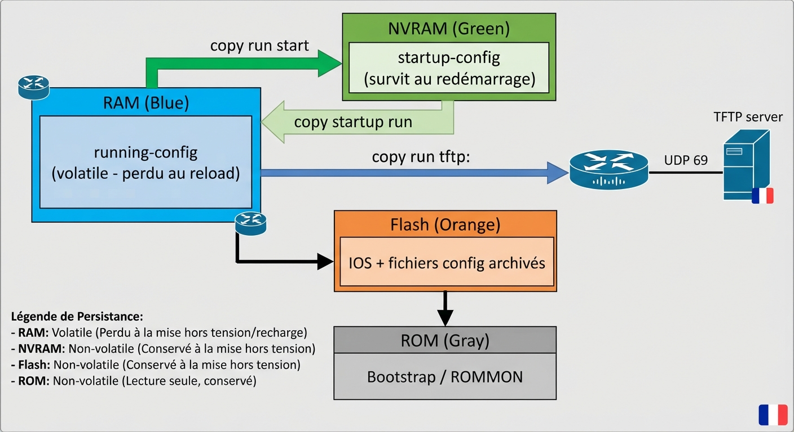
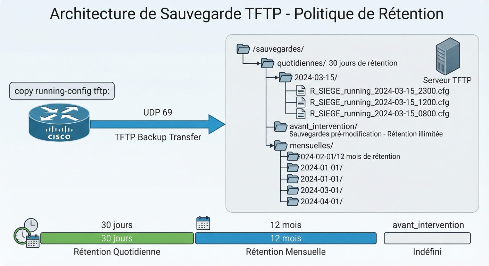
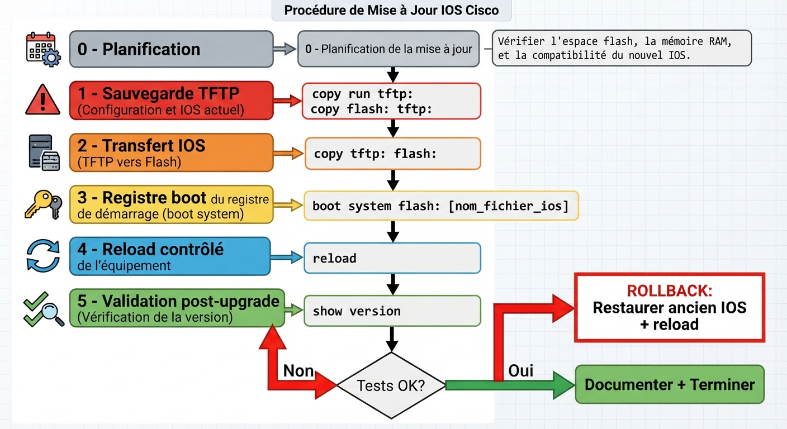
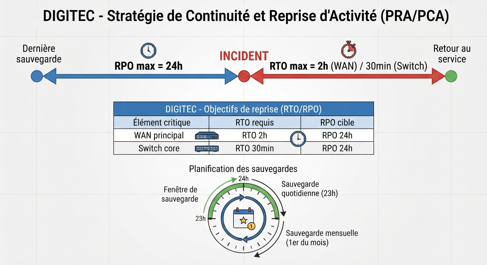
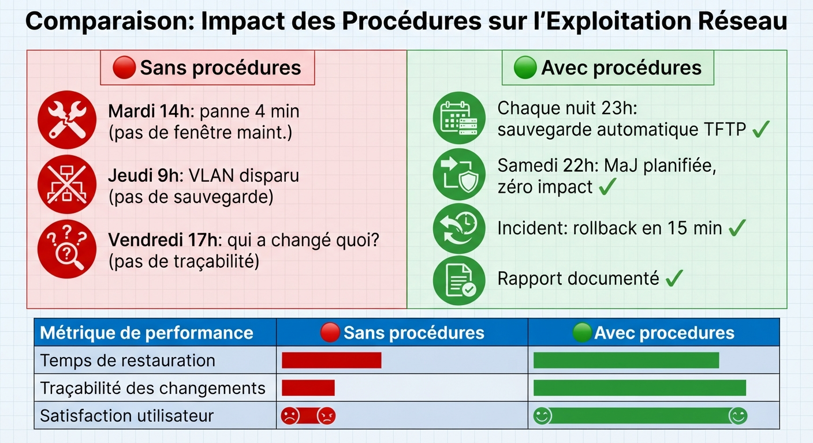

# 📘 FICHE DE COURS — S18 · 2ᵉ ANNÉE · E31
## Procédures d'exploitation : Sauvegarde · TFTP · MàJ IOS · PRA

---

> **Nom** : ___________________________
> **Date** : ___________________________
> **Compétences travaillées** : C2.5 · C2.6 · C3.1 · C3.2 · S5.2

---

## 🔑 Vocabulaire clé à maîtriser

| Terme | Définition |
|---|---|
| **running-config** | Configuration active en RAM — perdue si le routeur redémarre sans sauvegarde |
| **startup-config** | Configuration sauvegardée en NVRAM — chargée au démarrage |
| **TFTP** | Trivial File Transfer Protocol — protocole UDP 69 léger pour transférer des fichiers sur le réseau |
| **Rollback** | Retour à l'état précédent après une modification qui a mal tourné |
| **Fenêtre de maintenance** | Plage horaire planifiée (souvent la nuit) pendant laquelle les interventions sont autorisées |
| **PRA** | Plan de Reprise d'Activité — procédures pour rétablir le service après un incident |
| **PCA** | Plan de Continuité d'Activité — maintenir le service pendant l'incident |
| **RTO** | Recovery Time Objective — délai maximum toléré pour rétablir le service |
| **RPO** | Recovery Point Objective — perte de données maximale tolérée (durée depuis la dernière sauvegarde) |
| **Versionnage** | Convention de nommage horodatée permettant de retrouver n'importe quelle version d'un fichier |
| **IOS** | Internetwork Operating System — système d'exploitation des équipements Cisco |
| **Flash** | Mémoire non volatile du routeur où sont stockés l'IOS et les fichiers de configuration |

---

## 1️⃣ — Pourquoi les procédures d'exploitation sont-elles obligatoires ?

### Les 3 risques sans procédures

```
RISQUE 1 — Irréversibilité
  Une mauvaise configuration sans sauvegarde = impossibilité de revenir en arrière
  → Perte de configuration → heures de reconfiguration manuelle

RISQUE 2 — Impact métier
  Une intervention pendant les heures de bureau = coupure de service
  → Utilisateurs impactés → perte financière → plaintes direction

RISQUE 3 — Absence de traçabilité
  Impossible de savoir qui a fait quoi, quand, et pourquoi
  → Aucune preuve en cas de litige → audit RGPD/ISO 27001 impossible
```

### Les 5 règles d'or des procédures d'exploitation

```
RÈGLE 1 — TOUJOURS sauvegarder AVANT toute intervention
RÈGLE 2 — Intervenir pendant la fenêtre de maintenance (hors heures de bureau)
RÈGLE 3 — Préparer et tester le plan de rollback AVANT de commencer
RÈGLE 4 — Valider le bon fonctionnement APRÈS chaque modification
RÈGLE 5 — Documenter chaque intervention (qui, quoi, quand, résultat)
```

---

## 2️⃣ — La mémoire des équipements Cisco IOS

### Les 4 types de mémoire

```
┌─────────────────────────────────────────────────────────────────────────┐
│ RAM           → running-config (volatile — perdue au redémarrage)       │
│ NVRAM         → startup-config (non volatile — survit au redémarrage)   │
│ Flash         → IOS + fichiers de config archivés (non volatile)        │
│ ROM           → Bootstrap / ROM Monitor (non modifiable)                │
└─────────────────────────────────────────────────────────────────────────┘

Au démarrage : ROM → charge l'IOS depuis Flash → charge startup-config en RAM
```

### La différence critique

```
copy running-config startup-config
  → Copie RAM → NVRAM
  → La config survit au redémarrage
  → MAIS si la config est mauvaise, startup-config est aussi mauvaise

copy running-config tftp:
  → Copie RAM → Serveur TFTP distant
  → La sauvegarde est hors de l'équipement
  → En cas de panne ou de mauvaise config : restauration depuis l'externe
```

> 🔑 **Règle d'or** : `copy run start` = sauvegarde locale · `copy run tftp:` = sauvegarde externe.
> **Seule la sauvegarde externe permet un vrai rollback.**

---

**🖼️ ILLUSTRATION 1**
> *Légende* : Schéma des 4 types de mémoire d'un routeur Cisco avec des boîtes colorées. RAM (bleu) contient "running-config" avec mention "volatile — perdu au reload". NVRAM (vert) contient "startup-config" avec mention "chargé au boot". Flash (orange) contient "IOS + archives" avec mention "non volatile". ROM (gris) contient "Bootstrap". Des flèches montrent les flux : copy run start (RAM→NVRAM), copy run tftp: (RAM→TFTP externe), copy startup run (NVRAM→RAM), et le flux de démarrage (ROM→Flash IOS→RAM startup-config). Un serveur TFTP externe est représenté à droite relié par UDP 69.
>
> 

---

## 3️⃣ — Commandes de sauvegarde IOS

### Sauvegarder vers un serveur TFTP

```cisco
! Syntaxe interactive
R_SIEGE# copy running-config tftp:
Address or name of remote host []? 192.168.10.100
Destination filename [r_siege-confg]? R_SIEGE_running_2024-03-15_0800.cfg
!!
1234 bytes copied in 0.234 secs (5274 bytes/sec)

! Syntaxe en ligne (non interactive)
R_SIEGE# copy running-config tftp://192.168.10.100/R_SIEGE_running_2024-03-15.cfg
```

### Sauvegarder dans la mémoire flash (copie locale)

```cisco
! Lister les fichiers existants
R_SIEGE# dir flash:

! Copier la running-config en flash
R_SIEGE# copy running-config flash:R_SIEGE_backup_20240315.cfg

! Vérifier le contenu du fichier archivé
R_SIEGE# more flash:R_SIEGE_backup_20240315.cfg
```

### Restaurer depuis TFTP

```cisco
! Méthode 1 : merge (la config TFTP s'ajoute à la running-config actuelle)
R_SIEGE# copy tftp: running-config
Address or name of remote host []? 192.168.10.100
Source filename []? R_SIEGE_running_2024-03-15_0800.cfg

! Méthode 2 : remplacement complet (rollback propre recommandé)
R_SIEGE# erase startup-config
R_SIEGE# copy tftp: startup-config
Address or name of remote host []? 192.168.10.100
Source filename []? R_SIEGE_running_2024-03-15_0800.cfg
R_SIEGE# reload
```

> ⚠️ **Attention** : `copy tftp: running-config` fait un **merge**, pas un remplacement.
> Si la config à restaurer supprime des éléments, ils resteront présents.
> Pour un rollback complet : effacer + copier en startup + reload.

---

## 4️⃣ — Convention de nommage des sauvegardes

### Format standardisé

```
[HOSTNAME]_[type]_[AAAA-MM-JJ]_[HHMM].cfg

Exemples :
  R_SIEGE_running_2024-03-15_0800.cfg     ← avant intervention du 15 mars 8h
  SW_CORE_A_running_2024-03-15_0800.cfg
  R_AGENCE_B_startup_2024-03-15_0800.cfg

Pour les MàJ IOS :
  R_SIEGE_IOS_avant_upgrade_2024-03-15.cfg
```

### Organisation des archives sur le serveur TFTP

```
/sauvegardes/
├── quotidiennes/
│   ├── 2024-03-15/
│   │   ├── R_SIEGE_running_2024-03-15_2300.cfg
│   │   ├── SW_CORE_A_running_2024-03-15_2300.cfg
│   │   └── R_AGENCE_B_running_2024-03-15_2300.cfg
│   └── 2024-03-16/
│       └── ...
├── avant_intervention/
│   └── R_SIEGE_avant_upgrade_IOS_2024-03-15.cfg
└── mensuelles/
    └── 2024-03-01/
        └── ...
```

> 💡 **Rétention recommandée** : 30 sauvegardes quotidiennes + 12 mensuelles = 1 an de couverture.

---

**🖼️ ILLUSTRATION 2**
> *Légende* : Schéma d'arborescence du serveur TFTP avec les 3 dossiers (quotidiennes/avant_intervention/mensuelles) et des exemples de fichiers. À gauche, un routeur Cisco avec la commande `copy run tftp:` et une flèche UDP 69 vers le serveur. À droite, le serveur TFTP avec l'arborescence développée. Une timeline en bas montre la rétention (30 jours quotidien, 12 mois mensuel).
>
> 

---

## 5️⃣ — Procédure de mise à jour IOS en 6 étapes

### Contexte

Une MàJ IOS peut corriger des failles de sécurité, améliorer les performances ou ajouter des fonctionnalités. C'est aussi un risque : une mauvaise version peut rendre l'équipement inutilisable.

### La procédure en 6 étapes

```
ÉTAPE 0 — PLANIFICATION (avant la fenêtre de maintenance)
  ☐ Identifier la version cible sur cisco.com
  ☐ Vérifier la compatibilité avec les fonctionnalités utilisées (OSPF, EtherChannel, QoS)
  ☐ Télécharger et vérifier le MD5/SHA512 du fichier IOS
  ☐ Préparer la procédure de rollback
  ☐ Obtenir l'approbation du responsable

ÉTAPE 1 — SAUVEGARDE (début d'intervention)
  ☐ Sauvegarder running-config sur TFTP
  ☐ Sauvegarder startup-config sur TFTP
  ☐ Vérifier que les fichiers sont bien reçus sur le serveur TFTP
  ☐ Noter la version IOS actuelle : show version

ÉTAPE 2 — TRANSFERT DU NOUVEL IOS
  ☐ Copier le fichier IOS depuis TFTP vers la flash :
      copy tftp: flash:
  ☐ Vérifier l'intégrité : verify /md5 flash:[nom_ios]
  ☐ Vérifier l'espace disponible : dir flash:

ÉTAPE 3 — MODIFICATION DU REGISTRE DE DÉMARRAGE
  ☐ Désigner le nouvel IOS au démarrage :
      boot system flash:[nom_du_nouvel_ios]
  ☐ Sauvegarder la config de boot :
      copy running-config startup-config

ÉTAPE 4 — REDÉMARRAGE CONTRÔLÉ
  ☐ Prévenir les équipes du redémarrage imminent
  ☐ Planifier pendant la fenêtre de maintenance (nuit/week-end)
  ☐ Exécuter : reload
  ☐ Surveiller le temps de redémarrage (normal : 3-5 min)

ÉTAPE 5 — VALIDATION POST-MÀJ
  ☐ Vérifier la version : show version → nouvelle version présente
  ☐ Vérifier OSPF : show ip ospf neighbor → FULL sur tous les voisins
  ☐ Vérifier EtherChannel : show etherchannel summary → SU, (P)
  ☐ Ping end-to-end depuis tous les sites
  ☐ Documenter : version avant, version après, heure, technicien

ROLLBACK (si validation KO) :
  ☐ boot system flash:[ancien_ios]
  ☐ reload
  ☐ Vérifier que l'ancienne version est bien chargée
  ☐ Ouvrir un ticket d'incident
```

---

**🖼️ ILLUSTRATION 3**
> *Légende* : Organigramme vertical de la procédure de MàJ IOS en 6 boîtes colorées numérotées. Étape 0 (gris) Planification. Étape 1 (rouge) Sauvegarde obligatoire. Étape 2 (orange) Transfert IOS. Étape 3 (jaune) Registre de boot. Étape 4 (bleu) Reload. Étape 5 (vert) Validation. À droite de l'étape 5 : un losange de décision "Tests OK ?" → Oui : terminer · Non : flèche rouge vers Rollback box. Le chemin de rollback remonte vers l'étape 4 (reload avec ancien IOS).
>
> 

---

## 6️⃣ — Plan de Reprise d'Activité (PRA)

### Définitions RTO et RPO

```
RTO (Recovery Time Objective)
  = Durée maximale acceptable d'indisponibilité du service
  → "En combien de temps doit-on avoir restauré le service ?"
  Exemple DIGITEC : RTO = 2 heures pour le WAN principal

RPO (Recovery Point Objective)
  = Ancienneté maximale des données perdues acceptée
  → "Quelle est la perte de données maximale tolérable ?"
  Exemple DIGITEC : RPO = 24 heures (sauvegardes quotidiennes)
```

### Structure d'un scénario PRA

```
SCÉNARIO : [Description de la panne]
IMPACT    : [Équipements affectés, utilisateurs impactés]
DÉTECTION : [Comment on détecte la panne]
ACTIONS   :
  1. [Action immédiate — minute 0 à 5]
  2. [Diagnostic — minute 5 à 15]
  3. [Mise en œuvre du contournement — minute 15 à 60]
  4. [Restauration définitive]
VALIDATION : [Tests à effectuer pour confirmer le retour à la normale]
RTO CIBLE : [Durée visée]
```

### Scénario 1 — Panne du WAN principal Siège ↔ Agence B

```
SCÉNARIO  : Lien série Se0/0/0 de R_SIEGE tombe en panne physique
IMPACT    : Agence B (15 salariés) coupée du Siège et du Datacenter
            VoIP inter-sites inopérante
DÉTECTION : Alerte SIEM/syslog + appels utilisateurs Agence B
ACTIONS   :
  1. Vérifier sur R_AGENCE_B : show ip route
     → Si route via 10.1.3.1 apparaît : basculement automatique OK
  2. Vérifier sur R_SIEGE_BACKUP : show ip route
     → Routes vers Agence B présentes ?
  3. Si basculement automatique KO :
     R_AGENCE_B(config)# ip route 0.0.0.0 0.0.0.0 10.1.3.1
     (route manuelle temporaire)
  4. Diagnostiquer le lien physique (câble, modem, opérateur)
  5. Appeler l'opérateur télécom si lien opérateur
VALIDATION : ping 192.168.10.10 depuis PC Agence B → succès
RTO CIBLE : 15 minutes (basculement automatique) / 60 min (manuel)
```

### Scénario 2 — Corruption de configuration d'un switch

```
SCÉNARIO  : SW_CORE_A a une configuration corrompue (VLAN VoIP disparu)
IMPACT    : Téléphones IP du Siège muets · VLAN 20 inaccessible
DÉTECTION : Appels utilisateurs + show vlan brief → VLAN 20 absent
ACTIONS   :
  1. Vérifier : show vlan brief sur SW_CORE_A
  2. Tenter de recréer le VLAN 20 manuellement
     vlan 20 / name VOIP
  3. Si configuration trop dégradée : restauration depuis TFTP
     copy tftp: running-config (serveur : 192.168.10.100)
     Fichier : SW_CORE_A_running_[dernière_date].cfg
  4. Vérifier après restauration : show vlan brief + ping IP_Phone
VALIDATION : Appel test depuis IP_Phone Siège → SRV_VoIP
RTO CIBLE : 30 minutes
```

---

**🖼️ ILLUSTRATION 4**
> *Légende* : Diagramme RTO/RPO sous forme de timeline horizontale. Sur la frise : point "Dernière sauvegarde" → flèche bleue "RPO = 24h max" → point "Incident" → flèche rouge "RTO = 2h max" → point "Retour au service". En dessous, un second scénario avec des données plus récentes. À droite, un tableau de correspondance DIGITEC : RTO = 2h WAN / 30min switch · RPO = 24h. En bas, le cycle de sauvegarde (quotidien 23h → mensuel 1er du mois).
>
> 

---

## 7️⃣ — Format d'une procédure d'exploitation professionnelle

### Structure standard

```
┌─────────────────────────────────────────────────────────────────┐
│  EN-TÊTE                                                        │
│  Titre : [Procédure de ...]                                     │
│  Auteur : [Nom]    Date création : [JJ/MM/AAAA]                 │
│  Version : [X.Y]   Dernière MàJ : [JJ/MM/AAAA]                 │
│  Validé par : [Responsable réseau]                              │
├─────────────────────────────────────────────────────────────────┤
│  CONDITIONS PRÉALABLES                                          │
│  → Qui est autorisé à exécuter cette procédure                  │
│  → Fenêtre de maintenance requise (oui/non)                     │
│  → Équipements nécessaires                                      │
│  → Actions préalables obligatoires (sauvegardes...)             │
├─────────────────────────────────────────────────────────────────┤
│  ÉTAPES D'EXÉCUTION                                             │
│  [Numérotées, avec commandes exactes et résultat attendu]       │
├─────────────────────────────────────────────────────────────────┤
│  VALIDATION                                                     │
│  [Tests à effectuer + résultats attendus]                       │
├─────────────────────────────────────────────────────────────────┤
│  ROLLBACK                                                       │
│  [Étapes pour revenir à l'état précédent si KO]                 │
├─────────────────────────────────────────────────────────────────┤
│  HISTORIQUE DES MODIFICATIONS                                   │
│  [Journal des versions de la procédure elle-même]               │
└─────────────────────────────────────────────────────────────────┘
```

---

**🖼️ ILLUSTRATION 5**
> *Légende* : Comparaison visuelle "Avant procédures vs Après procédures" sous forme de deux colonnes. Colonne gauche rouge : chronologie chaotique d'une semaine (mardi 14h = panne incident 1, jeudi 9h = incident 2, vendredi 17h = personne ne sait qui a changé quoi). Colonne droite verte : même semaine avec procédures (sauvegarde automatique chaque nuit à 23h, modification samedi 22h en fenêtre de maintenance, rollback en 15 min lors d'un problème, rapport d'incident documenté). En bas : tableau chiffré "Coût sans procédures vs avec procédures" (temps de restauration, traçabilité, satisfaction utilisateurs).
>
> 

---

## 📌 Les essentiels à retenir pour l'examen

> ✅ **running-config** = RAM (volatile) · **startup-config** = NVRAM (non volatile) · **Flash** = IOS + archives
> ✅ `copy run start` = sauvegarde locale · `copy run tftp:` = sauvegarde externe (seule valable pour rollback)
> ✅ Convention de nommage : `[HOSTNAME]_running_[AAAA-MM-JJ]_[HHMM].cfg`
> ✅ MàJ IOS : 6 étapes — Planification → **Sauvegarde** → Transfert → Boot system → Reload → **Validation**
> ✅ Rollback : `erase startup-config` + `copy tftp: startup-config` + `reload`
> ✅ **RTO** = combien de temps pour rétablir · **RPO** = combien de données perdues tolérées
> ✅ PRA = pour chaque scénario de panne : impact · détection · actions · validation · RTO
> ✅ Fenêtre de maintenance = planifier les interventions hors heures de bureau

---

*Fiche de Cours — BAC PRO CIEL | E31 Administration Systèmes | 2ᵉ année S18*
*Compétences : C2.5 · C2.6 · C3.1 · C3.2 · S5.2*
