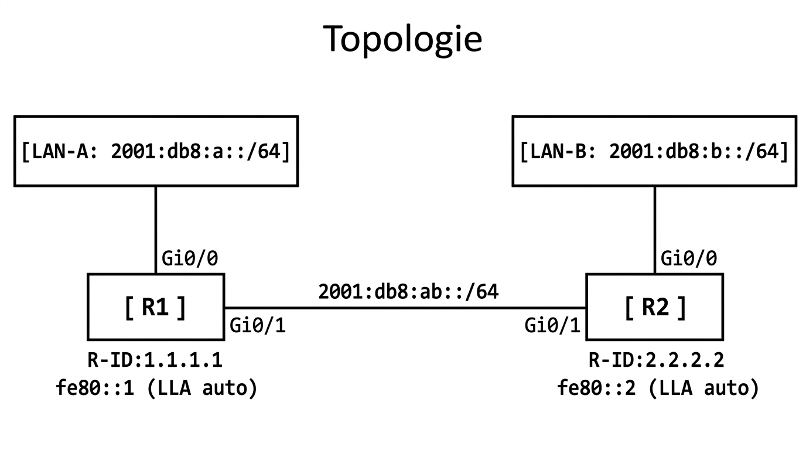

# 📖 FICHE COURS – S1 ANNÉE 3 – E31
## OSPFv3 : Introduction — Différences OSPFv2/v3, Configuration, Vérification

**Nom : ________________  Prénom : ________________**

---

## 🎯 OBJECTIFS

- ✅ Comprendre pourquoi OSPFv3 existe et ce qu'il ajoute par rapport à OSPFv2
- ✅ Identifier les différences clés de configuration (interface vs processus)
- ✅ Configurer OSPFv3 sur une interface Cisco IOS
- ✅ Comprendre pourquoi les hellos OSPFv3 utilisent les adresses LLA
- ✅ Vérifier avec `show ipv6 ospf neighbor` et `show ipv6 route ospf`

---

## 1️⃣ LE PONT : D'OSPFv2 À OSPFv3

### Rappel S15-A2 — Ce que vous savez déjà sur IPv6

> Vous avez découvert en S15-A2 les bases d'IPv6 : notation hexadécimale, règles `::`, types d'adresses (GUA/LLA/ULA). Vous savez que :
> - **LLA** (fe80::/10) est générée automatiquement sur toute interface IPv6 active
> - **`ipv6 unicast-routing`** est indispensable sur tout routeur IPv6
> - Le /64 est le préfixe standard pour les LAN

> *Ce cours fait exactement un pas de plus : maintenant que vous savez configurer des adresses IPv6, vous allez apprendre à faire converger le routage entre plusieurs routeurs IPv6 — c'est OSPFv3.*

---

### Pourquoi OSPFv3 et pas juste IPv6 sur OSPFv2 ?

> **OSPFv2 est conçu pour IPv4 uniquement.** Ses LSA (Link State Advertisements), ses paquets hello, ses bases de données contiennent des adresses IPv4. Pour router de l'IPv6, il faut un protocole adapté.
>
> **OSPFv3** est une réécriture d'OSPF pour IPv6 (RFC 5340). L'algorithme SPF reste identique — c'est la **représentation des adresses** et la **syntaxe de configuration** qui changent.

---

## 2️⃣ TABLEAU COMPARATIF OSPFv2 / OSPFv3

| **Critère** | **OSPFv2 (IPv4)** | **OSPFv3 (IPv6)** |
|---|---|---|
| **Protocole routé** | IPv4 | **IPv6** |
| **Configuration** | `network` dans `router ospf` | `ipv6 ospf` **sur chaque interface** |
| **Commande processus** | `router ospf <pid>` | `ipv6 router ospf <pid>` |
| **Source des hellos** | IP réelle de l'interface | **LLA (fe80::x)** toujours |
| **Multicast hellos** | 224.0.0.5 | **ff02::5** |
| **Multicast DR/BDR** | 224.0.0.6 | **ff02::6** |
| **Router-ID** | IPv4 (auto ou manuel) | **IPv4 obligatoire** (même si réseau est IPv6) |
| **Passive-interface** | Dans `router ospf` | Dans `ipv6 router ospf` |
| **Vérification voisins** | `show ip ospf neighbor` | **`show ipv6 ospf neighbor`** |
| **Vérification routes** | `show ip route ospf` | **`show ipv6 route ospf`** |
| **Vérification interfaces** | `show ip ospf interface` | `show ipv6 ospf interface` |
| **Prérequis** | Aucun de spécifique | **`ipv6 unicast-routing` obligatoire** |

> 💡 **Ce qui ne change PAS** entre v2 et v3 : l'algorithme SPF (Dijkstra), les états d'adjacence (Down→Full), les rôles DR/BDR, les timers hello/dead, la notion d'area.

---

## 3️⃣ LA DIFFÉRENCE FONDAMENTALE : CONFIG SUR L'INTERFACE

### OSPFv2 — Configuration dans le processus

```ios
! OSPFv2 : on déclare les réseaux dans le PROCESSUS OSPF
router ospf 1
  router-id 1.1.1.1
  network 192.168.1.0 0.0.0.255 area 0   ← ici, dans le processus
  network 10.0.12.0 0.0.0.3 area 0
```

### OSPFv3 — Configuration sur chaque INTERFACE

```ios
! OSPFv3 : on active OSPF directement SUR CHAQUE INTERFACE
ipv6 router ospf 1
  router-id 1.1.1.1                      ← dans le processus : SEULEMENT le router-id

interface GigabitEthernet0/0
  ipv6 address 2001:db8:1::1/64
  ipv6 ospf 1 area 0                     ← ici, sur l'interface

interface GigabitEthernet0/1
  ipv6 address 2001:db8:12::1/64
  ipv6 ospf 1 area 0                     ← ici aussi, sur l'interface
```

> ⚠️ **ERREUR CLASSIQUE :** chercher une commande `network` dans OSPFv3. Elle **n'existe pas**. Chaque interface est activée individuellement avec `ipv6 ospf <pid> area <n>`.

---

📷 **[ILLUSTRATION 1]**
*Comparaison visuelle côte à côte de la configuration OSPFv2 vs OSPFv3. À gauche : un routeur avec un seul bloc de configuration "router ospf 1" entouré de plusieurs flèches pointant vers les interfaces, avec l'annotation "Les interfaces sont déclarées dans le processus". À droite : le même routeur avec chaque interface ayant son propre bloc de configuration `ipv6 ospf 1 area 0`, avec l'annotation "Chaque interface déclare elle-même sa participation". Style schéma de configuration réseau pédagogique, fond blanc, mise en valeur de la différence en rouge/vert.*

> **Légende :** En OSPFv2, les réseaux sont déclarés dans le bloc `router ospf` via des commandes `network`. En OSPFv3, la logique est inversée : on active OSPFv3 directement sur chaque interface avec `ipv6 ospf <pid> area <n>`. Cette inversion simplifie la lecture de la config (on voit directement quelle interface participe à OSPF) mais oblige à ne pas oublier une interface.

---

## 4️⃣ POURQUOI LES HELLOS OSPF v3 UTILISENT LES LLA ?

> En OSPFv2, les hellos OSPF sont envoyés depuis l'IP réelle de l'interface (ex: 192.168.1.1). En OSPFv3, ils sont envoyés depuis l'**adresse Link-Local (LLA, fe80::x)** de l'interface.

### La raison fondamentale

> Les LLA sont **toujours présentes** sur une interface IPv6 active — même si aucune adresse GUA n'est encore assignée. En utilisant les LLA pour les hellos, OSPFv3 peut :

1. **Établir des adjacences avant que le plan d'adressage GUA soit déployé** — utile lors des phases de déploiement
2. **Garantir que les hellos restent locaux au lien** (LLA = non routée = jamais transmise hors du segment)
3. **Séparer la signalisation OSPF du plan d'adressage** — l'adresse GUA peut changer sans affecter les adjacences OSPFv3

```
Ce qu'on voit dans show ipv6 ospf neighbor :

Neighbor ID     Pri   State           Dead Time   Interface ID    Interface
2.2.2.2           1   FULL/DR         00:00:38    4               Gi0/1
                                                  ↑               ↑
                             Non plus l'IP réelle,   L'interface locale
                             mais le router-id IPv4   par laquelle le voisin est vu
```

> **Note :** La colonne "Address" n'affiche plus l'IP réelle du voisin — elle affiche son router-id ou l'Interface ID. Pour voir l'adresse LLA du voisin, utiliser `show ipv6 ospf neighbor detail`.

---

## 5️⃣ LE ROUTER-ID EN OSPFv3 — UNE SURPRISE

> **OSPFv3 sur Cisco IOS utilise un router-id IPv4** — même quand on route exclusivement de l'IPv6.

### Pourquoi ?

> Le router-id est un identifiant unique de 32 bits dans le domaine OSPF. OSPF (v2 et v3) a été conçu autour de ces 32 bits. Sur les routeurs Cisco, OSPFv3 conserve ce router-id IPv4 pour identifier les routeurs.

### Comment le configurer

**Méthode 1 — Explicite (recommandée) :**

```ios
ipv6 router ospf 1
  router-id 1.1.1.1    ← IPv4, même si ce réseau est IPv6 uniquement
```

**Méthode 2 — Automatique (à éviter en production) :**

> Si aucune commande `router-id` n'est saisie, Cisco utilise l'adresse IPv4 la plus haute sur une interface Loopback active, ou à défaut l'IPv4 la plus haute sur n'importe quelle interface active.

> ⚠️ **Problème :** Si le routeur n'a aucune interface IPv4 configurée ET aucun `router-id` explicite, OSPFv3 **ne démarrera pas** sur Cisco IOS. C'est une erreur fréquente en environnement IPv6-only.

**Solution pour un routeur sans IPv4 :**

```ios
! Option A : configurer une loopback IPv4 factice
interface Loopback0
  ip address 1.1.1.1 255.255.255.255

! Option B : router-id explicite dans OSPFv3
ipv6 router ospf 1
  router-id 1.1.1.1    ← IPv4 même sans interface IPv4 physique
```

---

## 6️⃣ CONFIGURATION COMPLÈTE OSPFv3 — EXEMPLE COMPLET

### Topologie



??? note "🔤 Schéma texte original"
    ```
    [LAN-A: 2001:db8:a::/64]                    [LAN-B: 2001:db8:b::/64]
             │                                            │
         Gi0/0                                        Gi0/0
      [  R1  ]──── Gi0/1 ─── 2001:db8:ab::/64 ───── Gi0/1 ─[  R2  ]
      R-ID:1.1.1.1                                          R-ID:2.2.2.2
      fe80::1 (LLA auto)                                    fe80::2 (LLA auto)
    ```


### Configuration R1

```ios
! === Prérequis IPv6 ===
ipv6 unicast-routing

! === Processus OSPFv3 — SEULEMENT le router-id ===
ipv6 router ospf 1
  router-id 1.1.1.1

! === Interfaces — activation OSPFv3 sur chaque interface ===
interface GigabitEthernet0/0
  description LAN-A
  ipv6 address 2001:db8:a::1/64
  ipv6 ospf 1 area 0
  no shutdown

interface GigabitEthernet0/1
  description VERS-R2
  ipv6 address 2001:db8:ab::1/64
  ipv6 ospf 1 area 0
  no shutdown

! === Passive-interface LAN (pas de hellos vers les PCs) ===
ipv6 router ospf 1
  passive-interface GigabitEthernet0/0
```

### Configuration R2

```ios
ipv6 unicast-routing

ipv6 router ospf 1
  router-id 2.2.2.2

interface GigabitEthernet0/0
  description LAN-B
  ipv6 address 2001:db8:b::1/64
  ipv6 ospf 1 area 0
  no shutdown

interface GigabitEthernet0/1
  description VERS-R1
  ipv6 address 2001:db8:ab::2/64
  ipv6 ospf 1 area 0
  no shutdown

ipv6 router ospf 1
  passive-interface GigabitEthernet0/0
```

---

## 7️⃣ VÉRIFICATION OSPFv3

### show ipv6 ospf neighbor

```ios
R1# show ipv6 ospf neighbor

            OSPFv3 Router with ID (1.1.1.1) (Process ID 1)

Neighbor ID     Pri   State           Dead Time   Interface ID    Interface
2.2.2.2           1   FULL/ -         00:00:36    4               Gi0/1
```

**Décryptage :**

| **Champ** | **Signification** |
|---|---|
| `Neighbor ID` | **Router-ID IPv4** du voisin (pas son adresse IPv6 !) |
| `Pri` | Priorité DR/BDR |
| `State` | État d'adjacence — `FULL/ -` = adjacent sur lien P-à-P |
| `Dead Time` | Temps restant avant de déclarer le voisin mort |
| `Interface ID` | Identifiant numérique de l'interface du voisin |
| `Interface` | Interface **locale** par laquelle le voisin est vu |

> 💡 On retrouve les mêmes états qu'en OSPFv2 (FULL, 2WAY, EXSTART…). Les rôles DR/BDR sont aussi identiques.

---

### show ipv6 ospf neighbor detail

```ios
R1# show ipv6 ospf neighbor detail

 Neighbor 2.2.2.2
    In the area 0 via interface GigabitEthernet0/1
    Neighbor: interface-id 4, link-local address FE80::2    ← LLA du voisin
    Neighbor priority is 1, State is FULL, 3 state changes
    DR is 0.0.0.0 BDR is 0.0.0.0
    Options is 0x000013 in Hello (V6-Bit, E-bit, R-bit)
    Dead timer due in 00:00:35
    Neighbor is up for 00:12:45
    Index 1/1/1, retransmission queue length 0, number of retransmission 1
```

> `link-local address FE80::2` → c'est l'adresse LLA du voisin. On confirme que les hellos OSPFv3 utilisent bien les LLA.

---

### show ipv6 route ospf

```ios
R1# show ipv6 route ospf

IPv6 Routing Table - default - 7 entries
Codes: C - Connected, L - Local, S - Static, R - RIP, B - BGP
       U - Per-user Static route
       O - OSPF Intra, OI - OSPF Inter, OE1 - OSPF Ext 1, OE2 - OSPF Ext 2
       ...

O   2001:DB8:B::/64 [110/2]
     via FE80::2, GigabitEthernet0/1     ← Le prochain saut = LLA du voisin !
```

> **Point remarquable :** Dans `show ipv6 route ospf`, le **next-hop est une adresse LLA** (FE80::2) — pas une adresse GUA. C'est une conséquence directe du fait qu'OSPFv3 utilise les LLA pour ses échanges.

---

📷 **[ILLUSTRATION 2]**
*Diagramme de séquence OSPFv3 entre R1 et R2. Deux colonnes (R1 gauche, R2 droite). Messages échangés annotés avec leurs adresses : hello de R1 "Source: fe80::1 → Dst: ff02::5" ; hello de R2 "Source: fe80::2 → Dst: ff02::5". Après l'établissement de l'adjacence (FULL), une route O apparaît dans la table de routage de R1 : "2001:db8:b::/64 via FE80::2 Gi0/1". Annotation encadrée : "Les hellos utilisent les LLA ; les routes pointent aussi vers les LLA comme next-hop". Style diagramme de séquence réseau, fond blanc.*

> **Légende :** Échanges OSPFv3 entre R1 et R2. Les messages hello sont émis depuis les adresses LLA (fe80::1, fe80::2) vers l'adresse multicast ff02::5. Une fois l'adjacence Full établie, les routes apprises pointent vers l'adresse LLA du voisin comme next-hop.

---

### show ipv6 ospf interface

```ios
R1# show ipv6 ospf interface GigabitEthernet0/1

GigabitEthernet0/1 is up, line protocol is up
  Link Local Address FE80::1, Interface ID 3
  Area 0, Process ID 1, Instance ID 0, Router ID 1.1.1.1
  Network Type POINT_TO_POINT, Cost: 1
  Transmit Delay is 1 sec, State POINT_TO_POINT
  Timer intervals: Hello 10, Dead 40, Wait 40, Retransmit 5
    Hello due in 00:00:06
  Neighbor Count is 1, Adjacent neighbor count is 1
    Adjacent with neighbor 2.2.2.2
```

> **Informations clés :** `Link Local Address FE80::1` confirme quelle LLA est utilisée sur cette interface. `Router ID 1.1.1.1` confirme le router-id IPv4.

---

## 8️⃣ DUAL-STACK : OSPFv2 ET OSPFv3 EN PARALLÈLE

> En production, pendant la migration IPv4 → IPv6, les deux protocoles tournent souvent simultanément sur la même infrastructure.

```ios
! Interface en dual-stack avec OSPFv2 ET OSPFv3 actifs :
interface GigabitEthernet0/0
  ip address 192.168.1.1 255.255.255.0    ← IPv4 pour OSPFv2
  ipv6 address 2001:db8:1::1/64           ← IPv6 pour OSPFv3
  ipv6 ospf 1 area 0                      ← activation OSPFv3

router ospf 1
  network 192.168.1.0 0.0.0.255 area 0    ← activation OSPFv2

ipv6 router ospf 1
  router-id 1.1.1.1
```

> Deux processus distincts, deux tables de routage (`show ip route` et `show ipv6 route`), mais le même hardware.

---

## ✅ AUTO-ÉVALUATION OSPFv3

- [ ] Je sais que la principale différence de config est : OSPFv3 = **sur l'interface** (pas dans le processus)
- [ ] Je sais configurer `ipv6 router ospf 1` + `router-id`
- [ ] Je sais activer OSPFv3 sur une interface : `ipv6 ospf 1 area 0`
- [ ] Je comprends pourquoi le router-id est IPv4 même en OSPFv3
- [ ] Je comprends pourquoi les hellos utilisent les LLA
- [ ] Je sais lire `show ipv6 ospf neighbor` : chercher FULL et le router-id du voisin
- [ ] Je sais que dans `show ipv6 route ospf`, le next-hop est une LLA
- [ ] Je n'oublie pas `ipv6 unicast-routing` avant tout le reste

---

## 📚 VOCABULAIRE CLEF OSPFv3

| **Terme** | **Définition** |
|---|---|
| **OSPFv3** | Version d'OSPF pour IPv6 (RFC 5340) — même algorithme SPF, syntaxe de config différente |
| **`ipv6 ospf <pid> area <n>`** | Commande sur interface pour activer OSPFv3 (remplace le `network` d'OSPFv2) |
| **`ipv6 router ospf`** | Commande pour entrer dans le processus OSPFv3 (seulement pour router-id et passive-interface) |
| **Router-ID IPv4** | Identifiant 32 bits du routeur dans le domaine OSPF — obligatoire même en OSPFv3 sur Cisco |
| **ff02::5** | Multicast AllSPFRouters IPv6 (équivalent de 224.0.0.5) |
| **ff02::6** | Multicast AllDRouters IPv6 (équivalent de 224.0.0.6) |
| **Next-hop LLA** | Dans `show ipv6 route ospf`, le prochain saut est l'adresse LLA du voisin |

---

## 📌 POINTS-CLÉS OSPFv3 À RETENIR

1. **Pas de `network` statement** en OSPFv3 — tout se configure sur l'interface
2. **Router-ID = IPv4** obligatoire sur Cisco, même en réseau IPv6 pur
3. **Hellos = LLA** → OSPFv3 fonctionne même sans adresse GUA assignée
4. **`ipv6 unicast-routing`** = prérequis absolu (comme en S15-A2)
5. **`show ipv6 ospf neighbor`** → chercher Neighbor ID (router-id IPv4) et State (FULL)
6. **`show ipv6 route ospf`** → next-hop = adresse LLA du voisin
7. **Mêmes états** qu'OSPFv2 : Down → Init → 2-Way → Full
8. En **dual-stack** : OSPFv2 et OSPFv3 tournent indépendamment et simultanément

---

**Document – BAC PRO CIEL – A3 – E31/U31 – Version 1.0 – 2026**
