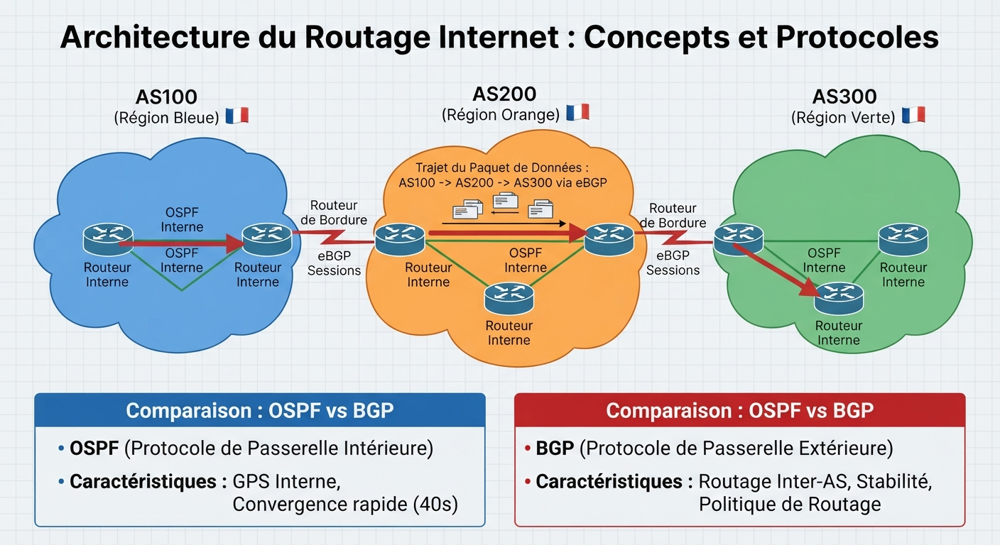
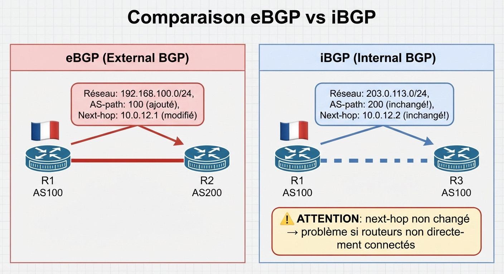
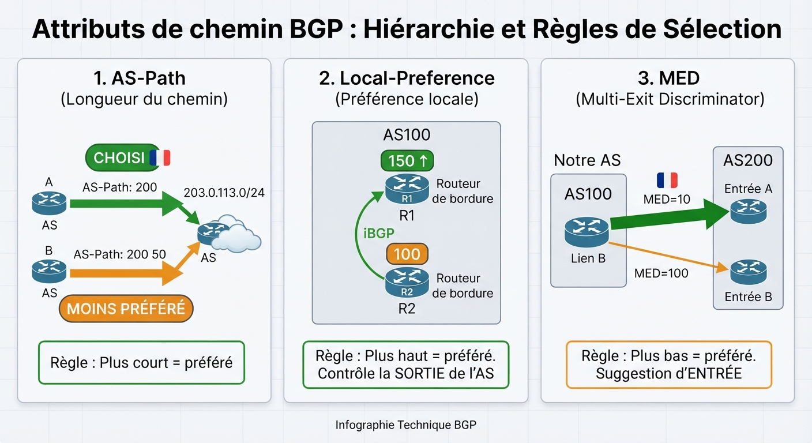
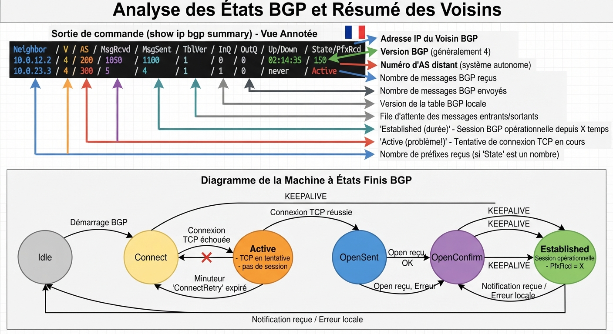
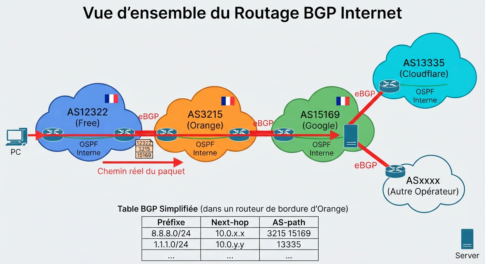

# 📘 FICHE DE COURS — S3 · 3ᵉ ANNÉE · E31
## BGP : AS · eBGP vs iBGP · Attributs de sélection · Table BGP

---

> **Nom** : ___________________________
> **Date** : ___________________________
> **Compétences travaillées** : S2.4 · S2.5 · C2.2 · C2.3

---

## 🔑 Vocabulaire clé à maîtriser

| Terme | Définition |
|---|---|
| **BGP** | Border Gateway Protocol — protocole de routage inter-AS (EGP), porte l'Internet mondial (RFC 4271) |
| **AS** | Autonomous System — groupe de réseaux sous une même politique de routage et un même numéro ASN |
| **ASN** | Autonomous System Number — numéro unique identifiant un AS (16 bits : 1-65 535 / 32 bits jusqu'à ~4 milliards) |
| **eBGP** | External BGP — session BGP entre deux routeurs de AS différents |
| **iBGP** | Internal BGP — session BGP entre deux routeurs du même AS |
| **Peering** | Relation BGP entre deux voisins (neighbors) — établie via une session TCP port 179 |
| **Neighbor** | Voisin BGP — routeur avec lequel on a configuré une session BGP (manuel, pas de découverte automatique) |
| **RIB** | Routing Information Base — table BGP complète (tous les chemins reçus) |
| **Best path** | Meilleur chemin sélectionné par l'algorithme BGP — installé dans la table de routage |
| **AS-path** | Attribut BGP listant tous les AS traversés — chemin le plus court préféré |
| **Local-Pref** | Attribut BGP indiquant la préférence de sortie d'un AS — plus haut = préféré · propagé en iBGP |
| **MED** | Multi-Exit Discriminator — suggestion d'entrée dans un AS adjacent — plus bas = préféré |
| **Next-hop** | En eBGP : adresse IP du voisin direct · En iBGP : next-hop conservé du eBGP original |
| **Weight** | Attribut Cisco propriétaire — local au routeur, non propagé — plus haut = préféré |
| **NLRI** | Network Layer Reachability Information — préfixe réseau annoncé dans un message BGP UPDATE |

---

## 1️⃣ — Pourquoi BGP ? La limite des IGP (OSPF, RIP)

### OSPF est fait pour l'intérieur — pas pour Internet

```
OSPF (IGP — Interior Gateway Protocol) :
  ✓ Optimisé pour la convergence rapide dans un réseau interne
  ✓ Connaissance complète de la topologie (LSDB)
  ✗ Ne passe pas à l'échelle d'Internet (millions de routes)
  ✗ Pas de politiques de routage inter-organisationnelles
  ✗ Pas de notion d'appartenance à une organisation (AS)

BGP (EGP — Exterior Gateway Protocol) :
  ✓ Conçu pour interconnecter des AS indépendants (organisations, FAI)
  ✓ Table de routage Internet : ~950 000 préfixes en 2024
  ✓ Politique de routage riche (attributs, filtres, route-maps)
  ✓ Convergence lente volontaire (stabilité > vitesse pour Internet)
  ✗ Pas fait pour la convergence rapide interne
```

### La métaphore des autoroutes

```
OSPF = GPS interne à une ville (connaît chaque rue, recalcule en secondes)
BGP  = Panneau autoroutier entre pays (indique "France → Espagne → Portugal"
        sans détailler chaque rue interne — et chaque pays contrôle
        les entrées/sorties sur son territoire)
```

---

**🖼️ ILLUSTRATION 1**
> *Légende* : Carte stylisée de trois "pays" (AS100, AS200, AS300) séparés par des frontières. À l'intérieur de chaque AS : des routeurs reliés entre eux par OSPF (liens verts). Aux frontières entre AS : des routeurs de bordure reliés par BGP (liens rouges épais). Un "paquet" fait un trajet de AS100 à AS300 en traversant AS200 via les sessions eBGP. En bas, deux boîtes comparatives : OSPF = "GPS interne, recalcule en 40s" vs BGP = "Routage inter-pays, stable, politique".
>
> 

---

## 2️⃣ — Le Système Autonome (AS) : l'unité de base de BGP

### Définition

Un **AS** est un groupe de réseaux IP administrés par une même entité (entreprise, FAI, université) qui applique une **politique de routage cohérente**.

Chaque AS possède un **numéro unique** (ASN) attribué par les RIR (RIPE NCC en Europe).

### Numéros d'AS

```
AS 16 bits (ancienne norme) :
  1 – 64 511       = ASN publics (routés sur Internet)
  64 512 – 65 534  = ASN privés (usage interne, labs, TP)

AS 32 bits (RFC 4893) :
  131 072 et plus  = nouveaux ASN publics
  Format "asdot" : 1.0 = 65536, 64496.1 = grands opérateurs

Exemples réels :
  Free (France)   : AS12322
  Orange          : AS3215
  Google          : AS15169
  Cloudflare      : AS13335
```

> 💡 **En TP** : on utilise les ASN privés 64512-65534 car on ne s'annonce pas sur Internet.

---

## 3️⃣ — eBGP vs iBGP : deux usages du même protocole

### eBGP (External BGP)

```
ENTRE deux AS différents (le cas classique)

Caractéristiques :
  → Voisin configuré avec un remote-as DIFFÉRENT du local-as
  → Le paquet BGP passe par un lien directement connecté entre les deux AS
  → L'AS-path est modifié : l'AS local est ajouté à chaque annonce sortante
  → Le next-hop est modifié : devient l'IP du routeur eBGP local

Configuration :
  router bgp 100
   neighbor 10.0.12.2 remote-as 200   ← AS 200 ≠ AS 100 = eBGP
```

### iBGP (Internal BGP)

```
À L'INTÉRIEUR d'un même AS (entre routeurs du même opérateur)

Pourquoi iBGP ?
  → Dans un grand AS, plusieurs routeurs de bordure ont des sessions eBGP
  → Ils doivent se partager les routes apprises via iBGP
  → Exemple : R1 apprend un préfixe via eBGP depuis AS200
              R1 annonce ce préfixe à R2 via iBGP
              R2 peut maintenant router vers ce préfixe

Caractéristiques IMPORTANTES :
  → Voisin configuré avec remote-as IDENTIQUE au local-as
  → L'AS-path n'est PAS modifié (pas d'ajout du propre AS)
  → Le next-hop n'est PAS modifié par défaut (problème fréquent !)
  → Les sessions iBGP ne sont pas sur des liens directement connectés nécessairement
     (utilise souvent des adresses Loopback pour la stabilité)
  → iBGP ne propage pas les routes iBGP vers d'autres voisins iBGP
     (règle anti-boucle : split horizon iBGP → nécessite mesh complet ou Route Reflector)

Configuration :
  router bgp 100
   neighbor 172.16.1.1 remote-as 100  ← même AS = iBGP
   neighbor 172.16.1.1 update-source Loopback0
```

---

**🖼️ ILLUSTRATION 2**
> *Légende* : Schéma en deux parties côte à côte. Gauche "eBGP" : R1 (AS100) et R2 (AS200) reliés, le message BGP UPDATE montre l'AS-path "100" ajouté par R1. La flèche eBGP est rouge/épaisse. Droite "iBGP" : R1 et R3 dans le même AS100, reliés par une flèche bleue pointillée "iBGP". R1 reçoit un préfixe 203.0.113.0/24 de R2 (eBGP) et l'annonce à R3 via iBGP sans modifier l'AS-path. R3 voit l'AS-path "200" (pas "100"). Une note "next-hop non changé → problème potentiel" pointe vers la session iBGP.
>
> 

---

## 4️⃣ — Configuration BGP de base

### Étapes de configuration eBGP

```cisco
! Étape 1 : Démarrer le processus BGP avec l'ASN local
router bgp 100

! Étape 2 : Définir le Router-ID (bonne pratique = Loopback)
 bgp router-id 1.1.1.1

! Étape 3 : Déclarer les voisins (manuel — pas de découverte automatique !)
 neighbor 10.0.12.2 remote-as 200      ← eBGP (AS différent)
 neighbor 172.16.1.1 remote-as 100     ← iBGP (même AS)
 neighbor 172.16.1.1 update-source Loopback0  ← stabilité iBGP

! Étape 4 : Annoncer ses propres réseaux
 network 192.168.100.0 mask 255.255.255.0
! → Ce réseau DOIT être dans la table de routage locale (C ou S)
!   sinon BGP ne l'annonce pas !
```

### Différence fondamentale : BGP ne découvre pas ses voisins

> ⚠️ En OSPF, les voisins sont découverts automatiquement via les Hello packets.
> En BGP, **chaque voisin doit être configuré manuellement** des deux côtés.
> Si les remote-as ne correspondent pas → session refusée.

---

## 5️⃣ — Les attributs BGP : décider du meilleur chemin

### Pourquoi des attributs ?

BGP n'a pas de métrique unique comme OSPF (coût). À la place, il utilise une **liste d'attributs** évalués dans un ordre précis pour choisir le "best path" vers chaque préfixe.

Cela permet aux opérateurs d'exprimer des **politiques de routage** : "je préfère sortir par le FAI A", "je veux que le trafic entrant arrive par le lien B", etc.

### Les 3 attributs à maîtriser

#### Attribut 1 — AS-path : compter les AS traversés

```
RÔLE    : Liste ordonnée des AS traversés depuis l'origine jusqu'à nous
          Sert aussi à détecter les boucles (si notre AS est déjà dans le path → rejeter)
RÈGLE   : Plus court = préféré (comme le nombre de sauts dans RIP)
EXEMPLE :
  Route A via AS200       → AS-path = "200"     (1 AS) ← PRÉFÉRÉ
  Route B via AS200, AS50 → AS-path = "200 50"  (2 AS)

MANIPULATION : on peut allonger artificiellement l'AS-path avec AS-path prepending
  (pour rendre un chemin moins attractif pour les voisins)
```

#### Attribut 2 — Local-Pref : choisir la sortie de l'AS

```
RÔLE    : Indique aux routeurs internes (iBGP) par quel routeur de bordure sortir
          Décision locale à l'AS — non propagé vers les AS voisins
VALEUR  : Par défaut = 100. Plus haute = préférée
RÈGLE   : Plus haut = préféré
PORTÉE  : Propagé uniquement en iBGP (dans l'AS) — jamais en eBGP

EXEMPLE :
  R1 reçoit 203.0.113.0/24 via AS200 → Local-Pref = 150 (lien préféré)
  R2 reçoit 203.0.113.0/24 via AS300 → Local-Pref = 100 (défaut)
  Tous les routeurs de l'AS préfèrent sortir par R1 (Local-Pref 150 > 100)
```

#### Attribut 3 — MED : suggérer l'entrée dans l'AS

```
RÔLE    : Suggestion envoyée à l'AS voisin pour lui indiquer par quel lien entrer
          dans notre AS. L'AS voisin peut l'ignorer (il n'est pas obligé de respecter)
VALEUR  : Par défaut = 0. Plus basse = préférée
RÈGLE   : Plus bas = préféré (inverse de Local-Pref !)
PORTÉE  : Propagé uniquement vers l'AS voisin direct — pas plus loin

EXEMPLE :
  Notre AS a deux liens vers AS200 :
    Lien A (datacenter) → on annonce MED = 10
    Lien B (backup)     → on annonce MED = 100
  AS200 préférera entrer par le Lien A (MED 10 < MED 100)
```

---

**🖼️ ILLUSTRATION 3**
> *Légende* : Schéma en 3 blocs représentant les 3 attributs. Bloc 1 "AS-path" : deux routes vers 203.0.113.0/24 avec des longueurs d'AS-path différentes (1 AS vs 2 AS), flèche verte sur le chemin le plus court. Bloc 2 "Local-Pref" : un AS avec deux routeurs de bordure R1 (LocPrf=150, flèche verte) et R2 (LocPrf=100, flèche orange), flèche plus épaisse sur R1 montrant que tout le trafic sortant préfère R1. Bloc 3 "MED" : notre AS avec deux liens vers l'AS voisin, MED 10 sur le lien principal (flèche verte entrante) et MED 100 sur le backup (flèche orange).
>
> 

---

## 6️⃣ — L'algorithme de sélection BGP : ordre de décision

```
Si plusieurs chemins existent pour la même destination, BGP les évalue
dans cet ordre jusqu'à trouver un gagnant :

  1. WEIGHT          (plus haut = préféré) — Cisco local, non propagé
  2. LOCAL-PREF      (plus haut = préféré) — propagé en iBGP
  3. LOCALLY ORIGINATED — préférer les routes annoncées localement
  4. AS-PATH LENGTH  (plus court = préféré)
  5. ORIGIN          (i IGP > e EGP > ? incomplete)
  6. MED             (plus bas = préféré)
  7. eBGP > iBGP     — préférer les chemins eBGP
  8. IGP METRIC      (plus bas next-hop = préféré)
  9. ROUTER-ID       (plus bas = préféré) — dernier recours
```

> 💡 **Moyen mnémotechnique** : **W**e **L**ove **L**azy **A**dministrators **O**ften **M**issing **E**rrors **I**n **R**outing → Weight, Local-pref, Locally originated, AS-path, Origin, MED, Ebgp/ibgp, IGP metric, Router-id

---

## 7️⃣ — Lire et interpréter `show bgp summary`

### Format de la sortie

```
R1# show bgp summary

BGP router identifier 1.1.1.1, local AS number 100
BGP table version is 12, main routing table version 12
5 network entries...

Neighbor        V    AS     MsgRcvd  MsgSent  TblVer  InQ OutQ  Up/Down  State/PfxRcd
10.0.12.2       4   200       1204     1198      12     0    0  05:23:11        3
10.0.34.1       4   300        891      897      12     0    0  02:11:44        8
172.16.1.1      4   100        532      528      12     0    0  01:05:33        6
192.168.1.2     4   100          0        0       0     0    0  never       Active
```

### Décoder chaque colonne

```
Neighbor    = Adresse IP du voisin BGP
V           = Version BGP (toujours 4 actuellement)
AS          = Numéro d'AS du voisin
MsgRcvd     = Nombre de messages BGP reçus (UPDATE, KEEPALIVE...)
MsgSent     = Nombre de messages BGP envoyés
TblVer      = Version de la table BGP (incrémente à chaque changement)
InQ / OutQ  = Files d'attente en entrée / sortie (0 = normal)
Up/Down     = Durée depuis laquelle la session est établie
State/PfxRcd:
  Nombre = session Established, X préfixes reçus de ce voisin ✓
  Active = session en cours de tentative TCP (connexion non établie) ⚠️
  Idle   = session désactivée ou en backoff
  Connect = tentative de connexion TCP en cours
  OpenSent = session en phase d'ouverture
  OpenConfirm = session presque établie
```

### `show bgp ipv4 unicast` — la table complète

```
R1# show bgp ipv4 unicast

   Network          Next Hop     Metric  LocPrf  Weight  Path
*> 192.168.100.0/24 0.0.0.0           0          32768   i    ← notre réseau local
*> 203.0.113.0/24   10.0.12.2         0     150       0   200 i  ← best path
*  203.0.113.0/24   10.0.34.1        20     100       0   300 i  ← alternatif
*  198.51.100.0/24  10.0.34.1         0     100       0   300 100 i

Codes :
  * = route valide (next-hop joignable)
  > = meilleure route (best path → installée dans la table de routage)
  i = apprise via iBGP (sans le >, c'est un chemin non best par iBGP)
  Next Hop 0.0.0.0 = réseau localement originated
  Weight 32768 = valeur par défaut Cisco pour les routes locales
```

---

**🖼️ ILLUSTRATION 4**
> *Légende* : Sortie `show bgp summary` annotée avec 10 flèches colorées pointant sur chaque colonne. En dessous, un tableau "États BGP" avec 6 états (Idle, Connect, Active, OpenSent, OpenConfirm, Established) représentés en diagramme d'états avec les transitions. L'état "Established" est mis en vert avec "PfxRcd = nombre de préfixes". L'état "Active" est en orange avec "TCP en tentative".
>
> 

---

## 8️⃣ — BGP vs OSPF : quand utiliser lequel ?

```
                OSPF                    BGP
Usage         Réseau interne (IGP)    Entre AS différents (EGP)
Découverte    Automatique (Hello)     Manuelle (neighbor déclaré)
Convergence   Rapide (~40s)           Lente (minutes — stabilité Internet)
Topologie     Connaissance complète   Vecteur de chemin (pas de topo interne)
Scalabilité   Limitée (~500 routeurs) Internet entier (~950 000 préfixes)
Métriques     Coût (bande passante)   Attributs (AS-path, LocPrf, MED...)
Politique     Limitée                 Très riche (route-map, filtres, attributs)

RÈGLE SIMPLE :
  → 1 entreprise, 1 FAI : routage statique suffit
  → Grande entreprise, plusieurs FAI : BGP recommandé
  → Opérateur FAI ou datacenter : BGP obligatoire
```

---

**🖼️ ILLUSTRATION 5**
> *Légende* : Vue d'ensemble du réseau Internet stylisé avec plusieurs AS (numérotés avec de vrais ASN : AS12322 Free, AS3215 Orange, AS15169 Google, AS13335 Cloudflare). Les sessions eBGP sont représentées par des liens rouges entre les AS. À l'intérieur de chaque AS, les liens OSPF sont verts. Un paquet fait le trajet d'un PC chez Free vers Google, en traversant les sessions eBGP. L'AS-path du trajet est affiché : "12322 → 3215 → 15169". En bas, la table BGP simplifiée d'un routeur Free montrant une route vers Google avec AS-path "3215 15169".
>
> 

---

## 📌 Les essentiels à retenir pour l'examen

> ✅ **BGP** = protocole de routage inter-AS · fait tourner Internet · EGP (≠ OSPF qui est IGP)
> ✅ **AS** = groupe de réseaux sous une même administration · identifié par un ASN unique
> ✅ **eBGP** = entre AS différents · AS-path modifié · next-hop modifié
> ✅ **iBGP** = même AS · AS-path non modifié · next-hop non modifié (attention !)
> ✅ **Local-Pref** : plus haut = préféré · contrôle la **sortie** de l'AS · propagé en iBGP uniquement
> ✅ **AS-path** : plus court = préféré · liste les AS traversés · sert à détecter les boucles
> ✅ **MED** : plus bas = préféré · **suggestion d'entrée** dans l'AS voisin · non propagé au-delà
> ✅ Algorithme BGP : Weight > **Local-Pref** > Locally originated > **AS-path** > Origin > **MED** > …
> ✅ `show bgp summary` : chiffre = Established (X préfixes reçus) · "Active" = session KO
> ✅ BGP ne découvre pas ses voisins automatiquement — chaque neighbor doit être **déclaré manuellement**
> ✅ `network X mask Y` dans BGP annonce un préfixe **seulement s'il est dans la table de routage locale**

---

*Fiche de Cours — BAC PRO CIEL | E31 Infrastructure Réseau | 3ᵉ année S3*
*Compétences : S2.4 · S2.5 · C2.2 · C2.3*
