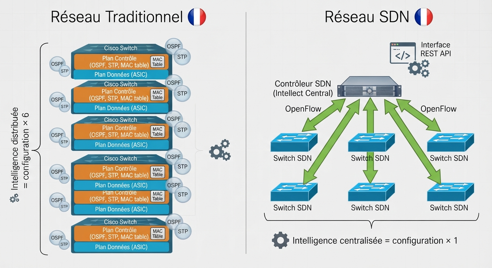
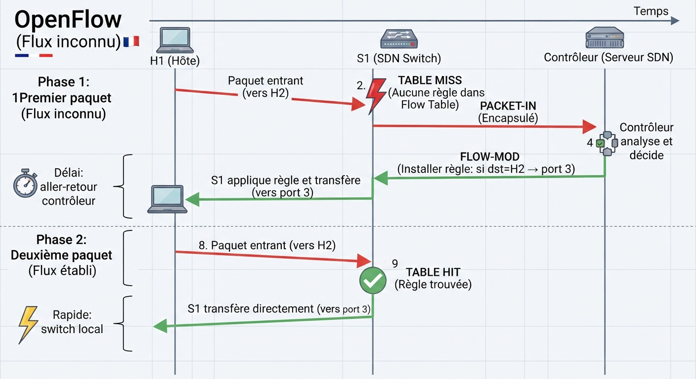
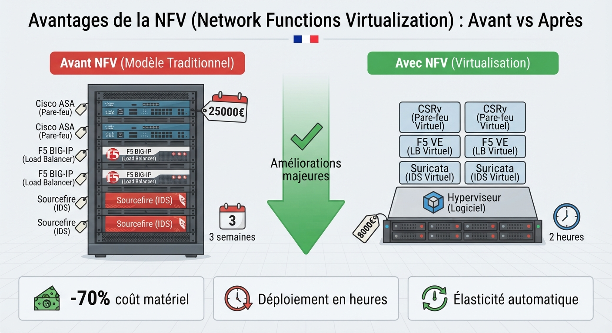
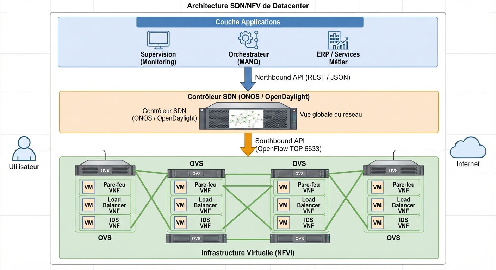
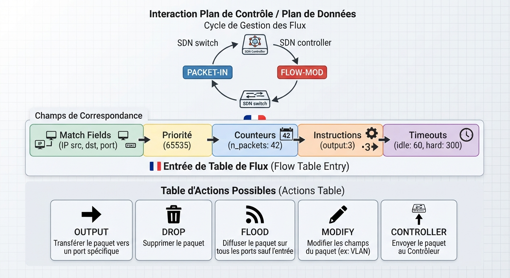

# 📘 FICHE DE COURS — S4 · 3ᵉ ANNÉE · E31
## SDN : Plan Contrôle/Données · OpenFlow · NFV · Contrôleur · Architecture

---

> **Nom** : ___________________________
> **Date** : ___________________________
> **Compétences travaillées** : S6.1 · S6.2 · S6.3 · C2.2 · C3.1

---

## 🔑 Vocabulaire clé à maîtriser

| Terme | Définition |
|---|---|
| **SDN** | Software-Defined Networking — architecture réseau qui centralise la logique de contrôle dans un logiciel |
| **Plan de contrôle** | Couche qui décide comment acheminer les paquets (calcul de routes, politiques) |
| **Plan de données** | Couche qui transmet physiquement les paquets selon les règles du plan de contrôle |
| **Plan de gestion** | Couche qui administre les équipements (SSH, SNMP, interface web) |
| **Contrôleur SDN** | Logiciel centralisé qui programme les équipements réseau via des API |
| **OpenFlow** | Protocole standardisé (IEEE) entre le contrôleur et les switches SDN — interface southbound |
| **Flow Table** | Table de règles dans un switch SDN : chaque règle définit "si paquet X → action Y" |
| **Northbound API** | Interface entre le contrôleur et les applications de gestion (REST/JSON) |
| **Southbound API** | Interface entre le contrôleur et les équipements réseau (OpenFlow, NETCONF…) |
| **NFV** | Network Functions Virtualization — déployer des fonctions réseau sur VMs plutôt que sur matériel dédié |
| **VNF** | Virtual Network Function — une fonction réseau (pare-feu, routeur, LB…) sur une VM |
| **Open vSwitch** | Switch virtuel open source supportant OpenFlow — utilisé dans Mininet et les hyperviseurs |
| **Mininet** | Émulateur de réseau SDN sur Linux — crée des topologies virtuelles légères |
| **ONOS/OpenDaylight** | Contrôleurs SDN open source — "le cerveau" du réseau SDN |

---

## 1️⃣ — Le problème des réseaux traditionnels

### Intelligence distribuée = configuration distribuée

Dans un réseau traditionnel, chaque équipement est **autonome** : il contient son propre plan de contrôle (OSPF, STP, tables MAC…) ET son propre plan de données.

```
Switch Cisco traditionnel :
┌─────────────────────────────────────┐
│  PLAN DE CONTRÔLE                   │
│  (STP, OSPF, table MAC, ACL...)     │  ← Intelligence locale
│  PLAN DE DONNÉES                    │
│  (ASIC de forwarding, ports)        │  ← Transmission physique
└─────────────────────────────────────┘
```

**Conséquences** :
- Configurer 500 switches = 500 sessions SSH ou SNMP
- Un changement de politique = 500 modifications manuelles
- La "vue globale" du réseau n'existe que dans la tête de l'admin
- Chaque constructeur a sa propre CLI, ses propres protocoles propriétaires

### La promesse SDN

```
"Et si on sortait le plan de contrôle des équipements réseau
et on le centralisait dans un logiciel ?"
→ Les équipements deviennent de simples "pipelines"
→ Le contrôleur a une vue globale et programme chaque équipement
→ Changement de politique = 1 commande propagée partout
```

---

**🖼️ ILLUSTRATION 1**
> *Légende* : Comparaison côte à côte "Réseau traditionnel" vs "Réseau SDN". Gauche : 6 switches Cisco avec à l'intérieur de chaque switch deux couches (contrôle en orange dessus, données en bleu dessous). Chaque switch a une petite bulle "OSPF", "STP", "table MAC" — intelligence distribuée. Droite : 6 switches "stupides" (seulement la couche bleue "données") reliés par des flèches vertes à un serveur central "Contrôleur SDN" qui contient toute l'intelligence. OpenFlow est indiqué sur les flèches. Une application REST est au-dessus du contrôleur.
>
> 

---

## 2️⃣ — L'architecture SDN : 3 plans et 2 interfaces

### Les 3 plans (ou couches)

```
┌──────────────────────────────────────────────────────────┐
│  PLAN D'APPLICATION (Application Layer)                  │
│  Applications métier, orchestrateurs, scripts Python     │
│  ERP réseau, monitoring, détection d'intrusion, SD-WAN   │
└───────────────────────┬──────────────────────────────────┘
                        │
              ◄ Northbound API ►
              (REST/JSON, OpenStack...)
                        │
┌───────────────────────▼──────────────────────────────────┐
│  PLAN DE CONTRÔLE (Control Layer) = CONTRÔLEUR SDN      │
│  Vue globale du réseau · Calcul des chemins              │
│  Politiques de sécurité · Gestion des flux              │
│  Exemples : OpenDaylight, ONOS, Ryu, Cisco ACI          │
└───────────────────────┬──────────────────────────────────┘
                        │
              ◄ Southbound API ►
              (OpenFlow, NETCONF, gRPC...)
                        │
┌───────────────────────▼──────────────────────────────────┐
│  PLAN DE DONNÉES (Data/Infrastructure Layer)             │
│  Switches et routeurs SDN · Open vSwitch                 │
│  Transmettent les paquets selon les règles reçues        │
│  Pas d'intelligence locale (ou minimale)                 │
└──────────────────────────────────────────────────────────┘
```

### Les 2 interfaces clés

| Interface | Direction | Protocoles | Rôle |
|---|---|---|---|
| **Northbound API** | Contrôleur ↔ Applications | REST, JSON, Python SDK | Permet aux apps de programmer le réseau |
| **Southbound API** | Contrôleur ↔ Équipements | **OpenFlow**, NETCONF, gRPC | Permet au contrôleur de programmer les switches |

> 💡 **Analogie** : Le contrôleur est comme un chef d'orchestre (vision globale, donne les partitions). Les switches sont comme les musiciens (exécutent fidèlement ce qu'on leur dit). L'audience (applications) indique quel morceau jouer.

---

## 3️⃣ — OpenFlow : le protocole southbound de référence

### Principe des flow tables

Chaque switch SDN possède une ou plusieurs **flow tables** (tables de flux). Une entrée dans la flow table est appelée une **flow entry** et contient :

```
┌──────────────┬──────────────┬──────────────┬──────────────┐
│ Match Fields │   Priority   │   Counters   │  Instructions│
│ (qui ?)      │ (ordre eval) │ (stats)      │ (quoi faire?)│
└──────────────┴──────────────┴──────────────┴──────────────┘

Match Fields = critères de correspondance :
  Adresse MAC src/dst · IP src/dst · Port TCP/UDP
  VLAN ID · Type de protocole · Interface d'entrée...

Instructions (actions) :
  FORWARD     → envoyer sur un port spécifique
  DROP        → jeter le paquet
  FLOOD       → envoyer sur tous les ports
  CONTROLLER  → envoyer au contrôleur pour décision
  MODIFY      → modifier un champ de l'en-tête (ex: VLAN tag)
```

### Cycle de vie d'un flux OpenFlow

```
Étape 1 — TABLE MISS : premier paquet du flux, aucune règle dans la flow table
  Switch → Contrôleur : PACKET-IN (voici ce paquet, que faire ?)

Étape 2 — DÉCISION : le contrôleur analyse le paquet
  Contrôleur → Switch : FLOW-MOD (installe cette règle)
  Règle : "si IP src=192.168.1.10 et IP dst=192.168.2.20 → forward port 3"

Étape 3 — TRAITEMENT : les paquets suivants du même flux
  Switch consulte la flow table → règle trouvée → forward directement
  Pas d'aller-retour contrôleur pour chaque paquet → haute performance

Étape 4 — EXPIRATION : les règles ont un timeout
  Idle timeout : supprimée si aucun paquet correspondant pendant X secondes
  Hard timeout  : supprimée après X secondes absolues
```

---

**🖼️ ILLUSTRATION 2**
> *Légende* : Diagramme de séquence OpenFlow. Trois acteurs verticaux : H1 (hôte), S1 (switch SDN), Contrôleur. Séquence : H1 envoie un paquet → S1 (Table Miss, flèche rouge "aucune règle") → S1 envoie Packet-In au contrôleur → Contrôleur analyse → Contrôleur envoie Flow-Mod à S1 → S1 confirme et forwarde vers H2. Deuxième paquet de H1 : S1 consulte la flow table (flèche verte "règle trouvée") → forwarde directement sans passer par le contrôleur. Timeline annotée avec "délai" sur le premier paquet et "rapide" sur les suivants.
>
> 

---

## 4️⃣ — NFV : virtualiser les fonctions réseau

### Appliance physique vs VNF

```
AVANT NFV (réseau physique) :
  Pare-feu Cisco ASA  → boîtier dédié 4U
  Load Balancer F5    → boîtier dédié 2U
  IDS Sourcefire      → boîtier dédié 2U
  Optimiseur WAN      → boîtier dédié 1U
  ─────────────────────────────────────────
  Total : 9U de rack · 25 000€ · 3 semaines de délai

AVEC NFV (virtualisation) :
  Serveur standard x86 (2U, 5 000€)
  + Hyperviseur (VMware ESXi ou KVM)
  + VMs :
    Cisco CSRv (pare-feu virtuel)
    F5 BIG-IP VE (load balancer virtuel)
    Suricata VM (IDS virtuel)
    Cisco vWAAS (optimiseur WAN virtuel)
  ─────────────────────────────────────────
  Total : 2U · ~8 000€ tout compris · 2h de déploiement
```

### Architecture NFV selon l'ETSI

```
┌─────────────────────────────────────────────────────────┐
│  OSS/BSS  (systèmes d'exploitation et de gestion)      │
└─────────────────────────────────────────────────────────┘
              ↕ API                    ↕ API
┌─────────────────────┐  ┌───────────────────────────────┐
│    MANO             │  │   VNF 1    VNF 2    VNF 3      │
│ (Management and    │  │ (Pare-feu)(LB)   (IDS)         │
│  Orchestration)    │  └───────────────────────────────┘
└─────────────────────┘              ↕
                        ┌──────────────────────────────────┐
                        │  NFVI (NFV Infrastructure)       │
                        │  Compute · Storage · Network     │
                        │  (serveurs x86 + SDN)            │
                        └──────────────────────────────────┘
```

### Cas d'usage NFV réels

```
Opérateurs télécom :
  → vEPC (Evolved Packet Core virtuel) dans les réseaux 4G/5G
  → vCPE (Customer Premises Equipment virtuel) — box internet virtuelle

Datacenter / Cloud :
  → Pare-feux virtuels dans AWS, Azure, GCP
  → Load balancers AWS ALB/NLB = NFV

Entreprises :
  → SD-WAN (Software-Defined WAN) = NFV + SDN appliqués aux liens WAN
  → Cisco Meraki, VMware SD-WAN, Fortinet SD-WAN
```

---

**🖼️ ILLUSTRATION 3**
> *Légende* : Infographie "Avant NFV vs Avec NFV" côte à côte. Gauche : rack physique avec 6 boîtiers dédiés empilés (pare-feu, LB, IDS, etc.) avec étiquettes de coût et délai. Droite : 1 serveur avec l'icône hyperviseur, et 6 VMs représentées par de petits rectangles colorés (Cisco CSRv, F5 VE, Snort, etc.). Flèches vers le bas montrant les économies : "- 70% coût matériel", "déploiement en heures vs semaines", "élasticité (scale up/down)".
>
> 

---

## 5️⃣ — SDN en pratique : Mininet et Open vSwitch

### Mininet : émulateur SDN

Mininet permet de créer des réseaux SDN **virtuels** sur une seule machine Linux. Les switches sont des instances d'**Open vSwitch** (OVS), les hôtes sont des namespaces Linux.

```
Avantages :
  ✓ Gratuit et open source
  ✓ Tourne sur un simple laptop
  ✓ Supporte OpenFlow natif
  ✓ Topologies programmables en Python
  ✗ Émulation (pas de performance réelle)
  ✗ Pas de support de tous les protocoles réseau
```

### Commandes Mininet essentielles

```bash
# Lancer une topologie simple (1 switch, 2 hôtes)
$ sudo mn

# Topologies prédéfinies
$ sudo mn --topo linear,3        # 3 switches en ligne : h1-s1-s2-s3-h2
$ sudo mn --topo tree,2,2        # Arbre : 1 racine, 4 feuilles
$ sudo mn --topo single,4        # 1 switch central, 4 hôtes

# Dans le CLI Mininet :
mininet> pingall                  # Ping entre tous les hôtes
mininet> h1 ping -c 3 h2         # 3 pings h1 → h2
mininet> h1 ifconfig              # Config réseau de h1
mininet> dump                     # Informations sur tous les nœuds
mininet> net                      # Topologie et liens
mininet> sh ovs-ofctl dump-flows s1   # Flow table du switch s1
mininet> exit                     # Quitter

# Depuis le shell Linux (pas dans Mininet)
$ sudo ovs-ofctl dump-flows s1    # Flow tables en dehors de Mininet
$ sudo ovs-vsctl show             # État d'Open vSwitch
```

### Lire une flow table Open vSwitch

```
$ sudo ovs-ofctl dump-flows s1

NXST_FLOW reply:
 cookie=0x0, duration=12.456s, table=0, n_packets=5, n_bytes=210,
   idle_age=2, priority=65535,arp,in_port=1,
   vlan_tci=0x0000,dl_src=00:00:00:00:00:01
   actions=output:2

Décoder chaque champ :
  cookie       = identifiant de la règle
  duration     = depuis combien de secondes cette règle existe
  n_packets    = nombre de paquets ayant correspondu
  priority     = priorité d'évaluation (plus haut = évalué en premier)
  arp          = type de protocole correspondant (ARP ici)
  in_port=1    = paquet reçu sur le port 1
  actions=output:2  = action : envoyer sur le port 2
```

---

## 6️⃣ — SDN vs Réseau traditionnel : bilan comparatif

```
                    RÉSEAU TRADITIONNEL    SDN
Configuration       Par équipement         Centralisée (1 contrôleur)
Vue du réseau       Partielle (locale)     Globale (contrôleur voit tout)
Protocoles          Propriétaires (Cisco)  Standards ouverts (OpenFlow)
Flexibilité         Faible (firmware fixe) Haute (programmable par API)
Automatisation      Difficile (CLI)        Native (API REST, Python)
Performance         Optimale (ASIC)        Légèrement réduite (logiciel)
Résilience          OSPF, STP              Dépend du contrôleur (SPOF !)
Complexité initiale Connue                 Nouvelle courbe d'apprentissage
Cas d'usage         Tout réseau            Datacenter, cloud, campus moderne
```

---

**🖼️ ILLUSTRATION 4**
> *Légende* : Vue d'ensemble complète d'une architecture SDN/NFV dans un datacenter. De haut en bas : couche Application (monitoring, orchestrateur, ERP) avec des icônes d'apps ; flèche "Northbound REST API" ; couche Contrôleur SDN (ONOS/OpenDaylight) avec mention "Vue globale du réseau" ; flèche "Southbound OpenFlow" ; couche Infrastructure avec des switches OVS, reliés à des VMs hébergeant des VNFs (pare-feu VM, LB VM, IDS VM). Un utilisateur final à gauche et Internet à droite complètent le tableau.
>
> 

---

**🖼️ ILLUSTRATION 5**
> *Légende* : Schéma de la flow table OpenFlow avec une entrée de flux typique, chaque champ annoté. Au-dessus, le cycle complet Packet-In / Flow-Mod expliqué avec des icônes. En dessous, un mini-tableau des actions OpenFlow les plus courantes (output, drop, flood, modify, controller) avec leur signification en français.
>
> 

---

## 📌 Les essentiels à retenir pour l'examen

> ✅ SDN = **Plan de contrôle** (décide) séparé du **plan de données** (transmet)
> ✅ **Contrôleur SDN** = "le cerveau" centralisé (OpenDaylight, ONOS, Cisco ACI)
> ✅ **Northbound API** = contrôleur ↔ applications (REST/JSON) — "vers le haut"
> ✅ **Southbound API** = contrôleur ↔ switches (**OpenFlow** — protocole TCP 6633)
> ✅ **Flow table** = règles dans un switch SDN : "si paquet X → action Y"
> ✅ **Table miss** = premier paquet sans règle → envoyé au contrôleur (Packet-In)
> ✅ **Flow-Mod** = message du contrôleur pour installer une règle dans un switch
> ✅ **NFV** = fonctions réseau (pare-feu, LB, IDS) sur VMs plutôt que matériel dédié
> ✅ **VNF** = Virtual Network Function = une fonction réseau virtualisée
> ✅ **Mininet** = émulateur SDN open source sur Linux, utilise Open vSwitch
> ✅ Avantage SDN : programmabilité, automatisation, vue globale
> ✅ Limite SDN : contrôleur = point de défaillance unique (SPOF)

---

*Fiche de Cours — BAC PRO CIEL | E31 Administration Systèmes | 3ᵉ année S4*
*Compétences : S6.1 · S6.2 · S6.3 · C2.2 · C3.1*
