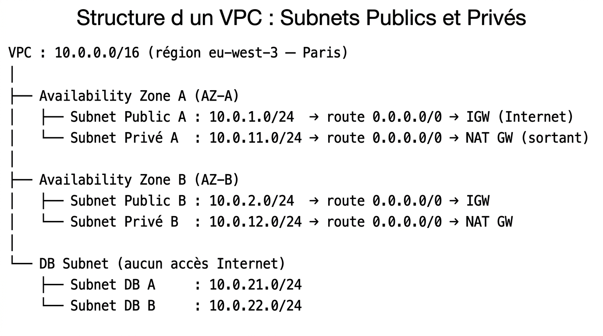
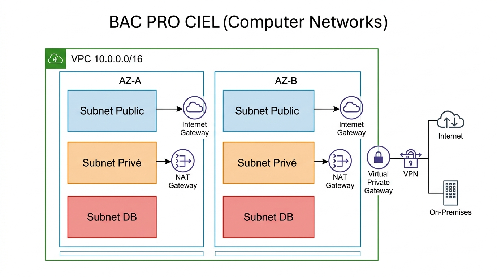
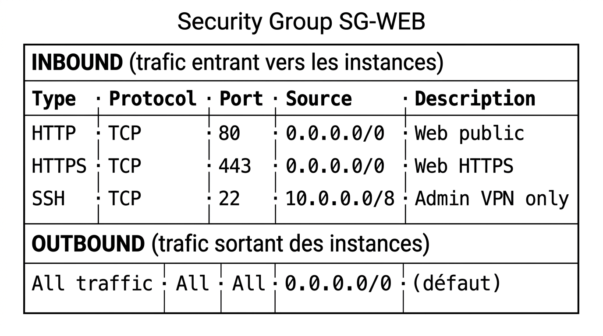
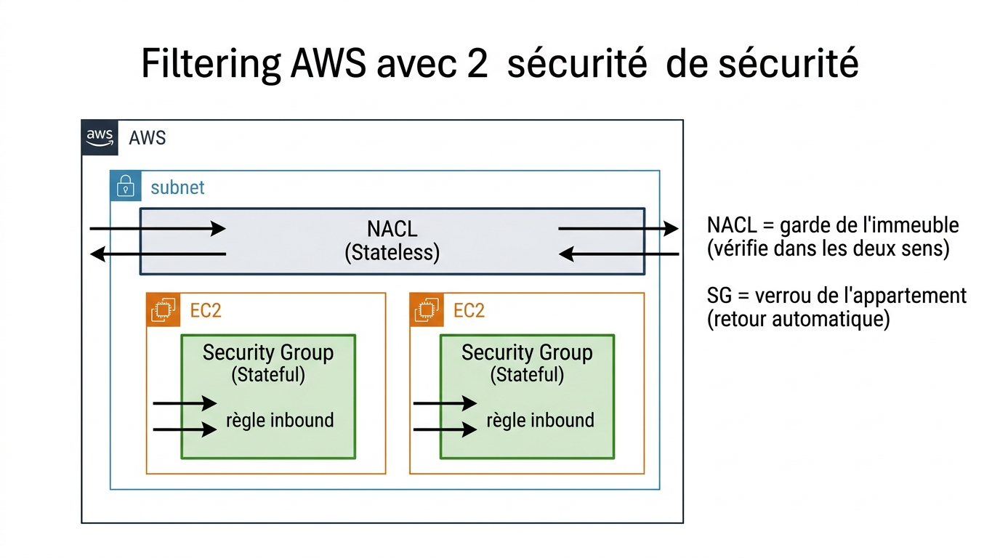
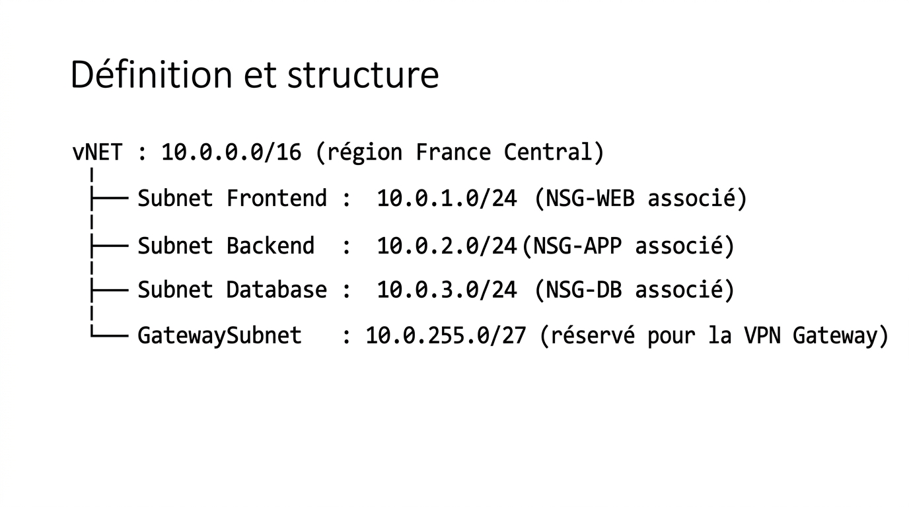
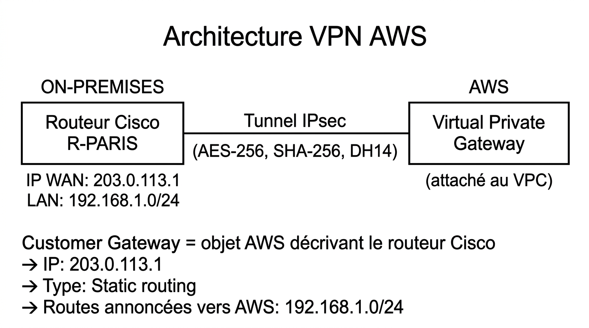
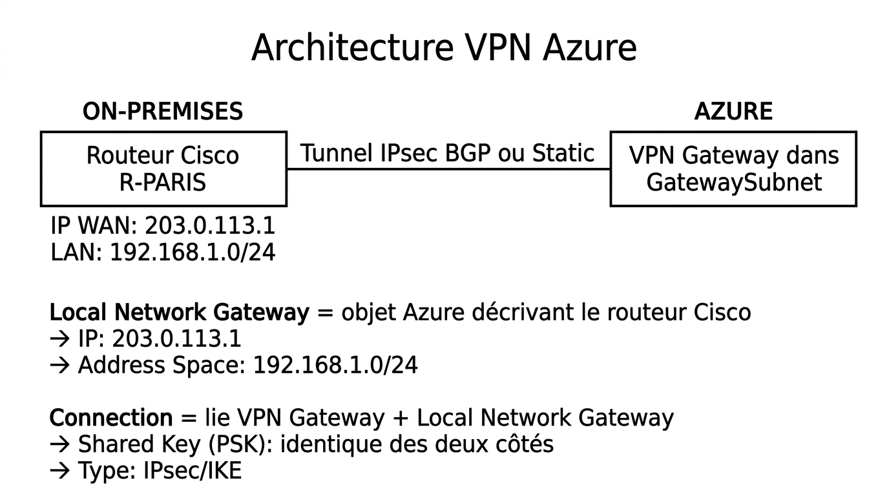

# 📖 FICHE COURS – S5 ANNÉE 3 – E31
## Cloud Networking : AWS VPC, Azure vNET, Security Groups, NSG, Routage Cloud, VPN Hybride

**Nom : ________________  Prénom : ________________**

---

## 🎯 OBJECTIFS

- ✅ Concevoir un VPC AWS et un vNET Azure avec subnets publics/privés
- ✅ Configurer Security Groups (AWS) et NSG (Azure) pour filtrer le trafic
- ✅ Distinguer comportement stateful (SG) et stateless (NACL)
- ✅ Comprendre le routage dans le cloud (Internet Gateway, NAT, route tables)
- ✅ Connecter un réseau on-premises au cloud via VPN IPsec

---

## 1️⃣ LE CLOUD : UN RÉSEAU COMME LES AUTRES (MAIS MANAGÉ)

### Ce que vous connaissez déjà

> Le cloud networking réutilise exactement les mêmes concepts qu'un réseau physique : adressage IP, subnets CIDR, routage, filtrage de trafic, VPN. La différence fondamentale est que l'infrastructure physique (câbles, switches, routeurs) est **gérée par le fournisseur cloud** (AWS, Azure, GCP). Vous n'interagissez qu'avec des objets logiques via une console web ou une API.

### Les deux grands acteurs du marché

| **Fournisseur** | **Service réseau** | **Part de marché 2025** |
|---|---|---|
| **Amazon Web Services (AWS)** | Virtual Private Cloud (VPC) | ~32% |
| **Microsoft Azure** | Virtual Network (vNET) | ~23% |
| Google Cloud Platform (GCP) | VPC | ~11% |

---

## 2️⃣ AWS VPC — VIRTUAL PRIVATE CLOUD

### Définition

> Un **VPC** (Virtual Private Cloud) est un réseau privé virtuel isolé dans l'infrastructure AWS. Il est défini par un **bloc CIDR** (ex: `10.0.0.0/16`) et contient des **subnets**, des **route tables**, des **Security Groups** et des passerelles.

> **Analogie :** Un VPC = votre réseau d'entreprise complet, mais dans le datacenter d'Amazon. Vous en êtes l'administrateur, AWS fournit l'infrastructure physique.

---

### Structure d'un VPC : Subnets Publics et Privés



??? note "🔤 Schéma texte original"
    ```
    VPC : 10.0.0.0/16 (région eu-west-3 — Paris)
    │
    ├── Availability Zone A (AZ-A)
    │   ├── Subnet Public A   : 10.0.1.0/24  → route 0.0.0.0/0 → IGW (Internet)
    │   └── Subnet Privé A    : 10.0.11.0/24 → route 0.0.0.0/0 → NAT GW (sortant)
    │
    ├── Availability Zone B (AZ-B)
    │   ├── Subnet Public B   : 10.0.2.0/24  → route 0.0.0.0/0 → IGW
    │   └── Subnet Privé B    : 10.0.12.0/24 → route 0.0.0.0/0 → NAT GW
    │
    └── DB Subnet (aucun accès Internet)
        ├── Subnet DB A       : 10.0.21.0/24
        └── Subnet DB B       : 10.0.22.0/24
    ```


| **Type de subnet** | **Caractéristique** | **Exemples d'usage** |
|---|---|---|
| **Public** | Route 0.0.0.0/0 → Internet Gateway → accessible depuis Internet | Load Balancer, Bastion Host |
| **Privé** | Route 0.0.0.0/0 → NAT Gateway → accès sortant seulement | Serveurs applicatifs, API |
| **Isolé** | Aucune route vers Internet | Bases de données, données sensibles |

> **Availability Zone (AZ)** : Datacenter physiquement séparé dans la même région. Déployer sur 2 AZ = haute disponibilité (panne d'une AZ → l'autre reste active).

---



> **Légende :** Architecture VPC 3-tier typique sur AWS. Les subnets publics hébergent les services exposés à Internet (via l'Internet Gateway). Les subnets privés accèdent à Internet uniquement en sortie (via la NAT Gateway). Les subnets DB sont totalement isolés. La déployée sur deux Availability Zones assure la haute disponibilité.

---

### Internet Gateway (IGW)

> Une **Internet Gateway** est un composant attaché au VPC qui permet au trafic d'entrer et sortir vers Internet. **Elle n'est pas automatique** — il faut l'attacher au VPC ET ajouter une route dans la route table du subnet public.

```
Route table subnet public :
  Destination     Cible
  10.0.0.0/16     local           ← Trafic interne au VPC
  0.0.0.0/0       igw-xxxxxxxx    ← Tout le reste → Internet via IGW
```

### NAT Gateway

> Une **NAT Gateway** permet aux instances dans un subnet **privé** d'accéder à Internet en sortie (mises à jour, téléchargements) sans être accessibles depuis Internet. Elle est déployée dans un subnet **public**.

```
Route table subnet privé :
  Destination     Cible
  10.0.0.0/16     local
  0.0.0.0/0       nat-xxxxxxxx    ← Sortie Internet via NAT Gateway (dans subnet public)
```

> ⚠️ La NAT Gateway est **payante** (à l'heure + au Go de données). Ne pas oublier de la supprimer quand elle n'est plus nécessaire en environnement de test.

---

## 3️⃣ SÉCURITÉ AWS : SECURITY GROUPS ET NACL

### Security Group — Pare-feu des instances (stateful)

> Un **Security Group** (SG) est un pare-feu associé à une ou plusieurs instances EC2. Il définit les règles de trafic entrant (**inbound**) et sortant (**outbound**).

**Caractéristique fondamentale : stateful**

> Un SG est **stateful** : si une règle inbound permet TCP port 443, la réponse sortante est automatiquement autorisée — sans règle outbound explicite. C'est le même comportement qu'une ACL stateful (comme en WPA2-Enterprise S8-A2 ou comme le suivi de connexion d'un firewall).



??? note "🔤 Schéma texte original"
    ```
    Security Group SG-WEB :
      ┌─────────────────────────────────────────────────────────┐
      │ INBOUND (trafic entrant vers les instances)              │
      │  Type     Protocol  Port  Source          Description    │
      │  HTTP      TCP       80   0.0.0.0/0       Web public     │
      │  HTTPS     TCP       443  0.0.0.0/0       Web HTTPS      │
      │  SSH       TCP       22   10.0.0.0/8      Admin VPN only │
      │                                                          │
      │ OUTBOUND (trafic sortant des instances)                  │
      │  All traffic  All  All   0.0.0.0/0        (défaut)       │
      └─────────────────────────────────────────────────────────┘
    ```


**Règle par défaut :** par défaut, tout le trafic entrant est **bloqué** et tout le trafic sortant est **autorisé** dans un Security Group.

> 💡 **Référence Security Group → Security Group :** On peut définir une source/destination non pas par une IP mais par un autre Security Group. Ex : autoriser TCP 3306 (MySQL) depuis SG-APP (les instances de la couche applicative) vers SG-DB. Très pratique pour les architectures multi-tiers.

---

### NACL — Pare-feu du subnet (stateless)

> Un **NACL** (Network Access Control List) est un pare-feu attaché à un **subnet entier**. Il est **stateless** (comme les ACL Cisco que vous connaissez de S5-A2).

| **Critère** | **Security Group** | **NACL** |
|---|---|---|
| Niveau | Instance (EC2) | Subnet entier |
| Comportement | **Stateful** (retour automatique) | **Stateless** (règle retour obligatoire) |
| Règles par défaut | Tout bloqué en entrée | Tout autorisé (AWS) |
| Ordre des règles | Toutes évaluées | Par numéro croissant (s'arrête au premier match) |
| Usage principal | Filtrage fin par instance | Première ligne de défense au niveau subnet |

**Exemple NACL — Bloquer une IP suspecte :**

```
NACL Subnet Public :
  Règle  Type     Protocol  Port     Source          Action
  100    HTTP     TCP        80      0.0.0.0/0       ALLOW
  110    HTTPS    TCP        443     0.0.0.0/0       ALLOW
  120    SSH      TCP        22      203.0.113.5/32  DENY    ← IP suspecte bloquée
  200    All      All        All     0.0.0.0/0       ALLOW
  *      All      All        All     0.0.0.0/0       DENY    ← Règle finale implicite
```

> ⚠️ **Règle de retour obligatoire (stateless) :** Pour autoriser les connexions TCP initiées depuis Internet, il faut aussi autoriser le trafic de retour sur les ports éphémères (1024–65535).

---



> **Légende :** Deux couches de sécurité complémentaires dans AWS. La NACL (stateless) protège l'ensemble du subnet — toute règle doit être bidirectionnelle. Le Security Group (stateful) protège chaque instance individuellement — la réponse au trafic autorisé en entrée sort automatiquement. En pratique, la NACL sert à bloquer des IP ou des ports pour tout un subnet, le SG sert au filtrage précis par instance et par rôle.

---

## 4️⃣ AZURE vNET — VIRTUAL NETWORK

### Définition et structure

> Un **vNET** (Virtual Network) est l'équivalent Azure du VPC AWS. Il est défini par un **address space** (ex: `10.0.0.0/16`) subdivisé en **subnets**.



??? note "🔤 Schéma texte original"
    ```
    vNET : 10.0.0.0/16 (région France Central)
    ├── Subnet Frontend   : 10.0.1.0/24   (NSG-WEB associé)
    ├── Subnet Backend    : 10.0.2.0/24   (NSG-APP associé)
    ├── Subnet Database   : 10.0.3.0/24   (NSG-DB associé)
    └── GatewaySubnet     : 10.0.255.0/27 (réservé pour la VPN Gateway)
    ```


> **GatewaySubnet** : Azure exige un subnet spécifiquement nommé `GatewaySubnet` pour y déployer la VPN Gateway. Il doit faire au minimum /29 (Azure recommande /27).

---

### NSG — Network Security Group (Azure)

> Un **NSG** (Network Security Group) est l'équivalent Azure du Security Group AWS, mais avec des différences importantes.

**Où s'applique un NSG :**
1. Sur une **NIC** (Network Interface Card) d'une VM — niveau instance
2. Sur un **Subnet** entier — niveau réseau

**Structure des règles NSG :**

```
NSG-WEB (associé au Subnet Frontend) :
  Règle    Priorité  Protocole  Port   Source              Direction  Action
  Allow-HTTP   100   TCP         80   Internet (tag)       Inbound    Allow
  Allow-HTTPS  110   TCP        443   Internet (tag)       Inbound    Allow
  Allow-SSH    200   TCP         22   VpnClientAddresses   Inbound    Allow
  Deny-All    4096   Any         Any   Any                 Inbound    Deny
```

> **Service Tags Azure** : Azure fournit des tags prédéfinis comme `Internet`, `VirtualNetwork`, `AzureLoadBalancer` utilisables comme source/destination dans les règles NSG — évite de saisir des plages IP manuellement.

| **Critère** | **Security Group AWS** | **NSG Azure** |
|---|---|---|
| Comportement | Stateful | **Stateful** (comme les SG) |
| Association | Instance seulement | Instance **ET/OU** Subnet |
| Règles par défaut | Tout bloqué inbound | 3 règles allow par défaut (vNET local, LB Azure, bloquer tout le reste) |
| Ordre | Toutes évaluées | Par **priorité** (100–4096, plus bas = plus prioritaire) |
| Numéro max | — | 4096 = règle deny-all de fond |

---

## 5️⃣ ROUTAGE DANS LE CLOUD

### Route Tables AWS

> Chaque subnet est associé à une **route table** qui détermine où envoyer le trafic selon la destination. Le routage fonctionne exactement comme une table de routage IOS.

```
Route Table subnet public :
  Destination    Target
  10.0.0.0/16   local        ← Trafic VPC interne
  0.0.0.0/0     igw-xxxxx    ← Internet via IGW

Route Table subnet privé :
  Destination    Target
  10.0.0.0/16   local
  0.0.0.0/0     nat-xxxxx    ← Internet sortant via NAT GW
  10.100.0.0/16 vgw-xxxxx    ← Réseau on-premises via VPN
```

### User-Defined Routes (UDR) Azure

> Azure équivalent des route tables AWS. Par défaut, Azure gère le routage automatiquement (system routes). Les UDR permettent de personnaliser.

```
UDR Frontend-RT associée au Subnet Frontend :
  Préfixe         Next Hop Type        Next Hop IP
  10.0.0.0/16     VirtualNetwork       —
  0.0.0.0/0       VirtualAppliance     10.0.250.4   ← Firewall NVA
  10.100.0.0/16   VirtualNetworkGw     —            ← On-premises via VPN
```

---

## 6️⃣ VPN SITE-À-SITE CLOUD ↔ ON-PREMISES

### Le lien direct avec S7-A2

> En S7-A2, vous avez configuré un VPN IPsec entre deux routeurs Cisco. Le **mécanisme est rigoureusement identique** dans le cloud — seul le "routeur" côté cloud est un service managé (Virtual Private Gateway sur AWS, VPN Gateway sur Azure).

### Architecture VPN AWS



??? note "🔤 Schéma texte original"
    ```
    ON-PREMISES                              AWS
    ━━━━━━━━━━━━━━━━━━━━━                    ━━━━━━━━━━━━━━━━━━━━━━━━
    [Routeur Cisco R-PARIS]                  [Virtual Private Gateway]
     IP WAN: 203.0.113.1                      (attaché au VPC)
     LAN: 192.168.1.0/24                          │
            │                                      │
            └────── Tunnel IPsec ──────────────────┘
                    (AES-256, SHA-256, DH14)

    Customer Gateway = objet AWS décrivant le routeur Cisco
      → IP: 203.0.113.1
      → Type: Static routing
      → Routes annoncées vers AWS: 192.168.1.0/24
    ```


### Correspondance S7-A2 → AWS

| **Cisco IOS (S7-A2)** | **AWS Console** |
|---|---|
| `crypto isakmp policy` | Phase 1 parameters (AES-256, SHA-256, DH group 14) |
| `crypto ipsec transform-set` | Phase 2 parameters (ESP-AES-256, SHA-256, tunnel mode) |
| `crypto isakmp key PSK` | Pre-Shared Key de la connexion VPN |
| `crypto map + set peer` | Connection VPN → Customer Gateway Target |
| `standby X track GigX 30` | — (géré par AWS) |
| Route statique vers le réseau distant | Route vers 192.168.1.0/24 via vgw-xxxxx |

---

### Architecture VPN Azure



??? note "🔤 Schéma texte original"
    ```
    ON-PREMISES                              AZURE
    ━━━━━━━━━━━━━━━━━━━━━                    ━━━━━━━━━━━━━━━━━━━━━━━
    [Routeur Cisco R-PARIS]                  [VPN Gateway dans GatewaySubnet]
     IP WAN: 203.0.113.1                          │
     LAN: 192.168.1.0/24                          │
            │                                      │
            └────── Tunnel IPsec BGP ou Static ────┘

    Local Network Gateway = objet Azure décrivant le routeur Cisco
      → IP: 203.0.113.1
      → Address Space: 192.168.1.0/24

    Connection = lie VPN Gateway + Local Network Gateway
      → Shared Key (PSK): identique des deux côtés
      → Type: IPsec/IKE
    ```


---

### Configuration Cisco IOS pour se connecter à AWS/Azure

> La configuration côté routeur Cisco **reprend exactement la syntaxe S7-A2** — seules les IPs et PSK changent :

```ios
! Configuration côté routeur on-premises (Cisco IOS) vers AWS :
crypto isakmp policy 10
  encryption aes 256
  hash sha256
  authentication pre-share
  group 14

crypto isakmp key <PSK_FOURNI_PAR_AWS> address <IP_VGW_AWS>

crypto ipsec transform-set TS_AWS esp-aes 256 esp-sha256-hmac
  mode tunnel

ip access-list extended ACL_VERS_AWS
  permit ip 192.168.1.0 0.0.0.255 10.0.0.0 0.0.255.255

crypto map CMAP_AWS 10 ipsec-isakmp
  set peer <IP_VGW_AWS>
  set transform-set TS_AWS
  match address ACL_VERS_AWS

interface GigabitEthernet0/1    ! Interface WAN
  crypto map CMAP_AWS
```

---

## 7️⃣ TABLEAU RÉCAPITULATIF GLOBAL

| **Objet réseau** | **Physique (A2)** | **AWS** | **Azure** |
|---|---|---|---|
| Réseau privé | LAN / VLAN | **VPC** | **vNET** |
| Sous-réseau | Subnet CIDR | **Subnet** (dans AZ) | **Subnet** |
| Firewall instance | ACL sur interface | **Security Group** (stateful) | **NSG** (stateful) |
| Firewall subnet | ACL VLAN | **NACL** (stateless) | **NSG sur subnet** |
| Passerelle Internet | Routeur + NAT | **Internet Gateway** | Intégré |
| NAT sortant | NAT/PAT | **NAT Gateway** | **Azure NAT** |
| Routeur VPN | Cisco `crypto map` | **Virtual Private Gateway** | **VPN Gateway** |
| Routeur distant | Cisco IOS | **Customer Gateway** | **Local Network Gateway** |
| Routing table | `ip route` / OSPF | **Route Table** | **UDR** |
| Interco réseaux | Trunk / OSPF | **VPC Peering** | **vNET Peering** |

---

## ✅ AUTO-ÉVALUATION

- [ ] Je sais définir un VPC AWS et un vNET Azure
- [ ] Je sais distinguer subnet public (IGW) et subnet privé (NAT GW)
- [ ] Je sais écrire une règle Security Group AWS (inbound, TCP, port, source)
- [ ] Je comprends que Security Group = stateful (pas besoin de règle retour)
- [ ] Je comprends que NACL = stateless (règle retour obligatoire)
- [ ] Je sais associer un NSG à un subnet Azure et lui donner une priorité
- [ ] Je comprends le rôle d'une Route Table / UDR dans le routage cloud
- [ ] Je sais que le VPN site-à-site cloud utilise le même protocole IPsec qu'en S7-A2
- [ ] Je sais nommer le VPN Gateway AWS (Virtual Private Gateway) et Azure (VPN Gateway)

---

## 📚 VOCABULAIRE CLEF

| **Terme** | **Définition** |
|---|---|
| **VPC** | Virtual Private Cloud — réseau privé isolé dans AWS |
| **vNET** | Virtual Network — réseau privé isolé dans Azure |
| **AZ** | Availability Zone — datacenter physiquement séparé dans une même région cloud |
| **Internet Gateway** | Composant AWS permettant les communications Internet depuis/vers un VPC |
| **NAT Gateway** | Composant AWS permettant l'accès Internet sortant depuis un subnet privé |
| **Security Group** | Pare-feu stateful attaché à des instances AWS |
| **NACL** | Network Access Control List — pare-feu stateless attaché à un subnet AWS |
| **NSG** | Network Security Group — pare-feu Azure attaché à un subnet ou une NIC |
| **Route Table / UDR** | Table de routage dans le cloud (AWS / Azure) |
| **Virtual Private Gateway** | Composant AWS côté cloud du VPN site-à-site |
| **Customer Gateway** | Objet AWS décrivant le routeur on-premises (IP WAN + PSK) |
| **VPN Gateway** | Composant Azure côté cloud du VPN site-à-site |
| **GatewaySubnet** | Subnet Azure réservé au VPN Gateway |
| **Stateful** | Le pare-feu mémorise l'état des connexions — pas besoin de règle de retour explicite |
| **Stateless** | Le pare-feu n'a pas de mémoire — règles aller ET retour obligatoires |

---

## 📌 POINTS-CLÉS À RETENIR

1. VPC (AWS) = vNET (Azure) = réseau privé virtuel dans le cloud — même concept, terminologie différente
2. **Subnet public** = route Internet Gateway ; **subnet privé** = route NAT Gateway ; **subnet isolé** = pas de route Internet
3. **Security Group** = stateful = **pas de règle retour à écrire** ← Différent des ACL Cisco !
4. **NACL** = stateless = **règle retour obligatoire** ← Comme les ACL Cisco (S5-A2)
5. **NSG Azure** = stateful (comme les Security Groups) mais peut s'appliquer au subnet ET à la NIC
6. Dans une **Route Table** cloud : `0.0.0.0/0 → igw-xxx` = subnet public ; `0.0.0.0/0 → nat-xxx` = subnet privé
7. **VPN site-à-site cloud = même IPsec** qu'en S7-A2 — côté cloud c'est managé, côté on-premises c'est Cisco IOS
8. Toujours **supprimer les NAT Gateways** et ressources non utilisées pour éviter la facturation

---

**Document – BAC PRO CIEL – A3 – E31/U31 – Version 1.0 – 2026**
