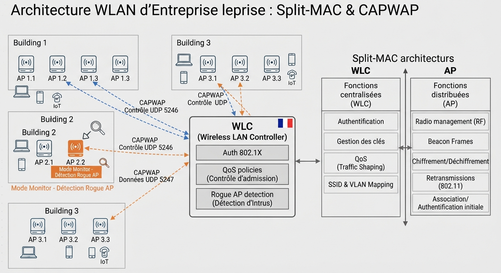
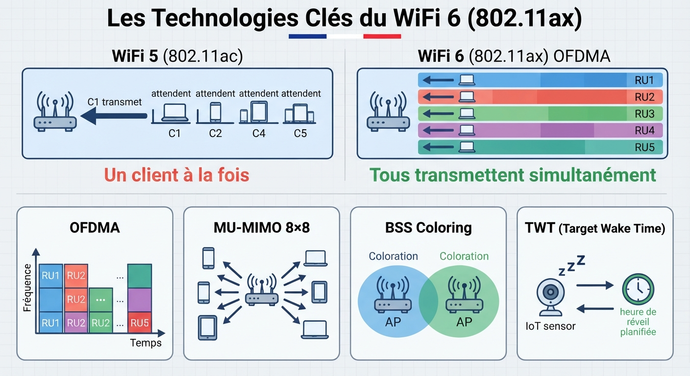
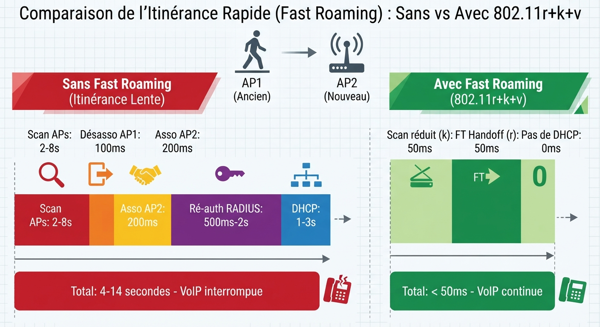
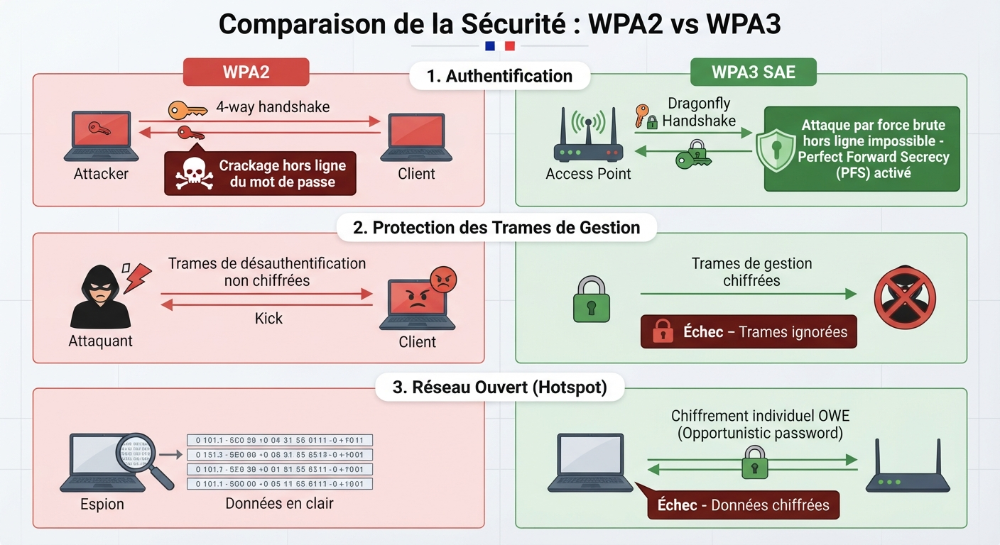
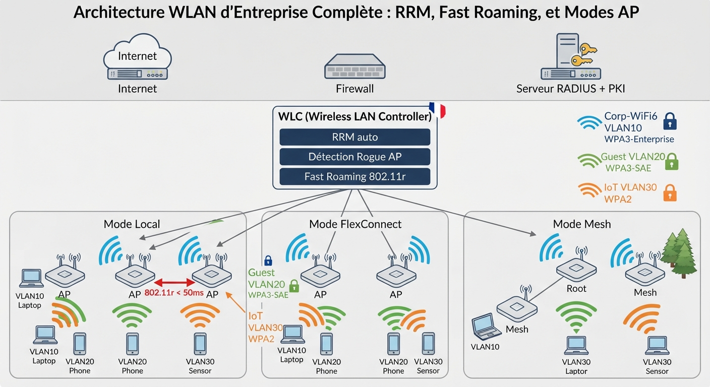

# 📘 FICHE DE COURS — S8 · 3ᵉ ANNÉE · E31
## Wireless Avancé : WiFi 6 · Mesh · WLC/CAPWAP · Roaming · QoS WMM · WPA3

---

> **Nom** : ___________________________
> **Date** : ___________________________
> **Compétences travaillées** : S4.5 · S4.6 · S4.7 · S4.8 · S4.9 · C2.2 · C3.1

---

## 🔑 Vocabulaire clé à maîtriser

| Terme | Définition |
|---|---|
| **WLC** | Wireless LAN Controller — équipement centralisé qui gère tous les APs d'un réseau enterprise |
| **CAPWAP** | Control And Provisioning of Wireless Access Points — protocole tunnel WLC↔AP (UDP 5246/5247) |
| **AP Lightweight** | Point d'accès sans configuration locale, reçoit tout du WLC via CAPWAP |
| **AP Standalone** | Point d'accès autonome avec sa propre configuration locale |
| **Roaming** | Déplacement d'un client d'un AP à un autre en maintenant la connexion |
| **Fast Roaming** | Ensemble de mécanismes (802.11r/k/v) pour accélérer le handoff entre APs |
| **WiFi 6** | 802.11ax — génération WiFi avec OFDMA, MU-MIMO 8×8, BSS Coloring, TWT |
| **OFDMA** | Orthogonal Frequency Division Multiple Access — subdivise le canal en sous-canaux pour plusieurs clients simultanés |
| **MU-MIMO** | Multi-User Multiple Input Multiple Output — communication simultanée avec plusieurs clients |
| **BSS Coloring** | Mécanisme de réutilisation spatiale WiFi 6 — réduit les interférences entre cellules proches |
| **TWT** | Target Wake Time — programmation du réveil des appareils IoT pour économiser la batterie |
| **WMM** | Wi-Fi Multimedia — mécanisme QoS WiFi à 4 files de priorité |
| **WPA3** | Wi-Fi Protected Access 3 — protocole de sécurité WiFi dernière génération |
| **SAE** | Simultaneous Authentication of Equals — handshake WPA3-Personal résistant au brute force |
| **PMF** | Protected Management Frames (802.11w) — protection des trames de gestion (obligatoire dans WPA3) |
| **OWE** | Opportunistic Wireless Encryption — chiffrement automatique sur réseaux WiFi ouverts (WPA3) |
| **Rogue AP** | Point d'accès non autorisé détecté dans l'environnement radio |
| **RRM** | Radio Resource Management — optimisation automatique des canaux et puissances par le WLC |
| **Mesh WiFi** | Architecture où des APs se connectent entre eux sans câble pour étendre la couverture |

---

## 1️⃣ — Architecture WLAN enterprise : WLC et CAPWAP

### Evolution des architectures WiFi

```
GÉNÉRATION 1 — APs Autonomes (standalone)
  Chaque AP a sa propre config
  Pas de gestion centralisée
  Roaming lent (réauthentification complète)
  ✓ Simple pour 1-5 APs
  ✗ Ingérable à partir de 10 APs

GÉNÉRATION 2 — WLC + APs Lightweight (actuel)
  WLC centralise configuration, sécurité, QoS, RF
  APs sont des "thin clients" radio seulement
  Tunnel CAPWAP entre WLC et chaque AP
  ✓ Gestion centralisée, roaming rapide, sécurité cohérente
  ✓ Standard entreprise/campus

GÉNÉRATION 3 — WLC Cloud (en émergence)
  WLC dans le cloud (Cisco Meraki, Aruba Central, Juniper Mist)
  APs gérés via Internet
  ✓ Aucune infrastructure on-premise
  ✓ Idéal multi-sites distribués
```

### CAPWAP : le protocole central

CAPWAP crée deux tunnels UDP entre le WLC et chaque AP lightweight :

```
              WLC                              AP Lightweight
               │                                    │
               │─── CAPWAP Control (UDP 5246) ────►│
               │    (configuration, gestion,        │
               │     statistiques, firmware...)     │
               │                                    │
               │◄── CAPWAP Data (UDP 5247) ─────────│
               │    (trafic des clients WiFi         │
               │     encapsulé dans le tunnel)       │
               │                                    │
```

### Split MAC : qui fait quoi ?

```
WLC gère (Plan de contrôle) :        AP gère (Plan de données radio) :
  → Authentification 802.1X/WPA3       → Transmission/réception radio
  → Association des clients            → Beacon frames
  → Gestion des clés de chiffrement    → Probe responses
  → Politiques QoS                     → Mesure du bruit RF
  → Détection rogue AP                 → Retransmissions
  → Load balancing entre APs           → ACK bas niveau 802.11
```

### Modes de fonctionnement des APs

| Mode | Description | Cas d'usage |
|---|---|---|
| **Local** | Tout le trafic passe par le WLC via CAPWAP | Standard — campus avec WLC proche |
| **FlexConnect** | Trafic local si WLC inaccessible, tunnel si disponible | Agences distantes, mauvais WAN |
| **Mesh** | L'AP se connecte à d'autres APs sans câble (backhaul sans fil) | Extérieur, zones sans câblage |
| **Monitor** | L'AP scanne le spectre RF sans servir de clients | Détection rogue AP, analyse radio |
| **SE-Connect** | Connexion à un moteur Spectrum Expert | Analyse RF avancée |

---

**🖼️ ILLUSTRATION 1**
> *Légende* : Architecture WLAN enterprise avec WLC. À droite du schéma, le WLC avec ses 3 plans (gestion, contrôle, données). Les APs sont représentés dans les 3 bâtiments reliés au WLC par des flèches bleues (CAPWAP control) et oranges (CAPWAP data). Les clients WiFi (laptops, smartphones, IoT) sont autour des APs. En haut, le switch cœur connecte le WLC. Un tableau "Split MAC" montre ce que gère le WLC vs les APs. Un AP en mode Monitor est indiqué en orange avec une antenne omnidirectionnelle.
>
> 

---

## 2️⃣ — WiFi 6 (802.11ax) : les technologies clés

### Pourquoi WiFi 6 ?

WiFi 5 (802.11ac) a été conçu pour des environnements peu denses. WiFi 6 est optimisé pour les **environnements haute densité** (stades, hôpitaux, bureaux open space, gares).

```
Comparatif :
             WiFi 4      WiFi 5         WiFi 6
Standard     802.11n     802.11ac       802.11ax
Année        2009        2013           2019
Bandes       2.4+5 GHz   5 GHz          2.4+5 GHz (+6 GHz pour 6E)
Débit max    600 Mbps    3.5 Gbps       9.6 Gbps
Modulation   64-QAM      256-QAM        1024-QAM
MU-MIMO      Non         4×4 DL only    8×8 UL + DL
OFDMA        Non         Non            Oui ← clé
BSS Coloring Non         Non            Oui ← clé
TWT          Non         Non            Oui ← IoT
```

### Technologie 1 — OFDMA : plusieurs clients en simultané

```
SANS OFDMA (WiFi 5) :
  Le canal est utilisé par UN seul client à la fois
  → 5 clients = 5 tours successifs
  → Inefficace si paquets petits (VoIP, IoT)

AVEC OFDMA (WiFi 6) :
  Le canal est subdivisé en Resource Units (RUs)
  → 5 clients transmettent SIMULTANÉMENT sur des RUs différents
  → Efficacité x4 en haute densité
  → Idéal pour IoT (petits paquets fréquents)
```

### Technologie 2 — MU-MIMO 8×8 UL+DL

```
WiFi 5 : 4 antennes TX, réception simultanée de 4 clients (DL seulement)
WiFi 6 : 8 antennes TX/RX, émission ET réception simultanée de 8 clients
           → UL (Uplink) MU-MIMO = clients transmettent simultanément vers l'AP
```

### Technologie 3 — BSS Coloring

```
Problème : deux APs proches sur le même canal → interférence → CSMA/CA attendsit
Solution WiFi 6 : chaque BSS (cellule WiFi) a une "couleur" (1-63)
  → Si le signal reçu est d'une couleur différente et faible → ignorer
  → Réutilisation spatiale possible même sur le même canal
  → Augmente la capacité globale du réseau
```

### Technologie 4 — TWT (Target Wake Time)

```
Pour les appareils IoT à batterie :
  L'AP et l'appareil négocient des "créneaux de réveil"
  → L'appareil dort entre ses créneaux → batterie ×10
  → L'AP sait exactement quand l'appareil sera disponible
  → Réduction des interférences (moins d'appareils actifs simultanément)
```

---

**🖼️ ILLUSTRATION 2**
> *Légende* : Comparaison visuelle OFDMA WiFi 5 vs WiFi 6. Gauche "WiFi 5 OFDMA non" : un canal avec 5 clients en attente, un seul transmet à la fois (FIFO). Droite "WiFi 6 OFDMA" : le même canal subdivisé en 5 Resource Units de tailles différentes, 5 clients transmettent simultanément. En dessous, les 4 technologies WiFi 6 sous forme d'icônes : OFDMA, MU-MIMO 8×8, BSS Coloring (APs avec couleurs distinctes), TWT (réveil programmé IoT).
>
> 

---

## 3️⃣ — Mesh WiFi : étendre sans câble

### Principe du réseau mesh

Dans un réseau mesh, les APs n'ont pas tous besoin d'un câble Ethernet. Ils se connectent **entre eux par radio** pour relayer le trafic jusqu'à l'AP racine (root AP) qui est câblé.

```
[Switch] ── [Root AP] ────── Radio Backhaul ──────► [Mesh AP 1]
                    └─────── Radio Backhaul ──────► [Mesh AP 2]
                                                           │
                                                     (sous-réseau
                                                      sans câblage)
```

### Types de liens mesh

```
Fronthaul : lien radio AP ← → Clients WiFi (utilise 2.4 ou 5 GHz)
Backhaul  : lien radio AP ← → AP (relaie le trafic vers le cœur)
           Idéalement sur une bande dédiée (5 GHz ou 6 GHz WiFi 6E)
           pour ne pas partager avec les clients
```

### Cas d'usage mesh

```
✓ Zones extérieures (parkings, terrasses) sans câblage
✓ Bâtiments historiques (câblage difficile)
✓ Déploiement temporaire rapide
✓ Extension de couverture dans des zones isolées
✗ Latence plus élevée (chaque hop ajoute 2-5ms)
✗ Débit diminue à chaque saut (demi-duplex radio)
```

---

## 4️⃣ — Roaming et Fast Roaming

### Le problème du roaming classique

Quand un client WiFi se déplace d'un AP à l'autre :

```
Sans fast roaming :
  1. Client détecte signal de AP1 trop faible
  2. Client cherche des APs disponibles (scan passif ou actif)
  3. Désassociation de AP1
  4. Association à AP2
  5. Ré-authentification complète (RADIUS ou PSK)
  6. Nouvelle attribution IP (DHCP si pas de roaming L3)
  Durée totale : 1 à 15 secondes → interruption de service
```

### 802.11r — Fast BSS Transition (FT)

```
Problème résolu : l'authentification est le point lent
Solution 802.11r : pré-partager les clés de chiffrement avant le handoff

Mécanisme :
  → Lors de l'association initiale à AP1, un "FT Cache" est créé
  → Partagé avec tous les APs du même domaine FT via le WLC
  → Lors du roaming vers AP2 : clés déjà disponibles → handoff < 50ms

Résultat : délai de roaming 50ms (vs 1-15s sans) → transparent pour VoIP
```

### 802.11k — Neighbor Reports

```
Problème résolu : le client ne sait pas vers quel AP aller
Solution 802.11k : l'AP fournit au client une liste des APs voisins
                   avec leurs canaux et RSSI mesurés

→ Le client choisit intelligemment l'AP cible AVANT de perdre le signal
→ Réduit le temps de scan et améliore le choix de l'AP cible
```

### 802.11v — BSS Transition Management

```
Problème résolu : le client reste sur un AP surchargé même si un autre est meilleur
Solution 802.11v : le WLC peut "suggérer" à un client de changer d'AP
                   (steering) basé sur la charge et le RSSI

→ Équilibrage de charge automatique
→ Décharge les APs surchargés
→ Améliore l'expérience globale du réseau
```

---

**🖼️ ILLUSTRATION 3**
> *Légende* : Timeline de roaming comparant "Sans fast roaming" et "Avec 802.11r+k+v". Gauche : 5 étapes successives avec durées (scan 2-8s, désasso 100ms, asso 200ms, réauth RADIUS 500ms-2s, DHCP 1-3s) = total 4-14 secondes. Droite : même client se déplaçant, AP2 déjà prêt grâce au cache 802.11r, scan réduit grâce à 802.11k, = total < 50ms. Les flèches VoIP montrent coupure à gauche et continuité à droite.
>
> 

---

## 5️⃣ — QoS WiFi : WMM (Wi-Fi Multimedia)

### Le problème sans QoS

Sans priorité, le point d'accès traite tous les paquets de la même façon (FIFO). Un téléchargement de 1 Go bloque la transmission d'un paquet VoIP de 200 octets.

### WMM : 4 files d'attente

```
Priorité    File WMM        DSCP équivalent    Exemples
Haute  1 → Voice (VO)       DSCP EF (46)       VoIP, appels vidéo
       2 → Video (VI)       DSCP AF41 (34)     Streaming, vidéoconf
       3 → Best Effort (BE) DSCP CS0 (0)       Navigation web, email
Basse  4 → Background (BK)  —                  Sauvegardes, mises à jour
```

### Mécanisme EDCA (Enhanced Distributed Channel Access)

```
Chaque file WMM a des paramètres EDCA différents :
  AIFS (Arbitration Inter Frame Space) : temps d'attente minimum
    → Voice : AIFS court → accède au canal rapidement
    → Background : AIFS long → attend plus longtemps
  CW (Contention Window) : fenêtre de backoff aléatoire
    → Voice : petite fenêtre → moins d'attente
    → Background : grande fenêtre → beaucoup d'attente

Résultat : Voice passe statistiquement AVANT les autres trafics
```

### Mapping DSCP WiFi

```
Un paquet arrive sur le WLC avec DSCP EF (46) (trafic VoIP)
→ Le WLC le place dans la file "Voice" (VO) de WMM
→ L'AP le transmet avec la priorité voice
→ Cohérence bout en bout : DSCP filaire ↔ WMM WiFi

Configuration sur WLC Cisco :
  SSID → QoS → WMM → Enabled
  Mapping DSCP-to-WMM : automatique (EF→VO, AF41→VI, etc.)
```

---

## 6️⃣ — WPA3 : la sécurité WiFi moderne

### Les limites de WPA2

```
WPA2-Personal (PSK) :
  ✗ Attaque "offline dictionary" : capturer le handshake 4-way → brute force offline
  ✗ Clé partagée : si un employé part, la clé est compromise
  ✗ PMKID attack (2018) : encore plus rapide que le handshake

WPA2-Enterprise :
  ✓ Identités individuelles via 802.1X
  ✗ Les trames de management (déauthentification) sont en clair
    → Attaque de déauthentification : l'attaquant peut chasser les clients
```

### WPA3 : les améliorations clés

#### WPA3-Personal : SAE (Simultaneous Authentication of Equals)

```
Remplacement du handshake PSK 4-way par le protocole Dragonfly :
  → Authentification mutuelle (les deux côtés prouvent leur identité)
  → Perfect Forward Secrecy (PFS) : chaque session a une clé unique
    → Si la clé maître est compromise plus tard, les sessions passées
      ne peuvent pas être déchiffrées (enregistrement puis décryptage impossible)
  → Résistant aux attaques offline : impossible de brute-forcer sans
    envoyer des tentatives en live (détectable)
```

#### PMF — Protected Management Frames (obligatoire dans WPA3)

```
Problème WPA2 : les trames Deauth/Disassoc sont en clair → attaques triviales
Solution WPA3 : ces trames sont chiffrées et authentifiées
  → Impossible de "chasser" un client sans connaître ses clés
  → Protège contre les attaques par déni de service WiFi
```

#### OWE — Opportunistic Wireless Encryption (réseaux ouverts)

```
Pour les SSIDs sans mot de passe (cafés, aéroports) :
  WPA2 ouvert : 0 chiffrement → tout le trafic est lisible en clair
  WPA3/OWE : chiffrement automatique par diffie-hellman sans mot de passe
    → Chaque client a un canal chiffré unique avec l'AP
    → Transparent pour l'utilisateur (pas de mot de passe)
    → Empêche l'écoute passive par un tiers sur le même réseau
```

---

**🖼️ ILLUSTRATION 4**
> *Légende* : Comparaison WPA2 vs WPA3 en 3 scénarios. Scénario 1 "Personal/PSK" : WPA2 avec un attaquant capturant le handshake et faisant du brute force offline (icône ordinateur → crâne) ; WPA3 SAE avec Dragonfly, icône cadenas vert "Brute force offline impossible". Scénario 2 "Trames de gestion" : WPA2 avec une trame Deauth non chiffrée envoyée par un attaquant qui chasse un client ; WPA3 PMF avec une trame chiffrée, l'attaquant échoue. Scénario 3 "Réseau ouvert" : WPA2 ouvert avec des ondes lisibles par un espion ; WPA3 OWE avec des ondes chiffrées même sans mot de passe.
>
> 

---

## 7️⃣ — Architecture WLAN enterprise complète

### Schéma de référence

```
INTERNET
    │
[Firewall UTM] ── [RADIUS + PKI] (auth 802.1X, certifs WPA3-Enterprise)
    │
[Switch Cœur]
    │─────────────── [WLC] (Wireless LAN Controller)
    │                  │── RRM (Radio Resource Management auto)
    │                  │── Détection Rogue AP
    │                  │── Fast Roaming domain (802.11r/k/v)
    │
[Switch Distribution]
    │
[Switch Accès 1]──[AP1]  [AP2]  [AP3]   ←── Mode Local
[Switch Accès 2]──[AP4]  [AP5]  [AP6]   ←── Mode Local
[WAN Agence]  ───[AP7]  [AP8]           ←── Mode FlexConnect
[Extérieur]   ───[Root AP]──[Mesh AP1]──[Mesh AP2]  ←── Mode Mesh

SSIDs :
  "Corp-WiFi6"   → VLAN 10 · WPA3-Enterprise (802.1X) · WMM Voice + Video
  "Guest-WiFi"   → VLAN 20 · WPA3-Personal (SAE) · Portail captif · Internet only
  "IoT-Network"  → VLAN 30 · WPA2-PSK isolé · Débit limité · OFDMA optimisé
```

---

**🖼️ ILLUSTRATION 5**
> *Légende* : Schéma d'architecture WLAN enterprise complète annoté. Les 3 couches (application : RADIUS/PKI ; contrôle : WLC avec RRM et détection ; données : APs en 3 modes). Les 3 SSIDs sont représentés par des ondes colorées distinctes (bleu Corp, vert Guest, orange IoT). Les clients (laptop, smartphone, capteur IoT) sont placés près des APs avec leurs VLAN. Le roaming 802.11r est représenté par une flèche entre deux APs avec "< 50ms". WPA3 est indiqué sur les 3 SSIDs avec des icônes de cadenas.
>
> 

---

## 📌 Les essentiels à retenir pour l'examen

> ✅ **WLC** centralise la gestion de tous les APs via **CAPWAP** (UDP 5246 contrôle, UDP 5247 données)
> ✅ AP Lightweight = aucune config locale · AP Standalone = config locale autonome
> ✅ **WiFi 6** (802.11ax) : **OFDMA** (simultané) · **MU-MIMO 8×8 UL+DL** · **BSS Coloring** (densité) · **TWT** (IoT)
> ✅ **Mesh** : APs reliés entre eux par radio · backhaul dédié pour l'interlien
> ✅ **802.11r** = Fast BSS Transition (< 50ms) · **802.11k** = Neighbor Reports · **802.11v** = BSS Steering
> ✅ **WMM** = QoS WiFi 4 files : Voice (VO) · Video (VI) · Best Effort (BE) · Background (BK)
> ✅ **WPA3-Personal** = SAE (résistant brute force offline, PFS) · **PMF** obligatoire
> ✅ **WPA3 OWE** = chiffrement automatique sur réseau ouvert (sans mot de passe)
> ✅ **Rogue AP** = AP non autorisé détecté par le WLC (mode Monitor ou Rogue Detector)
> ✅ Mode AP : Local (tunnel complet) · FlexConnect (local si WLC down) · Mesh (sans câble) · Monitor (surveillance RF)

---

*Fiche de Cours — BAC PRO CIEL | E31 Infrastructure Réseau | 3ᵉ année S8*
*Compétences : S4.5 · S4.6 · S4.7 · S4.8 · S4.9 · C2.2 · C3.1*
