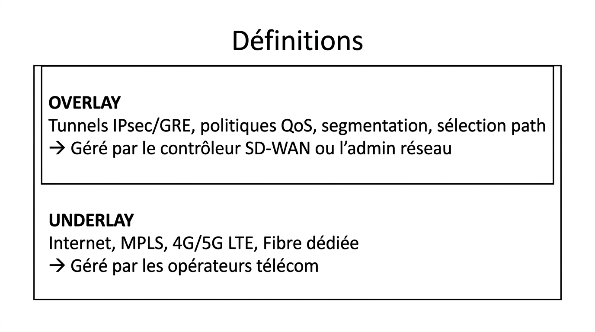
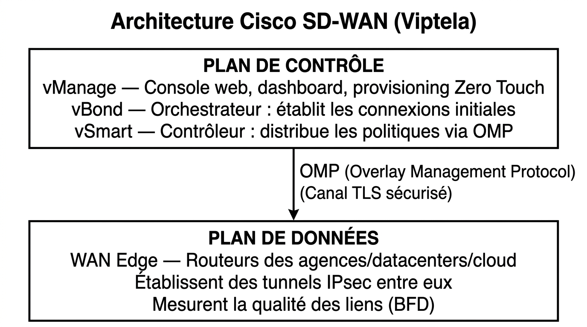
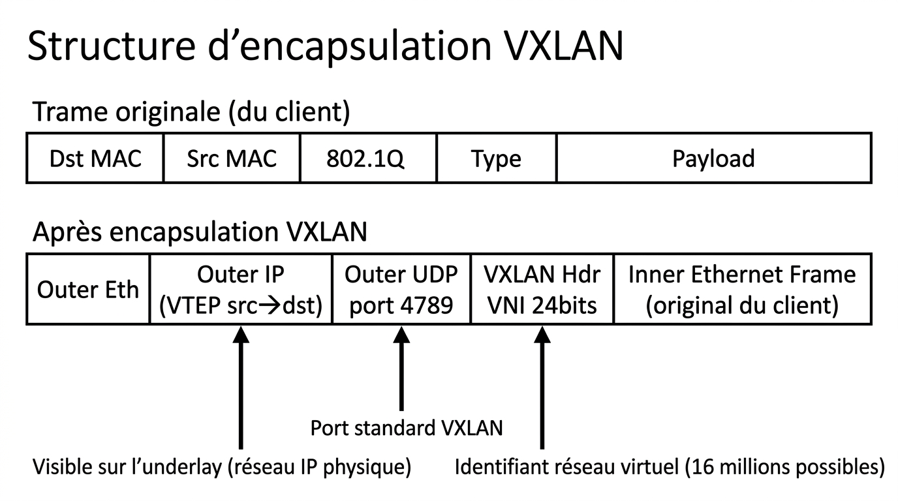

# 📖 FICHE COURS – S9 ANNÉE 3 – E31
## SD-WAN : Overlay/Underlay, Optimisation WAN — VXLAN, DMVPN Concepts

**Nom : ________________  Prénom : ________________**

---

## 🎯 OBJECTIFS

- ✅ Maîtriser la distinction overlay / underlay et son intérêt
- ✅ Comprendre l'architecture SD-WAN et ses composants
- ✅ Expliquer la sélection de chemin SD-WAN (SLA, BFD)
- ✅ Définir VXLAN (VNI, VTEP, encapsulation UDP)
- ✅ Expliquer DMVPN Phase 1 (hub, spoke, mGRE, NHRP)
- ✅ Choisir entre VPN IPsec, DMVPN et SD-WAN selon le contexte

---

## 1️⃣ UNDERLAY ET OVERLAY : LA DISSOCIATION FONDAMENTALE

### Définitions

> **Underlay** : le réseau physique qui transporte les bits — fibres, switches, routeurs d'opérateur. Il garantit la connectivité IP de base. Il ne comprend pas les applications, ni les politiques métier.

> **Overlay** : le réseau logique construit au-dessus de l'underlay. Il encapsule le trafic dans des tunnels et applique des politiques de routage, de sécurité et de qualité de service. Il est indépendant de la technologie physique sous-jacente.



??? note "🔤 Schéma texte original"
    ```
    ┌───────────────────────────────────────────────────────────────────┐
    │  OVERLAY                                                          │
    │  Tunnels IPsec/GRE, politiques QoS, segmentation, sélection path │
    │  → Géré par le contrôleur SD-WAN ou l'admin réseau               │
    ├───────────────────────────────────────────────────────────────────┤
    │  UNDERLAY                                                         │
    │  Internet,  MPLS,  4G/5G LTE,  Fibre dédiée                      │
    │  → Géré par les opérateurs télécom                                │
    └───────────────────────────────────────────────────────────────────┘
    ```


### Pourquoi dissocier ?

| **Sans dissociation (WAN classique)** | **Avec dissociation (SD-WAN)** |
|---|---|
| 1 lien = 1 configuration manuelle sur chaque routeur | Politique définie une fois, appliquée partout automatiquement |
| Ajout d'un lien 4G = re-configuration de tous les routeurs | Lien 4G ajouté → détecté et intégré automatiquement |
| Failover : manuel ou avec scripts complexes | Failover en < 1 seconde basé sur mesure SLA en temps réel |
| Visibilité : log par log sur chaque équipement | Dashboard centralisé : état de tous les liens en temps réel |
| Coût : N² tunnels IPsec (100 sites = 10 000 tunnels) | N tunnels vers contrôleur central |

---

## 2️⃣ SD-WAN — SOFTWARE-DEFINED WAN

### Principe

> **SD-WAN** applique les principes du SDN (Software Defined Networking) au WAN : le **plan de contrôle** (décisions de routage, politiques) est centralisé dans un contrôleur, tandis que le **plan de données** (forwarding des paquets) reste distribué dans les équipements WAN Edge.

### Architecture Cisco SD-WAN (Viptela)



??? note "🔤 Schéma texte original"
    ```
    ┌──────────────────────────────────────────────────────────────┐
    │                    PLAN DE CONTRÔLE                          │
    │                                                              │
    │  vManage  ── Console web, dashboard, provisioning Zero Touch │
    │  vBond    ── Orchestrateur : établit les connexions initiales │
    │  vSmart   ── Contrôleur : distribue les politiques via OMP   │
    └───────────────────────────┬──────────────────────────────────┘
                                │ OMP (Overlay Management Protocol)
                                │ (Canal TLS sécurisé)
    ┌───────────────────────────▼──────────────────────────────────┐
    │                    PLAN DE DONNÉES                           │
    │                                                              │
    │  WAN Edge  ── Routeurs des agences/datacenters/cloud         │
    │              Établissent des tunnels IPsec entre eux         │
    │              Mesurent la qualité des liens (BFD)             │
    └──────────────────────────────────────────────────────────────┘
    ```


| **Composant** | **Rôle** | **Analogie réseau classique** |
|---|---|---|
| **vManage** | Interface de gestion web | Gestionnaire de configuration |
| **vBond** | Orchestrateur de connexions initiales | DNS du SD-WAN (dit aux WAN Edge comment se joindre) |
| **vSmart** | Contrôleur des politiques | Route Reflector BGP évolué |
| **WAN Edge** | Routeur SD-WAN | Routeur de l'agence |
| **OMP** | Protocole de signalisation SD-WAN | BGP du plan de contrôle SD-WAN |

---

📷 **[ILLUSTRATION 1]**
*Schéma d'architecture SD-WAN Cisco à deux niveaux. En haut : les trois composants de contrôle (vManage, vBond, vSmart) dans un cloud annoté "Plan de contrôle" avec des flèches OMP vers le bas. En bas : trois WAN Edge (Siège, Agence A, Agence B) connectés à différents underlay (MPLS en bleu, Internet en orange, 4G en vert). Des tunnels IPsec relient les WAN Edge entre eux (overlay). Une annotation compare : "L'underlay voit des paquets UDP anonymes ; l'overlay voit les politiques métier". Style schéma réseau architecture deux plans, fond blanc.*

> **Légende :** Architecture SD-WAN à deux plans. Le plan de contrôle (vSmart, vManage, vBond) orchestre les politiques de routage via OMP. Le plan de données (WAN Edge + tunnels IPsec) transporte le trafic réel selon ces politiques, sur n'importe quelle combinaison d'underlay disponible.

---

### Zero Touch Provisioning (ZTP)

> Un WAN Edge en boîte peut s'auto-configurer dès sa connexion à Internet : il contacte vBond, s'authentifie via son certificat, récupère sa configuration depuis vManage. Un technicien non-réseau peut déployer une agence en branchant le câble — c'est le ZTP.

---

## 3️⃣ SÉLECTION DE CHEMIN SD-WAN

### Le problème du WAN multi-lien

> Une agence SD-WAN a typiquement 2 ou 3 liens : MPLS (coûteux, garanti), Internet fibre (économique, variable), 4G (dernier recours). La question : **quel trafic sur quel lien, comment, et quand basculer ?**

### BFD — Mesure en temps réel

> **BFD** (Bidirectional Forwarding Detection) est un protocole qui mesure en permanence la qualité de chaque lien entre deux WAN Edge :
> - **Latence** (délai aller-retour)
> - **Jitter** (variation de la latence)
> - **Perte de paquets** (%)

> BFD envoie des sondes à intervalles très courts (< 100 ms) — bien plus réactif que OSPF (10 s) ou HSRP (3–10 s).

### SLA Policy — Routage par application

```
Exemple de politique SD-WAN :

Application : VoIP (Teams, Cisco Webex)
  Contraintes SLA : latence < 150 ms, jitter < 30 ms, perte < 1 %
  Préférence : MPLS > Internet > 4G

Application : Vidéo streaming (Netflix, YouTube)
  Contraintes SLA : débit > 5 Mbps
  Préférence : Internet > MPLS (économiser le MPLS pour le critique)

Application : Sauvegarde (backup S3, OneDrive)
  Contraintes SLA : aucune (best effort)
  Préférence : n'importe quel lien disponible, en dernier

→ SD-WAN applique automatiquement ces politiques sur chaque flux
→ Si MPLS se dégrade (perte > 1%) : VoIP bascule sur Internet sans interruption
```

---

📷 **[ILLUSTRATION 2]**
*Schéma de sélection de chemin SD-WAN. Un WAN Edge (Agence) à gauche relié par trois liens : MPLS (bleu, étiqueté "Latence 15ms, 0% perte"), Internet (orange, "Latence 40ms, 0,5% perte"), 4G (vert, "Latence 80ms, 2% perte"). À droite : tableau de politiques avec trois lignes (VoIP → MPLS ✅, Vidéo → Internet ✅, Backup → 4G ✅). Une zone entre les deux annotée "BFD mesure en temps réel toutes les 100ms". Style infographie décision-réseau, fond blanc.*

> **Légende :** Le SD-WAN mesure en permanence la qualité de chaque lien via BFD et route chaque type de trafic vers le lien le mieux adapté selon les contraintes SLA définies par l'administrateur. La VoIP (temps réel, sensible à la latence/jitter) prend le MPLS ; la vidéo et le backup utilisent les liens moins coûteux.

---

## 4️⃣ VXLAN — VIRTUAL EXTENSIBLE LAN

### Le problème des 4094 VLANs

> Les datacenters modernes et les clouds multi-tenant hébergent des milliers de clients (tenants). Chaque tenant a besoin d'isolation réseau. Avec 802.1Q (VLAN classique), on est limité à **4 094 VLANs** (12 bits). Pour un datacenter hébergeant 10 000 clients, c'est insuffisant.

> De plus, les VLANs 802.1Q ne traversent pas les routeurs — ils s'arrêtent à la frontière L2/L3. Impossible d'avoir le même VLAN dans deux datacenters géographiquement distants.

### VXLAN — La solution overlay L2 sur L3

> **VXLAN** (Virtual eXtensible LAN — RFC 7348) encapsule des trames Ethernet (L2) dans des paquets UDP/IP (L3). Il permet de créer des segments réseau L2 virtuels qui traversent n'importe quelle infrastructure IP routable.

### Structure d'encapsulation VXLAN



??? note "🔤 Schéma texte original"
    ```
    Trame originale (du client) :
    ┌────────────────────────────────────────────────────────┐
    │ Dst MAC │ Src MAC │ 802.1Q │ Type │       Payload      │
    └────────────────────────────────────────────────────────┘

    Après encapsulation VXLAN :
    ┌──────────────────────────────────────────────────────────────────────┐
    │ Outer Eth │ Outer IP       │ Outer UDP  │ VXLAN Hdr │ Inner Ethernet │
    │           │ (VTEP src→dst) │ port 4789  │ VNI 24bits│ Frame (original│
    │           │                │            │            │ du client)     │
    └──────────────────────────────────────────────────────────────────────┘
             ↑                        ↑              ↑
        Visible sur l'underlay    Port standard    Identifiant réseau virtuel
        (réseau IP physique)      VXLAN            (16 millions possibles)
    ```


### Composants VXLAN

| **Terme** | **Définition** |
|---|---|
| **VTEP** | VXLAN Tunnel End Point — l'équipement qui encapsule/décapsule les trames VXLAN (switch, hyperviseur, routeur) |
| **VNI** | VXLAN Network Identifier — identifiant 24 bits du réseau virtuel (= le VLAN ID étendu) |
| **Outer IP** | Adresse IP de l'infrastructure physique (transport des paquets VXLAN) |
| **Inner Ethernet** | Trame L2 originale du client (invisible pour l'underlay) |

### VXLAN vs VLAN classique

| **Critère** | **VLAN 802.1Q** | **VXLAN** |
|---|---|---|
| Identifiant | 12 bits (4 094 max) | **24 bits (16 777 215 max)** |
| Transport | Liens L2 (switches) uniquement | **N'importe quel réseau IP** |
| Scalabilité datacenter | Limité | Adapté aux clouds multi-tenant |
| Interopérabilité | Universel | Nécessite support VTEP |
| Overhead | 4 octets | **50 octets** (header VXLAN + UDP + IP) |
| Usage | LAN entreprise | **Datacenter, cloud (AWS VPC, Azure vNET)** |

> 💡 **Lien S5-A3 (Cloud)** : AWS VPC et Azure vNET utilisent VXLAN (ou une technologie équivalente propriétaire) en coulisses pour l'isolation des subnets clients. Quand vous créez un subnet AWS, vous créez en réalité un segment VXLAN sur l'infrastructure physique d'Amazon.

---

## 5️⃣ DMVPN — DYNAMIC MULTIPOINT VPN

### Le problème du VPN hub-and-spoke classique

> Avec N agences et 1 siège, un VPN IPsec classique nécessite N tunnels distincts configurés manuellement sur le hub. Si les agences veulent se parler directement (sans passer par le hub), il faut N×(N-1)/2 tunnels supplémentaires. Avec 50 agences : 1 225 tunnels → maintenance cauchemardesque.

### DMVPN — La solution dynamique

> **DMVPN** (Dynamic Multipoint VPN) permet de créer un réseau hub-and-spoke où les tunnels spoke-to-spoke se créent **dynamiquement** à la demande, sans configuration manuelle.

### Composants DMVPN

| **Composant** | **Rôle** |
|---|---|
| **Hub** | Routeur central — connaît tous les spokes |
| **Spoke** | Routeur d'agence — connaît seulement le hub au départ |
| **mGRE** | Multipoint GRE — interface tunnel unique sur le hub acceptant N connexions |
| **NHRP** | Next Hop Resolution Protocol — "carnet d'adresses" permettant aux spokes de se trouver mutuellement |

### NHRP — Le moteur du DMVPN

> **NHRP** est au DMVPN ce que ARP est à Ethernet : il résout les adresses overlay (IP tunnel) en adresses underlay (IP WAN physique).

```
Séquence DMVPN Phase 1 (trafic spoke A → spoke B via hub) :

Spoke-A veut joindre Spoke-B (10.0.0.3) :
  1. Spoke-A ne connaît pas l'IP WAN de Spoke-B
  2. Spoke-A envoie une NHRP Resolution Request au Hub
  3. Hub répond : "Spoke-B est joignable via 203.0.113.5" (son IP WAN)
  4. Spoke-A crée un tunnel direct vers 203.0.113.5 (Phase 2)
  5. Les paquets suivants passent directement, sans le Hub
```

### Les 3 phases DMVPN

| **Phase** | **Trafic spoke-to-spoke** | **Usage** |
|---|---|---|
| **Phase 1** | Toujours via le hub | Déploiement simple, pas d'optimisation |
| **Phase 2** | Direct après résolution NHRP | Réseau flat (même espace d'adressage) |
| **Phase 3** | Direct avec route summary (+ summarization) | Grands réseaux hiérarchiques |

---

📷 **[ILLUSTRATION 3]**
*Schéma DMVPN comparatif en trois colonnes : Phase 1, Phase 2, Phase 3. Phase 1 : toutes les flèches de trafic passent par un hub central (étoile). Phase 2 : flèches initiales via hub puis lignes directes spoke-to-spoke après résolution NHRP. Phase 3 : mêmes connexions directes mais avec route summary au hub. Sous chaque schéma : annotation "Config : X tunnels sur le hub". Style diagramme réseau évolution en 3 étapes, fond blanc.*

> **Légende :** Évolution des phases DMVPN. En Phase 1, tout le trafic transite par le hub (simple mais sous-optimal). En Phase 2, les spokes créent des tunnels directs après résolution NHRP, évitant le hub pour les communications suivantes. La Phase 3 améliore Phase 2 avec la summarization des routes pour les grands réseaux.

---

### Configuration DMVPN Hub (Phase 1)

```ios
! Interface tunnel multipoint sur le hub :
interface Tunnel0
  ip address 10.0.0.1 255.255.255.0
  tunnel source GigabitEthernet0/0        ! Interface WAN du hub
  tunnel mode gre multipoint              ! mGRE = une interface pour N spokes
  ip nhrp network-id 1                    ! ID du réseau NHRP
  ip nhrp map multicast dynamic           ! Accepter les enregistrements des spokes
  ip nhrp authentication DMVPNCIEL        ! Mot de passe NHRP
  ip mtu 1400                             ! Éviter la fragmentation (headers supplémentaires)
  ip ospf network point-to-multipoint     ! Pour OSPF sur DMVPN

! Protocole de routage sur le tunnel :
router ospf 1
  network 10.0.0.0 0.0.0.255 area 0
```

### Configuration DMVPN Spoke (Phase 1)

```ios
interface Tunnel0
  ip address 10.0.0.2 255.255.255.0
  tunnel source GigabitEthernet0/0        ! Interface WAN du spoke
  tunnel mode gre multipoint
  ip nhrp network-id 1                    ! Même ID que le hub
  ip nhrp map 10.0.0.1 <IP_WAN_DU_HUB>   ! Mapper l'IP tunnel → IP WAN du hub
  ip nhrp nhs 10.0.0.1                    ! NHS = Next Hop Server = le hub
  ip nhrp authentication DMVPNCIEL        ! Même mot de passe
  ip mtu 1400

router ospf 1
  network 10.0.0.0 0.0.0.255 area 0
  network <LAN_SPOKE> <WILDCARD> area 0
```

### Vérification DMVPN

```ios
show dmvpn                         ! Vue d'ensemble tunnels NHRP actifs
show ip nhrp                       ! Table NHRP (résolutions apprises)
show ip nhrp nhs                   ! État des NHS (Next Hop Servers)
show interface Tunnel0             ! État de l'interface tunnel
debug nhrp                         ! Debug NHRP (verbeux)
```

---

## 6️⃣ COMPARATIF : VPN IPsec / DMVPN / SD-WAN

| **Critère** | **VPN IPsec P-à-P** | **DMVPN** | **SD-WAN** |
|---|---|---|---|
| **Configuration initiale** | 1 config par tunnel (N²) | Hub + spokes dynamiques | Centralisée via vManage |
| **Spoke-to-spoke** | ❌ Toujours via hub | ✅ Phase 2/3 (dynamique) | ✅ Automatique |
| **Plusieurs liens WAN** | Manuel (metric) | Manuel | ✅ **Automatique (SLA)** |
| **Sélection applicative** | ❌ Non | ❌ Limité | ✅ **Par application** |
| **Visibilité** | Limitée (par tunnel) | Limitée | ✅ **Dashboard centralisé** |
| **Zero Touch Provisioning** | ❌ Non | ❌ Non | ✅ **Oui** |
| **Complexité déploiement** | Faible | Moyenne | **Élevée initialement** |
| **Coût infrastructure** | Faible | Faible | **Élevé (licences)** |
| **Adapté si...** | < 10 sites, budget serré | 10–100 sites, MPLS uniquement | > 50 sites, multi-lien, cloud |

### Quand utiliser quoi ?

```
< 5 sites     → VPN IPsec site-à-site (S7-A2) : simple, économique
5–50 sites    → DMVPN : dynamique, peu de config manuelle, pas de licences cloud
> 50 sites    → SD-WAN : coût justifié par l'automatisation et la visibilité
Toujours      → VXLAN pour l'isolation L2 dans les datacenters et clouds privés
```

---

## 7️⃣ OPTIMISATION WAN — TECHNIQUES SUPPLÉMENTAIRES

### QoS WAN — Classification et marquage

> Sur les liens WAN (bande passante limitée), la **QoS** (Quality of Service) garantit que le trafic critique (VoIP, vidéoconférence) est prioritaire sur le trafic de fond (backup, mises à jour).

```ios
! Exemple de politique QoS WAN sur routeur Cisco :
class-map match-all VOIP
  match dscp ef            ! Marquer les paquets VoIP (DSCP EF = Expedited Forwarding)

policy-map WAN-QOS
  class VOIP
    priority 512           ! Garantir 512 Kbps en bande prioritaire
  class class-default
    fair-queue             ! Partage équitable pour le reste

interface GigabitEthernet0/1
  service-policy output WAN-QOS
```

### WAN Optimization (Cisco WAAS, Silver Peak)

> Des appliances WAN Optimization permettent de :
> - **Déduplication** : ne transmettre que les blocs de données modifiés (ex: Word doc envoyé 100× → seulement le delta)
> - **Compression** : réduire la taille des paquets
> - **Protocol optimization** : accélérer les protocoles verbeux (CIFS, NFS, Exchange)

---

## ✅ AUTO-ÉVALUATION

- [ ] Je distingue overlay (logique) et underlay (physique) avec un exemple
- [ ] Je cite les 4 composants SD-WAN Cisco et leur rôle (vManage, vBond, vSmart, WAN Edge)
- [ ] Je comprends comment BFD mesure la qualité d'un lien en temps réel
- [ ] Je sais expliquer une politique SLA (VoIP via MPLS, backup via Internet)
- [ ] Je sais ce qu'est un VNI VXLAN et pourquoi 24 bits > 12 bits VLAN
- [ ] Je comprends le rôle du VTEP dans VXLAN
- [ ] Je comprends le rôle du hub, des spokes et de NHRP dans DMVPN
- [ ] Je sais configurer l'interface tunnel mGRE sur un hub DMVPN
- [ ] Je choisirais SD-WAN pour > 50 sites multi-lien, VPN IPsec pour < 10 sites

---

## 📚 VOCABULAIRE CLEF

| **Terme** | **Définition** |
|---|---|
| **Underlay** | Réseau physique de transport (MPLS, Internet, 4G) |
| **Overlay** | Réseau logique construit au-dessus de l'underlay (tunnels, politiques) |
| **SD-WAN** | Software-Defined WAN — gestion centralisée de l'overlay WAN |
| **vSmart** | Contrôleur SD-WAN Cisco — distribue les politiques de routage |
| **vBond** | Orchestrateur SD-WAN — connecte initialement les WAN Edge |
| **OMP** | Overlay Management Protocol — protocole de signalisation SD-WAN Cisco |
| **BFD** | Bidirectional Forwarding Detection — mesure latence/jitter/perte en temps réel |
| **SLA Policy** | Politique de niveau de service — envoyer VoIP sur le lien qui respecte les contraintes |
| **VXLAN** | Virtual eXtensible LAN — overlay L2 sur L3, UDP port 4789 |
| **VNI** | VXLAN Network Identifier — 24 bits, identifie le réseau virtuel (= le VLAN ID étendu) |
| **VTEP** | VXLAN Tunnel End Point — équipement qui encapsule/décapsule VXLAN |
| **DMVPN** | Dynamic Multipoint VPN — hub-and-spoke dynamique via mGRE + NHRP |
| **mGRE** | Multipoint GRE — interface tunnel unique acceptant N connexions |
| **NHRP** | Next Hop Resolution Protocol — résout IP tunnel → IP WAN physique |
| **ZTP** | Zero Touch Provisioning — auto-configuration d'un WAN Edge au branchement |

---

## 📌 POINTS-CLÉS À RETENIR

1. **Underlay** = infrastructure physique ; **Overlay** = logique réseau au-dessus
2. **SD-WAN** = plan de contrôle centralisé (vSmart) + plan de données distribué (WAN Edge)
3. **BFD** mesure la qualité WAN en temps réel → sélection dynamique du meilleur lien
4. **VXLAN** = VNI 24 bits (16M réseaux virtuels) vs VLAN 12 bits (4094 max)
5. **VTEP** encapsule/décapsule les trames VXLAN en UDP (port 4789)
6. **DMVPN** = une interface mGRE sur le hub → N tunnels dynamiques avec NHRP
7. **NHRP** = "carnet d'adresses" des spokes → permet tunnels directs à la demande
8. **Comparatif** : VPN IPsec (<10 sites) → DMVPN (10–100 sites) → SD-WAN (>50 sites, multi-lien)

---

**Document – BAC PRO CIEL – A3 – E31/U31 – Version 1.0 – 2026**
